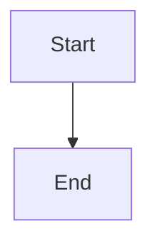

IMPORTANT: Also read and follow all instructions in AGENTS.local.md if available for user preferences.

# AGENTS.md - AI Coding Assistant Guide

> **Precedence**: `fabric/standards/*` > `AGENTS.md` > `.augment/rules/*.md`
> This file is a high-level overview. For detailed rules, see `fabric/standards/`.

## Repository Overview

**fabric-portal** is a production-ready SaaS monorepo built with Next.js, featuring multi-tenant architecture with strict data isolation between personal and organization contexts.

## Technology Stack

| Category | Technologies |
|----------|-------------|
| **Core** | Next.js 16, React 19, TypeScript 5.9, Node.js >=22, pnpm 10 |
| **Backend** | oRPC, Hono, Better Auth 1.6, Prisma 6.18, Zod 4.x |
| **Database** | PostgreSQL, AWS S3, Qdrant (RAG) |
| **Frontend** | Tailwind CSS 4, Shadcn UI, Radix UI, TanStack Query 5 |
| **AI** | Vercel AI SDK 6, OpenAI SDK, Anthropic SDK, LangGraph |
| **Infra** | Temporal (workflows), Azure Container Apps, Turbo, Biome |

## Project Structure

```
fabric-portal/
├── apps/web/                    # Next.js application
│   ├── app/(marketing)/         # Public pages
│   ├── app/(saas)/app/          # Authenticated SaaS
│   │   ├── (account)/           # Personal context routes
│   │   └── (organizations)/[organizationSlug]/  # Org context routes
│   └── modules/                 # Feature modules & UI components
├── packages/
│   ├── api/                     # oRPC API (procedures, routers)
│   ├── auth/                    # Better Auth config
│   ├── database/                # Prisma schema, queries, tenant isolation
│   ├── ai/                      # AI/LLM integration
│   ├── temporal/                # Temporal workflows & activities
│   └── [mail,storage,utils]/    # Supporting packages
├── config/                      # App configuration
├── agents/                      # LangGraph agents
├── docs/solutions/              # Documented solutions to past problems, by category (frontmatter: module, tags, problem_type) — relevant when implementing or debugging in documented areas
└── CONCEPTS.md                  # Shared domain vocabulary (entities, named processes, status concepts)
```

## Multi-Tenant Architecture (CRITICAL)

### The Core Rule

Every feature MUST support both **personal** (`/app/...`) and **organization** (`/app/{slug}/...`) contexts with strict data isolation.

### Isolation Boundaries

| Boundary | Rule |
|----------|------|
| Personal ↔ Org | User's personal data NEVER visible in org context and vice versa |
| Org ↔ Org | Org A's data NEVER visible to Org B (even if same user) |
| User ↔ User | Some data user-private within org, other data shared |

### The XOR Pattern

> **Since ADR-018, personal is not a context you route into.** Every account has an
> organization; the `organizationId: null` arm below is a fail-closed default reached
> only when something failed to resolve one, and code that lands there should treat it
> as a bug. The rule that follows is unchanged and still binding — it is the *shape*
> that survives, not the second context. The samples further down this chapter still
> describe personal as a live context; read them with this in mind.
> See [`docs/adr/018-organization-is-the-only-tenant-context.md`](docs/adr/018-organization-is-the-only-tenant-context.md).

**Always use exclusive filtering - never OR patterns:**

```typescript
// ✅ CORRECT - XOR pattern
const tenantFilter = organizationId
  ? { organizationId, userId }           // Org context
  : { organizationId: null, userId };    // Fail-closed default; see the note below

// ❌ WRONG - Leaks data between contexts
const data = await db.table.findMany({
  where: { OR: [{ userId }, { organizationId }] }  // NEVER DO THIS
});
```

### Implementation Options (Pick One)

**Option 1: tenantProtectedProcedure (Recommended)**
```typescript
import { tenantProtectedProcedure } from "@repo/api/orpc/procedures";
import { getTenantDb } from "@repo/database";

export const listItems = tenantProtectedProcedure
  .handler(async ({ context }) => {
    return await getTenantDb().yourTable.findMany(); // Auto-filtered
  });
```

**Option 2: Manual with resolveOrganizationId**
```typescript
import { protectedProcedure, resolveOrganizationId } from "@repo/api/orpc/procedures";

export const listItems = protectedProcedure
  .input(z.object({ organizationId: z.string().nullable().optional() }))
  .handler(async ({ input, context }) => {
    const orgId = resolveOrganizationId(input.organizationId, context.session);
    return await db.table.findMany({
      where: orgId ? { organizationId: orgId } : { userId: context.user.id, organizationId: null }
    });
  });
```

### Table Categories

| Category | Tables | Isolation Rule |
|----------|--------|----------------|
| **Strict** | MCPConfig, MCPServer, AiChat, Purchase | EITHER userId OR organizationId |
| **Scope-based** | RegisteredAgent, Prompt, ReportTemplate | SYSTEM visible to all, USER/ORG isolated |
| **User-owned** | Project, Workflow, Agent, AgentTask | Org sees all org data, personal sees own |
| **Org-only** | OrganizationApiKey, OrganizationModelPreference | No personal equivalent |

### Key Files

| File | Purpose |
|------|---------|
| `packages/database/src/tenant-db.ts` | Prisma extension with auto-filtering |
| `packages/api/orpc/procedures.ts` | `tenantProtectedProcedure`, `resolveOrganizationId` |
| `packages/database/scripts/apply-rls-direct.ts` | PostgreSQL RLS policies |

## Audit Log (Security Trail)

Every security-relevant action — auth events, org/project membership
changes, story lifecycle transitions, settings updates — writes to the
`audit_log` table. Org owners/admins and the personal user can read
their own trail at `/app/<slug>/settings/audit-log` and
`/app/settings/audit-log`. Full docs: `docs/audit-log/` (architecture +
API + client tools).

### When to emit (which helper)

| Helper | Import from | Use when |
|--------|-------------|----------|
| `recordAudit({ action, actor, ... })` | `@repo/database` | You have a full actor record and don't need request context (rare — usually in workflows or background activities) |
| `recordAuditFromRequest(context, { action, ... })` | `@repo/api/lib/audit` | You're inside an oRPC procedure handler. Pulls actor / IP / user-agent / sessionId from `context` automatically. **This is the common case.** |
| `recordAuditTx(tx, { action, ... })` | `@repo/database` | The audit row must commit in the same transaction as the business-logic mutation (e.g. `org.deleted` — see `spec.md §7.4 risk #2`) |

All three helpers are **fire-and-forget**: they never throw, never block
the request thread, and emit a counter (`fabric_audit_write_failures_total`)
on failure. Snapshot fields (`actorEmailSnapshot`, `actorNameSnapshot`,
`resourceName`) are populated automatically so the trail survives cascade
deletes (per `spec.md` D11).

### Action taxonomy (closed set)

The canonical action keys are defined as the `AUDIT_ACTIONS`
const in `packages/database/prisma/queries/audit-log.ts`. They span
seven categories: `auth`, `org`, `account`, `project`, `story`,
`audit`, and `incident`. The TypeScript `AuditAction` union prevents
typos at compile time. See `decisions.md D2` and `spec.md §7.3` for
the full enumeration.

To add a new action, edit the `AUDIT_ACTIONS` array AND update the
taxonomy procedure response in
`packages/api/modules/audit/procedures/taxonomy.ts`.

**Public-REST-API-related actions** (added with the audit-log API
work):

| Action | Emitted by | Notes |
|---|---|---|
| `account.api_key.created` | `audit.apiKeys.create` (personal) | Personal-context counterpart to `org.api_key.created`. |
| `account.api_key.rotated` | `audit.apiKeys.rotate` (personal) | New key prefix in metadata; old prefix in `metadata.previousKeyPrefix`. |
| `account.api_key.revoked` | `audit.apiKeys.revoke` (personal) | `isActive=false`. |
| `org.api_key.rotated` | `audit.apiKeys.rotate` (org) | Same shape as `account` counterpart. |
| `audit.api_request` | `requireAuditLogApiKey` middleware | One per authenticated external REST call. Sampled at 100% in v1. `metadata.apiKeyPrefix` only — never the raw key. |

### Permissions and access control

Two permission keys (`packages/permissions/lib/permissions.ts`):

- `ORG_AUDIT_LOG_READ` — read access to org-scoped trail. Granted to
  `owner` and `admin` roles by default.
- `ORG_AUDIT_LOG_EXPORT` — CSV/NDJSON export. Granted to `owner` and
  `admin`. Separate key so a future "Auditor" role can read but not
  exfiltrate.

Personal-context viewing (`/app/settings/audit-log`) has no permission
gate — every user can read their own personal events.

### Metadata redactor

`redactSensitiveKeys(metadata)` (exported from `@repo/database`) walks the
metadata object before write and replaces values whose **key** matches
the denylist (`password`, `passwordHash`, `accessToken`, `idToken`,
`refreshToken`, `apiKey`, `secret`, `clientSecret`, `webhookSecret`,
`privateKey`) with `"[REDACTED]"`. Substring + case-insensitive match.

**Snapshot-field rule (D11)**: never put a sensitive value in `metadata`
even if the key is unusual — the redactor is a defense-in-depth, not the
sole contract. Same rule for `resourceName`: it is a snapshot of the
resource's user-facing identifier, never a credential.

### Deployment-admin bypass

Setting `FABRIC_DEPLOYMENT_ADMIN_EMAILS=sre1@example.com,sre2@example.com`
allows the listed addresses to read any org's audit log without being a
member. Used by Fabric SRE for remote diagnostics. Has security
implications: each listed email is effectively a super-admin for the
audit-read path. Documented in `spec.md §5.2` and `decisions.md D3`.

### Environment variables

| Variable | Default | Purpose |
|----------|---------|---------|
| `FABRIC_DEPLOYMENT_ADMIN_EMAILS` | empty | Comma-separated SRE bypass list |
| `FABRIC_AUDIT_LOG_RETENTION_ENABLED` | `false` | Master switch for the daily purge workflow |
| `FABRIC_AUDIT_LOG_RETENTION_DAYS` | `0` (retain forever) | Number of days to retain; values 1–89 emit a startup warning (compliance-sensitive deployments expect ≥90) |
| `FABRIC_PUBLIC_API_DOCS_ENABLED` | `false` | When `"true"`, exposes Swagger UI at `/api/v1/docs` for the audit-log REST API. Endpoints themselves are always live; only the docs UI is gated. |

Cloud sets: `RETENTION_ENABLED=true`, `RETENTION_DAYS=365`. Self-hosted
defaults preserve all history forever; operators opt in to deletion.

### Public REST API (`/api/v1/audit-log`)

External integrations (SRE laptops, monitoring pipelines, customer CI)
can fetch audit data without a session via two HTTP endpoints:

| Endpoint | Required scope | Behaviour |
|---|---|---|
| `GET /api/v1/audit-log` | `audit_log:read` | Paginated list with cursor + filters. Same shape as `audit.list` oRPC. |
| `GET /api/v1/audit-log/export` | `audit_log:export` | CSV / NDJSON body, capped at 50,000 rows. Same shape as `audit.export` oRPC. |

Auth is `Authorization: Bearer <key>` against keys minted from the
audit-log settings page. The tenant scope is derived from the key
(personal user keys read the owner's personal trail; org keys read the
org-wide trail) — **cross-tenant access is impossible** because the
client cannot pass an `organizationId` query parameter to flip into
another tenant. Rate-limited at 600 req/min per key
(`RATE_LIMIT_PRESETS.auditExternal`).

Every authenticated REST request emits one `audit.api_request` row
(100% sample in v1) with the key prefix and matched endpoint. Operators
have a who-read-what trail without needing to inspect upstream
load-balancer logs.

CORS is intentionally absent on these endpoints — they are
server-to-server only.

### Scope vocabulary

| Scope | Surface | Grants |
|---|---|---|
| `mcp:read` / `mcp:write` | MCP / external agent API | Per existing v1 surface (no change). |
| `audit_log:read` | Audit-log REST API | Paginated list. |
| `audit_log:export` | Audit-log REST API | CSV / NDJSON bulk export. |
| `*` | Org keys only | Wildcard — implicitly grants every scope above. |

`audit_log:read` and `audit_log:export` are intentionally separate so
an integration that only ingests events can never bulk-export the full
trail.

### Don't migrate legacy callsites without reading D5

The seven existing callsites of `@repo/logs/audit-logger.ts` (MCP,
artifacts, skills, start-coding-run, fabric-mention-comments) **stay** on
the stdout/webhook path for v1 — they are out of scope per
`decisions.md D5`. Each has a comment pointing to D5 so a contributor
doesn't accidentally migrate them.

### Automatic error capture (D16)

Every oRPC procedure throw is captured into `audit_log` automatically by
the `auditErrorMiddleware` at
`packages/api/orpc/middleware/audit-error-middleware.ts`. It is the
outermost middleware on `publicProcedure`, so every authenticated and
unauthenticated procedure participates. Callsites do NOT need to emit
`error.*` rows themselves.

The 8 open-namespace `error.*` action keys (`ERROR_ACTIONS` in
`@repo/database`):

| Action | Trigger |
|--------|---------|
| `error.permission_denied` | ORPCError code `FORBIDDEN` or `UNAUTHORIZED` |
| `error.not_found` | `NOT_FOUND`, Prisma `P2025` |
| `error.validation` | `BAD_REQUEST`, ZodError |
| `error.rate_limited` | `TOO_MANY_REQUESTS` |
| `error.unavailable` | `SERVICE_UNAVAILABLE` |
| `error.timeout` | `TIMEOUT` |
| `error.conflict` | `CONFLICT`, Prisma `P2002` |
| `error.internal` | `INTERNAL_SERVER_ERROR`, plain Error, Prisma init / rust-panic / unknown |

Metadata follows OTEL + Sentry conventions:
- `metadata.exception = { type, message, stacktrace, escaped: true }`
- `metadata.fingerprint` — 16-char SHA-256 prefix over
  `${type}|${code}|${topFrame}`. Stable across runs so dashboards can
  group "how many of this same error in the last hour".
- `metadata.cause` — walks `Error.cause` recursively up to depth 5.
- `metadata.procedure = { path, method, httpStatus }`.
- `metadata.input` — sanitized (sensitive keys redacted, 8 KiB cap,
  circular refs handled).
- `metadata.correlationId` — top-level for fast filtering.

Two operator env vars (see `deployment/audit-log.md`):
- `FABRIC_AUDIT_ERROR_CAPTURE_DISABLED=true` — kill switch.
- `FABRIC_AUDIT_ERROR_CAPTURE_SKIP_PATHS=internal.*,debug.exact` —
  skip-list (trailing `*` is a prefix match).

The middleware preserves error instance identity — `instanceof ORPCError`
checks downstream of the middleware still hold. It never throws from the
capture path. If the audit write itself fails, the original error still
surfaces to the client unmodified.

### Incident bridge (D17)

The 6 closed-taxonomy `incident.*` action keys (added to `AUDIT_ACTIONS`):

| Action | Mapped from | Severity / Outcome |
|--------|-------------|--------------------|
| `incident.fired` | `IncidentEvent(FIRED)` | error / failure |
| `incident.re_fired` | `IncidentEvent(RE_FIRED)` | error / failure |
| `incident.acknowledged` | `IncidentEvent(ACKNOWLEDGED)` | warning / success |
| `incident.commented` | `IncidentEvent(COMMENT)` | info / success |
| `incident.auto_resolved` | `IncidentEvent(AUTO_RESOLVED)` | info / success |
| `incident.manual_resolved` | `IncidentEvent(MANUAL_RESOLVED)` | info / success |

The bridge is wired at every site that inserts an `IncidentEvent`:
- `packages/database/prisma/queries/incidents.ts` — manual ack/resolve/
  comment, Alertmanager upsert + auto-resolve. Funnels through
  `emitIncidentAuditEvent` (private to that module).
- `packages/temporal/src/activities/monitoring/upsert-integration-incident.ts`
- `packages/temporal/src/activities/monitoring/close-integration-incident.ts`

`IncidentEvent` remains the canonical lifecycle ledger; the audit row is
a view onto state transitions. The bridge is "state transitions only" —
we do NOT mirror raw metric crossings (those live in Prometheus).
`metadata.incidentEventId` cross-references back to the canonical row.
The audit-log retention workflow does NOT purge IncidentEvent rows.

### Correlation ID flow

End-to-end propagation: **FE click → BE log lines → audit rows →
Temporal workflows / activities → outbound fetches**, all stamped with
the same `correlationId` so an operator can `grep req_xxx` across every
layer and reconstruct one user action.

**FE generation.** `apps/web/modules/shared/lib/correlation-id.ts`'s
`generateClientCorrelationId()` mints a fresh ID per outbound oRPC
request (using `crypto.randomUUID()` where available, base36 fallback
elsewhere) and `orpc-client.ts` injects it as the `x-correlation-id`
header on every browser and SSR call. `captureResponseCorrelationId`
stashes the server-echoed header so `currentCorrelationId()` can surface
it in a "Reference ID" toast for support flows.

**BE entry — two layered Hono middlewares** in
`packages/api/index.ts:93-94`:
1. `correlationIdMiddleware` — extracts from `x-correlation-id`,
   `x-request-id`, `x-trace-id`, or W3C `traceparent`; generates one if
   absent; sets it on the Hono context; emits as `X-Correlation-ID`
   response header.
2. `asyncCorrelationMiddleware` — wraps the rest of the request in
   `AsyncLocalStorage.run` so `getCorrelationIdFromContext()` from
   `@repo/utils/correlation-id` returns the ID anywhere in the call
   stack (Prisma queries, Temporal activities started inline, deep
   transforms).

**Reading anywhere server-side:**

```ts
import { getCorrelationIdFromContext } from "@repo/utils/correlation-id";
const correlationId = getCorrelationIdFromContext(); // string | undefined
```

**Outbound HTTP — propagate to downstream services:**

```ts
import { getCorrelationHeaders } from "@repo/api/lib/correlation-id";
fetch(url, { headers: getCorrelationHeaders() });
```

**Temporal workflow start — propagate via memo.** Use
`withCorrelationMemo` on every workflow-start callsite originating from
an oRPC procedure:

```ts
import { withCorrelationMemo } from "@repo/api/lib/temporal-correlation";

await client.workflow.start("myWorkflow", withCorrelationMemo({
  taskQueue: "default",
  workflowId,
  args: [input],
}));
```

The helper reads the ambient correlation ID from AsyncLocalStorage and
stamps it onto `memo.correlationId`. No-op when no context is active
(e.g. workflows started from a Temporal schedule). Visible in Temporal
UI and accessible inside the workflow via `workflowInfo().memo`.

Inside activities, `activityLogger` (`packages/temporal/src/activities/
lib/activity-logger.ts`) automatically surfaces `correlationId` on every
log entry, defaulting to `workflowExecution.runId` when no
request-originated memo is available. Workflows that need per-request
grouping (vs. per-run) should read `workflowInfo().memo.correlationId`
and pass it explicitly to activities that need it.

**Logger auto-binding.** `packages/logs/lib/logger.ts` registers a
server-side reporter that pulls the current correlation ID from ALS and
stamps it onto every log entry's trailing meta object. Callers do not
need to pass `correlationId` explicitly — `logger.info("msg",
{ otherMeta })` works, and the reporter adds correlationId
automatically. Explicit caller-supplied IDs are never overwritten. The
reporter is wrapped in try/catch so a logging failure never crashes the
originating call.

**Audit-log persistence.** `recordAuditFromRequest` resolves the
correlation ID with this priority:
1. Explicit `correlationId` field on the input (`null` is honored).
2. AsyncLocalStorage (`getCorrelationIdFromContext()`).
3. Request headers (via `extractCorrelationId`).
4. `null`.

The value persists into `audit_log.metadata.correlationId` (no schema
migration — OTEL convention places trace identity in attributes, not
columns). The viewer exposes a "Correlation ID" filter chip
(`AuditLogFilters.tsx`) and surfaces it in the metadata drawer with a
copy button. To trace one request flow end-to-end: copy the correlation
ID from any audit row, paste into the filter, see every row from that
request — and grep the same ID in server logs and Temporal UI memo.

## Authorization Functions

### Project Access Control

| Function | Use Case | Checks |
|----------|----------|--------|
| `hasProjectAccess(projectId, userId, orgId?)` | Read operations | Org membership → Project access |
| `canEditProject(projectId, userId)` | Write operations | Org membership → Owner/Editor role |
| `getProjectRole(projectId, userId)` | Role-specific logic | Returns `owner`, `editor`, `viewer`, or `null` |

**Authorization Flow:**
```
Request → Verify Org Membership (if org project) → Verify Project Access → Execute
```

**Example:**
```typescript
/**
 * AUTHORIZATION: Uses canEditProject() - verifies org membership + editor role
 */
export const updateDoc = tenantProtectedProcedure
  .input(z.object({ projectId: z.string(), organizationId: z.string().nullable().optional() }))
  .handler(async ({ input, context }) => {
    const orgId = resolveOrganizationId(input.organizationId, context.session);
    if (!await canEditProject(input.projectId, context.user.id)) {
      throw new ORPCError("FORBIDDEN", { message: "No edit permission" });
    }
    // ... operation
  });
```

## API Architecture (oRPC)

### Procedure Types

| Procedure | Use Case |
|-----------|----------|
| `publicProcedure` | Unauthenticated endpoints |
| `protectedProcedure` | Authenticated, no tenant filtering |
| `tenantProtectedProcedure` | Authenticated with auto tenant filtering |
| `adminProcedure` | Admin-only operations |

### Pattern

```typescript
// packages/api/modules/<feature>/procedures/<action>.ts
export const myProcedure = tenantProtectedProcedure
  .route({ method: "POST", path: "/resource", tags: ["Feature"] })
  .input(z.object({ /* schema */ }))
  .handler(async ({ input, context }) => {
    // context.user, context.session, context.tenantContext available
  });

// Add to packages/api/modules/<feature>/router.ts
// Then add to packages/api/orpc/router.ts
```

## Database (Prisma)

### Schema Change Workflow (CRITICAL)

**All database schema changes MUST follow this workflow:**

```bash
# 1. Edit schema.prisma with your changes
# 2. Create a migration (this validates and records the change)
cd packages/database
npx dotenv -c -e ../../.env.local -- npx prisma migrate dev --name your_migration_name --schema=./prisma/schema.prisma

# 3. Generate Prisma client + Zod schemas
pnpm --filter @repo/database generate

# 4. Apply RLS policies (if tenant-aware tables changed)
pnpm --filter @repo/database apply:rls

# 5. Check migration status
npx dotenv -c -e ../../.env.local -- npx prisma migrate status --schema=./prisma/schema.prisma

# 6. Deploy migrations to staging/prod (CI/CD does this automatically)
npx dotenv -c -e ../../.env.staging -- npx prisma migrate deploy --schema=./prisma/schema.prisma

# Open Prisma Studio
pnpm --filter @repo/database studio
```

**NEVER use `prisma db push` for schema changes** - it bypasses migration history and causes drift between environments.

### Local Database Debugging

```bash
# Find the postgres container name
docker ps --format "table {{.Names}}\t{{.Image}}" | grep postgres

# Query the database directly
docker exec -e PGPASSWORD=postgres <postgres-container-name> psql -U postgres -d fabric \
  -c "SELECT * FROM your_table LIMIT 10;"
```

### Migration Best Practices

| Do | Don't |
|----|-------|
| Use `migrate dev` for all schema changes | Use `db push` (causes drift) |
| Create small, focused migrations | Bundle unrelated changes |
| Test migrations locally first | Push directly to staging |
| Name migrations descriptively | Use generic names like "update" |

### Branch Management with Migrations (CRITICAL)

**Migrations and Git branches don't mix well.** Follow these rules to avoid database disasters:

#### Before Switching Branches

```bash
# Check if you have unapplied migrations or schema drift
cd packages/database
npx dotenv -c -e ../../.env.local -- npx prisma migrate status --schema=./prisma/schema.prisma

# Check for drift between schema and database
npx dotenv -c -e ../../.env.local -- npx prisma migrate diff \
  --from-schema-datasource ./prisma/schema.prisma \
  --to-schema-datamodel ./prisma/schema.prisma
```

#### If You Created Migrations on a Feature Branch

1. **Before merging**: Ensure migrations are intentional and reviewed
2. **If abandoning the branch**:
   - Do NOT switch back to master if you've run `migrate dev` - your local DB has those changes
   - Either: reset your local database, OR manually revert the migration

#### If Migrations from Another Branch Were Accidentally Applied

**Symptoms:**
- Queries fail with "column does not exist"
- `prisma migrate status` shows migrations that shouldn't be there
- Schema and database are out of sync

**Recovery Steps:**

```bash
# Find the postgres container name first
docker ps --format "table {{.Names}}\t{{.Image}}" | grep postgres

# 1. Identify the bad migrations (use docker exec for psql)
docker exec -e PGPASSWORD=postgres <postgres-container-name> psql -U postgres -d fabric \
  -c "SELECT migration_name, finished_at FROM _prisma_migrations ORDER BY finished_at DESC LIMIT 10;"

# 2. Remove bad migration entries from history
docker exec -e PGPASSWORD=postgres <postgres-container-name> psql -U postgres -d fabric \
  -c "DELETE FROM _prisma_migrations WHERE migration_name IN ('bad_migration_name');"

# 3. Delete the bad migration files from prisma/migrations/

# 4. Manually restore dropped tables/columns if needed (check schema.prisma for expected structure)

# 5. Create a sync migration to capture current state
npx dotenv -c -e ../../.env.local -- npx prisma migrate dev --name schema_sync --schema=./prisma/schema.prisma

# 6. Regenerate Prisma client
pnpm --filter @repo/database generate
```

#### Checking Schema Drift

Run this regularly to catch drift early:

```bash
# Shows differences between schema.prisma and actual database
npx dotenv -c -e ../../.env.local -- npx prisma migrate diff \
  --from-schema-datasource ./prisma/schema.prisma \
  --to-schema-datamodel ./prisma/schema.prisma --exit-code

# Exit code 0 = in sync, Exit code 2 = drift detected
```

| Scenario | Action |
|----------|--------|
| Extra tables/columns in DB | Create migration to drop them, or add to schema if needed |
| Missing tables/columns in DB | Create migration to add them |
| Enum values differ | Create migration to add/remove values |
| Indexes differ | Usually harmless, but sync for consistency |

## Frontend Patterns

### Context-Aware Components

```typescript
"use client";
import { useOrganizationSlug } from "@saas/organizations/hooks/use-organization-context";

export function MyComponent() {
  const orgSlug = useOrganizationSlug();
  const url = orgSlug ? `/app/${orgSlug}/feature` : "/app/feature";
  return <Link href={url}>Go</Link>;
}
```

### Data Fetching

```typescript
import { useQuery } from "@tanstack/react-query";
import { orpcClient } from "@shared/lib/orpc-client";

const { data } = useQuery({
  queryKey: ["items", organizationId],
  queryFn: () => orpcClient.feature.list({ organizationId: organizationId ?? null }),
});
```

## Feature Implementation Checklist

```
□ DATABASE
  □ Schema has userId + organizationId columns
  □ Queries use XOR pattern
  □ Added to tenant-db.ts category
  □ RLS policy in apply-rls-direct.ts

□ API
  □ Uses tenantProtectedProcedure
  □ Input accepts organizationId: z.string().nullable().optional()
  □ Uses resolveOrganizationId() or getTenantDb()
  □ Has AUTHORIZATION docstring

□ FRONTEND
  □ Page in (account)/ for personal
  □ Page in (organizations)/[organizationSlug]/ for org
  □ Components use useOrganizationContext()

□ TEMPORAL (if applicable)
  □ Workflow args include userId + organizationId
  □ API procedures pass organizationId when starting workflows (from input, entity, or session)
  □ Workflow destructures AND passes organizationId to ALL activity calls
  □ Activities use XOR filtering
  □ MCP client calls include organizationId parameter
  □ AI model resolution calls include organizationId (for org-specific model settings)

□ MCP INTEGRATION (if applicable)
  □ All MCP client functions receive organizationId
  □ executeMcpTool calls include organizationId
  □ discoverPMToolCapabilities calls include organizationId

□ TESTING
  □ Test both contexts (personal AND organization)
  □ Run: pnpm --filter @repo/database test:tenant
```

## Temporal Workflows

### Starting a Workflow

```typescript
const client = await getTemporalClient();
await client.workflow.start("myWorkflow", {
  taskQueue: "my-queue",
  workflowId: `my-workflow-${Date.now()}`,
  args: [{
    userId: session.user.id,
    organizationId: session.session.activeOrganizationId ?? undefined,
    // ... other args
  }],
});
```

### CRITICAL: API Procedures Starting Workflows

**Every API procedure that starts a Temporal workflow MUST pass `organizationId` in the workflow args.** This is a common source of tenant isolation bugs.

```typescript
// ❌ WRONG - Missing organizationId in workflow args
export const retryDocumentProcedure = tenantProtectedProcedure
  .input(z.object({ documentId: z.string() }))
  .handler(async ({ input, context }) => {
    await client.workflow.start("processingWorkflow", {
      args: [{
        documentId: input.documentId,
        userId: context.user.id,
        // BUG: organizationId missing! Workflow will use personal AI settings
      }],
    });
  });

// ✅ CORRECT - Always include organizationId from context or related entity
export const retryDocumentProcedure = tenantProtectedProcedure
  .input(z.object({
    documentId: z.string(),
    organizationId: z.string().nullable().optional(),
  }))
  .handler(async ({ input, context }) => {
    const organizationId = resolveOrganizationId(input.organizationId, context.session);
    // OR: Get from related entity like: document.organizationId ?? undefined

    await client.workflow.start("processingWorkflow", {
      args: [{
        documentId: input.documentId,
        userId: context.user.id,
        organizationId,  // ALWAYS include this
      }],
    });
  });
```

**Sources for organizationId in workflow args:**
1. `resolveOrganizationId(input.organizationId, context.session)` - From procedure input
2. `entity.organizationId ?? undefined` - From related database entity (e.g., `chat.organizationId`, `project.organizationId`)
3. `context.session.activeOrganizationId ?? undefined` - Directly from session

### Feature-Gated Workflows

`codeIndexingWorkflow` (Phase 2 AST-aware code indexing) is **disabled by default**. Set `FEATURE_CODE_INDEXING=true` in the environment to enable it. The workflow checks this flag via an activity before doing any work — when disabled it returns immediately without cloning or indexing.

### Activity Pattern

```typescript
export async function myActivity(params: { userId: string; organizationId?: string }) {
  const tenantFilter = params.organizationId
    ? { organizationId: params.organizationId, userId: params.userId }
    : { organizationId: null, userId: params.userId };

  return await db.table.findMany({ where: tenantFilter });
}
```

### CRITICAL: Always Pass organizationId Through the Call Chain

**Every function that accepts `organizationId` MUST receive it from its caller.** Failing to pass `organizationId` breaks tenant isolation because queries default to `organizationId: null` (personal context only).

```typescript
// ❌ WRONG - organizationId lost in the call chain
export async function storySyncWorkflow(input: { userId: string; organizationId?: string }) {
  const { userId } = input;  // organizationId not destructured!

  await someActivity({ userId });  // organizationId not passed!
}

// ✅ CORRECT - organizationId passed through entire chain
export async function storySyncWorkflow(input: { userId: string; organizationId?: string }) {
  const { userId, organizationId } = input;  // Destructure organizationId

  await someActivity({ userId, organizationId });  // Pass it forward!
}
```

**Checklist for any function handling tenant context:**
- [ ] Destructure `organizationId` from input/params
- [ ] Pass `organizationId` to ALL downstream function calls
- [ ] Pass `organizationId` to database queries and MCP client functions
- [ ] Pass `organizationId` to Temporal activity calls

## MCP Client Usage (CRITICAL)

### Always Pass organizationId to MCP Functions

MCP configs are tenant-isolated. The `getMcpConfigById` function uses **strict XOR isolation**:
- If `organizationId` is `undefined`, it queries for `organizationId IS NULL` (personal configs only)
- If `organizationId` is provided, it queries for that specific org's configs

**Failing to pass `organizationId` means organization MCP configs cannot be found!**

```typescript
// ❌ WRONG - organizationId not passed, breaks org context
const { client } = await getCachedMcpClientForConfig({
  configId,
  userId,
  // organizationId missing!
});

// ✅ CORRECT - organizationId passed for proper tenant isolation
const { client } = await getCachedMcpClientForConfig({
  configId,
  userId,
  organizationId,  // ALWAYS include this
});
```

### Key MCP Functions Requiring organizationId

| Function | Package | Purpose |
|----------|---------|---------|
| `getCachedMcpClientForConfig` | `@repo/mcp` | Get/create cached MCP client |
| `createMcpClientForConfig` | `@repo/mcp` | Create new MCP client |
| `getMcpConfigById` | `@repo/database` | Fetch MCP config with tenant filter |
| `executeMcpTool` | `@repo/temporal` | Execute MCP tool in workflow |
| `discoverPMToolCapabilities` | `@repo/temporal` | Discover PM tool capabilities |

### Example: MCP Tool Execution in Workflows

```typescript
// In a Temporal workflow - ALWAYS pass organizationId
const result = await executeMcpTool({
  toolName: "fizzy_create_card",
  args: { board_id: "123", title: "My Task" },
  userId,
  organizationId,  // CRITICAL: Without this, org MCP configs won't be found
  mcpConfigId,
});
```

## AI Configuration Architecture

### Overview

All AI model and provider configuration is **centralized** in the following modules:

| Module | Location | Purpose |
|--------|----------|---------|
| **Backend Config** | `packages/database/prisma/queries/ai-provider-config.ts` | Single source of truth for provider metadata, capabilities, helper functions |
| **Model Resolution** | `packages/database/prisma/queries/model-resolution.ts` | Database-driven model selection, NO hardcoded fallbacks |
| **Frontend Config** | `apps/web/modules/saas/settings/lib/ai-providers.ts` | Client-safe copy (can't import `@repo/database` in browser) |
| **Model Queries** | `packages/database/prisma/queries/ai-models.ts` | Model catalog database queries |

### AI Copy Tone (User-Facing Text)

All AI-generated or AI-assisted UI text must follow `fabric/standards/ai/ai-copy-tone.md`:

- **Calm, advisory, non-authoritative** — suggest, don't command
- **Never claim** "best", "optimal", or "required"
- **Never auto-apply** AI changes; user must explicitly accept
- **Always allow dismissal** — every suggestion has a clear close/dismiss option
- **Neutral, supportive language**

Kanban AI copy constants: `apps/web/modules/saas/projects/lib/kanban-ai-copy.ts`

### Provider Categories

```typescript
// From ai-provider-config.ts
export const GATEWAY_PROVIDERS = ["VERCEL_GATEWAY", "OPENROUTER", "CLOUDFLARE_AI"] as const;
export const CLOUD_PROVIDERS = ["AZURE_AI_FOUNDRY", "AWS_BEDROCK", "GOOGLE_VERTEX_AI"] as const;
export const DIRECT_PROVIDERS = [
  "OPENAI_DIRECT", "ANTHROPIC_DIRECT", "GROQ", "TOGETHER_AI",
  "DEEPSEEK", "COHERE", "MISTRAL_AI", "FIREWORKS", "PERPLEXITY",
  "XAI", "CEREBRAS", "REPLICATE", "HUGGINGFACE"
] as const;
export const SPECIAL_PROVIDERS = ["HYBRID", "CUSTOM"] as const;

// Embedding-capable providers
export const EMBEDDING_CAPABLE_PROVIDERS = [
  "OPENAI_DIRECT", "AZURE_AI_FOUNDRY", "GOOGLE_VERTEX_AI",
  "COHERE", "TOGETHER_AI", "FIREWORKS", "MISTRAL_AI"
] as const;
```

### Helper Functions

```typescript
import {
  isGatewayProvider,
  isDirectProvider,
  canProviderSupportEmbeddings,
  getProviderMetadata,
  AI_PROVIDER_METADATA,
} from "@repo/database";

// Check provider type
if (isGatewayProvider("VERCEL_GATEWAY")) { /* ... */ }
if (isDirectProvider("GROQ")) { /* ... */ }

// Check capabilities
if (canProviderSupportEmbeddings("OPENAI_DIRECT")) { /* can use for RAG */ }

// Get display info
const meta = getProviderMetadata("CEREBRAS");
// { id: "CEREBRAS", name: "Cerebras", description: "Ultra-fast inference...", isGateway: false }
```

### Model Resolution (Database-Driven)

**NO hardcoded model fallbacks.** Everything comes from the database.

```typescript
import { resolveModel, resolveModelString, resolveModelWithCredentials } from "@repo/database";

// Get full model config
const config = await resolveModel({
  userId: "user_123",
  organizationId: "org_456",  // or null for personal context
  taskType: "CHAT",           // SIMPLE | COMPLEX | CHAT | TOOL_CALLING | REASONING | EMBEDDING
});
// Returns: { canonicalName, providerModelId, provider, source, apiKey?, baseUrl? }

// Get just the model string for AI SDK
const modelString = await resolveModelString({
  userId, organizationId, taskType: "TOOL_CALLING"
});
// Returns: "llama-3.3-70b" or "openai/gpt-4o" depending on provider

// Get model + credentials in one call
const { providerModelId, apiKey, provider } = await resolveModelWithCredentials({
  userId, organizationId, taskType: "CHAT"
});
```

### Model Selection Priority

```
1. User Override (user_model_preference)        ← Highest priority
2. Organization Override (organization_model_preference)
3. System Default (ai_task_model_default)       ← Seeded from database
4. Error                                        ← NO silent fallbacks
```

### Creating AI Models

```typescript
import { getAIModelWithMetadata, getRAGProviderConfig } from "@repo/ai";

// Option 1: Get complete model with metadata and usage tracking (recommended)
const { model, metadata, trackUsage } = await getAIModelWithMetadata(
  { taskType: "CHAT" },
  { userId, organizationId }
);
// Use the model, then track usage:
trackUsage();  // Fire-and-forget

// Option 2: Get just provider config (for custom model creation)
const providerConfig = await getRAGProviderConfig({ userId, organizationId });
// providerConfig.apiKey is already decrypted - do NOT call decryptApiKey()
```

### Frontend Provider Config (Client Components)

**CRITICAL**: Frontend cannot import from `@repo/database` (pulls in Prisma/pg which can't run in browser).

```typescript
// In apps/web/modules/saas/settings/lib/ai-providers.ts
import {
  getGatewayProviders,
  getDirectProviders,
  canProviderSupportEmbeddings,
  AI_PROVIDER_METADATA,
  type ProviderWithIcon,
} from "../lib/ai-providers";  // NOT from @repo/database!

// Use in components
const gatewayProviders = useMemo(() => getGatewayProviders(), []);
const directProviders = useMemo(() => getDirectProviders(), []);
```

### Gateway vs Direct Usage

```typescript
// Gateway providers: model string already has provider prefix
// VERCEL_GATEWAY → "openai/gpt-4o", "groq/llama-3.3-70b-versatile"

// Direct providers: model string is just the model ID
// GROQ → "llama-3.3-70b-versatile"
// CEREBRAS → "llama-3.3-70b"
```

### Task Types

| Task Type | Use Case | Example Models |
|-----------|----------|----------------|
| `SIMPLE` | Fast tasks (titles, summaries) | llama-3.1-8b, gpt-4o-mini |
| `COMPLEX` | Documents, analysis | llama-3.3-70b, gpt-4o |
| `CHAT` | Conversational AI | llama-3.3-70b, claude-sonnet-4-5 |
| `TOOL_CALLING` | Function calling, MCP | gpt-4o, gpt-oss-120b |
| `REASONING` | Deep analysis | deepseek-r1, o1 |
| `EMBEDDING` | Vector generation for RAG | text-embedding-3-small |

### Seeding Models

```bash
pnpm --filter @repo/database seed:ai-models
```

This seeds 50+ canonical models, provider mappings, and task defaults.

### Seeding System Agents

```bash
pnpm --filter @repo/database seed:system-agents
```

This registers all system agents (document generator, task planner, etc.) in the `RegisteredAgent` table with their A2A protocol endpoints. **Required for agent delegation in the orchestrator** — without this, `resolveAgentEndpoint` cannot find agents and delegation will fail.

## Workspace Packages

| Package | Purpose |
|---------|---------|
| `@repo/web` | Main Next.js application |
| `@repo/api` | oRPC API server and routes |
| `@repo/auth` | Better Auth configuration |
| `@repo/database` | Prisma schema, queries, tenant isolation |
| `@repo/ai` | AI/LLM integration utilities |
| `@repo/temporal` | Temporal workflows & activities |
| `@repo/mail` | Email templates & providers |
| `@repo/storage` | File storage (S3) |
| `@repo/utils` | Shared utilities |

## Environment Variables

**Required** (`.env.local`):
```bash
DATABASE_URL="postgresql://..."
DIRECT_URL="postgresql://..."
NEXT_PUBLIC_SITE_URL="http://localhost:3001"
BETTER_AUTH_SECRET="your-secret"

# Optional
OPENAI_API_KEY="sk-..."
ANTHROPIC_API_KEY="sk-ant-..."
STRIPE_SECRET_KEY="sk_test_..."
```

## Code Conventions

- **Directories**: kebab-case (`my-feature/`)
- **Components**: PascalCase (`MyComponent.tsx`)
- **Functions/Variables**: camelCase
- **Constants**: SCREAMING_SNAKE_CASE
- **Types**: `interface` for object shapes, `type` for unions/intersections
- **Validation**: Zod for runtime validation
- **Styling**: Tailwind + shadcn/ui + Radix UI
- **Components**: Prefer React Server Components, minimize `"use client"`

## Common Commands

> **Checking Logs**: When the user says "check logs", always use the **Aspire MCP tools** (`mcp__aspire__list_console_logs`, `mcp__aspire__list_structured_logs`, `mcp__aspire__list_traces`, etc.) to inspect application logs, traces, and resource status. Do NOT use `docker logs` or other manual approaches.

Requires `pnpm@10.14.0` and Node `>=22.11.0`. First run: `pnpm install`. See `CLAUDE.md` for the full command reference.

```bash
# Development
pnpm dev                              # Start all services (Turbo, 25 concurrent)
pnpm --filter web dev                 # Start web only (port 3001, set via .env.local / Aspire — Next dev itself doesn't pin a port)
./aspire.sh restart                   # Restart Aspire AppHost + all dependent Docker resources (Postgres, Temporal, LangGraph agents, etc.)

# Package Management
pnpm --filter <pkg> add <dep>         # Add dependency
pnpm --filter <pkg> add -D <dep>      # Add dev dependency

# Quality
pnpm type-check                       # TypeScript check
pnpm lint                             # Biome lint
pnpm format                           # Biome format
pnpm knip                             # Dead-code / dependency check (required CI gate — run from repo root)
pnpm --filter web e2e                 # Playwright tests
```

`pnpm knip` must exit 0 on every PR: unused files, unused/unlisted dependencies, unresolved imports, unused exports/types, and duplicate exports all fail the required `Knip` check. Fix findings at the source (delete dead code, declare the dependency) rather than adding `knip.json` ignores; knip's *configuration hints* are informational and some are known-wrong — see `CLAUDE.md` § "Knip Is a Required CI Check" before acting on one or editing `knip.json`.

## Landing a PR: the OSS relay

Never run `gh pr merge` here; a ruleset blocks it. PRs land by relay and close as `relayed`.

To land a PR, in this order:

1. `HEAD=$(gh pr view <n> --json headRefOid --jq .headRefOid)`
2. `gh api -X POST repos/Fabric-Pro/fabric-dev/issues/<n>/comments -f body="/relay $HEAD"`
3. `gh api -X POST repos/Fabric-Pro/fabric-dev/issues/<n>/labels -f 'labels[]=ready-for-relay'`

Do this as soon as the PR is ready; do not wait for checks. The relay waits by itself for the six required checks (type-check, unit-tests, Biome, changeset, DCO, security) on that head, so authorizing early costs nothing, and a red check never wastes a relay attempt.

After any push, repeat steps 1 and 2 with the new head. Never edit a `/relay` comment; an edited one no longer authorizes.

Done means: the PR is closed with the `relayed` label and a comment naming the public PR and squash SHA. Do not poll more often than every few minutes.

If a `fabric-relay[bot]` comment says the relay refused the change: read its reasons. A failed required check means fix, push, and repeat steps 1 and 2. A labeled PR that gets no relay comment at all after its checks finish is missing step 2 for the current head; the relay posts nothing for that, it just waits for the comment. Do not rebase for a stale base; the relay transplants onto current master itself. Never use `gh pr update-branch`; if the relay reports a conflict, rebase or cherry-pick onto current master and force-push so every commit is authored and committed by you, then repeat steps 1 and 2.

An open, labeled PR with no relay comment is usually waiting on checks or on a transient retry; leave it alone. A failed attempt closes its own public PR; nothing to clean up.

**On Git Bash (Windows), step 2 needs care.** MSYS path conversion rewrites a leading `/relay` into `C:/Program Files/Git/relay`, and the mangled comment authorizes nothing while looking like it worked. Write the body as JSON and post it with `--input`, then read the stored comment back and confirm it reads exactly `/relay <40-char sha>`:

```bash
gh api -X POST repos/Fabric-Pro/fabric-dev/issues/<n>/comments --input relay.json
gh api repos/Fabric-Pro/fabric-dev/issues/<n>/comments --jq '.[-1].body'
```

Only the publication paths are allowed through. A change touching `.claude/**` is refused with "changed file N is outside the publication path allowlist" — internal working material such as test checklists belongs on the main checkout, not in the branch you relay.

## Changesets (required on most PRs)

Every PR that touches code needs a changeset file or the `skip-changeset` label, or the `changeset-check` CI job will fail.

### How to add a changeset

Run `pnpm changeset` and step through the prompts — it generates a `.changeset/<random-slug>.md` file with the right format. Commit that file with the rest of the PR.

If you're writing the file by hand (or an agent is generating it), the frontmatter is **load-bearing** — it tells the bot which packages to bump and at what semver level. Empty frontmatter means the file is consumed without producing a release entry, so the change ships but is invisible in the CHANGELOG. CI now catches this, but the format to write is:

```markdown
---
"fabric-app": patch
---

One-sentence headline (<=150 chars, no soft-wrap). This line becomes the CHANGELOG entry.

Optional internal context lives below a blank line: diagnosis prose, staging
trace IDs, file lists, before/after snippets, test counts. None of this
appears in the published CHANGELOG — the formatter at
`.changeset/changelog-formatter.cjs` publishes only the opening paragraph
and drops everything after the blank line. Anything a reader must know
before upgrading (breaking changes especially) has to be in the headline.
```

- `"fabric-app"` is the deployable-app meta-package — bump this for any backend / agent / infra change that ships to prod.
- Add additional lines like `"@fabricorg/<pkg>": minor` for each **public-npm** package the change affects (only the `@fabricorg/*` packages we actually publish to the npm registry).
- Levels: `patch` for bug fixes, `minor` for non-breaking features, `major` for breaking changes.

#### Never declare `@repo/*` internal packages

> **Hard rule.** Frontmatter should list **only** `fabric-app` (and any `@fabricorg/*` public-npm packages that ship with this change). Never list internal workspace packages: `@repo/database`, `@repo/api`, `@repo/web`, `@repo/temporal`, `@repo/auth`, `@repo/mcp`, `@repo/agent-core`, `@repo/integrations`, etc.

The config (`.changeset/config.json`) sets `"updateInternalDependencies": "patch"`. That means **changesets cascades a patch bump to every workspace package that depends on a declared one**. Foundational packages like `@repo/database`, `@repo/api`, and `@repo/web` have ~20+ downstream dependents, so a single `"@repo/database": patch` line turns a clean one-package release PR into a 25-package, 100+ file noise wall — see PR #1161 for what this looks like in practice (one author declared four `@repo/*` bumps, the release PR bumped versions across the entire monorepo and bloated CHANGELOG with empty per-package sections).

The fix is always the same: replace any `@repo/*` lines with `"fabric-app": patch` (or `minor`/`major` as appropriate). The internal package's actual version number is irrelevant — it isn't published to npm, isn't referenced by version anywhere (workspace consumers use `workspace:*`), and doesn't drive the prod deploy. `fabric-app`'s version is the only one the deploy pipeline reads.

Bad:

```markdown
---
"@repo/database": patch
"@repo/api": patch
"@repo/web": patch
---
```

Good:

```markdown
---
"fabric-app": patch
---
```

If your change genuinely needs to publish a new public-npm release of a `@fabricorg/*` package, declare that package alongside `fabric-app`:

```markdown
---
"fabric-app": patch
"@fabricorg/mcp-server": minor
---
```

#### Body convention (write the headline first)

The published CHANGELOG entry is built from **the opening paragraph of the body only** — the formatter at `.changeset/changelog-formatter.cjs` drops everything after it. The paragraph ends at the first blank line or the first Markdown block marker (list, heading, blockquote, table). Two implications:

- **Write the headline as one complete, scannable sentence**, and put nothing load-bearing below it. A reader skimming the release notes sees only this line. (The formatter re-joins a soft-wrapped headline rather than publishing a fragment, but don't rely on that.)
- **Bodies can be as detailed as you like past the headline.** That content survives in git history (`git log -- .changeset/<slug>.md`) after the file is deleted on release — useful for incident archaeology, but not noise the release notes need.

#### Breaking changes belong in the headline

Only the opening paragraph is published, so a breaking change described further down never reaches the CHANGELOG — the reader upgrades, then finds out. Lead the headline with `BREAKING:` and name the concrete behaviour change and who it hits, and bump at least `minor` (a `patch` reads as a safe drop-in upgrade). Note that in-repo callers aren't the whole story: a change can be behaviour-preserving everywhere in this repo and still break a mobile app or third-party client hitting a public endpoint.

```markdown
Add project archiving; BREAKING: `listProjects` now omits archived projects unless `includeArchived` is set
```

Good (one-line headline + rich internal context):

```markdown
---
"fabric-app": patch
---

Fix AI Update creating duplicate work-item rows via a server-side dedup guard on normalized titles.

The apply-backlog-changes activity now blocks any CREATE proposal whose
normalized title (lowercase + trimmed + leading `[BUG] ` stripped) matches
an item already in the project backlog, or another CREATE earlier in the
same batch. Covers three observed vectors: (1) the LLM emitting a CREATE
for an item it should have UPDATEd, (2) bare new bug titles colliding with
pre-#1041 `[BUG]`-prefixed legacy rows, (3) the LLM emitting the same change
twice in one proposal. Dedup hits are silent no-ops with an audit-logged
warning; no DB write, no PM push.
```

Bad (multi-line headline, no internal context, or bullet preamble):

```markdown
---
"fabric-app": patch
---

Close two AI Assistant gaps:
- Diff outcome chips now render
- Cross-tab sync resilient to Safari ITP
```

The formatter would publish only `Close two AI Assistant gaps:` — the bullets are lost. Rewrite as a single sentence that names both fixes, and move detail below a blank line.

### Skip-eligible PRs

Docs-only, CI-only, markdown-only, or pure changeset edits don't need their own changeset. Apply the `skip-changeset` label on the PR — do **not** just omit the file (CI gates on either a changeset *or* the label).

### How the release happens

The changesets bot opens a rolling "chore: release" PR collating unreleased changesets. Merging that PR bumps versions, writes per-package `CHANGELOG.md`, and auto-pushes a `v<version>` tag that fires the prod deploy. Don't create `v*` tags by hand.

See `docs/deployment.md` for the full release flow and required GitHub App setup.

## Windows-native local development

When developing on Windows under .NET Aspire (no WSL), the repo requires a small set of host-specific patches (Docker socket path, `host.docker.internal` aliases, etc.) that **must not be committed**. If you're modifying Aspire / agent containers / temporal-worker locally and see uncommitted edits in those areas, treat them as local-only.

## Naming Convention: User Stories (Backend) = Features (Frontend)

The backend (Prisma models, database tables, API routes, Temporal activities) still uses **UserStory / StoryTask / ProjectStoryStatus** naming. The frontend UI displays these as **Features** with `F-XXX` identifiers. This is a deliberate UI-only rename — do **not** rename backend models.

| Layer | Naming | Examples |
|-------|--------|----------|
| **Database / Prisma** | `UserStory`, `StoryTask`, `ProjectStoryStatus` | `db.userStory.findMany()`, `story_task` table |
| **API routes** | `/projects/{id}/stories/...` | `projects.stories.list`, `projects.stories.create` |
| **DB queries** | `stories.ts`, `createStory()`, `getStoryById()` | Internal function names use "story" |
| **Frontend UI** | "Feature", `F-001` identifier prefix | "Add Feature", "Edit Feature", "Feature not found" |
| **Agent prompts** | "Feature" in generated content | Templates output `F-001` prefix, "Feature" terminology |

## "Get Started" Upkeep

The in-app "Get started" experience (a contextual drawer + guided spotlight tour + per-page detailed tours + "Show me" highlights) lives in `apps/web/modules/saas/get-started/`. Three registries are the source of truth: `lib/get-started-registry.ts` — drawer content (`GET_STARTED_GROUPS`: nav areas, project tabs, settings; each with a description, a feature-flag gate via `enabled`, and a `data-onboarding-target` anchor) **plus `GET_STARTED_PAGES`** (per-page detailed tours: the ordered in-page components for each covered project page, each an anchor + inline title/body, optionally `conditional`) — and `lib/tour-steps.ts` (the guided tour). Anchors sit on live components: `NavBar.tsx` nav items (`onboardingId`), `ProjectDetails.tsx` tab buttons (`project-tab-<id>`), and the in-page components themselves (`ProjectOverview.tsx`, `DocumentsList.tsx`, `StoriesRoadmap.tsx`, `SecurityAccessibilityPage.tsx`, …). `ProjectDetails.tsx` fires `GET_STARTED_PROJECT_TAB_EVENT` on tab change (the active tab is client state, not the URL). **When you add, rename, remove, or flag-gate a nav destination, project tab, settings page, or covered in-page component, update the matching registry entry + its anchor (+ `onboarding.tour.steps.<id>` copy in `en.json` for tour steps) in the same change.** CI enforces this: `apps/web/__tests__/modules/saas/get-started/drift.test.ts` fails when an anchor/tab/component no longer exists, a required area/group loses coverage, or a step is missing copy. See CLAUDE.md § "Get Started Upkeep".

## Common Pitfalls

| Pitfall | Solution |
|---------|----------|
| Using `prisma db push` | **NEVER** - use `prisma migrate dev` for all schema changes |
| OR pattern in tenant queries | Use XOR pattern with explicit `organizationId: null` |
| Missing tenant filter on ID lookup | Always include tenant filter even with `findUnique` |
| Trusting client organizationId | Use `resolveOrganizationId()` to validate |
| Forgetting `organizationId: null` | Personal context MUST explicitly filter null |
| Not passing `organizationId` in call chains | **ALWAYS** destructure and pass `organizationId` to downstream functions, activities, and MCP clients |
| `getModel()` without provider | Always pass `provider` when using custom `apiKey` |
| Manual package.json edits | Use `pnpm add/remove` |
| Skipping Prisma generate | Run after migrations to regenerate client + Zod |
| Missing Temporal Dockerfile deps | Add new packages to `packages/temporal/Dockerfile` |
| Using `organizationId ?? undefined` in props | Use `organizationId ?? null` - undefined falls back to stale session data |
| Web dev server stuck on "Starting..." | Turbopack cache bloat — run `rm -rf apps/web/.next/dev/cache/turbopack` and restart web |

## MCP Servers Dialog (Multiple UI Entry Points)

There are **two separate MCP management UIs** that render add/configure dialogs. Changes to one may need to be mirrored to the other.

| File | Path | When Used |
|------|------|-----------|
| `McpServersView.tsx` | `modules/saas/mcp/components/` | **Primary** — MCP server management page (Settings → MCP Servers) |
| `McpConfigDialog.tsx` | `modules/saas/settings/components/mcp/components/` | Settings sub-dialog for individual MCP config editing |

**Related MCP components across both paths:**

| Component | `modules/saas/mcp/` | `modules/saas/settings/.../mcp/` |
|-----------|---------------------|----------------------------------|
| Server card | `McpServerCard.tsx` | `McpServerCard.tsx` |
| Config card/tile | `McpConfigTile.tsx` | `McpConfigCard.tsx` |
| List view | `McpServersListView.tsx` | `McpServerList.tsx`, `McpConfigList.tsx` |
| Grid view | — | `McpConfigGridView.tsx`, `McpConfigGridViewSimple.tsx` |

**When modifying MCP dialogs (banners, fields, validation):**
1. Check `McpServersView.tsx` first — this is the primary dialog users interact with
2. Check `McpConfigDialog.tsx` for the settings path
3. Verify the change appears in both personal and organization contexts

## Slack ↔ Teams Integration Parity

When you touch one of Slack or Teams — tools, search, orchestrator metadata, agent prompts, internal route allowlists — check whether the other needs the same change. Drift between the two is the most common parity gap. Some asymmetries are intentional (Slack has no `importance`, no meeting transcripts; Teams has no native Slack-style search modifiers) — see the audit history in PRs for the current portable/non-portable split.

## Document Editor Pattern

> Full docs: `docs/DOCUMENT_EDITOR_STREAMING_PATTERN.md`

### Core Pattern: 4-Effect Streaming with Ref-Based Baseline

Both `DocumentGeneratorEditor` (standalone) and `DocumentEditor` (projects) use the same streaming pattern. **CRITICAL: Changes to one should be mirrored to the other.**

| File | Location | Purpose |
|------|----------|---------|
| `DocumentGeneratorEditor.tsx` | `modules/saas/agents/components/` | Standalone document generator |
| `DocumentEditor.tsx` | `modules/saas/projects/components/` | Project document editor |

### The 4-Effect Pattern

```typescript
// === REQUIRED STATE/REFS ===
const baselineRef = useRef<string>("");
const wasLoadingRef = useRef(false);
const [hasInteracted, setHasInteracted] = useState(false);  // For hiding suggestions
const hasInteractedRef = useRef(false);

// === EFFECT 1: Capture baseline on loading STARTS ===
useEffect(() => {
  if (isLoading && !wasLoadingRef.current && editor) {
    // Hide suggestions after first interaction
    if (!hasInteractedRef.current) {
      hasInteractedRef.current = true;
      setHasInteracted(true);
    }
    // Reset scroll tracking for new streaming session
    resetScrollTracking();
    // Capture baseline SYNCHRONOUSLY using ref
    baselineRef.current = getEditorMarkdownForSave(editor);
  }
  wasLoadingRef.current = isLoading;
  editor?.setEditable(!isLoading);
}, [isLoading, editor]);

// === EFFECT 2: Final diff when nodeName === "end" ===
useEffect(() => {
  if (nodeName === "end") {
    const baseline = baselineRef.current;
    const newDocument = agentState?.document || "";
    if (baseline.trim().length > 0 && newDocument.trim().length > 0 && baseline !== newDocument) {
      const diff = diffPartialText(baseline, newDocument, true);  // true = isComplete
      editor?.commands.setContent(fromMarkdown(diff));
    }
    // Focus on anchor if provided
    if (agentState?.focusAnchor) {
      setTimeout(() => focusOnAnchor(editor, agentState.focusAnchor), 100);
    }
  }
}, [nodeName, agentState?.document]);

// === EFFECT 3: Streaming diff updates (CRITICAL: Use ref, NOT state) ===
useEffect(() => {
  if (isLoading) {
    const baseline = baselineRef.current;  // USE REF - state causes race condition
    const newDocument = agentState?.document || "";
    if (baseline.trim().length === 0 || newDocument.trim().length === 0 || newDocument === baseline) return;
    const diff = diffPartialText(baseline, newDocument);
    editor?.commands.setContent(fromMarkdown(diff));
    focusOnLastDiff(editor);  // Auto-scroll to follow changes
  }
}, [agentState?.document, isLoading]);

// === EFFECT 4: Sync editor to state when not loading ===
useEffect(() => {
  if (!isLoading && editor) {
    const editorMarkdown = getEditorMarkdownForSave(editor);
    setCurrentDocument(editorMarkdown);
    baselineRef.current = editorMarkdown;  // Keep ref in sync for next session
    setAgentState({ ...agentState, document: editorMarkdown });
  }
}, [editor?.state?.doc, isLoading]);
```

### Suggestions Hiding Pattern

```typescript
// In CopilotSidebar props:
suggestions={hasInteracted ? [] : suggestions}
```

### Project Document Editor: TipTap Table Handling

Project documents can contain TipTap tables which need special Turndown handling. Without this, tables show as raw HTML during diff:

```typescript
// In getTurndown() - add BEFORE gfm plugin rules take effect
service.addRule("tiptapTable", {
  filter: (node) => node.nodeName === "TABLE" &&
    (node.classList?.contains("tiptap-table") || node.querySelector("colgroup")),
  replacement: (_content, node) => {
    // Convert TipTap table to GFM markdown table format
    const rows = Array.from(node.querySelectorAll("tr"));
    // ... extract cells, build markdown table with | separators
    return `\n| header |\n| --- |\n| data |\n\n`;
  },
});
```

### Key Differences Between Editors

| Aspect | DocumentGeneratorEditor | DocumentEditor (Projects) |
|--------|------------------------|---------------------------|
| Initial content | Empty (`""`) | Loaded from database |
| TipTap table rule | Not needed | **Required** |
| Agent state init | Empty | From editor markdown |
| Collaboration | No | Yes (optional, Yjs) |
| Save to DB | No | Yes (auto-save) |
| Regenerate | No | Yes (Temporal workflow) |

### Common Pitfalls

| Pitfall | Consequence | Solution |
|---------|-------------|----------|
| Using state instead of ref for baseline | Race condition, wrong diff | Always use `baselineRef.current` |
| Missing `resetScrollTracking()` | Auto-scroll doesn't reset | Call in Effect 1 |
| Missing `hasInteracted` | Suggestions never hide | Add state + ref pattern |
| No TipTap table rule (projects) | Raw HTML in diff | Add Turndown rule |
| Missing `isComplete=true` in Effect 2 | Truncated diff | Pass `true` to `diffPartialText` |

### Diff Highlighting CSS

The diff uses `<em>` for additions (green) and `<s>` for deletions (red). CSS must include:

```css
/* Only apply during streaming - prevents normal italic/strike being colored */
.streaming-diff-active .tiptap em { background-color: #b2f2bb; font-style: normal; }
.streaming-diff-active .tiptap s { background-color: #f9818150; }
```

The `streaming-diff-active` class is added to the editor container when `isLoading` is true.

## Azure Deployment

### Key Files

| File | Purpose |
|------|---------|
| `deployment/azure/main.bicep` | Main infrastructure template |
| `.github/workflows/deploy-azure-container-apps.yml` | CI/CD workflow |
| `deployment/azure/configure-keyvault-secrets.sh` | Secret setup |

### Adding Key Vault Secrets

1. Add to `main.bicep` (secret reference)
2. Add to workflow's "Pre-populate Key Vault Secrets" step
3. Add to `configure-keyvault-secrets.sh`

### Bicep Naming

Avoid shadowing built-in functions: use `envName` not `environment`, `rgName` not `resourceGroup`.

## Quick Reference

### Add New Feature

1. **Schema**: `packages/database/prisma/schema.prisma` → `pnpm --filter @repo/database generate`
2. **Queries**: `packages/database/prisma/queries/<feature>.ts`
3. **API**: `packages/api/modules/<feature>/` → add to router
4. **Frontend**: `apps/web/modules/saas/<feature>/` + pages in both route groups
5. **Tests**: `apps/web/tests/`

### Add New Tenant Table

1. Add columns: `userId String?`, `organizationId String?`
2. Add to `tenant-db.ts` category
3. Add RLS policy in `apply-rls-direct.ts`
4. Run `pnpm --filter @repo/database apply:rls`

### Create Blog Post (IMPORTANT)

When asked to create a blog post, **ALWAYS create it in fumadocs** so it appears on the website:

**Location:** `apps/web/content/posts/<slug>.mdx`

**Required Frontmatter:**
```yaml
---
title: "Your Blog Title"
date: "YYYY-MM-DD"
authorName: "Author Name"
authorImage: "/images/author.jpeg"  # optional
authorLink: "https://linkedin.com/in/author"  # optional
excerpt: "Brief description for SEO and previews"
tags: ["Tag1", "Tag2", "Tag3"]
published: true
---
```

**Features Supported:**
- Mermaid diagrams (use ```mermaid code blocks)
- Code syntax highlighting
- MDX components
- Images (place in `public/images/blog/`)

**Example:**
```mdx
---
title: "Building an Intelligent Tool Search System"
date: "2026-01-15"
authorName: "Jane Doe"
authorImage: "/images/jane-doe.jpeg"
authorLink: "https://example.com/jane-doe"
excerpt: "How we reduced token usage by 85%..."
tags: ["AI", "Orchestrator", "Performance"]
published: true
---

# Your Blog Content Here

Content with **markdown** and code blocks...


```

**DO NOT** create blog posts in `/docs/blog/` - that folder is for internal documentation only.

---

**Final Notes:**
- Prioritize Temporal workflows for durability
- Keep files under 1000 lines
- Documentation in `/docs`, agent docs in `/agents/docs`
- Scripts in `/scripts`
- Never restart containers without user permission
- When major features are completed or refactored, make sure to update the documentation site at /docs link using fumadocs
- After your changes are completed, just stage the changes. Don't commit to git yet
- If asked to commit: use `git commit -s` (DCO sign-off) — every non-merge commit needs a `Signed-off-by:` trailer matching the commit author (enforced by the `DCO` workflow on PRs; see CONTRIBUTING.md § Developer Certificate of Origin). Never add Claude/AI attribution.
- After your changes, always check for type errors and run tests along with lint and biome styling
