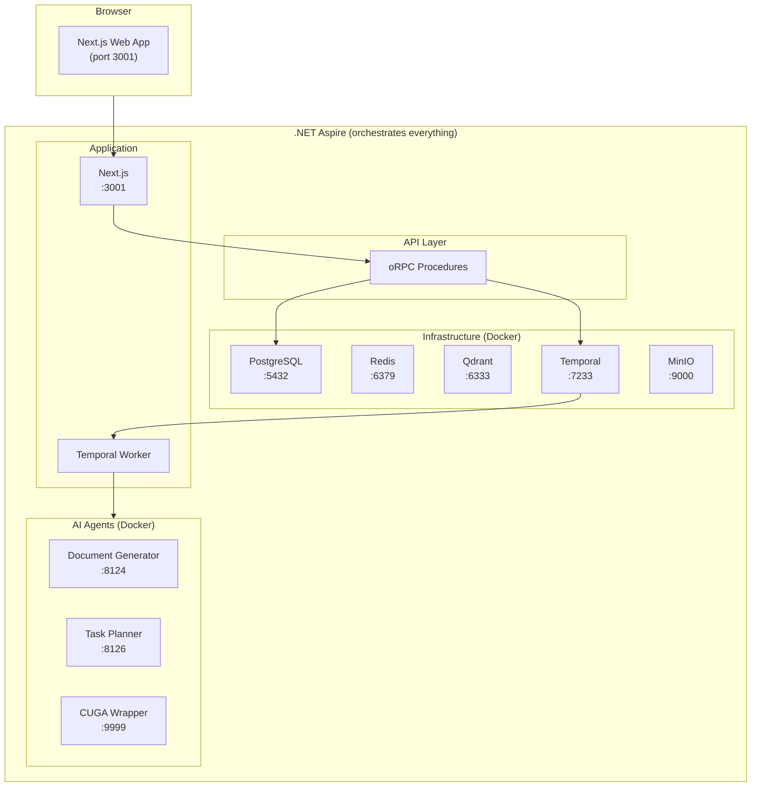

# Fabric Portal

A production-ready SaaS platform with multi-tenant architecture, AI agent orchestration, and durable workflow execution.

## Architecture



## Quick Start

### Option A: Docker Compose

```bash
# Optional: copy .env.compose.example to .env.compose for local overrides.
docker compose up -d postgres minio temporal temporal-ui qdrant redis
pnpm install
pnpm --filter @repo/database generate
pnpm --filter @repo/database migrate
pnpm --filter @repo/database apply:rls
pnpm --filter @repo/database seed
pnpm --filter @repo/database seed:ai-models
pnpm dev
```

### Option B: .NET Aspire (recommended)

```bash
cp .env.example .env.local
# Add at least one AI provider key to .env.local
#Generate random values for the following secrets in .env.local:
#    Line 25:  BETTER_AUTH_SECRET="" — generate with `openssl rand -base64 48`
#    Line 140: AGENT_API_KEY="" — generate a random key
#    Line 146: AI_TOKEN_SECRET="" — generate with `openssl rand -base64 32`
#    Lines 261-262: FABRIC_SERVER_API_KEY="" and FABRIC_AI_API_KEY=""
#                    — generate one random value and use it for BOTH
#    Line 282: BACKGROUND_AGENTS_INTERNAL_SECRET="" — generate and insert a random key greater than 32 characters

cp aspire/Fabric.AppHost/appsettings.Development.json.example aspire/Fabric.AppHost/appsettings.Development.json
# In appsettings.Development.json, reuse the SAME values you generated above for:
#    "agent-api-key"        — same value as AGENT_API_KEY in .env.local
#    "ai-token-secret"      — same value as AI_TOKEN_SECRET in .env.local
#    "fabric-server-api-key" — same value as FABRIC_SERVER_API_KEY in .env.local

pnpm install
pnpm build
cd aspire/Fabric.AppHost && dotnet run
# In a second terminal:
pnpm --filter @repo/database generate
pnpm --filter @repo/database migrate
pnpm --filter @repo/database apply:rls
pnpm --filter @repo/database seed
pnpm --filter @repo/database seed:ai-models
pnpm --filter @repo/database seed:system-agents
pnpm --filter @repo/auth seed:user
# Follow the prompts to create a login (email + password), then sign in at http://localhost:3001/auth/login

```

Access: http://localhost:3001 | Aspire Dashboard: https://localhost:17134

## Tech Stack

| Category | Technologies |
|----------|-------------|
| Core | Next.js 16, React 19, TypeScript 5.9, pnpm 10 |
| Backend | oRPC, Hono, Better Auth, Prisma 6, Zod 4 |
| Database | PostgreSQL, Redis, Qdrant (vectors), MinIO (S3) |
| Frontend | Tailwind CSS 4, Shadcn UI, Radix UI, TipTap |
| AI | Vercel AI SDK 6, LangGraph, OpenAI SDK, Anthropic SDK |
| Infra | Temporal, .NET Aspire, Azure Container Apps, Turbo, Biome |

## Project Structure

```
fabric-portal/
├── apps/web/                # Next.js application
├── packages/
│   ├── api/                 # oRPC API server
│   ├── auth/                # Better Auth config
│   ├── database/            # Prisma schema, queries, tenant isolation
│   ├── ai/                  # AI/LLM integration
│   ├── temporal/            # Temporal workflows & activities
│   └── [mail,storage,rag]/  # Supporting packages
├── agents/langchain/        # LangGraph agents
├── aspire/                  # .NET Aspire orchestration
├── fabric/standards/        # Coding standards
└── deployment/azure/        # Azure deployment
```

## Common Commands

| Command | Purpose |
|---------|---------|
| `pnpm dev` | Start development |
| `pnpm type-check` | TypeScript validation |
| `pnpm lint` | Biome linting |
| `pnpm --filter @repo/database generate` | Regenerate Prisma client |
| `pnpm --filter @repo/database migrate` | Run migrations |
| `pnpm --filter @repo/database studio` | Open Prisma Studio |
| `pnpm --filter web e2e` | Run E2E tests |

## Documentation

| Document | Purpose |
|----------|---------|
| [AGENTS.md](AGENTS.md) | AI coding assistant guide (multi-tenancy, API patterns, database) |
| [CONTRIBUTING.md](CONTRIBUTING.md) | Development workflow and conventions |
| [DOCUMENTATION_STANDARDS.md](DOCUMENTATION_STANDARDS.md) | Documentation governance rules |
| [fabric/standards/](fabric/standards/) | Coding standards (global, backend, frontend, AI) |
| [docs/](docs/) | Internal architecture and deployment references |
| [apps/web/content/docs/](apps/web/content/docs/) | Public documentation site |

## License

The platform core is licensed under **[Apache-2.0](LICENSE)**. The client packages — `packages/cli`, `packages/sdk`, `packages/sdk-mcp`, and the `packages/integrations-*` family — are **MIT**. [docs/licensing.md](docs/licensing.md) is the authoritative path → license map. Incorporated third-party material keeps its own license; see [NOTICE](NOTICE) and [THIRD_PARTY_NOTICES.md](THIRD_PARTY_NOTICES.md).

**Trademarks.** The source license grants no trademark rights (Apache-2.0 §6). The **Fabric** name as used for this product, the Fabric logo and brand assets, and the **fabric.pro** domain are marks of TechFabric LLC, all rights reserved. Factual reference needs no permission — "built on Fabric", "compatible with Fabric", "a fork of Fabric". Naming a derivative product "Fabric" or a confusingly similar name, using the logo as your own product's mark, or presenting a fork so as to imply endorsement, are not permitted. Forks must rename.
