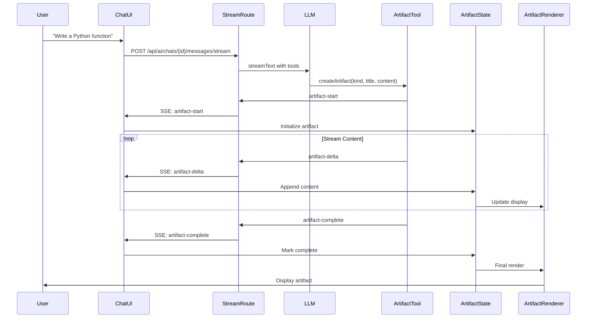
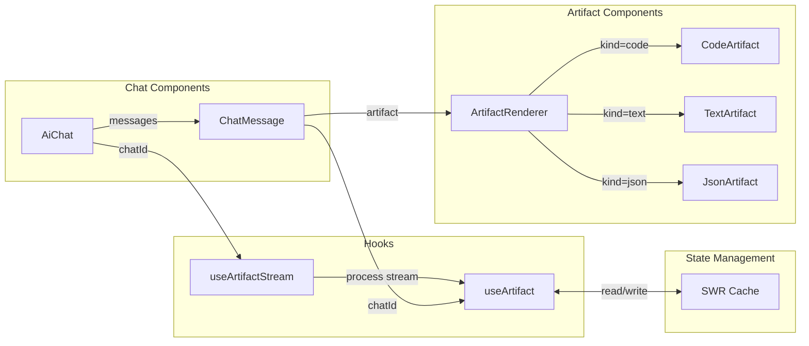
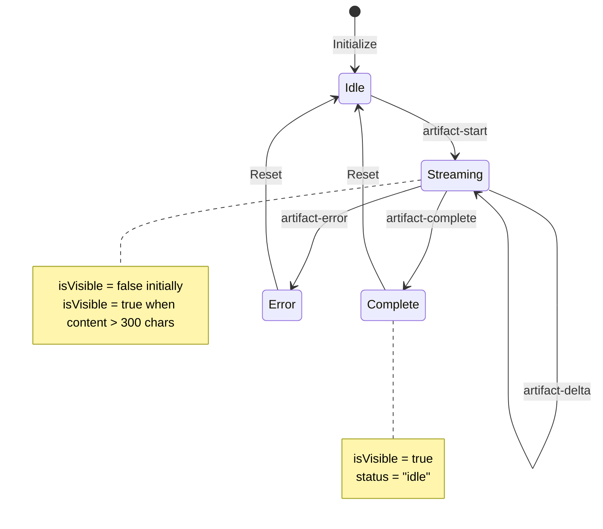
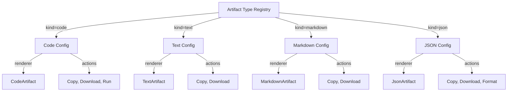
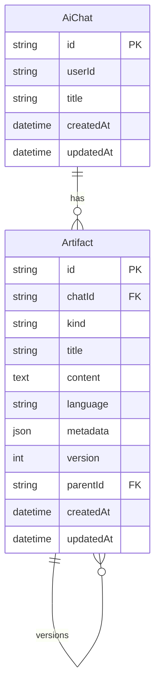
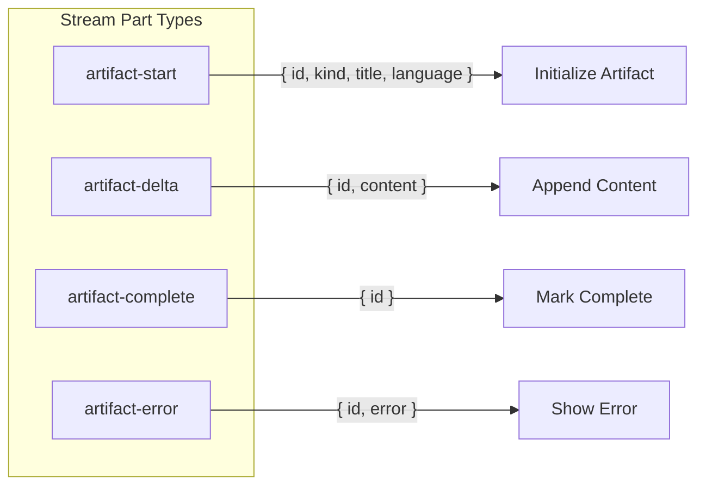
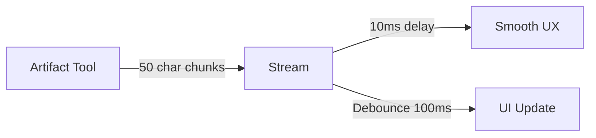
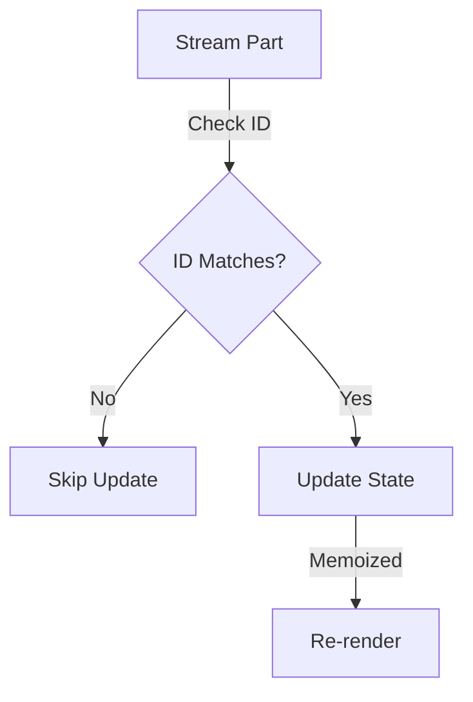
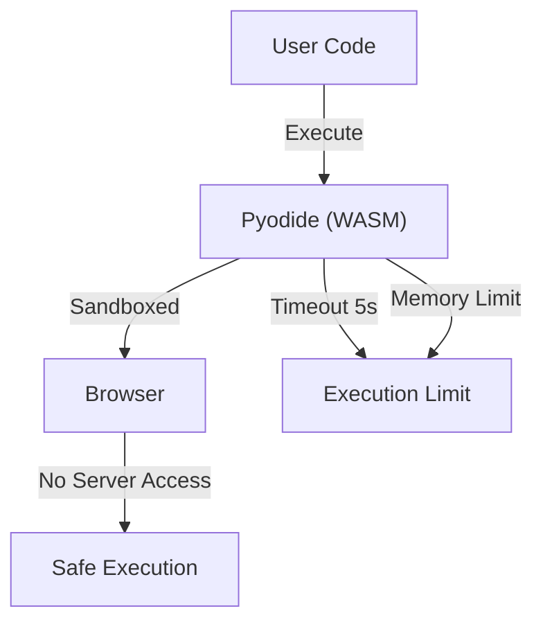
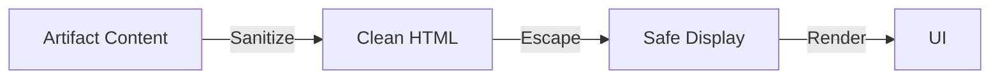

# AI Artifacts Architecture

## System Overview

This document provides a visual overview of the AI Artifacts system architecture in Fabric Portal.

## High-Level Architecture

```mermaid
flowchart TB
    subgraph Client["Client (Browser)"]
        UI["Chat UI"]
        ArtifactRenderer["Artifact Renderer"]
        ArtifactState["Artifact State (SWR)"]
    end
    
    subgraph API["API Layer"]
        StreamRoute["Stream Route"]
        ArtifactTools["Artifact Tools"]
        LLM["LLM (OpenAI/Anthropic)"]
    end
    
    subgraph Database["Database (Phase 2)"]
        ArtifactDB["Artifact Table"]
        ChatDB["Chat Table"]
    end
    
    UI -->|User Message| StreamRoute
    StreamRoute -->|Prompt + Tools| LLM
    LLM -->|Tool Calls| ArtifactTools
    ArtifactTools -->|Stream Parts| StreamRoute
    StreamRoute -->|SSE Stream| UI
    UI -->|Update State| ArtifactState
    ArtifactState -->|Render| ArtifactRenderer
    ArtifactRenderer -->|Display| UI
    
    StreamRoute -.->|Save (Phase 2)| ArtifactDB
    ArtifactDB -.->|Relation| ChatDB
```

## Data Flow



## Component Architecture



## Artifact State Machine



## Artifact Type Registry



## Database Schema (Phase 2)



## Stream Part Types



## Key Design Decisions

### 1. State Management: SWR

**Why SWR?**
- Real-time updates during streaming
- Automatic revalidation
- Built-in caching
- Optimistic updates
- Minimal boilerplate

**Alternative Considered**: Zustand
- Rejected: More boilerplate for this use case
- SWR is better suited for streaming data

### 2. Streaming: Custom Data Parts

**Why Custom Data Parts?**
- Fine-grained control over artifact updates
- Separate artifact data from message content
- Support for multiple artifacts per message
- Easy to extend with new part types

**Alternative Considered**: Embed in message content
- Rejected: Harder to parse and update incrementally

### 3. Component Architecture: Type Registry

**Why Type Registry?**
- Easy to add new artifact types
- Centralized configuration
- Type-safe renderer selection
- Reusable action definitions

**Alternative Considered**: Switch statement in renderer
- Rejected: Less extensible, harder to maintain

### 4. Visibility Threshold: 300 Characters

**Why 300 Characters?**
- Balances UX (show early) vs. performance (avoid flicker)
- Enough content to be meaningful
- Prevents empty artifact flash

**Alternative Considered**: Show immediately
- Rejected: Causes UI flicker during streaming

## Performance Considerations

### Streaming Optimization



### State Update Optimization



## Security Considerations

### Code Execution (Phase 2)



### Content Sanitization



## Future Enhancements

1. **Multi-Artifact Support**: Display multiple artifacts per message
2. **Artifact Collaboration**: Share and fork artifacts
3. **Artifact Templates**: Pre-defined artifact templates
4. **Artifact Search**: Search across all artifacts
5. **Artifact Export**: Export to GitHub Gist, CodePen, etc.

