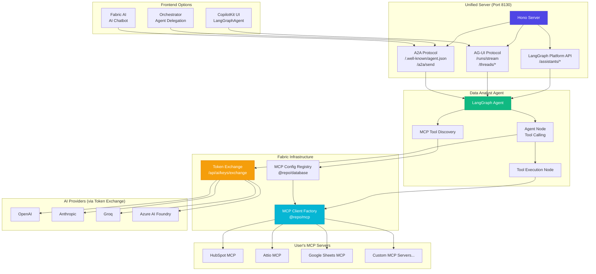

# Data Analyst Agent - Fabric Integration Architecture

## Overview

The Data Analyst Agent has been integrated with Fabric's agent infrastructure to support:

1. **A2A Protocol** - Agent-to-Agent communication for orchestrator integration
2. **AG-UI Protocol** - For CopilotKit frontend integration
3. **Fabric MCP** - Uses user's configured MCP servers instead of Composio
4. **Token Exchange** - AI provider configuration via secure token exchange
5. **Multi-Tenancy** - Proper tenant isolation for personal and organization contexts

## Architecture Diagram



## Key Components

### 1. Unified Server (`unified-server.ts`)

The entry point that exposes the agent via multiple protocols:

```typescript
// A2A endpoints (for orchestrator)
GET  /.well-known/agent.json  // Agent discovery
POST /a2a/send                 // Execute task
POST /a2a/send/stream          // Stream execution

// AG-UI endpoints (for CopilotKit)
POST /runs/stream              // Stream a run
POST /threads/:id/runs/stream  // Stream on thread

// Health
GET  /health                   // Health check
```

### 2. LangGraph Agent (`lib/agent/graph.ts`)

A LangGraph StateGraph with the following nodes:

1. **discover_tools** - Loads MCP tools from user's configured servers
2. **agent** - Reasoning node with tool calling
3. **tools** - Executes MCP tools
4. **cleanup** - Closes MCP client connections

### 3. MCP Integration

Instead of Composio, the agent uses Fabric's MCP system:

```typescript
// Get user's configured MCP servers
const configs = await listMcpConfigsForTenant({
  userId,
  organizationId,
});

// Create cached MCP client
const { client } = await getCachedMcpClientForConfig({
  configId: config.id,
  userId,
  organizationId,
});

// Get tools from MCP server
const tools = await client.tools();
```

### 4. Token Exchange

AI provider credentials are obtained via token exchange:

```typescript
// Token is passed via X-AI-Token header
const credentials = await exchangeTokenForCredentials(token);
// credentials: { apiKey, provider, model, baseUrl }
```

## Running the Agent

### Development

```bash
# Run unified server only
pnpm dev:server

# Run both Next.js frontend and unified server
pnpm dev:all
```

### Production

```bash
# Build
pnpm build

# Start unified server
pnpm start:server
```

### Docker

```bash
docker build -t data-analyst-agent .
docker run -p 8130:8130 \
  -e FABRIC_API_URL="http://web:3001" \
  -e AGENT_API_KEY="your_agent_api_key" \
  data-analyst-agent
```

## Agent Skills (A2A Discovery)

The agent exposes these skills for orchestrator discovery:

| Skill | Description |
|-------|-------------|
| `analyze-data` | Analyze data from connected sources and generate insights |
| `create-visualization` | Generate charts (bar, line, pie, scatter, histogram) |
| `generate-report` | Generate comprehensive data reports |
| `query-data` | Query and retrieve data from MCP sources |

## Environment Variables

| Variable | Description | Required |
|----------|-------------|----------|
| `PORT` | Server port (default: 8130) | No |
| `HOST` | Server host (default: 0.0.0.0) | No |
| `BASE_URL` | Public URL for agent card | No |
| `FABRIC_API_URL` | Fabric API URL for tool router | Yes |
| `AGENT_API_KEY` | API key for agent authentication | Yes |

**Note:** AI provider keys (OpenAI, Anthropic, etc.) are NOT configured as environment variables. They are provided via token exchange at runtime from Fabric's AI configuration.

## Comparison: Composio vs Fabric MCP

| Feature | Composio | Fabric MCP |
|---------|----------|------------|
| Tool Discovery | Composio Tool Router | User's configured MCP servers |
| Authentication | Composio OAuth | Fabric auth + MCP OAuth |
| AI Providers | Direct API keys | Token exchange (secure) |
| Multi-Tenancy | Per-user session | Full tenant isolation |
| Integrations | Composio managed | User managed in Settings |
| Pricing | Composio subscription | Self-hosted |

## Migration Notes

### Removed Dependencies

- `@composio/core` - Replaced by `@repo/mcp`

### New Dependencies

- `@repo/agent-core` - Unified server, model factory
- `@repo/agent-runtime` - Multi-tenant runtime
- `@repo/database` - MCP config queries
- `@repo/mcp` - MCP client factory
- `@repo/ai-token` - Token exchange

### Breaking Changes

1. The standalone Next.js app still works for development
2. For production, use the unified server (`pnpm start:server`)
3. AI providers must be configured in Fabric Settings
4. MCP servers must be installed in Fabric MCP Settings
