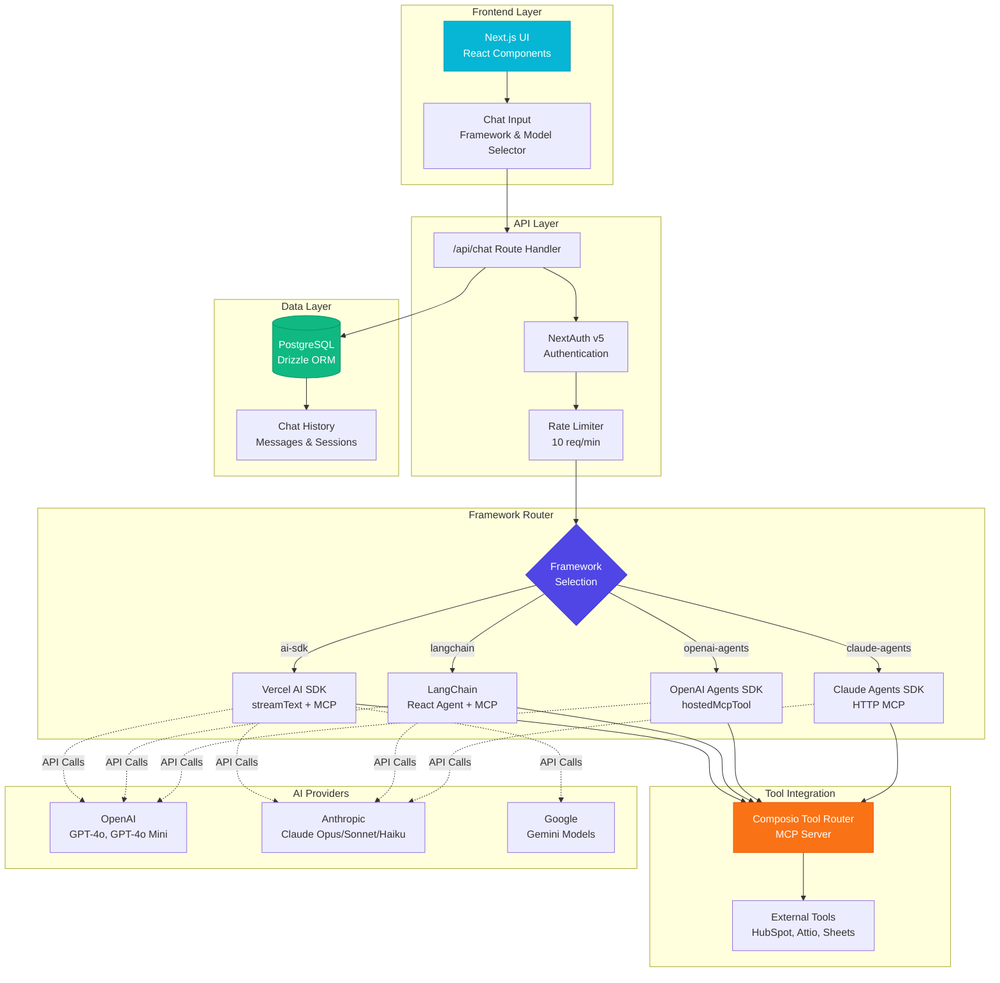
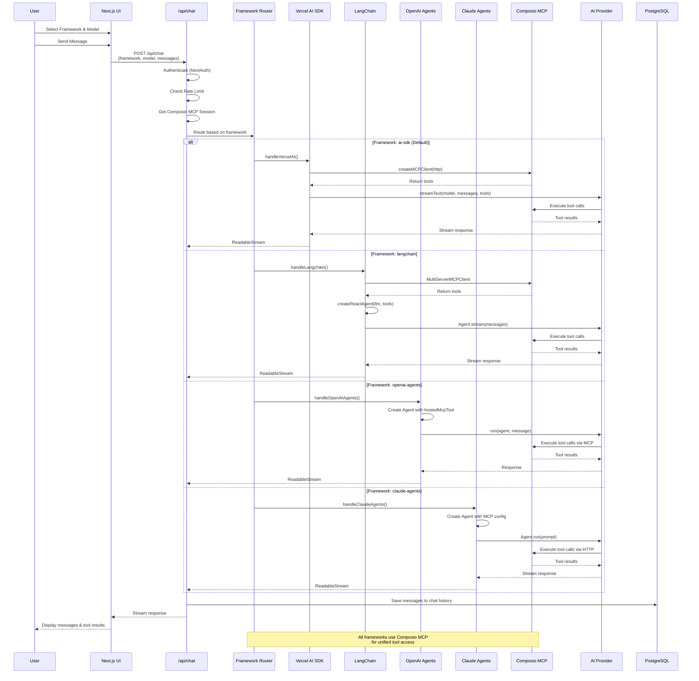
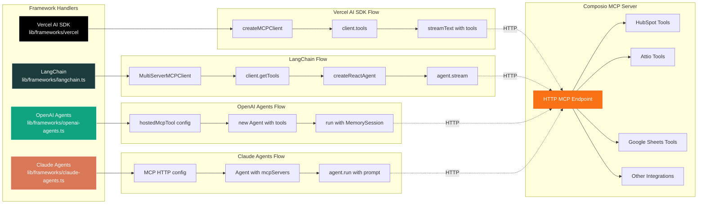
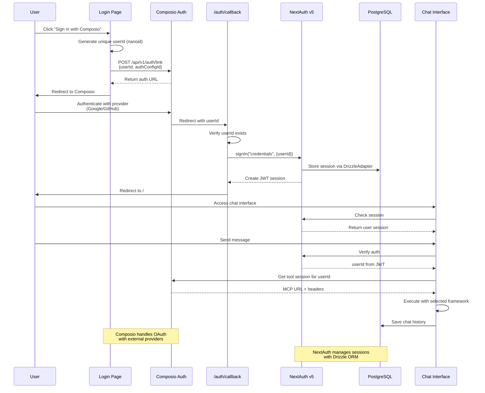

# Data Analyst Agent - Architecture Documentation

## Project Summary

**Data Analyst Agent** is a multi-framework AI-powered data analysis application built with Next.js 16. It allows users to analyze data from multiple sources (HubSpot, Attio, Google Sheets) through natural language conversations. 

The unique aspect of this project is that it supports **four different AI frameworks** (Vercel AI SDK, LangChain, OpenAI Agents SDK, and Claude Agents SDK) that all integrate with **Composio's Tool Router** for unified tool access.

## Tech Stack

- **Framework**: Next.js 16 (App Router)
- **Language**: TypeScript
- **Database**: PostgreSQL with Drizzle ORM
- **Authentication**: NextAuth.js v5 (Auth.js)
- **AI Frameworks**:
  - Vercel AI SDK (with MCP support)
  - LangChain (with MultiServerMCPClient)
  - OpenAI Agents SDK
  - Claude Agents SDK
- **Tool Integration**: Composio Tool Router (MCP Server)
- **AI Providers**: OpenAI (GPT-4o, GPT-4o Mini), Anthropic (Claude Opus/Sonnet/Haiku), Google (Gemini)
- **Styling**: Tailwind CSS
- **Validation**: Zod
- **Testing**: Vitest

## High-Level Architecture



## Request Flow - How Frameworks Work Together



## Framework Integration Details



## Authentication & Data Flow



## Key Architecture Insights

### 1. Unified Tool Access via Composio MCP

All four frameworks (Vercel AI SDK, LangChain, OpenAI Agents, Claude Agents) connect to the **same Composio MCP (Model Context Protocol) server**. This is the key architectural decision that enables framework flexibility.

**How it works:**
- Composio acts as a **universal tool router** that provides access to external integrations (HubSpot, Attio, Google Sheets)
- Each framework has its own MCP client implementation, but they all hit the same HTTP endpoint
- The MCP server exposes tools in a standardized format that all frameworks can consume
- Tool execution happens server-side through Composio, ensuring consistent behavior

### 2. Framework-Specific Implementations

Each framework has a dedicated handler in `lib/frameworks/`:

#### **Vercel AI SDK** (Default - `lib/frameworks/vercel`)
- **Implementation**: Uses `createMCPClient` and `streamText`
- **Strengths**: Most flexible, supports all models (OpenAI, Anthropic, Google)
- **Use Case**: General-purpose, production-ready streaming
- **File**: Implemented directly in `/app/api/chat/route.ts`

#### **LangChain** (`lib/frameworks/langchain.ts`)
- **Implementation**: Uses `MultiServerMCPClient` with React Agent pattern
- **Strengths**: Complex reasoning chains, agent patterns, extensive ecosystem
- **Use Case**: Multi-step reasoning, complex workflows
- **Models**: Supports OpenAI and Anthropic models

#### **OpenAI Agents SDK** (`lib/frameworks/openai-agents.ts`)
- **Implementation**: Uses `hostedMcpTool` with native OpenAI Agent
- **Strengths**: Native OpenAI integration, optimized for GPT models
- **Use Case**: GPT-specific features, OpenAI ecosystem
- **Models**: GPT models only (auto-switches if incompatible model selected)

#### **Claude Agents SDK** (`lib/frameworks/claude-agents.ts`)
- **Implementation**: Uses HTTP MCP config with Anthropic's Agent SDK
- **Strengths**: Native Anthropic integration, Claude-specific features
- **Use Case**: Claude-specific optimizations, Anthropic ecosystem
- **Models**: Claude models only

### 3. Single Entry Point with Dynamic Routing

The `/app/api/chat/route.ts` acts as a **framework router**:

```typescript
// Simplified routing logic
if (framework === "langchain") {
  return handleLangchain(context);
} else if (framework === "openai-agents") {
  return handleOpenAIAgents(context);
} else if (framework === "claude-agents") {
  return handleClaudeAgents(context);
} else {
  // Default: Vercel AI SDK
  return handleVercelAI(context);
}
```

**Key features:**
- All handlers receive the same context (messages, model, MCP config)
- All handlers return a `ReadableStream` for consistent streaming responses
- Rate limiting (10 req/min) applied before routing
- Authentication verified before any framework execution

### 4. Model Compatibility Layer

The system includes automatic model compatibility checking:

```typescript
function getCompatibleModel(framework: string, requestedModel: string): string {
  // Auto-switches to compatible model if mismatch detected
  // Example: OpenAI Agents + Claude model → switches to GPT-4o
}
```

This ensures users can't accidentally select incompatible framework/model combinations.

### 5. Shared Infrastructure

All frameworks share common infrastructure:

#### **Authentication (NextAuth v5)**
- Composio OAuth integration for external providers
- JWT-based sessions stored in PostgreSQL
- Middleware protection for all routes
- Session verification on every API call

#### **Database (PostgreSQL + Drizzle ORM)**
- Unified chat history across all frameworks
- Messages stored with full context (text, tool calls, images)
- Session management via DrizzleAdapter
- Efficient querying with Drizzle's type-safe API

#### **Rate Limiting**
- In-memory rate limiter (10 requests per minute per user)
- Applied uniformly across all frameworks
- Prevents abuse and manages API costs

#### **Tool Integration (Composio MCP)**
- Single MCP session per user
- Tools available to all frameworks simultaneously
- Consistent tool execution regardless of framework
- HTTP-based MCP transport for reliability

## Why Multiple Frameworks?

This architecture demonstrates **framework flexibility** and provides several benefits:

### **1. Performance Comparison**
Users can compare the same query across different frameworks to see which performs better for their specific use case.

### **2. Framework-Specific Features**
- **LangChain**: Access to agent patterns, memory systems, and complex chains
- **OpenAI Agents**: Native GPT optimizations and OpenAI-specific features
- **Claude Agents**: Anthropic's latest agent capabilities
- **Vercel AI SDK**: Cutting-edge streaming and multi-modal support

### **3. Vendor Independence**
The application isn't locked into a single framework. If one framework has issues or becomes deprecated, others can be used as fallbacks.

### **4. Learning & Experimentation**
Developers can learn different AI framework patterns and experiment with various approaches to the same problem.

### **5. Future-Proofing**
New frameworks can be added easily by:
1. Creating a new handler in `lib/frameworks/`
2. Adding the framework to the router in `/app/api/chat/route.ts`
3. Updating the UI selector in `lib/constants.ts`

## File Structure

```
data-analyst-agent/
├── app/
│   ├── api/
│   │   └── chat/
│   │       └── route.ts          # Main framework router & API endpoint
│   ├── auth/
│   │   └── callback/             # OAuth callback handler
│   ├── login/                    # Login page
│   └── page.tsx                  # Main chat interface
├── lib/
│   ├── frameworks/
│   │   ├── langchain.ts          # LangChain implementation
│   │   ├── openai-agents.ts      # OpenAI Agents implementation
│   │   └── claude-agents.ts      # Claude Agents implementation
│   ├── db/                       # Database schema & client
│   ├── auth.ts                   # NextAuth configuration
│   ├── auth.config.ts            # Auth config
│   └── constants.ts              # Framework & model definitions
├── components/
│   ├── chat/
│   │   ├── chat-input.tsx        # Framework & model selector
│   │   ├── chat-message.tsx      # Message rendering
│   │   └── chat-sidebar.tsx      # Chat history sidebar
│   └── ui/                       # Reusable UI components
└── hooks/
    ├── use-chat-history.ts       # Chat history management
    └── use-streaming-chat.ts     # Streaming chat hook
```

## Key Takeaways

1. **Composio MCP is the unifying layer** - It provides a standardized interface that all frameworks can consume
2. **Framework handlers are interchangeable** - They all implement the same contract (input context → output stream)
3. **User experience is consistent** - Regardless of framework choice, the UI and data flow remain the same
4. **Tool integration is framework-agnostic** - Tools work identically across all frameworks
5. **The architecture is extensible** - New frameworks can be added without modifying existing code

This design pattern demonstrates how to build **framework-agnostic AI applications** that can adapt to the rapidly evolving AI ecosystem.

