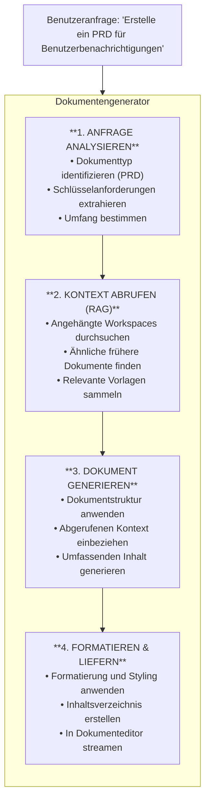

Der Dokumentengenerator ist Fabric AIs spezialisierter Agent für die Erstellung strukturierter, professioneller Dokumente. Er kombiniert die Kraft großer Sprachmodelle mit RAG (Retrieval-Augmented Generation), um Dokumente zu produzieren, die im Kontext Ihrer Organisation verwurzelt sind.

## Was kann er generieren?

Der Dokumentengenerator zeichnet sich bei folgenden Dokumenten aus:

| Dokumenttyp | Beschreibung |
|---------------|-------------|
| **PRD (Produktanforderungsdokument)** | Vollständige Produktspezifikationen mit User Stories, Anforderungen und Erfolgsmetriken |
| **Technische Spezifikation** | Detaillierte technische Designs mit Architektur, APIs und Implementierungsdetails |
| **Architekturdokument** | Systemdesign-Dokumente mit Diagrammen, Komponentenbeschreibungen und Kompromissen |
| **API-Dokumentation** | Endpunkt-Spezifikationen, Anfrage-/Antwort-Schemas und Verwendungsbeispiele |
| **User Stories** | Detaillierte Stories mit Akzeptanzkriterien, bereit für Sprint-Planung |
| **Release Notes** | Kundenorientierte Änderungszusammenfassungen |
| **Runbooks** | Betriebsprozesse für Deployments und Incident Response |

## Wie es funktioniert



## Den Dokumentengenerator verwenden

### Ein Gespräch starten

<Steps>
  <Step>
    ### Zum Dokumentengenerator navigieren

    Gehen Sie zu **Agenten → Dokumentengenerator** oder starten Sie ein neues Gespräch und wählen Sie den Dokumentengenerator-Agenten.
  </Step>

  <Step>
    ### Kontext anhängen (Optional)

    Klicken Sie auf die Schaltfläche **Anhängen**, um Workspaces hinzuzufügen, die Folgendes enthalten:
    - Frühere Dokumente als Stilreferenz
    - Technische Einschränkungen und Anforderungen
    - Unternehmensvorlagen und Richtlinien
  </Step>

  <Step>
    ### Ihr Dokument beschreiben

    Seien Sie spezifisch darüber, was Sie benötigen:
    
    ```
    Erstelle ein PRD für ein Benachrichtigungspräferenz-Feature.
    
    Anforderungen:
    - Benutzer können Benachrichtigungstypen wählen (E-Mail, Push, SMS)
    - Konfiguration für ruhige Stunden
    - Häufigkeitseinstellungen (sofort, täglich, wöchentliche Zusammenfassung)
    
    Ziel: Web- und mobile Apps
    Benutzer: Kostenlose und Premium-Stufen
    ```
  </Step>

  <Step>
    ### Überprüfen und verfeinern

    Das Dokument streamt in Echtzeit. Sie können:
    - Direkt im Editor bearbeiten
    - Über den Chat um Änderungen bitten
    - KI-Vorschläge annehmen oder ablehnen
  </Step>
</Steps>

## Prompt-Techniken

### Spezifisch sein

```
❌ "Schreibe ein PRD"

✅ "Schreibe ein PRD für ein Benutzerauthentifizierungs-Feature, das Folgendes enthält:
   - OAuth 2.0-Unterstützung für Google und GitHub
   - Magic-Link-Authentifizierung per E-Mail
   - Sitzungsverwaltung mit 30-Tage-Refresh-Tokens
   - Zielgruppe: B2B SaaS-Benutzer"
```

### Kontext referenzieren

```
"Erstelle eine technische Spezifikation für den Benachrichtigungsdienst.
Referenziere die Architekturmuster aus unserer bestehenden User-Service-
Dokumentation im 'Backend Docs' Workspace."
```

### Bestimmte Abschnitte anfordern

```
"Füge diesem PRD die folgenden Abschnitte hinzu:
1. Sicherheitsüberlegungen
2. DSGVO-Konformitätsanforderungen
3. Rollback-Plan"
```

### Iterieren

```
Zuerst: "Erstelle ein PRD für Zahlungsabwicklung"
Dann:   "Erweitere den Sicherheitsabschnitt mit PCI-Compliance-Details"
Dann:   "Füge zu jeder User Story Akzeptanzkriterien hinzu"
```

## Dokumentstruktur

Generierte Dokumente folgen Industriestandard-Strukturen:

### PRD-Struktur

```
1. Zusammenfassung
2. Problembeschreibung
3. Ziele & Vorgaben
4. Zielbenutzer
5. User Stories
   - Als [Benutzer] möchte ich [Aktion], damit [Nutzen]
   - Akzeptanzkriterien für jede Story
6. Funktionale Anforderungen
7. Nicht-funktionale Anforderungen
8. Erfolgsmetriken
9. Zeitplan & Meilensteine
10. Abhängigkeiten & Risiken
11. Anhang
```

### Technische Spezifikations-Struktur

```
1. Übersicht
2. Ziele & Nicht-Ziele
3. Hintergrund & Kontext
4. Technisches Design
   - Architekturdiagramm
   - Komponentenbeschreibungen
   - Datenmodelle
   - API-Spezifikationen
5. Implementierungsplan
6. Teststrategie
7. Monitoring & Beobachtbarkeit
8. Sicherheitsüberlegungen
9. Offene Fragen
```

## RAG-Integration

Der Dokumentengenerator nutzt RAG für kontextbewusste Generierung:

### Wie Kontext die Ausgabe verbessert

| Ohne RAG | Mit RAG |
|-------------|----------|
| Generische Dokumentstruktur | Folgt den Vorlagen Ihres Teams |
| Standard-Branchenterminologie | Verwendet die Terminologie Ihres Unternehmens |
| Platzhalterbeispiele | Echte Beispiele aus vergangenen Projekten |
| Fehlende Einschränkungen | Bezieht bekannte Einschränkungen ein |

### Workspaces anhängen

1. Einen Workspace mit Referenzdokumenten erstellen
2. Relevante Dateien hochladen (PRDs, Spezifikationen, Vorlagen)
3. Workspace beim Starten des Gesprächs anhängen
4. Der Generator ruft relevante Abschnitte automatisch ab

## Export-Optionen

Sobald Ihr Dokument fertig ist:

<Cards>
  <Card title="Markdown">
    Als `.md` für GitHub, Notion oder andere Markdown-kompatible Tools exportieren
  </Card>
  <Card title="PDF">
    Professionelles PDF mit erhaltener Formatierung
  </Card>
  <Card title="DOCX">
    Microsoft Word-Format für traditionelle Workflows
  </Card>
  <Card title="HTML">
    Web-bereites Format für die Veröffentlichung
  </Card>
</Cards>

## Best Practices

### 1. Mit Vorlagen beginnen

Erstellen Sie Prompt-Vorlagen für häufige Dokumenttypen:

```
"Erstelle ein [DOKUMENTTYP] für [FEATURE-NAME].

Kontext:
- Team: [TEAMNAME]
- Zeitplan: [ZEITPLAN]
- Abhängigkeiten: [ABHÄNGIGKEITEN]

Schließe Abschnitte ein für:
- [ABSCHNITT_1]
- [ABSCHNITT_2]
- [ABSCHNITT_3]"
```

### 2. Beispiele bereitstellen

Laden Sie Beispieldokumente in Ihren Workspace hoch. Der Generator lernt Ihren Stil:
- Bevorzugte Abschnittsreihenfolge
- Erwarteter Detailgrad
- Terminologie und Ton

### 3. Iterative Verfeinerung verwenden

Versuchen Sie nicht, alles in einem Prompt perfekt zu machen:
1. Ersten Entwurf generieren
2. Struktur und Inhalt überprüfen
3. Spezifische Verbesserungen anfordern
4. Polieren und finalisieren

### 4. KI-Vorschläge überprüfen

Der Generator kann Abschnitte hinzufügen, die Sie nicht angefordert haben. Überprüfen Sie diese – sie enthalten oft wichtige Überlegungen, die Sie möglicherweise übersehen haben.

## Fehlerbehebung

### Dokument ist zu kurz

- Mehr Kontext in Ihrem Prompt bereitstellen
- Workspaces mit Referenzdokumenten anhängen
- Um „Erweiterung" bestimmter Abschnitte bitten

### Fehlende Abschnitte

- Die benötigten Abschnitte explizit anfordern
- Eine Vorlage oder ein Beispieldokument referenzieren

### Falscher Ton oder Stil

- Beispieldokumente anhängen, die Ihren bevorzugten Stil demonstrieren
- Die Zielgruppe angeben: „Schreibe für ein technisches Publikum" oder „Schreibe für Führungskräfte"

### Kontext wird nicht verwendet

- Sicherstellen, dass der Workspace ordnungsgemäß angehängt ist
- Prüfen, ob die Dokumente im Workspace verarbeitet sind
- Genauer angeben, welcher Kontext referenziert werden soll

---

## Nächste Schritte

<Cards>
  <Card title="RAG-System" href="/docs/core-concepts/rag">
    Erfahren Sie, wie Kontextabruf funktioniert
  </Card>
  <Card title="Prompt-Bibliothek" href="/docs/features/prompts">
    Wiederverwendbare Dokumentvorlagen erstellen
  </Card>
  <Card title="Orchestrator" href="/docs/agents/orchestrator">
    Dokumentengenerierung mit anderen Aufgaben verbinden
  </Card>
</Cards>
