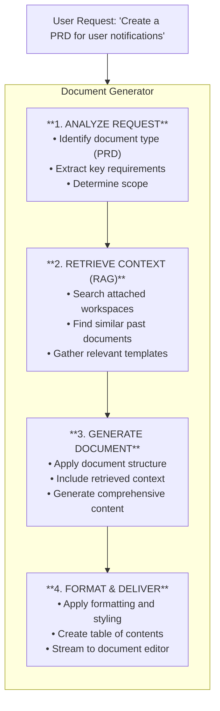

The Document Generator is Fabric AI's specialized agent for creating structured, professional documents. It combines the power of large language models with RAG (Retrieval-Augmented Generation) to produce documents grounded in your organization's context.

## What Can It Generate?

The Document Generator excels at creating:

| Document Type | Description |
|---------------|-------------|
| **PRD (Product Requirements Document)** | Complete product specs with user stories, requirements, and success metrics |
| **Technical Specification** | Detailed technical designs with architecture, APIs, and implementation details |
| **Architecture Document** | System design docs with diagrams, component descriptions, and trade-offs |
| **API Documentation** | Endpoint specs, request/response schemas, and usage examples |
| **User Stories** | Detailed stories with acceptance criteria, ready for sprint planning |
| **Release Notes** | Customer-facing change summaries |
| **Runbooks** | Operational procedures for deployments and incident response |

## How It Works



## Using the Document Generator

### Starting a Conversation

<Steps>
  <Step>
    ### Navigate to Document Generator

    Go to **Agents → Document Generator** or start a new conversation and select the Document Generator agent.
  </Step>

  <Step>
    ### Attach Context (Optional)

    Click the **Attach** button to add workspaces containing:
    - Previous documents for style reference
    - Technical constraints and requirements
    - Company templates and guidelines
  </Step>

  <Step>
    ### Describe Your Document

    Be specific about what you need:
    
    ```
    Create a PRD for a notification preferences feature.
    
    Requirements:
    - Users can choose notification types (email, push, SMS)
    - Quiet hours configuration
    - Frequency settings (immediate, daily, weekly digest)
    
    Target: Web and mobile apps
    Users: Free and premium tiers
    ```
  </Step>

  <Step>
    ### Review and Refine

    The document streams in real-time. You can:
    - Edit directly in the editor
    - Ask for changes via chat
    - Accept or reject AI suggestions
  </Step>
</Steps>

## Prompt Techniques

### Be Specific

```
❌ "Write a PRD"

✅ "Write a PRD for a user authentication feature that includes:
   - OAuth 2.0 support for Google and GitHub
   - Magic link authentication via email
   - Session management with 30-day refresh tokens
   - Target audience: B2B SaaS users"
```

### Reference Context

```
"Create a technical spec for the notification service.
Reference the architecture patterns from our existing user-service
documentation in the 'Backend Docs' workspace."
```

### Request Specific Sections

```
"Add the following sections to this PRD:
1. Security considerations
2. GDPR compliance requirements
3. Rollback plan"
```

### Iterate

```
First: "Create a PRD for payment processing"
Then:  "Expand the security section with PCI compliance details"
Then:  "Add acceptance criteria to each user story"
```

## Document Structure

Generated documents follow industry-standard structures:

### PRD Structure

```
1. Executive Summary
2. Problem Statement
3. Goals & Objectives
4. Target Users
5. User Stories
   - As a [user], I want [action], so that [benefit]
   - Acceptance criteria for each story
6. Functional Requirements
7. Non-Functional Requirements
8. Success Metrics
9. Timeline & Milestones
10. Dependencies & Risks
11. Appendix
```

### Technical Spec Structure

```
1. Overview
2. Goals & Non-Goals
3. Background & Context
4. Technical Design
   - Architecture diagram
   - Component descriptions
   - Data models
   - API specifications
5. Implementation Plan
6. Testing Strategy
7. Monitoring & Observability
8. Security Considerations
9. Open Questions
```

## RAG Integration

The Document Generator leverages RAG for context-aware generation:

### How Context Improves Output

| Without RAG | With RAG |
|-------------|----------|
| Generic document structure | Follows your team's templates |
| Standard industry terminology | Uses your company's terminology |
| Placeholder examples | Real examples from past projects |
| Missing constraints | Incorporates known limitations |

### Attaching Workspaces

1. Create a workspace with reference documents
2. Upload relevant files (PRDs, specs, templates)
3. Attach workspace when starting conversation
4. The generator retrieves relevant chunks automatically

## Export Options

Once your document is ready:

<Cards>
  <Card title="Markdown">
    Export as `.md` for GitHub, Notion, or other markdown-compatible tools
  </Card>
  <Card title="PDF">
    Professional PDF with formatting preserved
  </Card>
  <Card title="DOCX">
    Microsoft Word format for traditional workflows
  </Card>
  <Card title="HTML">
    Web-ready format for publishing
  </Card>
</Cards>

## Best Practices

### 1. Start with Templates

Create prompt templates for common document types:

```
"Create a [DOCUMENT_TYPE] for [FEATURE_NAME].

Context:
- Team: [TEAM_NAME]
- Timeline: [TIMELINE]
- Dependencies: [DEPENDENCIES]

Include sections for:
- [SECTION_1]
- [SECTION_2]
- [SECTION_3]"
```

### 2. Provide Examples

Upload example documents to your workspace. The generator learns your style:
- Preferred section ordering
- Level of detail expected
- Terminology and tone

### 3. Use Iterative Refinement

Don't try to get everything perfect in one prompt:
1. Generate initial draft
2. Review structure and content
3. Request specific improvements
4. Polish and finalize

### 4. Review AI Suggestions

The generator may add sections you didn't request. Review them—they often include important considerations you might have missed.

## Troubleshooting

### Document is too short

- Provide more context in your prompt
- Attach workspaces with reference documents
- Ask to "expand" specific sections

### Missing sections

- Explicitly request the sections you need
- Reference a template or example document

### Wrong tone or style

- Attach example documents that demonstrate your preferred style
- Specify the audience: "Write for a technical audience" or "Write for executives"

### Not using my context

- Ensure the workspace is properly attached
- Check that documents in the workspace are processed
- Be more specific about which context to reference

---

## Next Steps

<Cards>
  <Card title="RAG System" href="/docs/core-concepts/rag">
    Learn how context retrieval works
  </Card>
  <Card title="Prompt Library" href="/docs/features/prompts">
    Create reusable document templates
  </Card>
  <Card title="Orchestrator" href="/docs/agents/orchestrator">
    Chain document generation with other tasks
  </Card>
</Cards>
