Fabric Loom (der Orchestrator) ist das Gehirn von Fabric AI. Er leitet Ihre Anfragen intelligent an die richtigen Agenten und Tools weiter, verwaltet komplexe mehrstufige Workflows und lernt aus jeder Interaktion, um sich mit der Zeit zu verbessern.

## Was macht den Orchestrator besonders?

### Ohne den Orchestrator

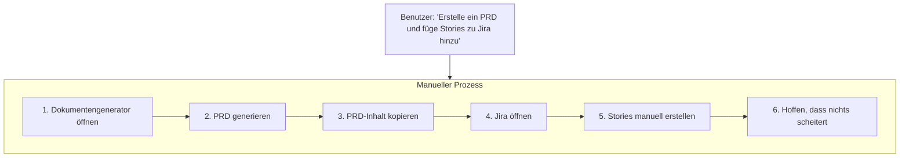

### Mit dem Orchestrator

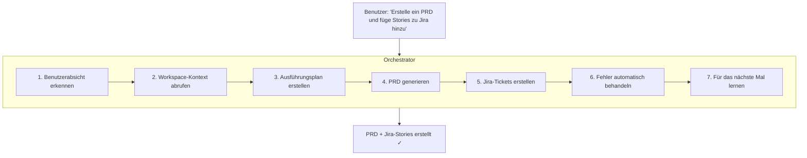

## Kernfähigkeiten

### 1. Benutzerabsichtserkennung

Der Orchestrator versteht, was Sie anfragen, einschließlich expliziter Anfragen:

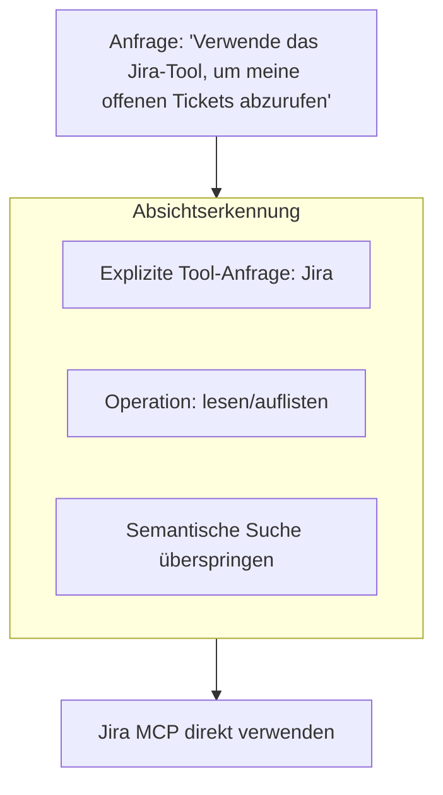

**Erkannte Absichten:**
- **Explizite Tool-Anfragen** — „Jira-Tool verwenden", „mit GitHub suchen"
- **YouTube-URLs** — Leitet automatisch zur Transkriptextraktion weiter
- **Workspace-Verweise** — „meine Dokumente", „angehängte Dateien" → RAG verwenden
- **Integrations-Trigger** — „in Slack posten", „E-Mail senden"
- **Fabric-Muster** — „zusammenfassen", „Weisheit extrahieren", „Behauptungen analysieren"

### 2. Semantische Weiterleitung

Der Orchestrator verwendet KI-Einbettungen, um den besten Ausführenden für Ihre Aufgabe zu finden:

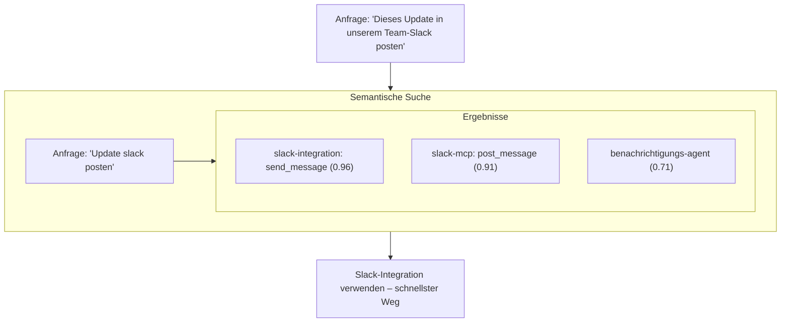

**Warum das wichtig ist:**
- Kein Merken, welches Tool was macht
- Funktioniert mit 100+ Tools ohne Verwirrung
- Verständnis natürlicher Sprache
- Respektiert explizite Benutzerpräferenzen

### 3. Aufgabenplanung

Komplexe Anfragen werden automatisch zerlegt:

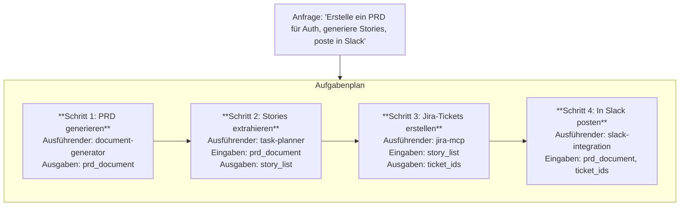

### 4. Prioritätsbasierte Ausführerzuweisung

Jedem Schritt wird der optimale Ausführende basierend auf Fähigkeit und Geschwindigkeit zugewiesen:

| Priorität | Ausführer-Typ | Anwendungsfall |
|----------|--------------|----------|
| 1 | Workflow-Integrationen | Slack, GitHub, E-Mail – schnellster Weg |
| 2 | MCP-Tools | Verbundene Dienste über MCP-Protokoll |
| 3 | Fabric AI-Tools | YouTube, Web-Scraping, Audio |
| 4 | Spezialisierte Agenten | Aufgaben, die KI-Reasoning erfordern |
| 5 | Vordefinierte Workflows | Komplexe Automatisierungen |
| 6 | LLM | Einfache Textgenerierung |
| 7 | Web/Browser | Browser-Automatisierung (letzter Ausweg) |

### 5. Kontextfluss

Jeder Schritt kann Ausgaben aus vorherigen Schritten verwenden:

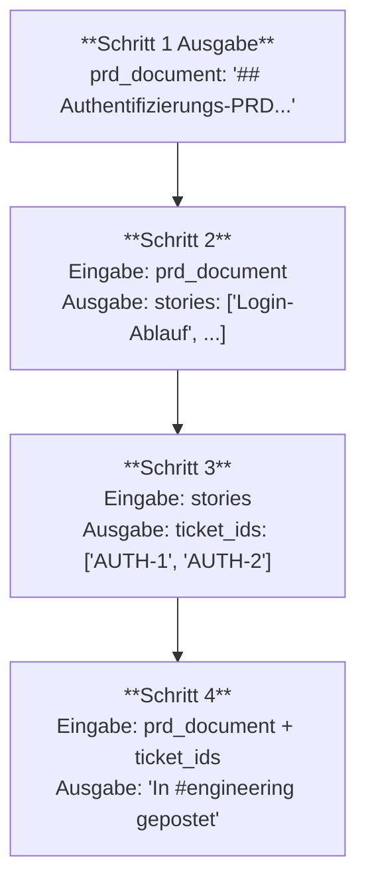

**Variableninterpolation** erlaubt das Verweisen auf Ausgaben vorheriger Schritte mit Template-Syntax wie `{{step-1.output.title}}`.

### 6. Vertrauensbasierte Genehmigungen

Der Orchestrator lernt, was Sie genehmigen:

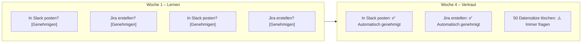

### 7. Gedächtnissystem

Der Orchestrator erinnert sich, was funktioniert und was nicht:

**Positives Gedächtnis:**
- Erfolgreiche Weiterleitungsmuster
- Effektive Tool-Kombinationen
- Funktionierende Prompts und Parameter

**Negatives Gedächtnis:**
- Fehlgeschlagene Ansätze
- Rate-limitierte Operationen
- Fehleranfällige Muster

```
Neue Anfrage ähnlich einem vergangenen Fehler:
"⚠️ Ähnliche Aufgabe vor 3 Tagen aufgrund von Rate-Limiting fehlgeschlagen.
 Operationen werden automatisch in Batches mit Verzögerungen verarbeitet."
```

### 8. Elegante Wiederherstellung

Wenn etwas schiefläuft, behandelt der Orchestrator es:

| Fehlertyp | Reaktion |
|------------|----------|
| Timeout | Mit längerem Timeout wiederholen |
| Rate-Limit | Exponentieller Backoff |
| Netzwerkfehler | Mit Backoff wiederholen |
| Validierungsfehler | Einmal korrigieren und wiederholen |
| Nicht gefunden | Schritt überspringen, fortfahren |
| Authentifizierungsfehler | Elegant beenden, Benutzer benachrichtigen |

## Workflow-Integrationen

Der Orchestrator enthält integrierte Integrationen für gängige Dienste – schneller als MCP:

### Verfügbare Integrationen

| Integration | Operationen | Geschwindigkeit |
|------------|------------|-------|
| **Slack** | send_message, post_notification, send_dm | ~200ms |
| **GitHub** | create_issue, create_pr, list_issues | ~300ms |
| **Linear** | create_issue, list_issues, update_issue | ~250ms |
| **E-Mail** | send_email (über Resend) | ~400ms |
| **Webhooks** | Benutzerdefinierte HTTP-Aufrufe | ~200ms |

### Integration vs. MCP-Tools

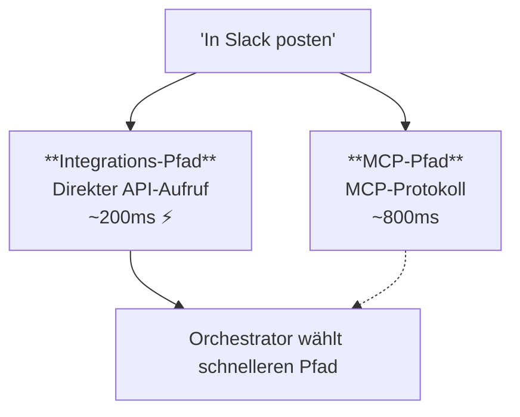

## Fabric AI-Tools

Integrierte Tools zur Inhaltsverarbeitung ohne externe Abhängigkeiten:

### YouTube-Tools

- `fabric_youtube_transcript` — Rohe Transkripte mit optionalen Zeitstempeln extrahieren
- `fabric_analyze_youtube` — Muster anwenden: zusammenfassen, weisheit_extrahieren, behauptungen_analysieren, keynote_erstellen

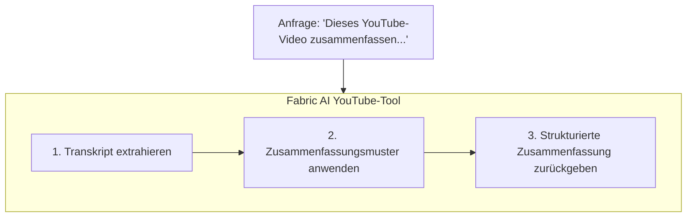

### Web-Tools

- `fabric_scrape_url` — Web-Inhalte scrapen und readability-optimieren
- `fabric_analyze_webpage` — Fabric-Muster auf Web-Inhalte anwenden

### Audio-Tools

- `fabric_transcribe_audio` — Audiodateien in Text umwandeln

## MCP-Tool-Integration

Der Orchestrator kann MCP-Tools direkt ausführen:

### Verfügbare Tools

- **GitHub** — Issues, PRs, Repositories
- **Jira** — Tickets, Sprints, Projekte
- **Slack** — Nachrichten, Kanäle
- **Notion** — Seiten, Datenbanken
- **Linear** — Issues, Projekte
- Und vieles mehr...

### Tool-Auswahl

Der Orchestrator wählt Tools automatisch aus:

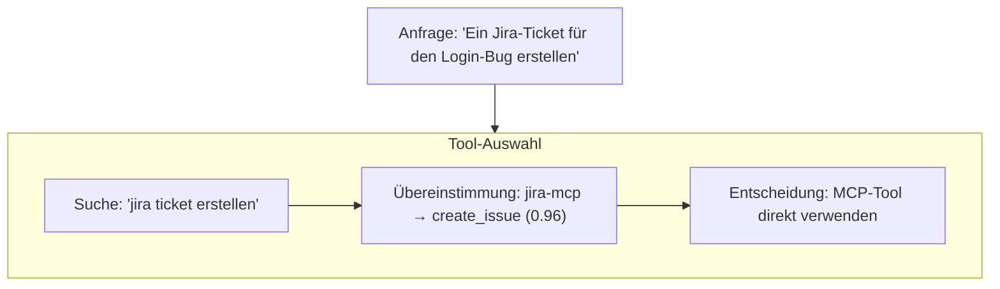

### Tool vs. Agentendelegation

| Szenario | Tool verwenden | Agenten verwenden |
|----------|----------|-----------|
| Direkter API-Aufruf | ✓ | |
| Einfaches CRUD | ✓ | |
| Reasoning erforderlich | | ✓ |
| Komplexe Generierung | | ✓ |
| Mehrstufige Logik | | ✓ |

## Stern-Präferenzen

Bevorzugte Tools, Server und Agenten priorisieren:

### Wie man Sterne vergibt

1. Gehen Sie zu **Einstellungen → MCP-Server** oder **Agenten**
2. Klicken Sie auf das ⭐-Symbol neben Elementen, die Sie häufig verwenden
3. Mit Stern versehene Elemente erhalten Priorität bei Weiterleitungsentscheidungen

### Was das Sternvergeben bewirkt

| Markiertes Element | Auswirkung |
|-------------|--------|
| MCP-Server | ALLE Tools dieses Servers erhalten erhöhte Priorität |
| Spezifisches Tool | Einzelnes Tool in der semantischen Suche bevorzugt |
| Agent | Bevorzugter Agent wird zuerst für Delegation berücksichtigt |
| Integration | Bevorzugte Integration wird priorisiert |

## Den Orchestrator verwenden

### Ein Gespräch starten

1. Gehen Sie zu **Agenten → Fabric AI (Orchestrator)**
2. Geben Sie Ihre Anfrage natürlich ein
3. Der Orchestrator erledigt den Rest

### Beispielanfragen

**Einfach:**
```
"Erstelle ein PRD für Benutzerauthentifizierung"
```

**Mehrstufig:**
```
"Erstelle ein PRD für das Zahlungs-Feature, generiere dann
User Stories und erstelle sie in Jira"
```

**Mit Kontext:**
```
"Basierend auf unserer Q4-Roadmap, erstelle eine technische Spezifikation
für das neue API-Gateway und poste eine Zusammenfassung in #engineering"
```

**YouTube-Verarbeitung:**
```
"Dieses Video zusammenfassen und die wichtigsten Erkenntnisse extrahieren:
https://youtube.com/watch?v=..."
```

**Web-Recherche:**
```
"Diesen Artikel scrapen und eine Zusammenfassung mit wichtigsten Punkten erstellen:
https://example.com/article"
```

### Ausführungsmodi

Wählen Sie den richtigen Modus für Ihre Aufgabe:

| Modus | Max. Schritte | Anwendungsfall |
|------|-----------|----------|
| Lite | 10 | Schnelle Aufgaben, einfache Anfragen |
| Balanced | 20 | Standard-Workflows (Standard) |
| Deep | 25 | Komplexe Multi-Agenten-Aufgaben |

### Kontext anhängen

Verbessern Sie Ergebnisse durch Anhängen von:

- **Workspaces** — Dokumente für RAG-Kontext
- **Projekte** — Frühere Projektdokumente
- **Spezifische Dateien** — Direkt hochladen

## Workflow-Visualisierung

Beobachten Sie Ihren Workflow in Echtzeit:

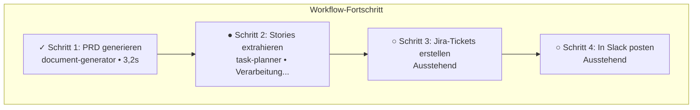

## Genehmigungsworkflows

### Wann Genehmigungen erforderlich sind

Der Orchestrator fordert Genehmigung für folgendes an:

1. **Risikoreiche Operationen** — Löschen, Massenaktualisierungen
2. **Externe Aktionen** — Erste Tool-Nutzung
3. **Kostspielige Operationen** — Große API-Aufrufe
4. **Unbekannte Muster** — Neue Anfragetypen

### Risikostufen

| Operation | Risikostufe | Genehmigung |
|-----------|------------|----------|
| Lesen/Auflisten/Suchen | Niedrig | Automatisch genehmigt |
| Aktualisieren/Ändern | Mittel | Vertrauensverlauf prüfen |
| Erstellen/Einfügen | Hoch | Fragen, wenn nicht vertrauenswürdig |
| Löschen/Massenoperationen | Kritisch | Immer fragen |
| Code-Ausführung | Mittel+ | Vertrauensverlauf prüfen |
| Browser-Automatisierung | Mittel+ | Vertrauensverlauf prüfen |

### Genehmigungsinterface

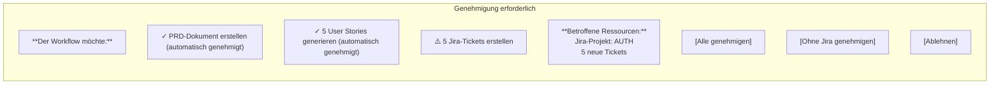

### Konsolidierte Anfragen

Mehrere Genehmigungen werden in einer zusammengefasst:

```
Vorher: 5 separate Genehmigungsanfragen
Nachher: 1 konsolidierte Anfrage mit allen aufgelisteten Aktionen
```

## Erweiterte Funktionen

### Nachfragen behandeln

Der Orchestrator versteht Kontext:

```
Sie: "Erstelle ein PRD für Auth"
Orchestrator: [Generiert PRD]

Sie: "Füge auch OAuth-Unterstützung hinzu"
Orchestrator: "PRD wird aktualisiert, um OAuth einzuschließen..."
[Modifiziert vorhandenes Dokument, fängt nicht von vorne an]
```

### Journey-Verfolgung

Vollständiger Kontext wird beibehalten:

- Aktuelle Ausführungsphase
- Getroffene Entscheidungen und Begründungen
- Annahmen mit Vertrauensstufen
- Alle generierten Artefakte
- Vollständiger Gesprächsverlauf

### Echtzeit-Signale

Workflow-Zustand jederzeit abfragen, um aktuellen Fortschritt, generierte Artefakte und Ausführungsstatus zu sehen.

### Generalist-Agentendelegation

Für komplexe Aufgaben, die autonome Ausführung erfordern:

| Delegationsmodus | Verhalten |
|----------------|----------|
| `single-step` | Orchestrator zerlegt, Agent führt Schritte aus |
| `complete-task` | Agent behandelt die gesamte Aufgabe autonom |

---

## Nächste Schritte

<Cards>
  <Card title="Dokumentengenerator" href="/docs/agents/document-generator">
    Erfahren Sie mehr über den Dokumentengenerierungs-Agenten
  </Card>
  <Card title="MCP-Integration" href="/docs/integrations/mcp">
    Externe Tools verbinden
  </Card>
  <Card title="Workflows" href="/docs/core-concepts/workflows">
    Dauerhafte Workflow-Ausführung verstehen
  </Card>
</Cards>
