Fabric Loom (the orchestrator) is the brain of Fabric AI. It intelligently routes your requests to the right agents and tools, manages complex multi-step workflows, and learns from every interaction to get better over time.

## What Makes the Orchestrator Special?

### Before the Orchestrator

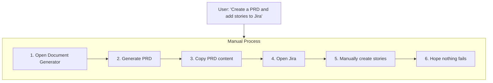

### With the Orchestrator

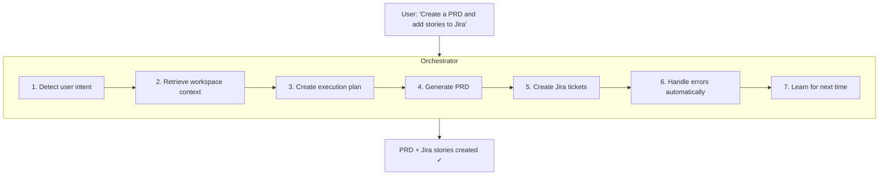

## Core Capabilities

### 1. User Intent Detection

The Orchestrator understands what you're asking for, including explicit requests:

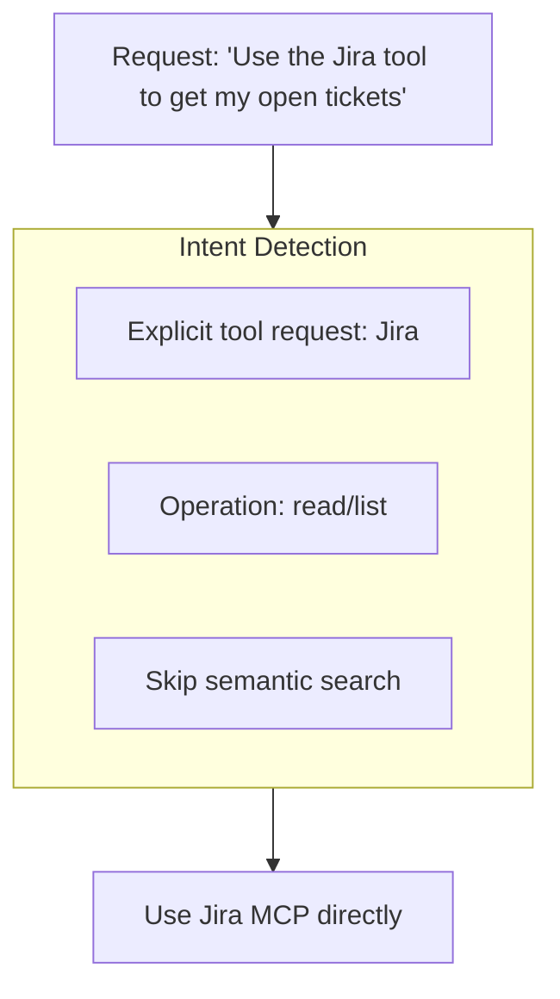

**Recognized intents:**
- **Explicit tool requests** — "use the Jira tool", "search with GitHub"
- **YouTube URLs** — Automatically routes to transcript extraction
- **Workspace references** — "my docs", "attached files" → use RAG
- **Integration triggers** — "post to Slack", "send an email"
- **Fabric patterns** — "summarize", "extract wisdom", "analyze claims"

### 2. Semantic Routing

The Orchestrator uses AI embeddings to find the best executor for your task:

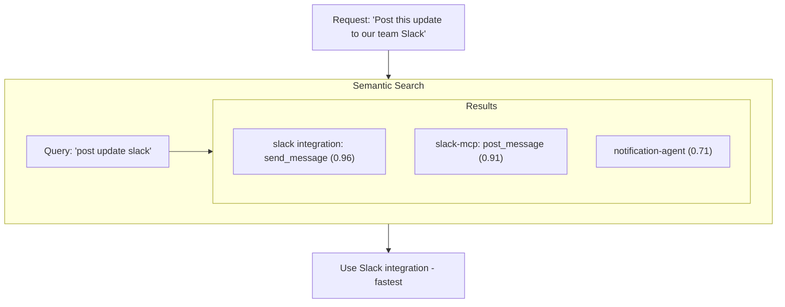

**Why this matters:**
- No need to remember which tool does what
- Works with 100+ tools without confusion
- Natural language understanding
- Respects explicit user preferences

### 3. Task Planning

Complex requests are automatically decomposed:

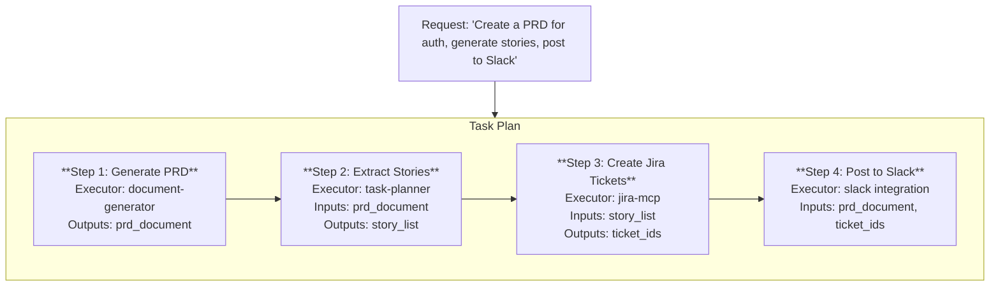

### 4. Priority-Based Executor Assignment

Each step is assigned the optimal executor based on capability and speed:

| Priority | Executor Type | Use Case |
|----------|--------------|----------|
| 1 | Workflow Integrations | Slack, GitHub, Email—fastest path |
| 2 | MCP Tools | Connected services via MCP protocol |
| 3 | Fabric AI Tools | YouTube, web scraping, audio |
| 4 | Specialized Agents | Tasks requiring AI reasoning |
| 5 | Pre-defined Workflows | Complex automations |
| 6 | LLM | Simple text generation |
| 7 | Web/Browser | Browser automation (last resort) |

### 5. Context Flow

Each step can use outputs from previous steps:

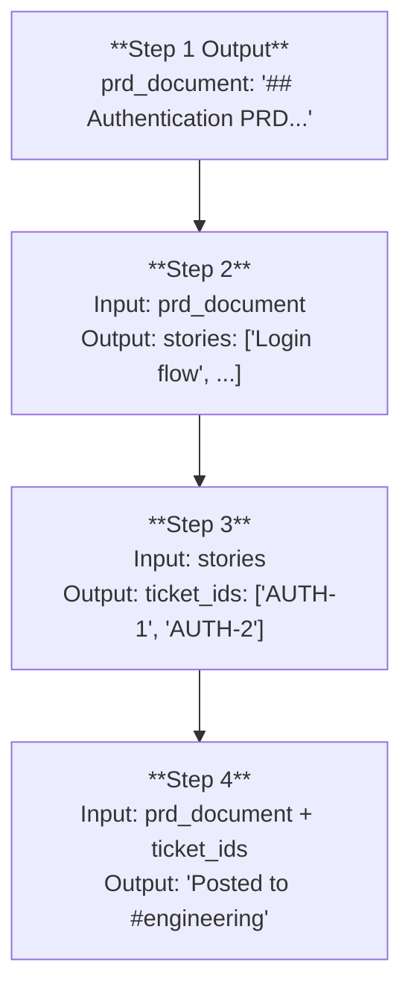

**Variable interpolation** allows referencing previous step outputs using template syntax like `{{step-1.output.title}}`.

### 6. Trust-Based Approvals

The Orchestrator learns what you approve:

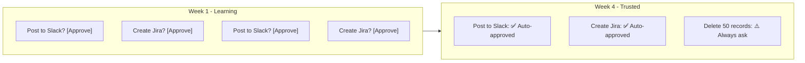

### 7. Memory System

The Orchestrator remembers what works and what doesn't:

**Positive Memory:**
- Successful routing patterns
- Effective tool combinations
- Working prompts and parameters

**Negative Memory:**
- Failed approaches
- Rate-limited operations
- Error-prone patterns

```
New request similar to past failure:
"⚠️ Similar task failed 3 days ago due to rate limiting.
 Automatically batching operations with delays."
```

### 8. Graceful Recovery

When things go wrong, the Orchestrator handles it:

| Error Type | Response |
|------------|----------|
| Timeout | Retry with longer timeout |
| Rate limit | Exponential backoff |
| Network error | Retry with backoff |
| Validation error | Fix and retry once |
| Not found | Skip step, continue |
| Auth error | Fail gracefully, alert user |

## Workflow Integrations

The Orchestrator includes built-in integrations for common services—faster than MCP:

### Available Integrations

| Integration | Operations | Speed |
|------------|------------|-------|
| **Slack** | send_message, post_notification, send_dm | ~200ms |
| **GitHub** | create_issue, create_pr, list_issues | ~300ms |
| **Linear** | create_issue, list_issues, update_issue | ~250ms |
| **Email** | send_email (via Resend) | ~400ms |
| **Webhooks** | Custom HTTP calls | ~200ms |

### Integration vs. MCP Tools

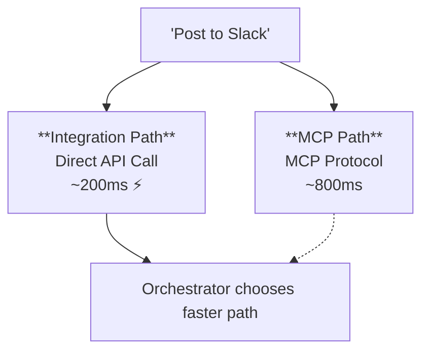

## Fabric AI Tools

Built-in tools for content processing without external dependencies:

### YouTube Tools

- `fabric_youtube_transcript` — Extract raw transcripts with optional timestamps
- `fabric_analyze_youtube` — Apply patterns: summarize, extract_wisdom, analyze_claims, create_keynote

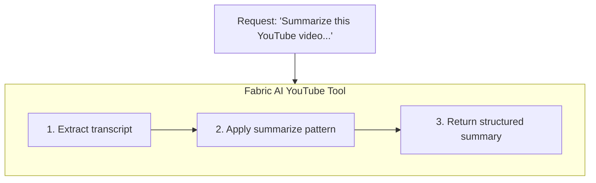

### Web Tools

- `fabric_scrape_url` — Scrape and readability-enhance web content
- `fabric_analyze_webpage` — Apply Fabric patterns to web content

### Audio Tools

- `fabric_transcribe_audio` — Convert audio files to text

## MCP Tool Integration

The Orchestrator can execute MCP tools directly:

### Available Tools

- **GitHub** — Issues, PRs, repositories
- **Jira** — Tickets, sprints, projects
- **Slack** — Messages, channels
- **Notion** — Pages, databases
- **Linear** — Issues, projects
- And many more...

### Tool Selection

The Orchestrator automatically selects tools:

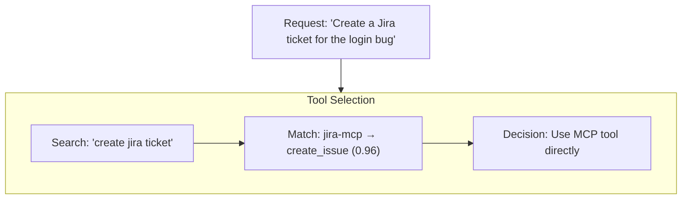

### Tool vs. Agent Delegation

| Scenario | Use Tool | Use Agent |
|----------|----------|-----------|
| Direct API call | ✓ | |
| Simple CRUD | ✓ | |
| Needs reasoning | | ✓ |
| Complex generation | | ✓ |
| Multi-step logic | | ✓ |

## Starred Preferences

Prioritize your favorite tools, servers, and agents:

### How to Star

1. Go to **Settings → MCP Servers** or **Agents**
2. Click the ⭐ icon next to items you use frequently
3. Starred items get priority in routing decisions

### What Starring Does

| Starred Item | Effect |
|-------------|--------|
| MCP Server | ALL tools from that server get elevated priority |
| Specific Tool | Individual tool boosted in semantic search |
| Agent | Preferred agent considered first for delegation |
| Integration | Favorite integration prioritized |

## Using the Orchestrator

### Starting a Conversation

1. Go to **Agents → Fabric AI (Orchestrator)**
2. Type your request naturally
3. The Orchestrator handles the rest

### Example Requests

**Simple:**
```
"Create a PRD for user authentication"
```

**Multi-step:**
```
"Create a PRD for the payment feature, then generate
user stories and create them in Jira"
```

**With context:**
```
"Based on our Q4 roadmap, create a technical spec
for the new API gateway and post a summary to #engineering"
```

**YouTube processing:**
```
"Summarize this video and extract the key insights:
https://youtube.com/watch?v=..."
```

**Web research:**
```
"Scrape this article and create a summary with key takeaways:
https://example.com/article"
```

### Execution Modes

Choose the right mode for your task:

| Mode | Max Steps | Use Case |
|------|-----------|----------|
| Lite | 10 | Quick tasks, simple queries |
| Balanced | 20 | Standard workflows (default) |
| Deep | 25 | Complex multi-agent tasks |

### Attaching Context

Improve results by attaching:

- **Workspaces** — Documents for RAG context
- **Projects** — Previous project documents
- **Specific files** — Upload directly

## Workflow Visualization

Watch your workflow execute in real-time:

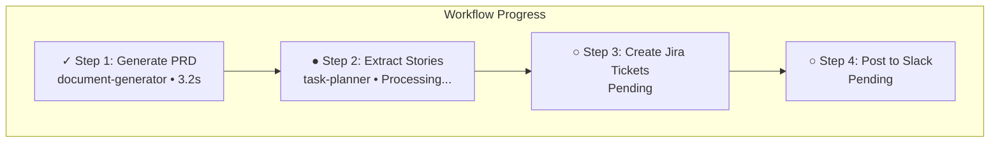

## Approval Workflows

### When Approvals Are Needed

The Orchestrator requests approval for:

1. **High-risk operations** — Delete, bulk updates
2. **External actions** — First-time tool usage
3. **Expensive operations** — Large API calls
4. **Unknown patterns** — New types of requests

### Risk Levels

| Operation | Risk Level | Approval |
|-----------|------------|----------|
| Read/List/Search | Low | Auto-approved |
| Update/Modify | Medium | Check trust history |
| Create/Insert | High | Ask if untrusted |
| Delete/Bulk ops | Critical | Always ask |
| Code execution | Medium+ | Check trust history |
| Browser automation | Medium+ | Check trust history |

### Approval Interface

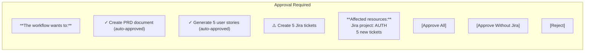

### Consolidated Prompts

Multiple approvals are grouped into one:

```
Before: 5 separate approval prompts
After:  1 consolidated prompt with all actions listed
```

## Advanced Features

### Follow-up Handling

The Orchestrator understands context:

```
You: "Create a PRD for auth"
Orchestrator: [Generates PRD]

You: "Actually, also include OAuth support"
Orchestrator: "Updating PRD to include OAuth..."
[Modifies existing document, not starting over]
```

### Journey Tracking

Full context is maintained:

- Current phase of execution
- Decisions made and why
- Assumptions with confidence levels
- All artifacts generated
- Complete conversation history

### Real-time Signals

Query workflow state anytime to see current progress, generated artifacts, and execution status.

### Generalist Agent Delegation

For complex tasks requiring autonomous execution:

| Delegation Mode | Behavior |
|----------------|----------|
| `single-step` | Orchestrator decomposes, agent executes steps |
| `complete-task` | Agent handles entire task autonomously |

---

## Next Steps

<Cards>
  <Card title="Document Generator" href="/docs/agents/document-generator">
    Learn about the document generation agent
  </Card>
  <Card title="MCP Integration" href="/docs/integrations/mcp">
    Connect external tools
  </Card>
  <Card title="Workflows" href="/docs/core-concepts/workflows">
    Understand durable workflow execution
  </Card>
</Cards>
