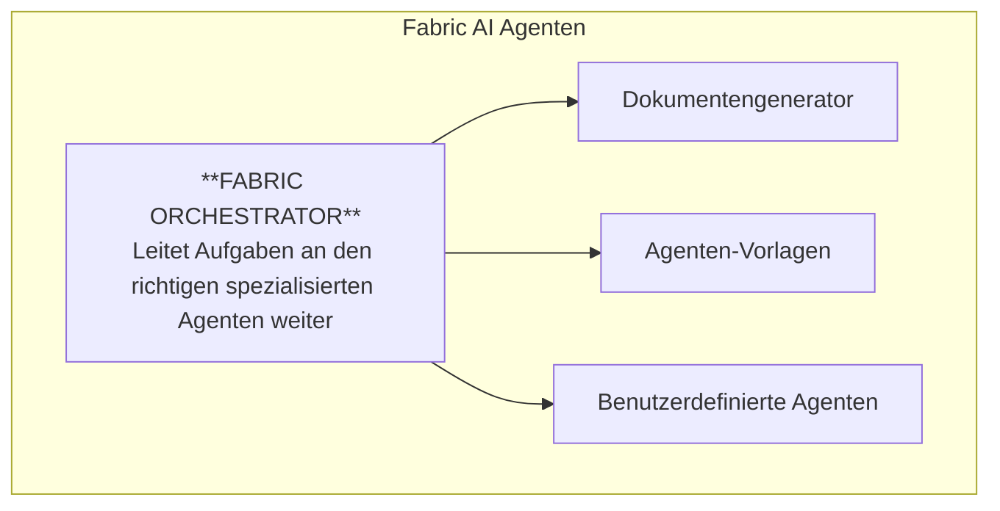
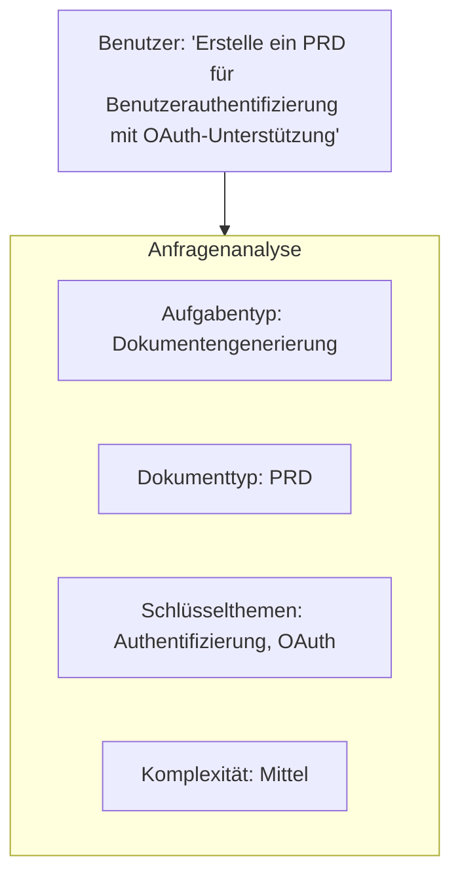
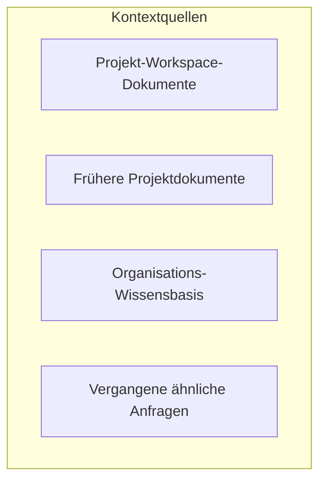
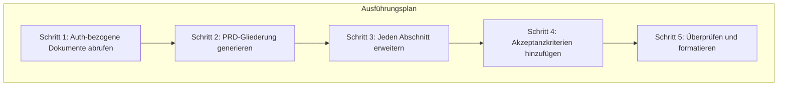
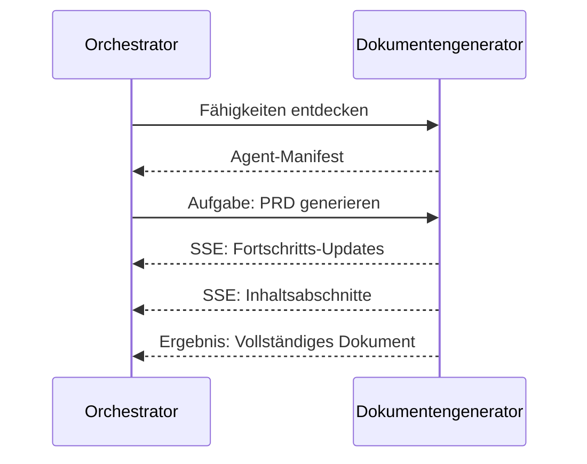
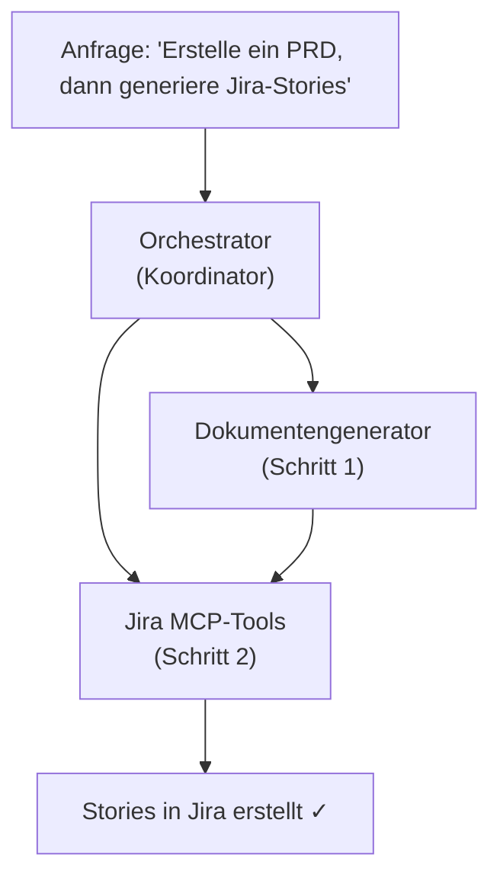

Fabric AI enthält mehrere spezialisierte Agenten, von denen jeder für bestimmte Aufgaben konzipiert ist. Dieser Leitfaden hilft Ihnen zu verstehen, welchen Agenten Sie verwenden sollten und wie sie zusammenarbeiten.

## Was ist ein Agent?

Ein KI-Agent ist ein autonomes System, das kann:

- **Verstehen** — Ihre Anfragen und den Kontext interpretieren
- **Planen** — Komplexe Aufgaben in Schritte unterteilen
- **Ausführen** — Aktionen wie das Generieren von Dokumenten oder das Aufrufen von APIs durchführen
- **Lernen** — Aus Feedback und vergangenen Ausführungen verbessern

Im Gegensatz zu einfachen Chatbots können Agenten Aktionen ausführen, Tools verwenden und mehrstufige Workflows abschließen.

## Agenten-Typen

Fabric bietet verschiedene Typen von Agenten:

### Fabric Loom

Der intelligente Orchestrator, der Ihre Anfragen an den richtigen Agenten oder das richtige Tool weiterleitet.

**Am besten geeignet für:**
- Komplexe mehrstufige Aufgaben
- Aufgaben, die mehrere Tools benötigen
- Wenn Sie nicht sicher sind, welchen Agenten Sie verwenden sollen
- Workflow-Automatisierung
- YouTube- und Web-Inhaltsverarbeitung

**Fähigkeiten:**
- Benutzerabsichtserkennung für explizite Anfragen
- Semantische Weiterleitung zum besten Ausführenden
- Aufgabenzerlegung und -planung
- Prioritätsbasierte Ausführerzuweisung
- Workflow-Integrationen (Slack, GitHub, Linear, E-Mail)
- MCP-Tool-Ausführung
- Fabric AI-Tools (YouTube, Web-Scraping, Audio)
- Agentendelegation über A2A-Protokoll
- Vertrauensbasierte Genehmigungsworkflows
- Hybrid-Gedächtnissystem für das Lernen aus vergangenen Interaktionen
- Stern-Präferenzen für bevorzugte Tools

[Mehr über den Orchestrator →](/docs/agents/orchestrator)

### Dokumentengenerator

Ein spezialisierter Agent zum Erstellen strukturierter Dokumente.

**Am besten geeignet für:**
- PRDs und Produktdokumentation
- Technische Spezifikationen
- Architekturdokumente
- User Stories und Akzeptanzkriterien
- API-Dokumentation

**Fähigkeiten:**
- Mehrere Dokumentvorlagen
- RAG-Kontext-Integration
- Echtzeit-Streaming mit Diff-Hervorhebung
- Bestätigungs-/Ablehnungsworkflow für Änderungen
- Export als PDF, DOCX, Markdown

[Mehr über Dokumentengenerierung →](/docs/agents/document-generator)

### Agenten-Vorlagen

Erstellen Sie wiederverwendbare Agenten aus vorgefertigten oder benutzerdefinierten Vorlagen, die jeweils auf bestimmte Workflows zugeschnitten sind.

**Am besten geeignet für:**
- Organisationsspezifische Prozesse
- Wiederholbare Dokumenttypen
- Benutzerdefinierte Integrationen
- Spezialisierte Domänen

**Fähigkeiten:**
- 15+ vorgefertigte Vorlagenkategorien
- Benutzerdefinierte Prompts und Anweisungen
- Konfigurierbare MCP-Tools
- Benutzerdefinierte Genehmigungsworkflows
- Skill-Anhängesystem
- Gedächtnissystem zum Lernen
- Bereichsbasierte Sichtbarkeit (System, Organisation, Benutzer)

[Mehr über Agenten-Vorlagen →](/docs/features/agent-templates)

### Benutzerdefinierte Agenten

Erstellen Sie Ihre eigenen Agenten für spezifische Workflows.

**Am besten geeignet für:**
- Organisationsspezifische Prozesse
- Einzigartige Dokumenttypen
- Benutzerdefinierte Integrationen
- Spezialisierte Domänen

**Fähigkeiten:**
- Benutzerdefinierte Prompts und Anweisungen
- Konfigurierbare MCP-Tools
- Benutzerdefinierte Genehmigungsworkflows
- Vorlagenbasierte Erstellung

[Wie man benutzerdefinierte Agenten erstellt →](/docs/tutorials/first-agent)

## Den richtigen Agenten wählen

| Aufgabe | Empfohlener Agent | Warum |
|------|-------------------|-----|
| PRD generieren | Dokumentengenerator | Optimiert für strukturierte Dokumente |
| 10 Jira-Tickets aus PRD erstellen | Orchestrator | Mehrstufig mit MCP-Tools |
| YouTube-Video zusammenfassen | Orchestrator | Verwendet Fabric AI YouTube-Tools |
| Update in Slack posten | Orchestrator | Verwendet schnelle Slack-Integration |
| Website scrapen und analysieren | Orchestrator | Verwendet Fabric AI Web-Tools |
| Konkurrenzwebsites scrapen | Orchestrator | Browser-Automatisierungstools |
| Wöchentlichen Bericht generieren | Agenten-Vorlage | Organisationsspezifisches Format |
| „Hilf mir mit X" | Orchestrator | Leitet automatisch weiter |

## Wie Agenten funktionieren

### 1. Anfrageverständnis

Wenn Sie eine Nachricht senden:

### 2. Kontextabruf

Der Agent sammelt relevanten Kontext:

### 3. Planung

Für komplexe Aufgaben erstellt der Agent einen Plan:

### 4. Ausführung

Der Agent führt jeden Schritt aus:

- **KI-Generierung** — LLM aufrufen, um Inhalte zu generieren
- **Tool-Aufrufe** — MCP-Tools ausführen, falls benötigt
- **Validierung** — Ausgabequalität überprüfen
- **Streaming** — Echtzeit-Updates an den Benutzer senden

### 5. Lernen

Nach Abschluss:

- Aufzeichnen, was funktioniert hat und was nicht
- Gedächtnis für zukünftige Anfragen aktualisieren
- Weiterleitungsgenauigkeit verbessern

## Agentenkommunikation

### A2A-Protokoll

Agenten kommunizieren über das Agent-zu-Agent (A2A)-Protokoll:

### AG-UI-Protokoll

Agenten kommunizieren mit der Benutzeroberfläche über das AG-UI-Protokoll:

- **Zustands-Deltas** — Echtzeit-Zustandsaktualisierungen
- **Tool-Aufrufe** — Einblick in Agentenaktionen
- **Streaming** — Token-für-Token-Generierung
- **Genehmigungen** — Mensch-im-Prozess-Anfragen

## Multi-Agenten-Workflows

Der Orchestrator kann mehrere Agenten koordinieren:

## Agentenkonfiguration

### Modellauswahl

Wählen Sie, welches KI-Modell der Agent verwendet:

Die Modellauswahl ist datenbankgesteuert und hängt von Ihren konfigurierten Anbietern ab. Häufige Optionen umfassen:

- **Claude Sonnet / Opus** — Lange Dokumente, differenzierte Inhalte
- **GPT-4o** — Komplexes Reasoning, Tool-Aufrufe
- **GPT-4o-mini** — Schnell, ausgewogene Qualität
- **Llama 3.3 (über Groq/Cerebras)** — Ultraniedrige Latenz
- **DeepSeek R1** — Tiefe Reasoning-Aufgaben

Modelle werden nach Aufgabentyp aufgelöst (Einfach, Komplex, Chat, Tool-Aufruf, Reasoning, Einbettung). Konfiguration unter [KI-Anbieter](/docs/features/ai-providers).

### Temperatur

Ausgabe-Kreativität steuern:

- **0,0** — Deterministisch, konsistent
- **0,7** — Ausgewogen (Standard)
- **1,0** — Kreativ, variiert

### System-Prompts

Agentenverhalten mit Prompts aus Ihrer Bibliothek anpassen.

### MCP-Tools

Spezifische Tools für den Agenten aktivieren:

- GitHub, Jira, Slack-Integrationen
- Benutzerdefinierte API-Endpunkte
- Datenbankabfragen

---

## Nächste Schritte

<Cards>
  <Card title="Fabric Loom" href="/docs/agents/orchestrator">
    Tauchen Sie tief in den intelligenten Orchestrator ein
  </Card>
  <Card title="Dokumentengenerator" href="/docs/agents/document-generator">
    Erfahren Sie mehr über Dokumentengenerierung
  </Card>
  <Card title="Agenten-Vorlagen" href="/docs/features/agent-templates">
    Entdecken Sie vorgefertigte und benutzerdefinierte Agenten-Vorlagen
  </Card>
  <Card title="Benutzerdefinierten Agenten erstellen" href="/docs/tutorials/first-agent">
    Bauen Sie Ihren eigenen Agenten
  </Card>
</Cards>
