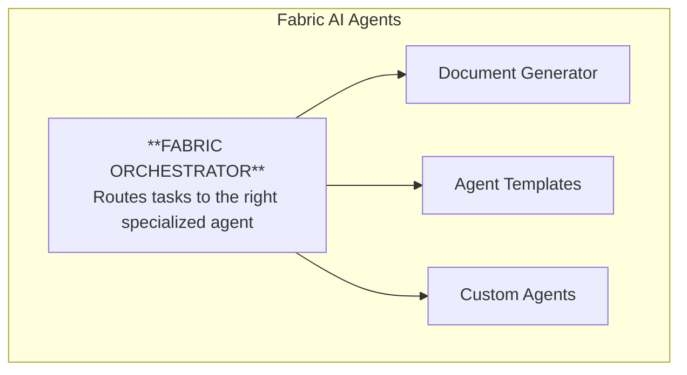
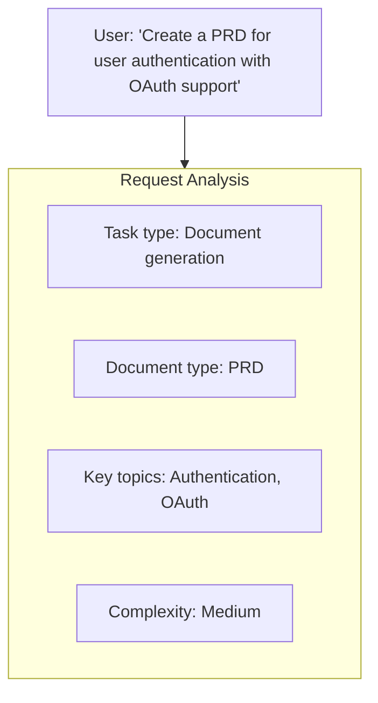
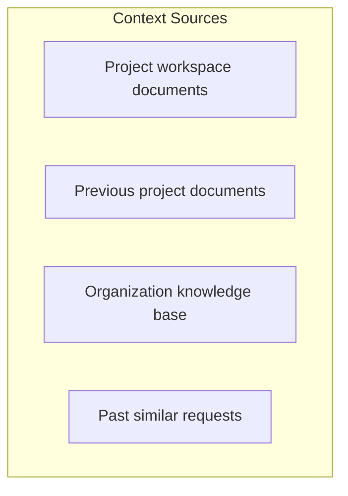
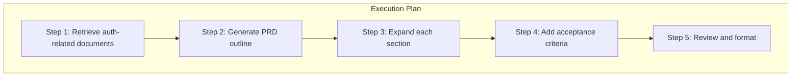
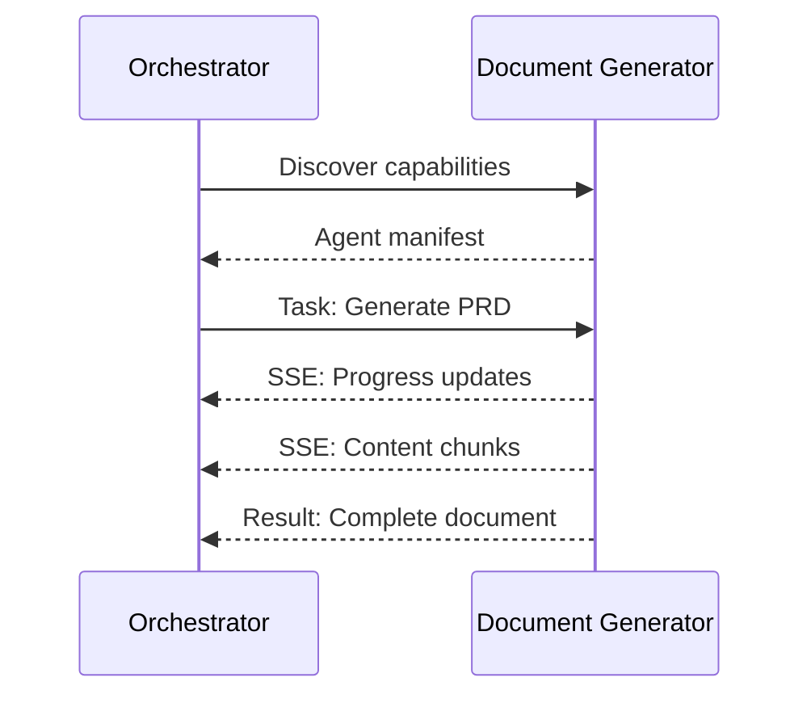
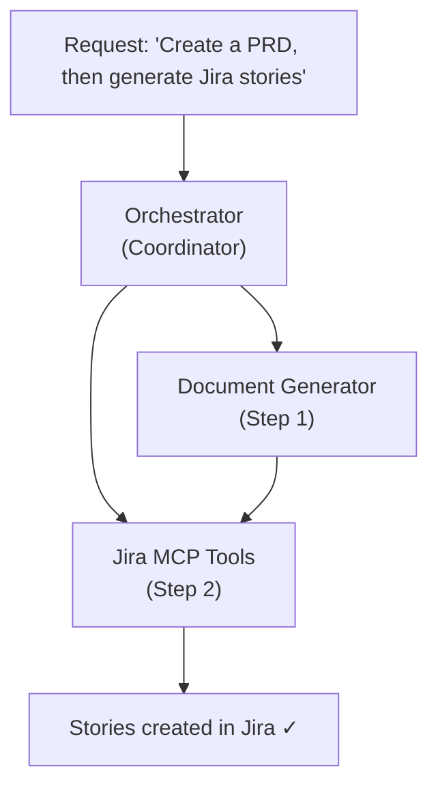

Fabric AI includes multiple specialized agents, each designed for specific tasks. This guide helps you understand which agent to use and how they work together.

## What is an Agent?

An AI agent is an autonomous system that can:

- **Understand** — Interpret your requests and context
- **Plan** — Break down complex tasks into steps
- **Execute** — Perform actions like generating documents or calling APIs
- **Learn** — Improve from feedback and past executions

Unlike simple chatbots, agents can take actions, use tools, and complete multi-step workflows.

## Agent Types

Fabric provides several types of agents:

### Fabric Loom

The intelligent orchestrator that routes your requests to the right agent or tool.

**Best for:**
- Complex multi-step tasks
- Tasks requiring multiple tools
- When you're not sure which agent to use
- Workflow automation
- YouTube and web content processing

**Capabilities:**
- User intent detection for explicit requests
- Semantic routing to find the best executor
- Task decomposition and planning
- Priority-based executor assignment
- Workflow integrations (Slack, GitHub, Linear, Email)
- MCP tool execution
- Fabric AI tools (YouTube, web scraping, audio)
- Agent delegation via A2A protocol
- Trust-based approval workflows
- Hybrid memory system for learning from past interactions
- Starred preferences for favorite tools

[Learn more about the Orchestrator →](/docs/agents/orchestrator)

### Document Generator

A specialized agent for creating structured documents.

**Best for:**
- PRDs and product documentation
- Technical specifications
- Architecture documents
- User stories and acceptance criteria
- API documentation

**Capabilities:**
- Multiple document templates
- RAG context integration
- Real-time streaming with diff highlighting
- Confirm/reject workflow for changes
- Export to PDF, DOCX, Markdown

[Learn more about Document Generation →](/docs/agents/document-generator)

### Agent Templates

Create reusable agents from pre-built or custom templates, each tailored to specific workflows.

**Best for:**
- Organization-specific processes
- Repeatable document types
- Custom integrations
- Specialized domains

**Capabilities:**
- 15+ pre-built template categories
- Custom prompts and instructions
- Configurable MCP tools
- Custom approval workflows
- Skill attachment system
- Memory system for learning
- Scoped visibility (System, Organization, User)

[Learn more about Agent Templates →](/docs/features/agent-templates)

### Custom Agents

Create your own agents for specific workflows.

**Best for:**
- Organization-specific processes
- Unique document types
- Custom integrations
- Specialized domains

**Capabilities:**
- Custom prompts and instructions
- Configurable MCP tools
- Custom approval workflows
- Template-based creation

[Learn how to create custom agents →](/docs/tutorials/first-agent)

## Choosing the Right Agent

| Task | Recommended Agent | Why |
|------|-------------------|-----|
| Generate a PRD | Document Generator | Optimized for structured documents |
| Create 10 Jira tickets from PRD | Orchestrator | Multi-step with MCP tools |
| Summarize a YouTube video | Orchestrator | Uses Fabric AI YouTube tools |
| Post update to Slack | Orchestrator | Uses fast Slack integration |
| Scrape and analyze a website | Orchestrator | Uses Fabric AI web tools |
| Scrape competitor websites | Orchestrator | Browser automation tools |
| Generate weekly report | Agent Template | Organization-specific format |
| "Just help me with X" | Orchestrator | Routes automatically |

## How Agents Work

### 1. Request Understanding

When you send a message:

### 2. Context Retrieval

The agent gathers relevant context:

### 3. Planning

For complex tasks, the agent creates a plan:

### 4. Execution

The agent executes each step:

- **AI generation** — Call LLM to generate content
- **Tool calls** — Execute MCP tools if needed
- **Validation** — Check output quality
- **Streaming** — Send updates to user in real-time

### 5. Learning

After completion:

- Record what worked and what didn't
- Update memory for future requests
- Improve routing accuracy

## Agent Communication

### A2A Protocol

Agents communicate using the Agent-to-Agent (A2A) protocol:

### AG-UI Protocol

Agents communicate with the UI using the AG-UI protocol:

- **State deltas** — Real-time state updates
- **Tool calls** — Visibility into agent actions
- **Streaming** — Token-by-token generation
- **Approvals** — Human-in-the-loop requests

## Multi-Agent Workflows

The Orchestrator can coordinate multiple agents:

## Agent Configuration

### Model Selection

Choose which AI model the agent uses:

Model selection is database-driven and depends on your configured providers. Common choices include:

- **Claude Sonnet / Opus** — Long documents, nuanced content
- **GPT-4o** — Complex reasoning, tool calling
- **GPT-4o-mini** — Fast, balanced quality
- **Llama 3.3 (via Groq/Cerebras)** — Ultra-low latency
- **DeepSeek R1** — Deep reasoning tasks

Models are resolved per task type (Simple, Complex, Chat, Tool Calling, Reasoning, Embedding). See [AI Providers](/docs/features/ai-providers) for configuration.

### Temperature

Control output creativity:

- **0.0** — Deterministic, consistent
- **0.7** — Balanced (default)
- **1.0** — Creative, varied

### System Prompts

Customize agent behavior with prompts from your library.

### MCP Tools

Enable specific tools for the agent:

- GitHub, Jira, Slack integrations
- Custom API endpoints
- Database queries

---

## Next Steps

<Cards>
  <Card title="Fabric Loom" href="/docs/agents/orchestrator">
    Deep dive into the intelligent orchestrator
  </Card>
  <Card title="Document Generator" href="/docs/agents/document-generator">
    Learn about document generation
  </Card>
  <Card title="Agent Templates" href="/docs/features/agent-templates">
    Explore pre-built and custom agent templates
  </Card>
  <Card title="Create Custom Agent" href="/docs/tutorials/first-agent">
    Build your own agent
  </Card>
</Cards>
