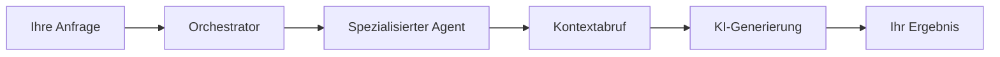

Fabric AI kombiniert intelligente Agenten, dauerhafte Workflows und Dokumentenabfrage, um Teams bei der Automatisierung komplexer Wissensarbeit zu unterstützen. Diese Seite erklärt die wichtigsten Konzepte, wie die Plattform funktioniert.

## Anfrage-Ablauf

Wenn Sie mit Fabric interagieren, durchläuft Ihre Anfrage mehrere Stufen:

1. **Sie stellen eine Anfrage** über Chat, einen Workflow-Trigger oder die API
2. **Der Orchestrator** bestimmt, welcher spezialisierte Agent am besten für Ihre Aufgabe geeignet ist
3. **Der Agent ruft Kontext ab** aus Ihren hochgeladenen Dokumenten und dem Workspace-Wissen
4. **Die KI generiert das Ergebnis** mit Ihrem konfigurierten Anbieter (OpenAI, Anthropic, Groq usw.)
5. **Sie erhalten die Ausgabe** als Dokument, Chat-Antwort oder Workflow-Ergebnis

## KI-Agenten

Agenten sind der intelligente Kern von Fabric. Jeder Agent spezialisiert sich auf eine Art von Aufgabe:

| Agent | Was er tut |
|-------|------------|
| **Orchestrator** | Leitet Ihre Anfragen an den richtigen Spezialisten und koordiniert Multi-Agenten-Aufgaben |
| **Dokumentengenerator** | Erstellt PRDs, Spezifikationen, Architekturdokumente und andere strukturierte Dokumente |
| **CUGA** | Konfigurierbarer Generalist-Agent für komplexe, mehrstufige Automatisierung |
| **Benutzerdefinierte Agenten** | Agenten, die Sie mit spezifischen Tools, Prompts und Verhaltensweisen definieren |

Agenten können miteinander kommunizieren, externe Tools (über MCP) nutzen und aus vergangenen Interaktionen durch persistentes Gedächtnis lernen.

## Dokumentenabfrage (RAG)

Wenn Sie Dokumente in einen Workspace hochladen, verarbeitet Fabric diese zu durchsuchbarem Wissen:

1. **Dokumente werden in Abschnitte aufgeteilt** – in bedeutungsvolle Segmente
2. **Einbettungen werden generiert** für semantisches Verständnis
3. **Wenn Sie eine Frage stellen**, werden relevante Abschnitte abgerufen und der KI als Kontext bereitgestellt

Das bedeutet, die KI referenziert *Ihre tatsächlichen Dokumente* statt sich ausschließlich auf ihre Trainingsdaten zu verlassen. Weitere Details finden Sie unter [RAG](/docs/core-concepts/rag).

## Dauerhafte Workflows

Fabric verwendet eine dauerhafte Workflow-Engine für langwierige, mehrstufige Prozesse:

- **Fehlertoleranz** – Wenn ein Schritt fehlschlägt, wird er automatisch wiederholt
- **Mensch im Prozess** – Workflows können für Ihre Genehmigung pausieren, bevor sie fortfahren
- **Zustandspersistenz** – Workflows überleben Neustarts und Unterbrechungen
- **Protokollierung** – Jeder Schritt wird für vollständige Transparenz aufgezeichnet

Dies unterstützt Funktionen wie Dokumentengenerierungs-Pipelines, geplante Agent-Ausführungen und mehrstufige Automatisierungsketten. Weitere Details finden Sie unter [Workflows](/docs/core-concepts/workflows).

## Integrierte Integrationen

Fabric verbindet sich mit Ihren bestehenden Tools, um End-to-End-Prozesse zu automatisieren:

| Integration | Was Sie tun können |
|------------|-------------------|
| **Slack** | Nachrichten und Benachrichtigungen senden |
| **GitHub** | Issues und Pull Requests erstellen |
| **Linear** | Issues erstellen und aktualisieren |
| **E-Mail** | Automatisierte E-Mails senden |
| **Webhooks** | Mit beliebigen externen Systemen verbinden |

Weitere Integrationen sind über MCP (Model Context Protocol) verfügbar. Die vollständige Liste finden Sie unter [Integrationen](/docs/integrations/mcp).

## Werkzeuge zur Inhaltsverarbeitung

Fabric enthält integrierte Werkzeuge zur Verarbeitung von Inhalten aus verschiedenen Quellen:

- **YouTube** – Transkripte extrahieren und Video-Inhalte analysieren
- **Web** – Web-Seiteninhalte abrufen und analysieren
- **Audio** – Audiodateien transkribieren

## Datenisolierung

Alle Daten in Fabric sind strikt nach Mandant isoliert. Ihre persönlichen Daten sind in einer Organisation nie sichtbar, und die Daten einer Organisation sind für eine andere nie sichtbar – auch wenn derselbe Benutzer beiden angehört. Weitere Details finden Sie unter [Datenisolierung](/docs/guides/tenant-isolation).

## Sicherheit

- **Mehrere Anmeldemethoden** – E-Mail, OAuth, Passkeys und Zwei-Faktor-Authentifizierung
- **Rollenbasierter Zugriff** – Eigentümer-, Admin- und Mitgliederrollen innerhalb von Organisationen
- **Verschlüsselte Zugangsdaten** – Alle API-Schlüssel und Geheimnisse werden verschlüsselt gespeichert
- **Verschlüsselte Kommunikation** – Alle Daten im Transit sind mit TLS geschützt

---

## Nächste Schritte

<Cards>
  <Card title="RAG-System" href="/docs/core-concepts/rag">
    Erfahren Sie, wie Dokumentenabfrage funktioniert
  </Card>
  <Card title="Workflows" href="/docs/core-concepts/workflows">
    Verstehen Sie die dauerhafte Workflow-Automatisierung
  </Card>
  <Card title="Agenten-Typen" href="/docs/agents/overview">
    Entdecken Sie die verschiedenen Agenten-Typen
  </Card>
</Cards>
