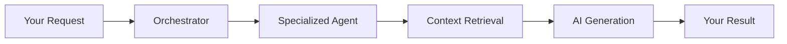

Fabric AI combines intelligent agents, durable workflows, and document retrieval to help teams automate complex knowledge work. This page explains the key concepts behind how the platform works.

## Request Flow

When you interact with Fabric, your request flows through several stages:

1. **You submit a request** through chat, a workflow trigger, or the API
2. **The Orchestrator** determines which specialized agent is best suited for your task
3. **The agent retrieves context** from your uploaded documents and workspace knowledge
4. **AI generates the result** using your configured provider (OpenAI, Anthropic, Groq, etc.)
5. **You receive the output** as a document, chat response, or workflow result

## AI Agents

Agents are the intelligent core of Fabric. Each agent specializes in a type of task:

| Agent | What It Does |
|-------|-------------|
| **Orchestrator** | Routes your requests to the right specialist and coordinates multi-agent tasks |
| **Document Generator** | Creates PRDs, specs, architecture docs, and other structured documents |
| **CUGA** | Configurable generalist agent for complex, multi-step automation |
| **Custom Agents** | Agents you define with specific tools, prompts, and behaviors |

Agents can communicate with each other, use external tools (via MCP), and learn from past interactions through persistent memory.

## Document Retrieval (RAG)

When you upload documents to a workspace, Fabric processes them into searchable knowledge:

1. **Documents are chunked** into meaningful segments
2. **Embeddings are generated** for semantic understanding
3. **When you ask a question**, relevant chunks are retrieved and provided as context to the AI

This means the AI references *your actual documents* rather than relying solely on its training data. See [RAG](/docs/core-concepts/rag) for more details.

## Durable Workflows

Fabric uses a durable workflow engine to handle long-running, multi-step processes:

- **Fault tolerance** -- If a step fails, it retries automatically
- **Human-in-the-loop** -- Workflows can pause for your approval before continuing
- **State persistence** -- Workflows survive restarts and interruptions
- **Audit trail** -- Every step is recorded for full visibility

This powers features like document generation pipelines, scheduled agent runs, and multi-tool automation chains. See [Workflows](/docs/core-concepts/workflows) for more details.

## Built-In Integrations

Fabric connects to your existing tools to automate end-to-end processes:

| Integration | What You Can Do |
|------------|----------------|
| **Slack** | Send messages and notifications |
| **GitHub** | Create issues and pull requests |
| **Linear** | Create and update issues |
| **Email** | Send automated emails |
| **Webhooks** | Connect to any external system |

Additional integrations are available through MCP (Model Context Protocol). See [Integrations](/docs/integrations/mcp) for the full list.

All external tool access is protected by [Runtime Authority](/docs/core-concepts/runtime-authority) — a session-scoped authorization model that ensures agents get human-approved, time-limited access before using connected systems.

You can also use Fabric as a unified MCP server from Claude Desktop, Cursor, or any MCP client via the [MCP Gateway](/docs/integrations/mcp-gateway).

## Content Processing Tools

Fabric includes built-in tools for processing content from various sources:

- **YouTube** -- Extract transcripts and analyze video content
- **Web** -- Scrape and analyze web page content
- **Audio** -- Transcribe audio files

## Data Isolation

All data in Fabric is strictly isolated by tenant. Your personal data is never visible in an organization, and one organization's data is never visible to another -- even if the same user belongs to both. See [Data Isolation](/docs/guides/tenant-isolation) for details.

## Security

- **Multiple sign-in methods** -- Email, OAuth, passkeys, and two-factor authentication
- **Role-based access** -- Owner, Admin, and Member roles within organizations
- **Encrypted credentials** -- All API keys and secrets are encrypted at rest
- **Encrypted communications** -- All data in transit is protected with TLS

---

## Next Steps

<Cards>
  <Card title="RAG System" href="/docs/core-concepts/rag">
    Learn how document retrieval works
  </Card>
  <Card title="Workflows" href="/docs/core-concepts/workflows">
    Understand durable workflow automation
  </Card>
  <Card title="Agent Types" href="/docs/agents/overview">
    Explore the different agent types
  </Card>
</Cards>
