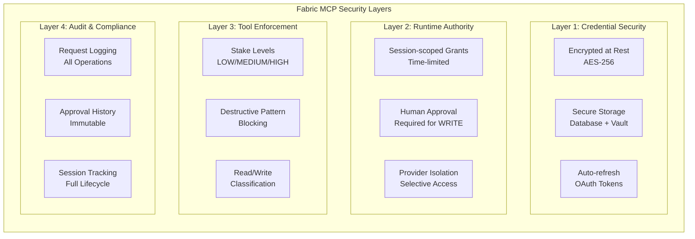
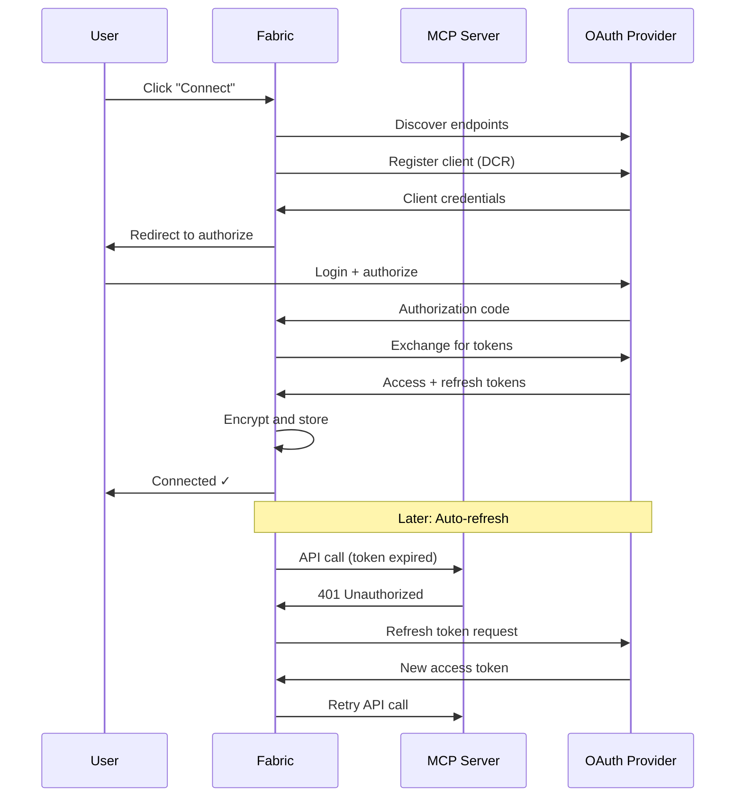
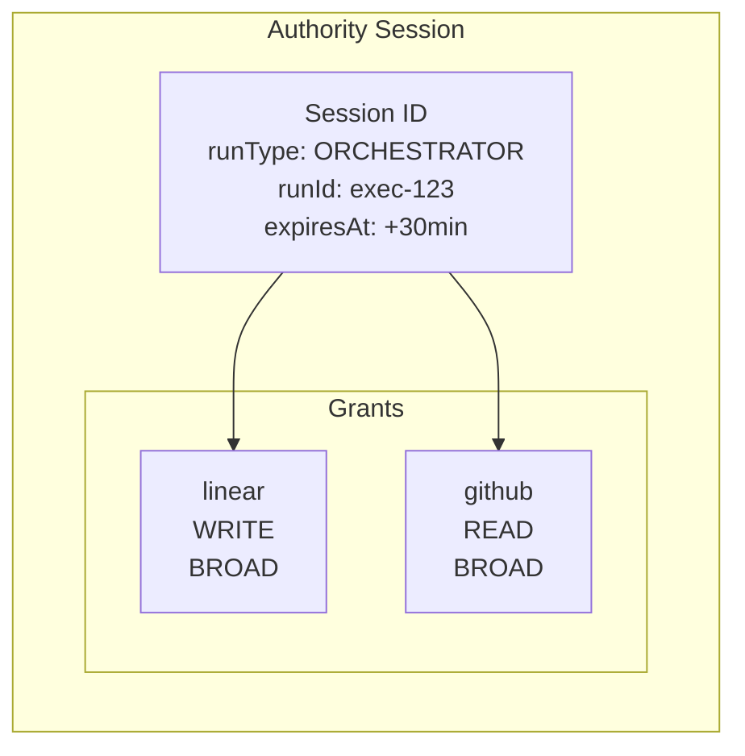
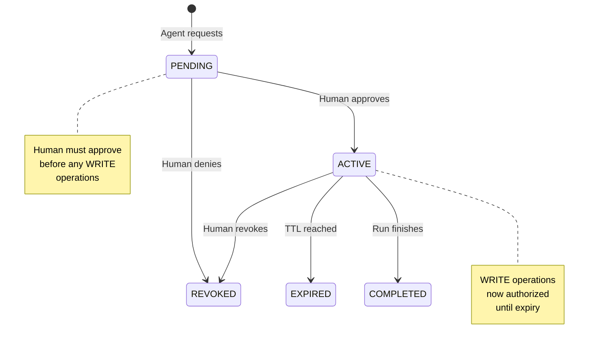
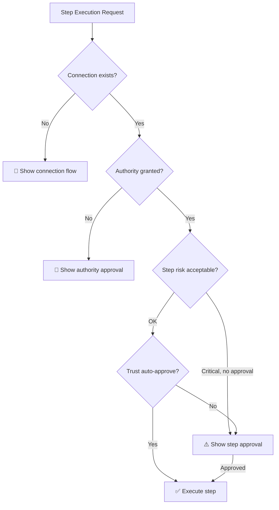

Fabric implements a **defense-in-depth security model** for MCP (Model Context Protocol) servers. This guide covers all security layers from credential storage to runtime authorization.

## Security Architecture Overview



## Layer 1: Credential Security

### Encrypted Storage

All sensitive MCP configuration is encrypted:

| Field | Encryption | Description |
|-------|------------|-------------|
| `encryptedApiKey` | AES-256 | API keys for key-based auth |
| `encryptedAccessToken` | AES-256 | OAuth access tokens |
| `encryptedRefreshToken` | AES-256 | OAuth refresh tokens |
| `encryptedClientSecret` | AES-256 | OAuth client secrets |

### OAuth Token Management

Fabric handles OAuth flows securely:

1. **Discovery** — Automatic OAuth 2.0 endpoint discovery (RFC 8414)
2. **Dynamic Registration** — DCR for supported providers
3. **Secure Callback** — PKCE-verified authorization
4. **Auto-refresh** — Tokens refresh automatically before expiry
5. **Revocation** — Proper token revocation on disconnect



## Layer 2: Runtime Authority (Pipes-Style)

Fabric separates **persistent credentials** from **runtime authority**. Your MCP connections stay configured, but agents need human-approved, time-limited permission to use them.

### Why Runtime Authority?

| Risk Without | Mitigation With |
|-------------|-----------------|
| Agent accidentally writes to wrong project | Human approves which providers to use |
| Workflow sends messages to wrong channel | Authority scoped to specific session |
| No visibility into agent access | Complete audit trail |
| Permanent access once connected | Time-limited grants (30 min default) |

### Authority Components



### Session Lifecycle



### Access Level Classification

Tools are automatically classified based on their names:

| Pattern | Level | Examples |
|---------|-------|----------|
| `list_*`, `get_*`, `search_*`, `find_*`, `query_*` | **READ** | `list_issues`, `get_user` |
| `create_*`, `update_*`, `delete_*`, `send_*`, `post_*` | **WRITE** | `create_issue`, `send_message` |
| `execute_*`, `run_*`, `trigger_*`, `publish_*` | **WRITE** | `execute_workflow` |
| Unknown patterns | **WRITE** (conservative) | Any unmatched tool |

**Key Rule**: A WRITE grant covers READ operations for the same provider.

### Provider Normalization

MCP servers map to canonical provider keys:

| MCP Server Key | Canonical Provider |
|---------------|-------------------|
| `github`, `github-mcp` | `github` |
| `linear`, `linear-mcp` | `linear` |
| `slack`, `slack-mcp` | `slack` |
| `notion`, `notion-mcp` | `notion` |
| `azure-devops` | `azure-devops` |
| Unknown servers | `custom:{server-key}` |

## Layer 3: Tool Enforcement

### Stake Levels (Dust-Style)

Each MCP tool has a **stake level** controlling approval requirements:

| Level | Behavior | Use Case |
|-------|----------|----------|
| **LOW** | Never asks for approval | Read-only operations, safe queries |
| **MEDIUM** | Approve once per agent+target, then auto | Regular operations to known targets |
| **HIGH** | Always asks, every single time | Destructive operations, sensitive data |

Stake levels are configured per tool in `MCPToolConfig`:

```typescript
// Example: Linear tools
{
  toolName: "linear__list_issues",
  stakeLevel: "LOW",      // Auto-approved
  isEnabled: true
},
{
  toolName: "linear__create_issue", 
  stakeLevel: "MEDIUM",   // Approve once per target
  isEnabled: true
},
{
  toolName: "linear__delete_issue",
  stakeLevel: "HIGH",     // Always ask
  isEnabled: true
}
```

### Destructive Pattern Blocking

At execution time, Fabric blocks destructive tools unless explicitly approved:

```typescript
// Destructive patterns that trigger blocking
const DESTRUCTIVE_PATTERNS = [
  /delete/i,
  /remove/i,
  /drop/i,
  /purge/i,
  /archive/i,
  /close/i,
  /cancel/i,
  /reject/i,
  /revoke/i,
  /disable/i,
  /uninstall/i,
  /terminate/i,
  /destroy/i,
  /wipe/i,
  /reset/i,
  /clear/i,
  /empty/i,
  /force/i,
  /override/i,
  /bypass/i,
];
```

**Enforcement**: If a step has destructive tools but isn't approved for destructive operations, those tools are removed before execution.

### Authority Enforcement Points

Authority is enforced at multiple points:

| Path | Enforcement | Binding |
|------|-------------|---------|
| **Orchestrator** | `filterByAuthority()` pre-filters tools | Execution ID |
| **Direct Chat** | `ensureSensitiveOperationAuthority()` wraps tool execution | Execution ID |
| **MCP Gateway** | `enforceAuthority()` before each tool call | Gateway session ID |
| **Template Instance** | Uses orchestrator paths (inherently protected) | N/A |

## Layer 4: Audit & Compliance

### Authority Session Tracking

Every authority request is tracked:

```typescript
interface AuthoritySession {
  id: string;
  userId: string;
  organizationId: string | null;
  runType: "ORCHESTRATOR" | "WORKFLOW" | "MCP_GATEWAY" | "AGENT_INSTANCE";
  runId: string;
  status: "PENDING" | "ACTIVE" | "EXPIRED" | "REVOKED" | "COMPLETED";
  requestedAt: Date;
  approvedAt?: Date;
  expiresAt: Date;
  revokedAt?: Date;
  requestedByAgentId?: string;
  approvalInstructions?: string; // User notes to agent
}
```

### Grant Details

Each grant within a session:

```typescript
interface AuthorityGrant {
  id: string;
  authoritySessionId: string;
  kind: "BROAD" | "REQUEST";  // BROAD = reusable, REQUEST = one-shot
  providerType: "MCP" | "INTEGRATION" | "FABRIC_NATIVE";
  providerKey: string;        // e.g., "linear", "github"
  accessLevel: "READ" | "WRITE";
  toolScope: string[];        // Optional specific tool restrictions
  requestFingerprint?: string; // For one-shot REQUEST grants
  status: "PENDING" | "APPROVED" | "DENIED" | "CONSUMED" | "EXPIRED" | "REVOKED";
  approvedBy?: string;
  approvedAt?: Date;
  expiresAt: Date;
  consumedAt?: Date;          // For REQUEST grants
  denialReason?: string;
  metadata?: Record<string, unknown>;
}
```

### One-Shot Request Grants

For highly sensitive operations, use **REQUEST** grants:

- Tied to a specific request fingerprint (hash of tool + args)
- Can only be used once
- Automatically consumed after execution
- Useful for: "Delete this specific repository"

```typescript
// Generate fingerprint for one-shot approval
const fingerprint = await generateRequestFingerprint(
  "github__delete_repo",
  { owner: "acme", repo: "legacy-app" }
);
// User approves this specific operation
// Grant is consumed after execution
```

## Approval Precedence

When a step is executed, approval checks happen in order:



1. **Connection Check** — Does the MCP connection exist?
2. **Authority Check** — Is there an active runtime grant? (Trust cannot bypass)
3. **Risk Check** — Is this a high/critical risk step?
4. **Trust Check** — Can trust settings auto-approve step-level approval?

## Managing Authority

### From the Dashboard

Navigate to **Settings → Runtime Authority** to see:

- **Pending** — Requests awaiting your approval
- **Active** — Currently valid authority sessions
- **History** — Expired, revoked, or completed sessions

Each approval card shows:
- Requesting providers
- Access levels (READ/WRITE)
- Expiration time
- Agent instructions (optional)

### From API

```typescript
// Request authority
POST /api/rpc/mcp.authority.request
{
  "providers": ["linear", "github"],
  "accessLevel": "WRITE",
  "runType": "ORCHESTRATOR",
  "runId": "exec-123"
}

// Approve session
POST /api/rpc/mcp.authority.approve
{
  "sessionId": "sess_xxx",
  "instructions": "Focus on the frontend issues"
}

// Revoke early
POST /api/rpc/mcp.authority.revoke
{
  "sessionId": "sess_xxx"
}
```

## Multi-Tenant Isolation

Authority follows Fabric's XOR isolation pattern:

```typescript
// Personal context
{ userId: "u_123", organizationId: null }

// Organization context  
{ userId: "u_123", organizationId: "org_456" }
```

- Personal grants are invisible in org context
- Org A grants are invisible in Org B
- User A grants are invisible to User B

## Production Checklist

Before deploying MCP servers to production:

- [ ] **Credentials encrypted** — All tokens/API keys use AES-256
- [ ] **OAuth auto-refresh enabled** — Tokens refresh automatically
- [ ] **Runtime authority enforced** — WRITE operations require approval
- [ ] **Stake levels configured** — Tools have appropriate LOW/MEDIUM/HIGH levels
- [ ] **Destructive patterns blocked** — High-risk tools require explicit approval
- [ ] **Audit logging enabled** — All authority actions are tracked
- [ ] **Session expiration set** — Default 30 minutes, max 8 hours
- [ ] **Tenant isolation verified** — XOR pattern in all queries

## Troubleshooting

### "Authority required" error

The tool execution was blocked because no active authority session exists. Solutions:

1. Approve the pending authority request in the UI
2. Call `fabric_request_authority` from the agent
3. Pre-approve authority for the execution

### "Token refresh failed"

OAuth tokens couldn't be refreshed:

1. Reconnect the MCP server in Settings
2. Check if the OAuth app was revoked at the provider
3. Verify OAuth credentials are still valid

### "Tool blocked as destructive"

The tool matched destructive patterns:

1. Ensure the step is marked as requiring approval
2. Set appropriate risk level (high/critical)
3. User must explicitly approve destructive operations

---

## Next Steps

<Cards>
  <Card title="Runtime Authority" href="/docs/core-concepts/runtime-authority">
    Deep dive into the Pipes-style authorization model
  </Card>
  <Card title="MCP Integration" href="/docs/integrations/mcp">
    Connect and configure MCP servers
  </Card>
  <Card title="MCP Gateway" href="/docs/integrations/mcp-gateway">
    Use Fabric as an MCP server from external clients
  </Card>
  <Card title="Orchestrator" href="/docs/agents/orchestrator">
    Learn how the orchestrator uses authority
  </Card>
</Cards>
