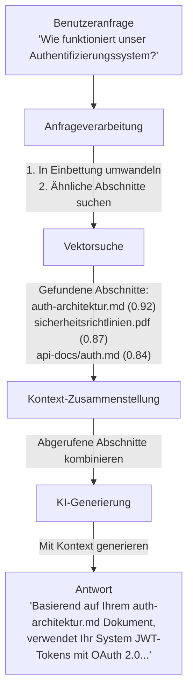
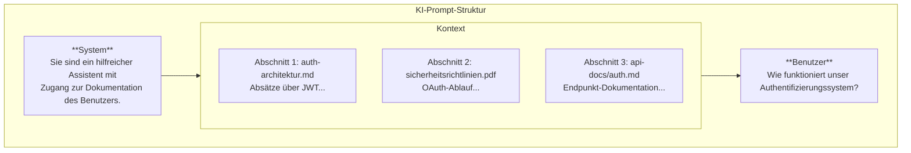
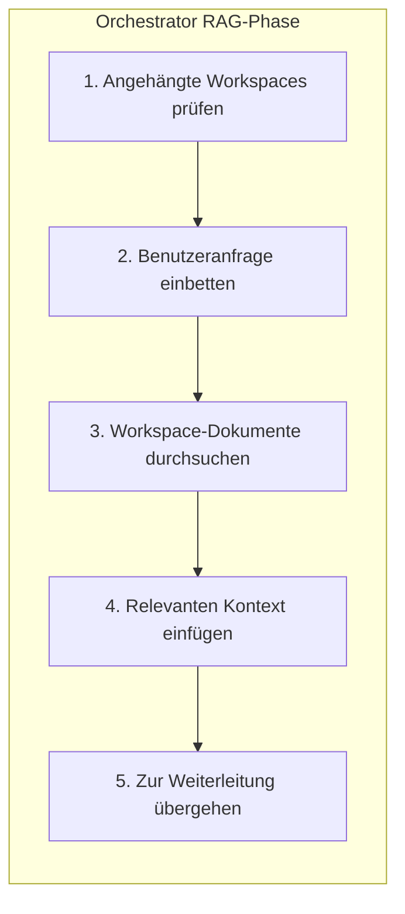
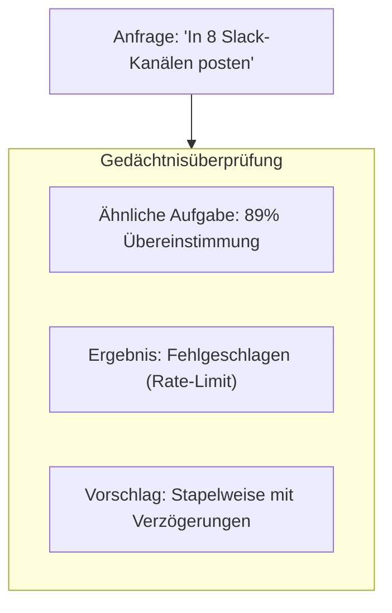
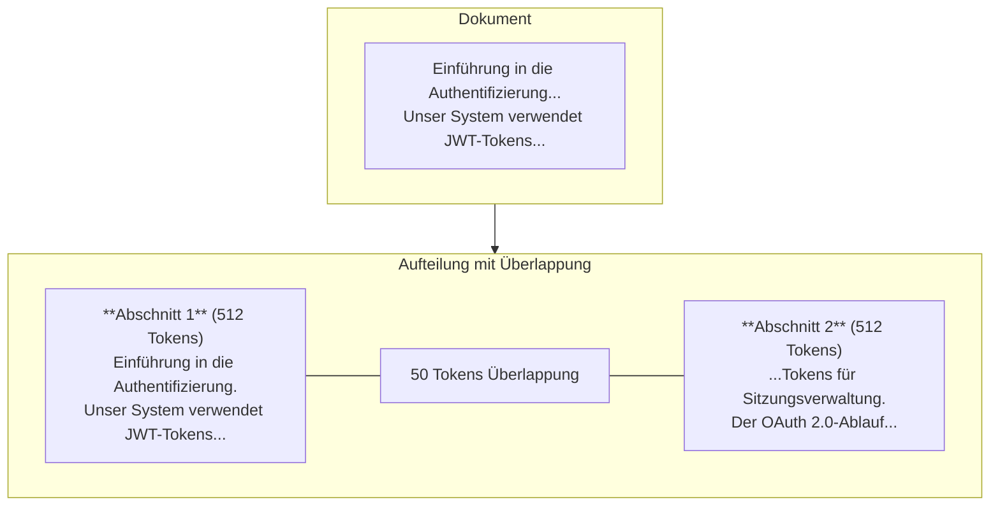

RAG ist eine der leistungsstärksten Funktionen von Fabric AI. Es ermöglicht KI-Agenten, auf Informationen aus Ihren Dokumenten, Code-Repositories und Wissensbasen zuzugreifen und diese zu nutzen – was Antworten genauer, relevanter und in Ihren tatsächlichen Daten verankert macht.

## Was ist RAG?

**Retrieval-Augmented Generation** ist eine Technik, die KI-Antworten verbessert durch:

1. **Abrufen** relevanter Informationen aus Ihren Dokumenten
2. **Anreichern** des KI-Kontexts mit diesen Informationen
3. **Generieren** von Antworten, die auf Ihre spezifischen Daten verweisen

Anstatt sich ausschließlich auf die Trainingsdaten des KI-Modells zu stützen, ermöglicht RAG dem Modell, in Echtzeit auf Ihre proprietären Informationen zuzugreifen.

## Warum RAG nutzen?

### Ohne RAG

- KI antwortet basierend auf allgemeinem Wissen
- Kann halluzinieren oder Details erfinden
- Kann nicht auf Ihre spezifischen Systeme verweisen
- Antworten können veraltet sein

### Mit RAG

- KI verweist auf Ihre tatsächliche Dokumentation
- Antworten basieren auf verifizierten Informationen
- Versteht Ihre spezifische Terminologie
- Nutzt immer die zuletzt hochgeladenen Dokumente

## Wie RAG in Fabric funktioniert

### 1. Dokumentenaufnahme

Wenn Sie Dokumente in einen Workspace hochladen, verarbeitet Fabric diese durch eine Pipeline:

<Steps>
  <Step>
    ### Hochladen

    Ziehen Sie Dateien per Drag & Drop in einen Workspace. Unterstützte Formate:
    - **PDF** – Einschließlich gescannter Dokumente (mit OCR)
    - **Word** – .docx Dateien
    - **Markdown** – .md Dateien
    - **Text** – .txt Dateien
    - **Code** – Verschiedene Programmiersprachen
  </Step>

  <Step>
    ### Extraktion

    Text wird mit dem entsprechenden Extraktor extrahiert:
    - **Lokale Extraktoren** – Schnelle, kostenlose Verarbeitung für Standardformate
    - **Unstructured.io** – Erweitertes OCR für gescannte Dokumente und Bilder
    - **LlamaParse** – Optimiert für Code-Dokumentation
  </Step>

  <Step>
    ### Aufteilung in Abschnitte

    Dokumente werden in semantische Abschnitte aufgeteilt:
    - **Abschnittsgröße** – ~512 Tokens pro Abschnitt (konfigurierbar)
    - **Überlappung** – 50 Tokens Überlappung zwischen Abschnitten
    - **Semantische Grenzen** – Respektiert Absätze und Abschnitte
  </Step>

  <Step>
    ### Einbettung

    Jeder Abschnitt wird mit Ihrem konfigurierten Einbettungsanbieter in eine Vektoreinbettung umgewandelt für semantisches Verständnis.
  </Step>

  <Step>
    ### Speicherung

    Einbettungen werden mit Metadaten gespeichert:
    - **Vektor** – Die hochdimensionale Einbettung
    - **Metadaten** – Dateiname, Abschnittsposition, Mandanten-IDs
    - **Mandantenfähigkeit** – Isoliert nach Benutzer und Organisation
  </Step>
</Steps>

### 2. Abruf

Wenn Sie eine Frage stellen oder ein Dokument generieren:

<Steps>
  <Step>
    ### Anfrage-Einbettung

    Ihre Frage wird mit demselben Einbettungsmodell in einen Vektor umgewandelt.
  </Step>

  <Step>
    ### Ähnlichkeitssuche

    Die Vektordatenbank findet die ähnlichsten Dokumentabschnitte:
    - **Kosinus-Ähnlichkeit** – Misst semantische Nähe
    - **Top-K-Abruf** – Gibt die 5-10 relevantesten Abschnitte zurück
    - **Mandanten-Filterung** – Durchsucht nur Ihre Dokumente
  </Step>

  <Step>
    ### Neu-Rangierung

    Ergebnisse werden nach Relevanz neu geordnet:
    - **Aktualitäts-Boost** – Neuere Dokumente werden höher gewichtet
    - **Quellenvielfalt** – Abschnitte aus verschiedenen Dokumenten mischen
    - **Relevanzschwelle** – Abschnitte mit geringer Ähnlichkeit herausfiltern
  </Step>
</Steps>

### 3. Generierung

Der abgerufene Kontext wird der KI bereitgestellt:

Die KI generiert eine Antwort, die Informationen aus allen relevanten Abschnitten zusammenfasst.

## RAG in Fabric nutzen

### Einen Workspace erstellen

<Steps>
  <Step>
    ### Zu Workspaces navigieren

    Klicken Sie in der linken Seitenleiste auf **Workspaces**.
  </Step>

  <Step>
    ### Neuen Workspace erstellen

    Klicken Sie auf **Workspace erstellen** und geben Sie einen beschreibenden Namen wie „Produktdokumentation" oder „Engineering-Spezifikationen" ein.
  </Step>

  <Step>
    ### Dokumente hochladen

    Ziehen Sie Dateien per Drag & Drop oder klicken Sie zum Durchsuchen. Sie können mehrere Dateien gleichzeitig hochladen.
  </Step>

  <Step>
    ### Auf Verarbeitung warten

    Dokumente werden im Hintergrund verarbeitet. Große Dokumente können einige Minuten dauern. Sie sehen eine Fortschrittsanzeige.
  </Step>
</Steps>

### Workspaces an Agenten anhängen

Beim Starten eines Gesprächs mit einem Agenten:

1. Klicken Sie auf die Schaltfläche **Anhängen** in der Chat-Oberfläche
2. Wählen Sie einen oder mehrere Workspaces aus
3. Der Agent hat nun Zugriff auf alle Dokumente in diesen Workspaces

**Tipp:** Sie können für verschiedene Arten von Fragen unterschiedliche Workspaces anhängen. Zum Beispiel:
- „Produktdokumentation" anhängen beim Generieren von PRDs
- „Technische Spezifikationen" anhängen beim Generieren von Architekturdokumenten
- „Code-Repos" anhängen beim Generieren von API-Dokumentation

### Workspaces in Projekten

Projekte können dedizierte Workspaces haben:

1. Gehen Sie zu **Projekte > Ihr Projekt**
2. Klicken Sie auf die Registerkarte **Dokumente**
3. Laden Sie projektspezifische Dokumente hoch
4. Alle Agenten, die an diesem Projekt arbeiten, haben automatisch Zugriff

## Best Practices

### Dokumentenvorbereitung

**Empfohlen:**
- Verwenden Sie klare, gut strukturierte Dokumente
- Fügen Sie Überschriften und Abschnitte ein
- Halten Sie Dokumente auf einzelne Themen fokussiert
- Aktualisieren Sie Dokumente, wenn sich Informationen ändern

**Nicht empfohlen:**
- Massive Dateien mit gemischten Themen hochladen
- Sensible Daten ohne Überlegung einbeziehen
- Doppelten Inhalt hochladen
- Veraltete Dokumente in Workspaces belassen

### Optimierung der Abschnittsgröße

| Inhaltstyp | Empfohlene Abschnittsgröße |
|--------------|--------------------------|
| Technische Dokumente | 512 Tokens |
| Code-Dateien | 256 Tokens |
| Langtext-Inhalte | 768 Tokens |
| Frage-Antwort-Format | 128 Tokens |

### Anfrage-Optimierung

Für beste Ergebnisse:
- Stellen Sie spezifische Fragen
- Verwenden Sie relevante Schlüsselwörter
- Verweisen Sie auf Dokumentnamen, wenn bekannt
- Teilen Sie komplexe Fragen in Teile auf

## Mandantenfähigkeit und Sicherheit

RAG in Fabric ist vollständig mandantenfähig:

### Datenisolierung

- **Organisationsgrenzen** – Dokumente sind nach Organisation isoliert
- **Benutzer-Scoping** – Persönliche Workspaces sind privat
- **Keine Kreuzkontamination** – Anfragen geben nie die Daten anderer Mandanten zurück

### Zugangskontrolle

- **Workspace-Berechtigungen** – Kontrollieren Sie, wer anzeigen/bearbeiten kann
- **Rollenbasierter Zugriff** – Admins können alle Workspaces verwalten
- **Protokollierung** – Dokumentenzugriff verfolgen

### Datensicherheit

- **Verschlüsselte Speicherung** – Vektoren werden verschlüsselt gespeichert
- **Sichere Übertragung** – TLS für alle Übertragungen
- **Mandanten-Isolierung** – Separate Vektor-Namespaces pro Mandant

## RAG im Orchestrator

Der Fabric-Orchestrator verwendet RAG als ersten Schritt vor der Weiterleitung oder Planung:

Das bedeutet, wenn Sie sagen „erstelle ein PRD basierend auf unserer Produktstrategie", weiß der Orchestrator bereits, was Ihre Produktstrategie besagt, bevor er mit der Planung beginnt.

### Workspace-Verweise

Der Orchestrator erkennt workspace-bezogene Absichten:

| Ausdruck | Aktion |
|--------|--------|
| „meine Dokumente" | Angehängte Workspaces durchsuchen |
| „hochgeladene Dateien" | Hochgeladene Dokumente verwenden |
| „persönliche Dokumente" | Workspaces des Benutzers durchsuchen |
| „basierend auf unseren..." | Relevanten Kontext abrufen |

Wenn Workspace-Inhalte verfügbar sind, bevorzugt der Orchestrator:
- Die Analyse von Workspace-Inhalten gegenüber externen Suchen
- Direkte KI-Analyse
- Unnötige externe Tool-Aufrufe überspringen

## Semantisches Gedächtnis

Über die Dokumentenabfrage hinaus speichert die Vektordatenbank Ausführungsverläufe für das Gedächtnissystem:

### Positives Gedächtnis

- Erfolgreiche Weiterleitungsmuster
- Effektive Tool-Kombinationen
- Funktionierende Prompts und Parameter

### Negatives Gedächtnis

Vergangene Fehler werden gespeichert und genutzt, um das Wiederholen von Fehlern zu vermeiden:

## Technische Details

### Einbettungsmodelle

Fabric unterstützt mehrere Einbettungsanbieter:

| Anbieter | Modell | Dimensionen | Anwendungsfall |
|----------|-------|------------|----------|
| OpenAI | text-embedding-3-small | 1536 | Standard, hohe Qualität |
| OpenAI | text-embedding-3-large | 3072 | Maximale Genauigkeit |
| Voyage AI | voyage-3 | 1024 | Alternativer Anbieter |
| Lokal | Verschiedene | Variiert | Self-Hosted-Option |

Die Konfiguration erfolgt über die KI-Gateway-Einstellungen.

### Vektorsuche

Die Vektordatenbank bietet:
- **Ähnlichkeitsmetrik** – Kosinus-Ähnlichkeit
- **Filterung** – Metadatenbasierte Filterung für Mandantenfähigkeit
- **Skalierbarkeit** – Verarbeitet Millionen von Vektoren
- **Leistung** – Abfragezeiten unter einer Millisekunde

### Abschnittsstrategie

## Fehlerbehebung

### „Keine relevanten Dokumente gefunden"

- Prüfen Sie, ob Dokumente vollständig verarbeitet wurden
- Stellen Sie sicher, dass der Workspace angehängt ist
- Versuchen Sie, Ihre Frage umzuformulieren
- Stellen Sie sicher, dass die Dokumente relevante Informationen enthalten

### „Irrelevanter Kontext abgerufen"

- Dokumente könnten zu allgemein sein
- Versuchen Sie, spezifischere Dokumente hochzuladen
- Verwenden Sie Workspace-Filter, um den Bereich einzugrenzen
- Passen Sie die Anfrage an, um spezifischer zu sein

### „Verarbeitung dauert zu lange"

- Große PDFs können mehrere Minuten dauern
- Gescannte Dokumente erfordern OCR
- Prüfen Sie, ob das Dokument nicht beschädigt ist
- Versuchen Sie, es in kleinere Dateien aufzuteilen

---

## Nächste Schritte

<Cards>
  <Card title="Workflows" href="/docs/core-concepts/workflows">
    Erfahren Sie mehr über dauerhafte Workflow-Ausführung
  </Card>
  <Card title="Dokumentengenerierung" href="/docs/tutorials/first-document">
    Erstellen Sie Ihr erstes Dokument mit RAG-Kontext
  </Card>
</Cards>
