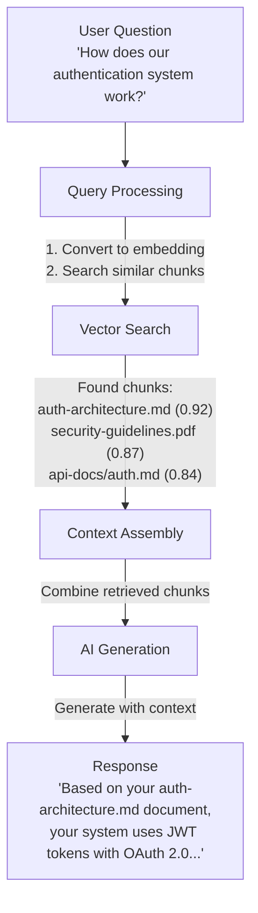
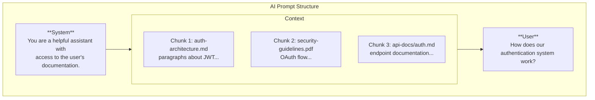
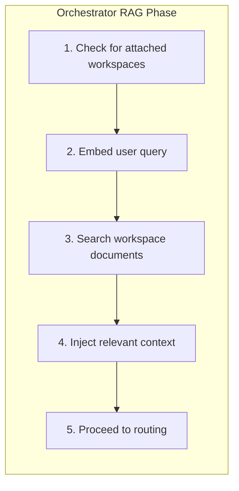
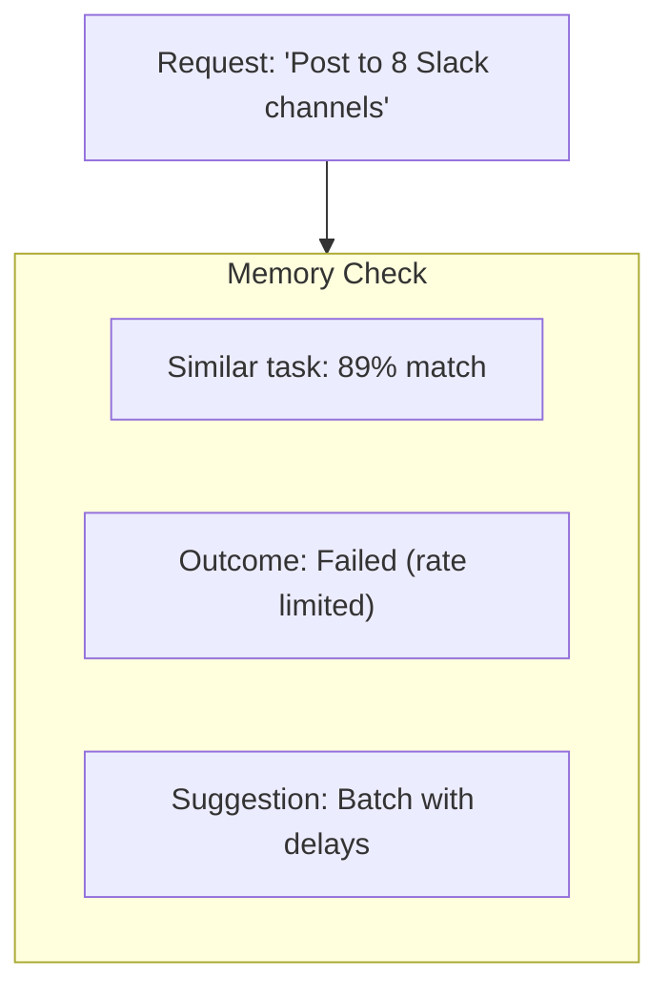
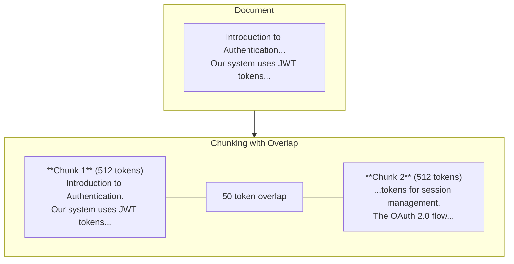

RAG is one of Fabric AI's most powerful features. It allows AI agents to access and use information from your documents, code repositories, and knowledge bases -- making responses more accurate, relevant, and grounded in your actual data.

## What is RAG?

**Retrieval-Augmented Generation** is a technique that enhances AI responses by:

1. **Retrieving** relevant information from your documents
2. **Augmenting** the AI's context with that information
3. **Generating** responses that reference your specific data

Instead of relying solely on the AI model's training data, RAG allows the model to access your proprietary information in real-time.

## Why Use RAG?

### Without RAG

- AI responds based on general knowledge
- May hallucinate or make up details
- Can't reference your specific systems
- Answers may be outdated

### With RAG

- AI references your actual documentation
- Responses grounded in verified information
- Understands your specific terminology
- Always uses latest uploaded documents

## How RAG Works in Fabric

### 1. Document Ingestion

When you upload documents to a workspace, Fabric processes them through a pipeline:

<Steps>
  <Step>
    ### Upload

    Drag and drop files into a workspace. Supported formats:
    - **PDF** -- Including scanned documents (with OCR)
    - **Word** -- .docx files
    - **Markdown** -- .md files
    - **Text** -- .txt files
    - **Code** -- Various programming languages
  </Step>

  <Step>
    ### Extraction

    Text is extracted using the appropriate extractor:
    - **Local extractors** -- Fast, free processing for standard formats
    - **Unstructured.io** -- Advanced OCR for scanned documents and images
    - **LlamaParse** -- Optimized for code documentation
  </Step>

  <Step>
    ### Chunking

    Documents are split into semantic chunks:
    - **Chunk size** -- ~512 tokens per chunk (configurable)
    - **Overlap** -- 50 tokens overlap between chunks
    - **Semantic boundaries** -- Respects paragraphs and sections
  </Step>

  <Step>
    ### Embedding

    Each chunk is converted to a vector embedding using your configured embedding provider for semantic understanding.
  </Step>

  <Step>
    ### Storage

    Embeddings are stored with metadata:
    - **Vector** -- The high-dimensional embedding
    - **Metadata** -- Filename, chunk position, tenant IDs
    - **Multi-tenancy** -- Isolated by user and organization
  </Step>
</Steps>

### 2. Retrieval

When you ask a question or start generating a document:

<Steps>
  <Step>
    ### Query Embedding

    Your question is converted to a vector using the same embedding model.
  </Step>

  <Step>
    ### Similarity Search

    The vector database finds the most similar document chunks:
    - **Cosine similarity** -- Measures semantic closeness
    - **Top-K retrieval** -- Returns top 5-10 most relevant chunks
    - **Tenant filtering** -- Only searches your documents
  </Step>

  <Step>
    ### Re-ranking

    Results are re-ranked for relevance:
    - **Recency boost** -- Newer documents weighted higher
    - **Source diversity** -- Mix chunks from different documents
    - **Relevance threshold** -- Filter out low-similarity chunks
  </Step>
</Steps>

### 3. Generation

Retrieved context is provided to the AI:

The AI generates a response that synthesizes information from all relevant chunks.

## Using RAG in Fabric

### Creating a Workspace

<Steps>
  <Step>
    ### Navigate to Workspaces

    Click **Workspaces** in the left sidebar.
  </Step>

  <Step>
    ### Create New Workspace

    Click **Create Workspace** and give it a descriptive name like "Product Documentation" or "Engineering Specs".
  </Step>

  <Step>
    ### Upload Documents

    Drag and drop files or click to browse. You can upload multiple files at once.
  </Step>

  <Step>
    ### Wait for Processing

    Documents are processed in the background. Large documents may take a few minutes. You'll see a progress indicator.
  </Step>
</Steps>

### Attaching Workspaces to Agents

When starting a conversation with an agent:

1. Click the **Attach** button in the chat interface
2. Select one or more workspaces
3. The agent now has access to all documents in those workspaces

**Tip:** You can attach different workspaces for different types of questions. For example:
- Attach "Product Docs" when generating PRDs
- Attach "Technical Specs" when generating architecture documents
- Attach "Code Repos" when generating API documentation

### Workspaces in Projects

Projects can have dedicated workspaces:

1. Go to **Projects > Your Project**
2. Click **Documents** tab
3. Upload project-specific documents
4. All agents working on this project automatically have access

## Best Practices

### Document Preparation

**Do:**
- Use clear, well-structured documents
- Include headings and sections
- Keep documents focused on single topics
- Update documents when information changes

**Don't:**
- Upload massive files with mixed topics
- Include sensitive data without consideration
- Upload duplicate content
- Leave outdated documents in workspaces

### Chunk Size Optimization

| Content Type | Recommended Chunk Size |
|--------------|------------------------|
| Technical docs | 512 tokens |
| Code files | 256 tokens |
| Long-form content | 768 tokens |
| Q&A format | 128 tokens |

### Query Optimization

For best results:
- Ask specific questions
- Include relevant keywords
- Reference document names when known
- Break complex questions into parts

## Multi-Tenancy and Security

RAG in Fabric is fully multi-tenant:

### Data Isolation

- **Organization boundaries** -- Documents are isolated by organization
- **User scoping** -- Personal workspaces are private
- **No cross-contamination** -- Queries never return other tenants' data

### Access Control

- **Workspace permissions** -- Control who can view/edit
- **Role-based access** -- Admins can manage all workspaces
- **Audit logging** -- Track document access

### Data Security

- **Encrypted storage** -- Vectors encrypted at rest
- **Secure transmission** -- TLS for all transfers
- **Tenant isolation** -- Separate vector namespaces per tenant

## RAG in the Orchestrator

Fabric Loom uses RAG as its first step before routing or planning:

This means when you say "create a PRD based on our product strategy", the orchestrator already knows what your product strategy says before it starts planning.

### Workspace References

The orchestrator recognizes workspace-related intents:

| Phrase | Action |
|--------|--------|
| "my docs" | Search attached workspaces |
| "attached files" | Use uploaded documents |
| "personal documents" | Search user's workspaces |
| "based on our..." | Retrieve relevant context |

When workspace content is available, the orchestrator:
- Prefers analyzing workspace content over external searches
- Routes to direct AI analysis
- Skips unnecessary external tool calls

## Semantic Memory

Beyond document retrieval, the vector database stores execution trajectories for the memory system:

### Positive Memory

- Successful routing patterns
- Effective tool combinations
- Working prompts and parameters

### Negative Memory

Past failures are stored and used to avoid repeating mistakes:

## Technical Details

### Embedding Models

Fabric supports multiple embedding providers:

| Provider | Model | Dimensions | Use Case |
|----------|-------|------------|----------|
| OpenAI | text-embedding-3-small | 1536 | Default, high quality |
| OpenAI | text-embedding-3-large | 3072 | Maximum accuracy |
| Voyage AI | voyage-3 | 1024 | Alternative provider |
| Local | Various | Varies | Self-hosted option |

Configuration is done via AI Gateway settings.

### Vector Search

The vector database provides:
- **Similarity metric** -- Cosine similarity
- **Filtering** -- Metadata-based filtering for multi-tenancy
- **Scalability** -- Handles millions of vectors
- **Performance** -- Sub-millisecond query times

### Chunking Strategy

## Troubleshooting

### "No relevant documents found"

- Check that documents are fully processed
- Verify the workspace is attached
- Try rephrasing your question
- Ensure documents contain relevant information

### "Irrelevant context retrieved"

- Documents may be too general
- Try uploading more specific documents
- Use workspace filters to narrow scope
- Adjust query to be more specific

### "Processing taking too long"

- Large PDFs may take several minutes
- Scanned documents require OCR
- Check document isn't corrupted
- Try splitting into smaller files

---

## Next Steps

<Cards>
  <Card title="Workflows" href="/docs/core-concepts/workflows">
    Learn about durable workflow execution
  </Card>
  <Card title="Document Generation" href="/docs/tutorials/first-document">
    Create your first document with RAG context
  </Card>
</Cards>
