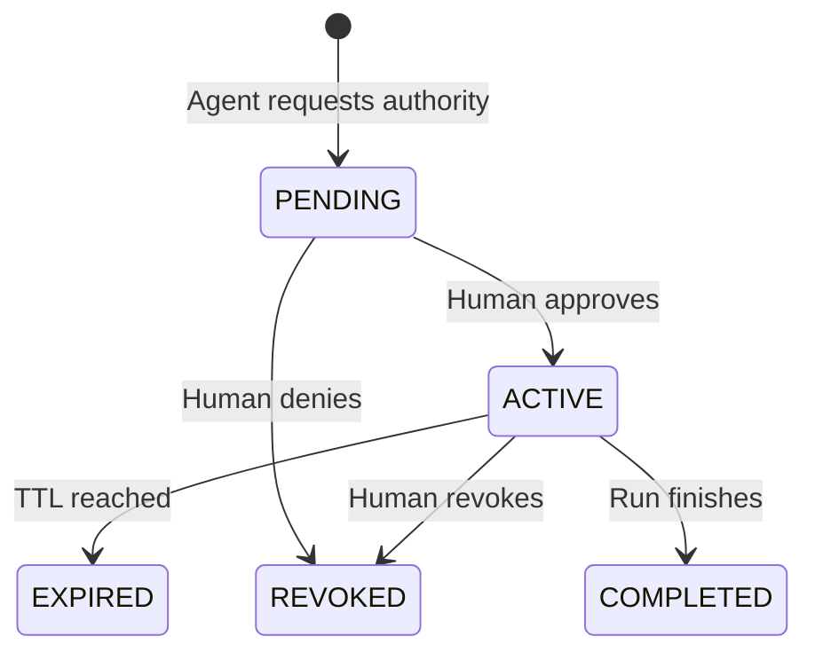
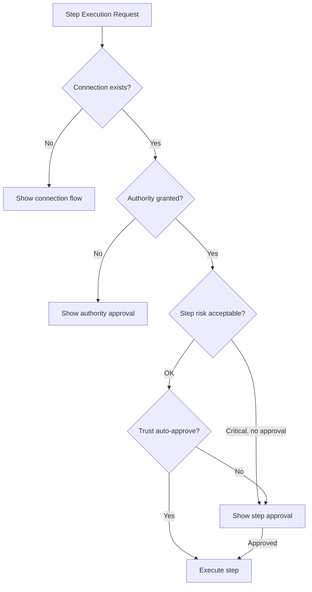

Fabric separates **persistent credentials** from **runtime authority**. Your MCP server connections and API keys stay configured long-term, but AI agents must obtain human-approved, time-limited permission before using them during a task.

This is inspired by the [WorkOS Pipes MCP](https://workos.com/blog/pipes-mcp) model and adapted for Fabric's multi-tenant architecture.

## Why Runtime Authority?

Without runtime authority, any connected MCP server is available to agents at all times. This creates risk:

- An agent could accidentally write to the wrong Linear project
- A misconfigured workflow could send Slack messages to the wrong channel
- There's no visibility into what agents accessed and when

With runtime authority:

| Property | Behavior |
|---|---|
| **Time-limited** | Grants expire automatically (configurable TTL, default 30 min) |
| **Human-approved** | Agents can request, but only humans can approve |
| **Scoped by provider** | Grant access to Linear without granting Slack |
| **Access-level aware** | Distinguish READ from WRITE operations |
| **Session-bound** | Authority is tied to a specific run, not reusable across sessions |
| **Auditable** | Every request, approval, denial, and expiration is recorded |

## Core Concepts

### Authority Sessions

An **AuthoritySession** represents a time-bounded execution context within which authority grants are valid. Sessions are tied to:

- A specific **user** and **tenant** (personal or org)
- A **run type** (MCP Gateway, Orchestrator, Workflow, or Agent Instance)
- A **run ID** (the specific session or execution)
- An **expiration time**

Sessions follow a lifecycle:



### Authority Grants

Each session contains one or more **AuthorityGrants**, each scoped to a specific provider:

| Field | Description |
|---|---|
| **providerKey** | Canonical provider name (e.g., `github`, `linear`, `custom:my-server`) |
| **accessLevel** | `READ` or `WRITE` — WRITE covers READ |
| **kind** | `BROAD` (reusable within session) or `REQUEST` (one-shot, consumed after use) |
| **toolScope** | Optional list of specific tool names to restrict access further |
| **expiresAt** | When this grant expires |

### Provider Normalization

MCP servers are mapped to canonical provider keys:

| MCP Server Key | Canonical Provider |
|---|---|
| `github`, `github-mcp` | `github` |
| `linear`, `linear-mcp` | `linear` |
| `slack`, `slack-mcp` | `slack` |
| `notion`, `notion-mcp` | `notion` |
| `azure-devops` | `azure-devops` |
| `jira`, `atlassian-jira` | `jira` |
| Unknown servers | `custom:{server-key}` |

### Access Level Classification

Tools are automatically classified as READ or WRITE based on their name:

| Pattern | Level | Examples |
|---|---|---|
| `list_*`, `get_*`, `search_*`, `find_*`, `query_*` | READ | `list_issues`, `get_user`, `search_docs` |
| `create_*`, `update_*`, `delete_*`, `send_*`, `post_*` | WRITE | `create_issue`, `send_message`, `delete_file` |
| `execute_*`, `run_*`, `trigger_*`, `publish_*` | WRITE | `execute_workflow`, `publish_page` |
| Unknown pattern | WRITE | Conservative default |

A WRITE grant covers READ operations for the same provider.

## Approval Precedence

Fabric has multiple approval systems. Runtime authority establishes a clear precedence:



1. **Connection** — Does the MCP server connection exist? If not, show the connection/setup flow.
2. **Authority** — Is there an active runtime grant for this provider? If not, show the authority approval flow. **Trust cannot bypass this.**
3. **Step risk** — Is this a high/critical risk step? If so, require explicit step-level approval.
4. **Trust** — Can the user's trust configuration auto-approve the step-level approval? This only reduces friction for step approvals, never for authority.

## Enforcement Points

Runtime authority is enforced at every external execution path:

| Path | What's Checked | Binding |
|---|---|---|
| **MCP Gateway** | Before every connected server tool call | Bound to gateway session ID |
| **Orchestrator MCP Tools** | Tools from unauthorized providers filtered out | Bound to execution ID |
| **Integration Handler** | Pre-execution check for integration provider | Bound to execution ID |
| **MCP Proxy** | Before forwarding to upstream server | Provider + access level |

### MCP Gateway Enforcement

When a connected server tool is called through the gateway:

1. Resolve the provider key from the tool prefix
2. Classify the operation as READ or WRITE
3. Generate a request fingerprint (for one-shot grants)
4. Look up the authority session bound to **this specific gateway session**
5. Check for a matching grant (provider + access level + tool scope)
6. If authorized: execute the tool. If one-shot grant: consume it.
7. If not authorized: return error with guidance on how to request authority

### Orchestrator Enforcement

In the orchestrator execution phase:

1. Before each step, `checkStepAuthorityActivity` extracts required providers
2. Authority is checked with `evaluateAuthorityPolicy()` — bound to `ORCHESTRATOR` run type and execution ID
3. Steps that fail authority are marked as errors (non-fatal)
4. Steps that pass authority proceed to risk/approval checks

## Managing Authority

### From the Fabric Dashboard

Go to **Settings → Runtime Authority** to see:

- **Pending** — Requests waiting for your approval
- **Active** — Currently active authority sessions with grants
- **History** — Recent expired, revoked, or completed sessions

Each approval card shows:
- Which providers are requesting access
- READ vs WRITE access level
- How long the authority will last
- Optional instructions you can add for the agent

### From MCP Clients

Agents can manage authority through platform tools:

```
fabric_request_authority  — Request access (creates PENDING session)
fabric_check_authority    — Poll for approval status
fabric_revoke_authority   — End active authority early
```

Approval is **human-only** — there is no `fabric_approve_authority` tool. Agents request, humans approve.

## One-Shot Request Grants

For highly sensitive operations, you can create **REQUEST** grants instead of **BROAD** grants:

- A REQUEST grant is tied to a specific request fingerprint (hash of tool name + arguments)
- It can only be used once — after execution, it's automatically consumed
- This is useful for operations like "delete this specific repository" where you want exact-match approval

## Session Lifecycle

### Creation
Authority sessions are created when an agent calls `fabric_request_authority` or when the orchestrator encounters a step requiring external access.

### Expiration
Sessions expire automatically based on their TTL (default: 30 minutes, max: 8 hours). An expiration worker runs every minute to clean up stale sessions.

### Completion
When a gateway session ends (client disconnects), active authority sessions are automatically completed.

### Revocation
Users can revoke authority at any time from the dashboard or by calling `fabric_revoke_authority`.

## Multi-Tenant Isolation

Authority follows the same XOR isolation pattern as all Fabric data:

- **Personal grants** are invisible in org context
- **Org grants** are invisible in personal context
- **Org A grants** are invisible in Org B
- **User A grants** are invisible to User B

---

## Next Steps

<Cards>
  <Card title="MCP Authority & Security" href="/docs/core-concepts/mcp-authority">
    Complete security guide with credentials, stake levels, and enforcement
  </Card>
  <Card title="MCP Gateway" href="/docs/integrations/mcp-gateway">
    Set up the gateway in your MCP client
  </Card>
  <Card title="MCP Integration" href="/docs/integrations/mcp">
    Connect MCP servers to Fabric
  </Card>
  <Card title="Orchestrator" href="/docs/agents/orchestrator">
    Learn how the orchestrator uses authority
  </Card>
</Cards>
