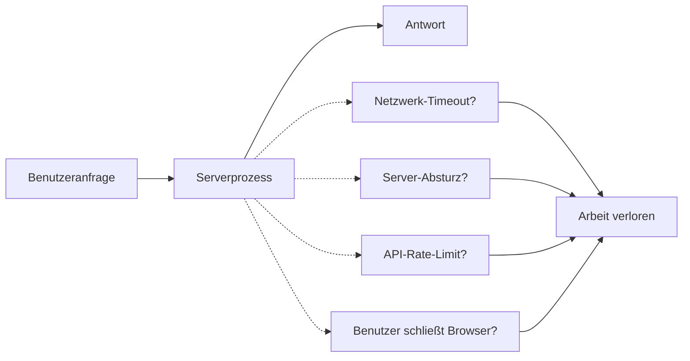
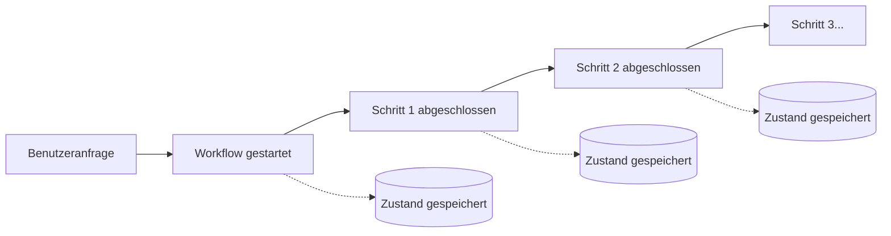
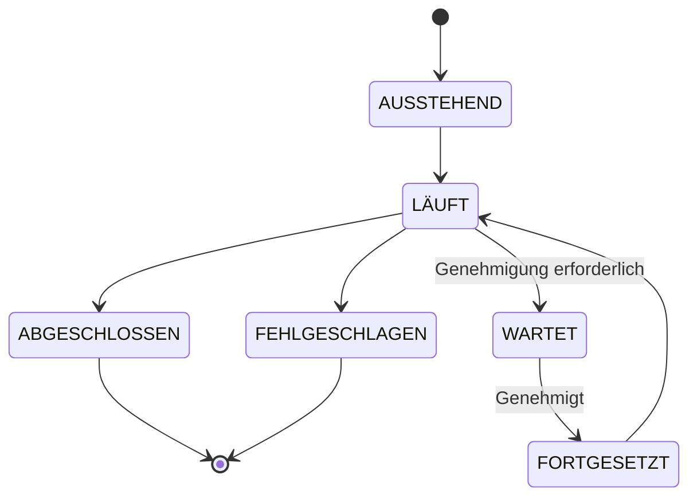
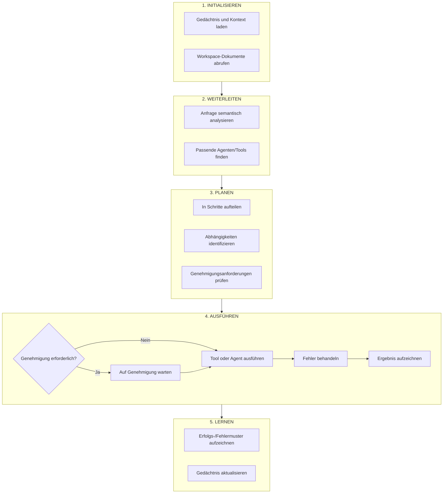
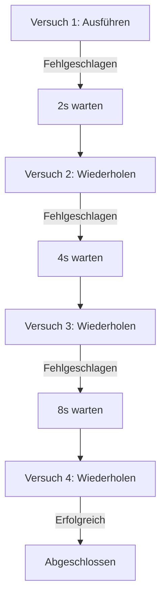
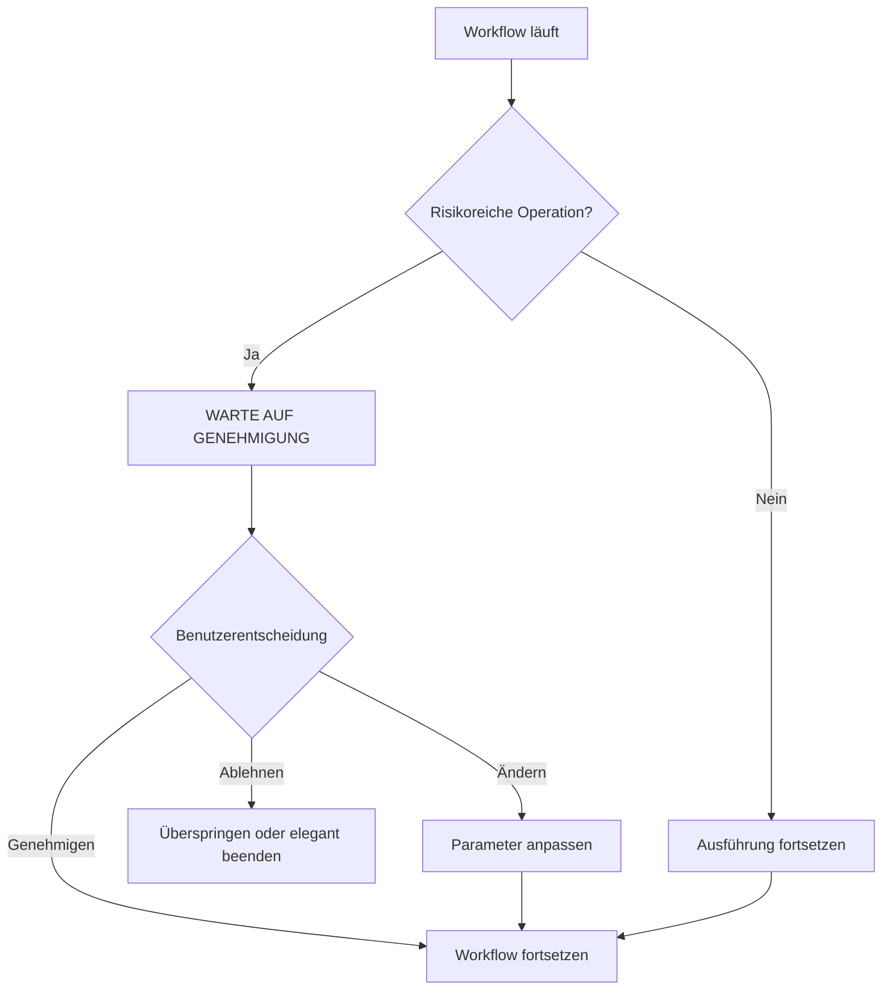
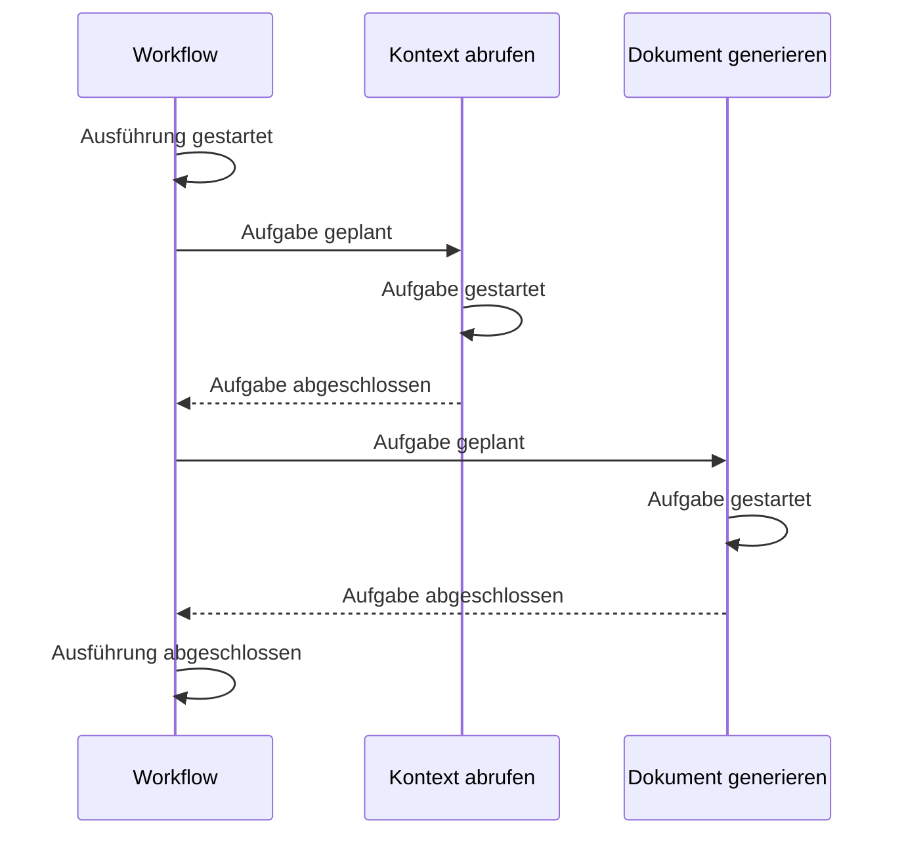

Fabric AI verwendet eine **dauerhafte Workflow-Engine**, um sicherzustellen, dass komplexe mehrstufige Operationen zuverlässig abgeschlossen werden – auch wenn etwas schiefläuft.

## Warum Workflows wichtig sind

### Das Problem mit traditioneller Ausführung

Traditionelle Anfrage-Antwort-Systeme haben Einschränkungen:



Beim Generieren eines PRDs, das 5 Minuten dauert, oder beim Erstellen von 20 Jira-Tickets bedeutet jede Unterbrechung, von vorne beginnen zu müssen.

### Die Workflow-Lösung

Workflows persistieren den Zustand bei jedem Schritt:



**Wenn etwas fehlschlägt:** Der Workflow setzt vom letzten gespeicherten Zustand fort.

## Wie es funktioniert

### Schlüsselkonzepte

| Konzept | Beschreibung |
|---------|-------------|
| **Workflows** | Langwierige, fehlertolerante Prozesse, die mehrere Schritte koordinieren |
| **Aktivitäten** | Einzelne Arbeitseinheiten wie API-Aufrufe, KI-Generierung oder Dateioperationen |
| **Signale** | Externe Ereignisse, die laufende Workflows modifizieren können (z. B. Genehmigungen) |
| **Abfragen** | Den aktuellen Zustand eines laufenden Workflows lesen |

### Workflow-Lebenszyklus



## Workflows in Fabric

### Dokumentengenerierungs-Workflow

Wenn Sie einen Agenten bitten, ein Dokument zu generieren, wird dieser Workflow ausgeführt:

<Steps>
  <Step>
    ### Kontext initialisieren

    Benutzereinstellungen, Organisationseinstellungen und Gesprächsverlauf laden.
  </Step>

  <Step>
    ### RAG-Kontext abrufen

    Ihre Workspace-Dokumente nach relevantem Inhalt basierend auf der Anfrage durchsuchen.
  </Step>

  <Step>
    ### Inhalt generieren

    Das KI-Modell mit Kontext aufrufen, um das Dokument zu generieren.
  </Step>

  <Step>
    ### Formatierung anwenden

    Die Ausgabe entsprechend dem Dokumenttyp formatieren (PRD, Spezifikation usw.).
  </Step>

  <Step>
    ### Speichern und zurückgeben

    Das Dokument speichern und an den Benutzer zurückgeben.
  </Step>
</Steps>

Jeder Schritt:
- Wird bei Fehler automatisch wiederholt
- Hat konfigurierbare Timeouts
- Speichert den Zustand vor und nach

### Orchestrator-Workflow

Der Fabric-Orchestrator führt einen komplexeren Workflow aus:



## Zuverlässigkeitsfunktionen

### Automatische Wiederholungen

Aktivitäten werden automatisch mit exponentiellem Backoff wiederholt:



Konfiguration:
- **Anfangsintervall** – 1 Sekunde
- **Maximales Intervall** – 5 Minuten
- **Maximale Versuche** – 5 (konfigurierbar)
- **Backoff-Koeffizient** – 2,0

### Herzschläge

Langwierige Aktivitäten senden periodische Herzschläge, um anzuzeigen, dass sie noch aktiv sind. Wenn Herzschläge ausbleiben, kann die Workflow-Engine die Aktivität auf einem anderen Worker wiederholen.

### Timeouts

Mehrere Timeout-Typen schützen vor hängenden Operationen:

| Timeout-Typ | Zweck | Standard |
|--------------|---------|---------|
| Start bis Ende | Maximale Zeit für einen einzelnen Versuch | 5 Minuten |
| Planung bis Ende | Maximale Zeit einschließlich Wiederholungen | 30 Minuten |
| Herzschlag | Maximale Zeit zwischen Herzschlägen | 1 Minute |
| Planung bis Start | Maximale Wartezeit in der Warteschlange | 10 Minuten |

## Mensch im Prozess

Workflows können für menschliche Genehmigung pausieren:

### Wie es funktioniert



> **Beispiel:** „Der Workflow möchte 50 Jira-Tickets löschen. Möchten Sie fortfahren?"

**Hauptmerkmale:**
- Workflow pausiert auf unbestimmte Zeit (oder bis Timeout)
- Zustand wird während des Wartens beibehalten
- Benutzer kann jederzeit genehmigen/ablehnen
- Workflow setzt sofort nach Genehmigung fort

## Beobachtbarkeit

### Workflow-Überwachung

Überwachen Sie Ihre Workflows über das Fabric-Dashboard:

- **Alle Workflows auflisten** – Laufende, abgeschlossene und fehlgeschlagene anzeigen
- **Timeline anzeigen** – Schrittweise Ausführungsvisualisierung
- **Zustand prüfen** – Aktuelle Workflow-Variablen
- **Wiederholen** – Fehlgeschlagene Workflows erneut ausführen

### Ereignisverlauf

Jeder Workflow führt einen vollständigen Ereignisverlauf:



Dieser Verlauf ermöglicht:
- **Debugging** – Sehen Sie genau, was passiert ist
- **Wiederholen** – Mit denselben Eingaben erneut ausführen
- **Prüfung** – Vollständiger Compliance-Pfad

## Vertrauensbasierte Genehmigungen

Der Orchestrator lernt aus Ihren Genehmigungsmustern:

### Wie es funktioniert

**Woche 1:**
```
Operation: In Slack posten -> Genehmigung anfordern -> Genehmigt
Operation: Jira-Ticket erstellen -> Genehmigung anfordern -> Genehmigt
Operation: In Slack posten -> Genehmigung anfordern -> Genehmigt
```

**Woche 2:**
```
Operation: In Slack posten -> Automatisch genehmigt (Sie genehmigen immer)
Operation: Jira-Ticket erstellen -> Genehmigung anfordern -> Genehmigt
```

**Woche 4:**
```
Operation: In Slack posten -> Automatisch genehmigt
Operation: Jira-Ticket erstellen -> Automatisch genehmigt
Operation: 100 Datensätze LÖSCHEN -> Genehmigung anfordern (immer bei Löschvorgängen fragen)
```

### Risikostufen

| Risikostufe | Beispiele | Standardverhalten |
|------------|----------|------------------|
| Niedrig | Lesen, auflisten, suchen | Automatisch genehmigen |
| Mittel | Erstellen, aktualisieren | Aus Mustern lernen |
| Hoch | Massenoperationen | Normalerweise Genehmigung anfordern |
| Kritisch | Löschen, finanziell | Immer Genehmigung anfordern |

## Best Practices

### Für Zuverlässigkeit planen

**Empfohlen:**
- Arbeit in kleine, fokussierte Schritte aufteilen
- Wo möglich idempotente Operationen verwenden
- Teilweisen Erfolg elegant behandeln
- Angemessene Timeouts setzen

**Nicht empfohlen:**
- Zu viel Logik in einen einzelnen Schritt packen
- Annehmen, dass Netzwerkaufrufe immer erfolgreich sind
- Fehlerbehandlung überspringen
- Unendliche Timeouts verwenden

### Überwachung

- Workflow-Status regelmäßig auf Fehler überprüfen
- Benachrichtigungen für Workflow-Fehler einrichten
- Ausführungszeiten zur Optimierung überprüfen
- Genehmigungsmuster prüfen

---

## Nächste Schritte

<Cards>
  <Card title="Agenten" href="/docs/agents/overview">
    Erfahren Sie mehr über die verschiedenen Agenten-Typen
  </Card>
  <Card title="Orchestrator" href="/docs/agents/orchestrator">
    Tauchen Sie tief in den Fabric-Orchestrator ein
  </Card>
</Cards>
