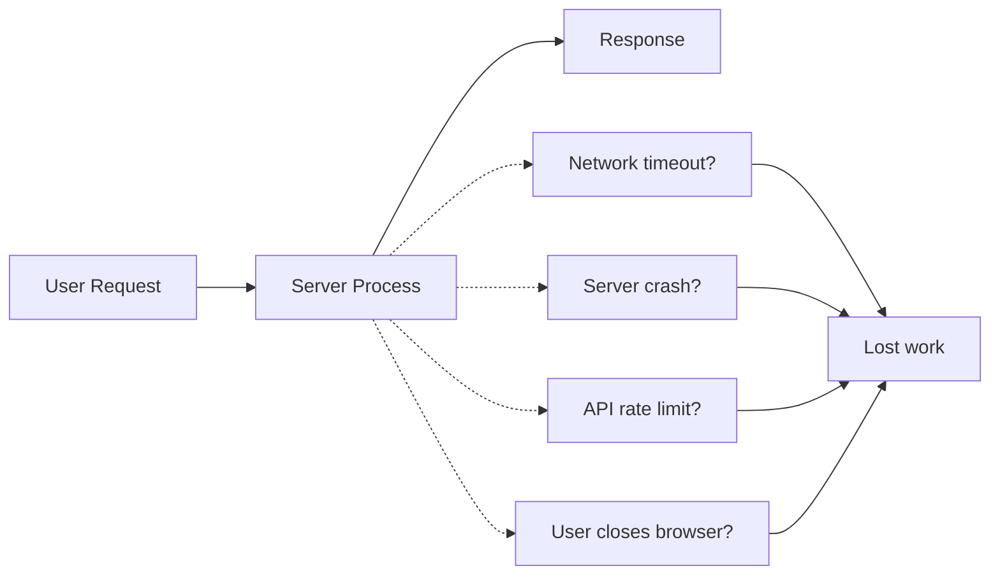
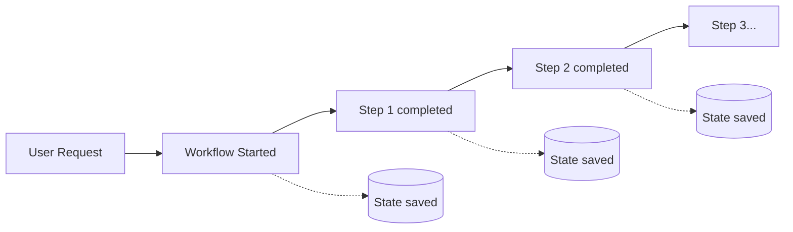
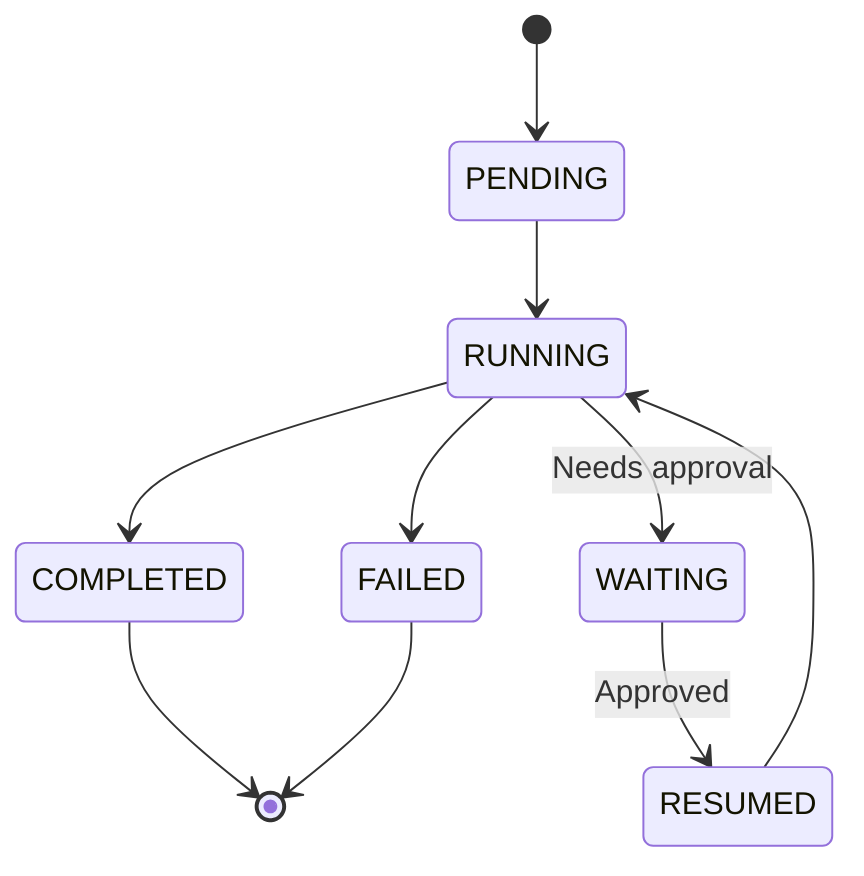
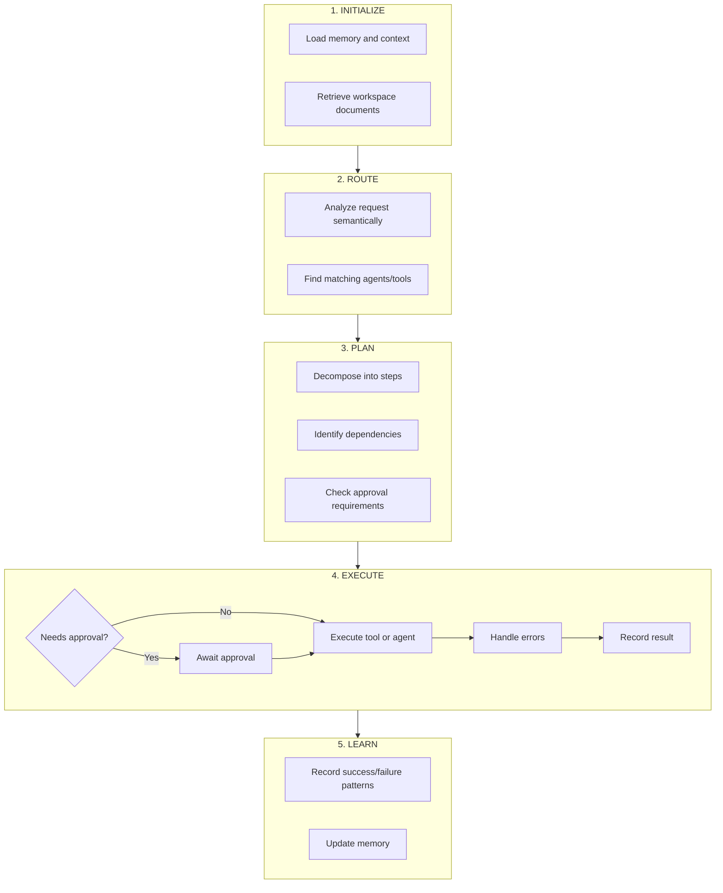
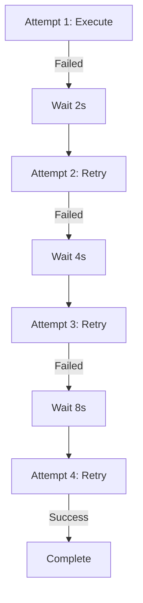
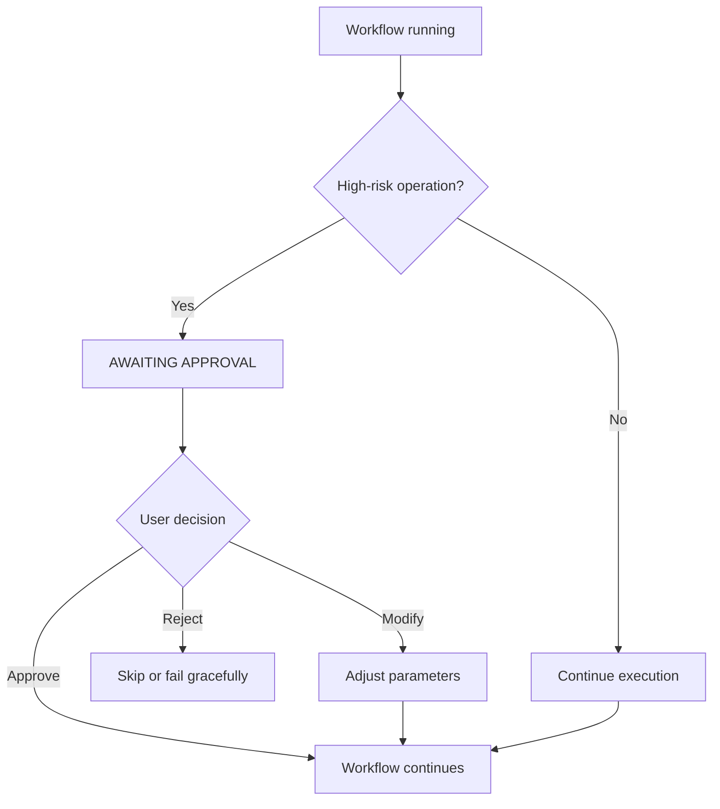
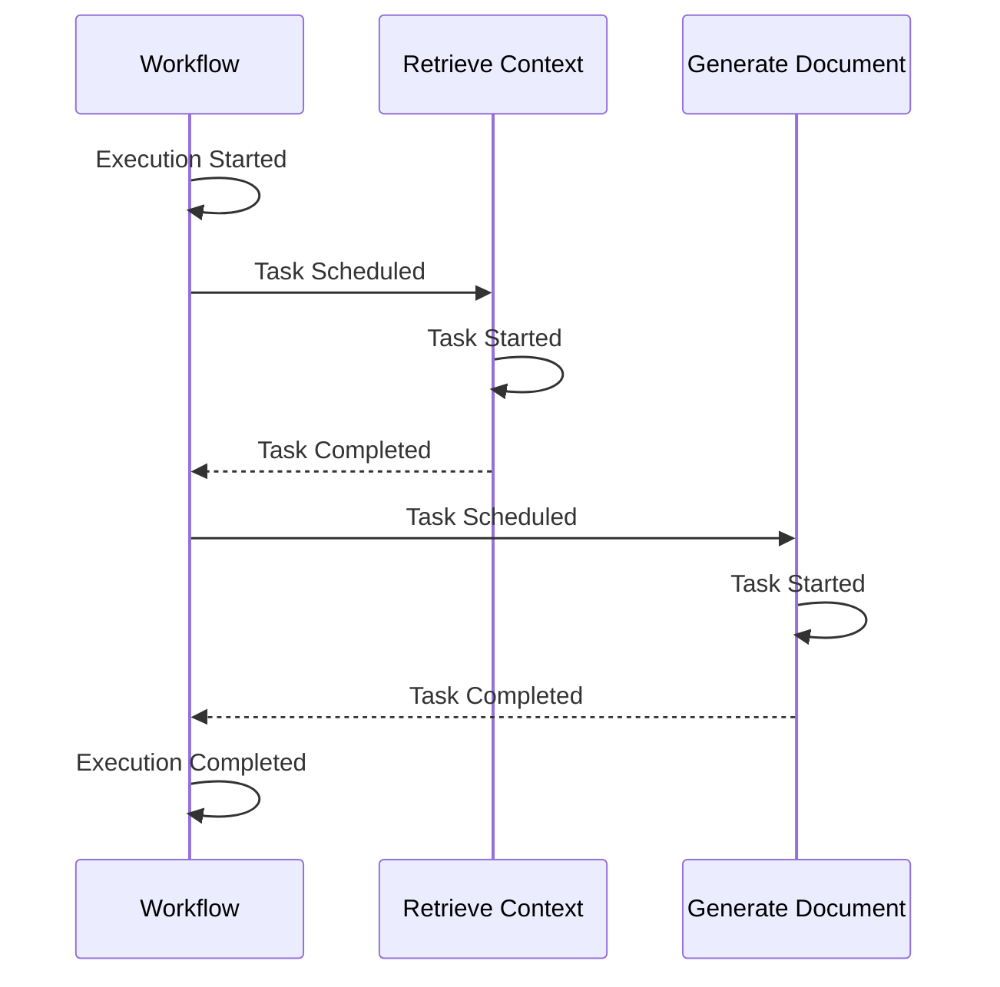

Fabric AI uses a **durable workflow engine** to ensure that complex multi-step operations complete reliably -- even when things go wrong.

## Why Workflows Matter

### The Problem with Traditional Execution

Traditional request-response systems have limitations:



When generating a PRD that takes 5 minutes, or creating 20 Jira tickets, any interruption means starting over.

### The Workflow Solution

Workflows persist state at every step:



**If anything fails:** The workflow resumes from the last saved state.

## How It Works

### Key Concepts

| Concept | Description |
|---------|-------------|
| **Workflows** | Long-running, fault-tolerant processes that coordinate multiple steps |
| **Activities** | Individual units of work like API calls, AI generation, or file operations |
| **Signals** | External events that can modify running workflows (e.g., approvals) |
| **Queries** | Read the current state of a running workflow |

### Workflow Lifecycle



## Workflows in Fabric

### Document Generation Workflow

When you ask an agent to generate a document, this workflow executes:

<Steps>
  <Step>
    ### Initialize Context

    Load user preferences, organization settings, and conversation history.
  </Step>

  <Step>
    ### Retrieve RAG Context

    Search your workspace documents for relevant content based on the request.
  </Step>

  <Step>
    ### Generate Content

    Call the AI model with context to generate the document.
  </Step>

  <Step>
    ### Apply Formatting

    Format the output according to document type (PRD, spec, etc.).
  </Step>

  <Step>
    ### Save and Return

    Store the document and return it to the user.
  </Step>
</Steps>

Each step:
- Automatically retries on failure
- Has configurable timeouts
- Saves state before and after

### Orchestrator Workflow

Fabric Loom runs a more complex workflow:



## Reliability Features

### Automatic Retries

Activities retry automatically with exponential backoff:



Configuration:
- **Initial interval** -- 1 second
- **Maximum interval** -- 5 minutes
- **Maximum attempts** -- 5 (configurable)
- **Backoff coefficient** -- 2.0

### Heartbeats

Long-running activities send periodic heartbeats to indicate they're still alive. If heartbeats stop, the workflow engine can retry the activity on a different worker.

### Timeouts

Multiple timeout types protect against hanging operations:

| Timeout Type | Purpose | Default |
|--------------|---------|---------|
| Start-to-close | Max time for single attempt | 5 minutes |
| Schedule-to-close | Max time including retries | 30 minutes |
| Heartbeat | Max time between heartbeats | 1 minute |
| Schedule-to-start | Max time in queue | 10 minutes |

## Human-in-the-Loop

Workflows can pause for human approval:

### How It Works



> **Example:** "The workflow wants to delete 50 Jira tickets. Do you want to proceed?"

**Key Features:**
- Workflow pauses indefinitely (or until timeout)
- State is preserved while waiting
- User can approve/reject anytime
- Workflow resumes immediately after approval

## Observability

### Workflow Monitoring

Monitor your workflows through the Fabric dashboard:

- **List all workflows** -- See running, completed, and failed
- **View timeline** -- Step-by-step execution visualization
- **Inspect state** -- Current workflow variables
- **Replay** -- Re-execute failed workflows

### Event History

Every workflow maintains a complete event history:



This history enables:
- **Debugging** -- See exactly what happened
- **Replay** -- Re-execute with same inputs
- **Audit** -- Complete compliance trail

## Trust-Based Approvals

The Orchestrator learns from your approval patterns:

### How It Works

**Week 1:**
```
Operation: Post to Slack -> Request approval -> Approved
Operation: Create Jira ticket -> Request approval -> Approved
Operation: Post to Slack -> Request approval -> Approved
```

**Week 2:**
```
Operation: Post to Slack -> Auto-approved (you always approve)
Operation: Create Jira ticket -> Request approval -> Approved
```

**Week 4:**
```
Operation: Post to Slack -> Auto-approved
Operation: Create Jira ticket -> Auto-approved
Operation: DELETE 100 records -> Request approval (always ask for deletes)
```

### Risk Levels

| Risk Level | Examples | Default Behavior |
|------------|----------|------------------|
| Low | Read, list, search | Auto-approve |
| Medium | Create, update | Learn from patterns |
| High | Bulk operations | Usually request approval |
| Critical | Delete, financial | Always request approval |

## Best Practices

### Designing for Reliability

**Do:**
- Break work into small, focused steps
- Use idempotent operations when possible
- Handle partial success gracefully
- Set appropriate timeouts

**Don't:**
- Put too much logic in a single step
- Assume network calls will always succeed
- Skip error handling
- Use infinite timeouts

### Monitoring

- Check workflow status regularly for failures
- Set up alerts for workflow failures
- Review execution times for optimization
- Audit approval patterns

---

## Next Steps

<Cards>
  <Card title="Agents" href="/docs/agents/overview">
    Learn about the different agent types
  </Card>
  <Card title="Orchestrator" href="/docs/agents/orchestrator">
    Deep dive into Fabric Loom
  </Card>
</Cards>
