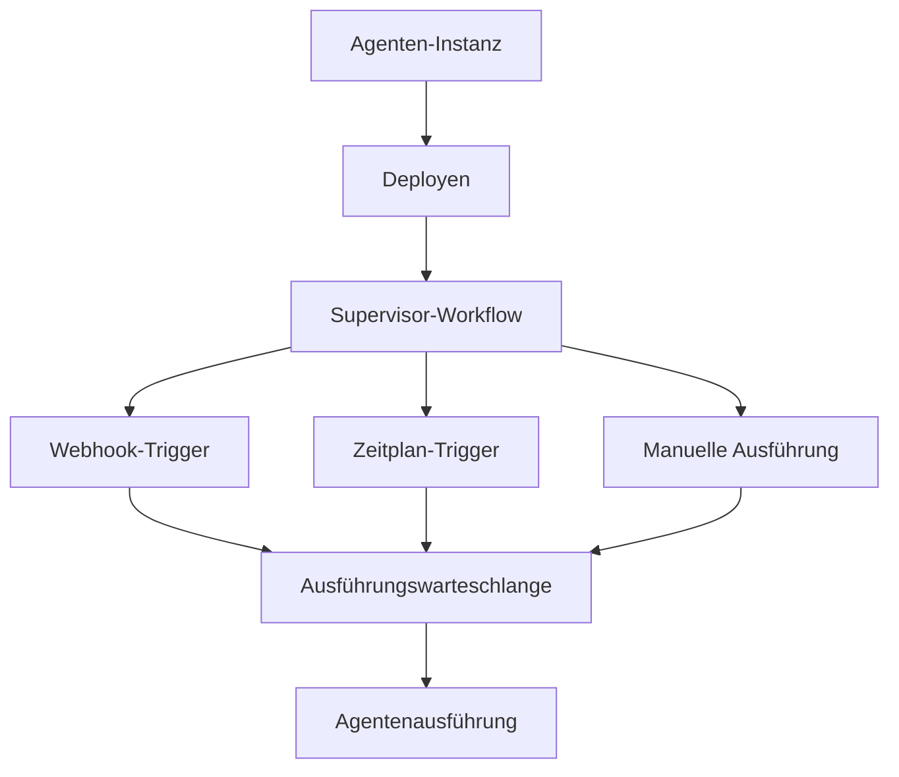

Agenten-Deployments verwandeln Ihre konfigurierten Agenten-Instanzen in immer verfügbare, produktionsreife Dienste. Ein deployierter Agent läuft unter einem dauerhaften Supervisor, der die Ausführung verwaltet, Rate-Limits durchsetzt und automatisch auf Trigger reagiert.

## Deployment-Architektur

Wenn Sie einen Agenten deployen, erstellt Fabric einen dauerhaften Supervisor, der den Lebenszyklus des Agenten verwaltet:



## Einen Agenten deployen

<Steps>
  <Step>
    ### Agenten-Instanz konfigurieren

    Bevor Sie deployen, benötigen Sie eine konfigurierte Agenten-Vorlagen-Instanz. Richten Sie die Tools, Prompts und das Verhalten des Agenten in **Agenten-Vorlagen** ein.
  </Step>

  <Step>
    ### Deployment-Konfiguration festlegen

    Ausführungsgrenzen für das Deployment konfigurieren:

    | Einstellung | Beschreibung | Standard |
    |---------|-------------|---------|
    | **Max. gleichzeitige Ausführungen** | Wie viele Ausführungen gleichzeitig laufen können | 5 |
    | **Rate-Limit pro Minute** | Maximale Ausführungen pro Minute | 60 |
    | **Rate-Limit pro Stunde** | Maximale Ausführungen pro Stunde | 500 |
    | **Tägliches Ausführungslimit** | Optionale tägliche Obergrenze | Kein Limit |
    | **Monatliches Ausführungslimit** | Optionale monatliche Obergrenze | Kein Limit |
  </Step>

  <Step>
    ### Deployen

    Klicken Sie auf **Deployen**, um das Deployment zu starten. Fabric wird:

    1. Einen Deployment-Datensatz erstellen
    2. Den dauerhaften Supervisor-Prozess starten
    3. Alle auf der Agenten-Instanz definierten Trigger aktivieren (Webhooks, Zeitpläne)
    4. Die Deployment-ID und Trigger-Details zurückgeben
  </Step>
</Steps>

## Deployment-Status

| Status | Beschreibung |
|--------|-------------|
| **Aktiv** | Supervisor läuft, akzeptiert Ausführungsanfragen |
| **Pausiert** | Supervisor pausiert, keine neuen Ausführungen akzeptiert, laufende Ausführungen können abgeschlossen werden |
| **Beendet** | Supervisor gestoppt, Deployment beendet |

## Lebenszyklus-Verwaltung

### Pausieren

Pausieren eines Deployments:

- Signalisiert dem Supervisor, keine neuen Ausführungen mehr anzunehmen
- Deaktiviert alle Webhook-Trigger (eingehende Webhooks werden abgelehnt)
- Pausiert alle Zeitplan-Trigger
- Laufende Ausführungen können bis zur Fertigstellung fortgesetzt werden

### Fortsetzen

Fortsetzen eines pausierten Deployments:

- Signalisiert dem Supervisor, Ausführungen wieder anzunehmen
- Reaktiviert Webhook-Trigger, die pausiert waren
- Setzt Zeitplan-Trigger fort
- Das Deployment kehrt zum Status **Aktiv** zurück

### Beenden

Beenden eines Deployments:

- Signalisiert dem Supervisor, herunterzufahren
- Löscht alle zugehörigen Zeitpläne
- Entfernt alle Trigger-Datensätze
- Gibt das Deployment-Quota frei
- Diese Aktion ist dauerhaft

## Trigger

Trigger definieren, wie ein deployierter Agent automatisch aufgerufen wird. Jedes Deployment kann mehrere Trigger haben.

### Webhook-Trigger

Webhook-Trigger stellen einen HTTP-Endpunkt bereit, der POST-Anfragen akzeptiert:

```
POST /api/webhooks/agent/{eindeutiger-pfad}
```

| Funktion | Beschreibung |
|---------|-------------|
| **Authentifizierung** | HMAC-SHA256-Signatur-Überprüfung mit einem generierten Geheimnis |
| **Replay-Schutz** | Zeitstempel-Validierung (5-Minuten-Fenster) |
| **IP-Allowlisting** | Optionale Einschränkung auf bestimmte IP-Adressen |
| **Payload-Größenbegrenzung** | Konfigurierbar, bis zu 10 MB |
| **Eingabe-Vorlage** | Standard-Eingabe, die mit dem Webhook-Payload zusammengeführt wird |
| **Priorität** | Ausführungspriorität (Niedrig, Normal, Hoch, Kritisch) |

Das Webhook-Geheimnis wird nur bei der Erstellung angezeigt. Sie können es bei Bedarf neu generieren, was das vorherige Geheimnis ungültig macht.

### Zeitplan-Trigger

Zeitplan-Trigger verwenden Cron-Ausdrücke, um Agenten regelmäßig auszuführen:

| Funktion | Beschreibung |
|---------|-------------|
| **Cron-Ausdruck** | Standard 5-teiliges Cron-Format (Minute, Stunde, Tag, Monat, Wochentag) |
| **Zeitzone** | IANA-Zeitzone für Zeitplanauswertung (Standard: UTC) |
| **Überlappungsrichtlinie** | Wenn die vorherige Ausführung noch läuft, wird die geplante Ausführung übersprungen |
| **Aufholfenster** | Verpasste Zeitpläne innerhalb von 1 Minute werden nachgeholt |

Zeitplan-Trigger werden von einer dauerhaften Ausführungsinfrastruktur unterstützt, die zuverlässige und fehlertolerante Zeitplanung bietet.

### Manuelle Ausführung

Sie können eine Ausführung jederzeit manuell über die Benutzeroberfläche oder API auslösen:

- Optionale Eingabedaten als JSON-Objekt angeben
- Ausführungspriorität festlegen (Niedrig, Normal, Hoch, Kritisch)
- Ausführungen werden in eine Warteschlange gestellt und vom Supervisor verarbeitet

## Ausführungsverwaltung

### Ausführungsablauf

1. Ein Trigger (Webhook, Zeitplan oder manuell) erstellt einen Ausführungsdatensatz
2. Die Ausführung wird beim Supervisor in die Warteschlange gestellt
3. Der Supervisor setzt Rate-Limits und Gleichzeitigkeitskontrollen durch
4. Der Agent läuft mit der bereitgestellten Eingabe
5. Ergebnisse werden im Ausführungsdatensatz gespeichert

### Ausführungsstatus

| Status | Beschreibung |
|--------|-------------|
| **Ausstehend** | In der Warteschlange, wartet auf Supervisor-Verarbeitung |
| **Läuft** | Agentenausführung läuft |
| **Abgeschlossen** | Ausführung erfolgreich abgeschlossen |
| **Fehlgeschlagen** | Ausführung hat einen Fehler gefunden |
| **Abgebrochen** | Ausführung wurde vom Benutzer abgebrochen |

### Ausführungen abbrechen

Sie können eine ausstehende oder laufende Ausführung über die Deployment-Detailseite oder die API abbrechen.

## Quota-Verwaltung

Deployment-Quotas verhindern übermäßige Ressourcennutzung:

- **Deployment-Quota** — Begrenzt, wie viele aktive Deployments ein Benutzer oder eine Organisation haben kann
- **Ausführungs-Quota** — Tägliche und monatliche Ausführungsgrenzen pro Deployment
- **Rate-Limits** — Ausführungsgrenzen pro Minute und pro Stunde

Quota-Nutzung über die Deployment-Detailseite oder die API prüfen.

## Mandantenfähige Unterstützung

Agenten-Deployments funktionieren sowohl in persönlichen als auch in Organisationskontexten:

- **Persönlich** (`/app/agent-deployments`) — Ihre privaten Deployments
- **Organisation** (`/app/{org}/agent-deployments`) — Organisationsbereichsbezogene Deployments, sichtbar für Mitglieder
- Deployment-Quotas werden pro Kontext getrennt verfolgt
- Organisationsmitglieder können Deployments basierend auf ihrer Org-Rolle verwalten
- Webhook- und Zeitplan-Trigger sind mandanten-isoliert
- Task-Queue-Sharding trennt persönliche und Organisationsarbeitslasten

---

## Nächste Schritte

<Cards>
  <Card title="Agenten-Vorlagen" href="/docs/features/agent-templates">
    Agenten vor dem Deployen erstellen und konfigurieren
  </Card>
  <Card title="Workflow-Builder" href="/docs/features/workflow-builder">
    Automatisierte Workflows erstellen, die Agenten-Deployments ergänzen
  </Card>
  <Card title="KI-Anbieter" href="/docs/features/ai-providers">
    Von deployierten Agenten verwendete KI-Modelle konfigurieren
  </Card>
</Cards>
