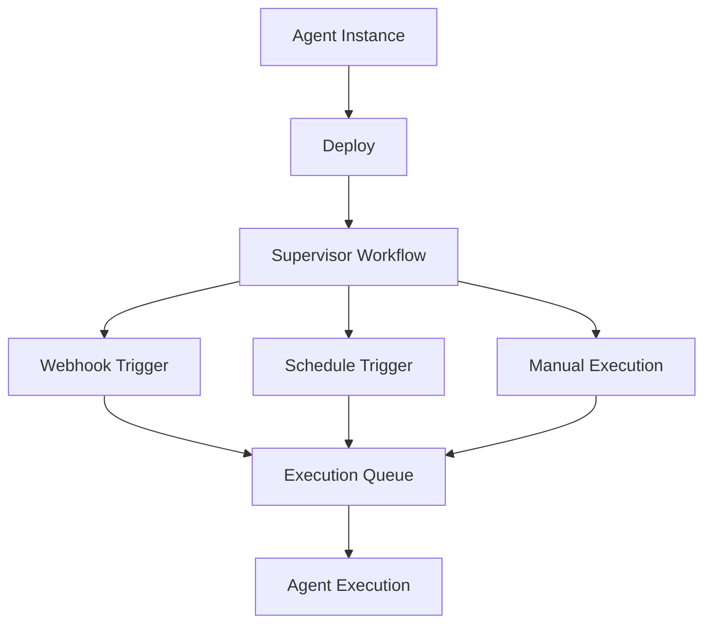

Agent Deployments turn your configured agent instances into always-on, production-ready services. A deployed agent runs under a durable supervisor that manages execution, enforces rate limits, and responds to triggers automatically.

## Deployment Architecture

When you deploy an agent, Fabric creates a durable supervisor that manages the agent's lifecycle:



## Deploying an Agent

<Steps>
  <Step>
    ### Configure an Agent Instance

    Before deploying, you need a configured agent template instance. Set up the agent's tools, prompts, and behavior in **Agent Templates**.
  </Step>

  <Step>
    ### Set Deployment Configuration

    Configure execution limits for the deployment:

    | Setting | Description | Default |
    |---------|-------------|---------|
    | **Max Concurrent Executions** | How many executions can run at once | 5 |
    | **Rate Limit Per Minute** | Maximum executions per minute | 60 |
    | **Rate Limit Per Hour** | Maximum executions per hour | 500 |
    | **Daily Execution Limit** | Optional daily cap | No limit |
    | **Monthly Execution Limit** | Optional monthly cap | No limit |
  </Step>

  <Step>
    ### Deploy

    Click **Deploy** to start the deployment. Fabric will:

    1. Create a deployment record
    2. Start the durable supervisor process
    3. Activate any triggers defined on the agent instance (webhooks, schedules)
    4. Return the deployment ID and trigger details
  </Step>
</Steps>

## Deployment Statuses

| Status | Description |
|--------|-------------|
| **Active** | Supervisor running, accepting execution requests |
| **Paused** | Supervisor paused, no new executions accepted, existing executions may complete |
| **Terminated** | Supervisor stopped, deployment ended |

## Lifecycle Management

### Pause

Pausing a deployment:

- Signals the supervisor to stop accepting new executions
- Deactivates all webhook triggers (incoming webhooks are rejected)
- Pauses all schedule triggers
- Running executions may continue to completion

### Resume

Resuming a paused deployment:

- Signals the supervisor to accept executions again
- Reactivates webhook triggers that were paused
- Resumes schedule triggers
- The deployment returns to **Active** status

### Terminate

Terminating a deployment:

- Signals the supervisor to shut down
- Deletes all associated schedules
- Removes all trigger records
- Releases the deployment quota
- This action is permanent

## Triggers

Triggers define how a deployed agent is automatically invoked. Each deployment can have multiple triggers.

### Webhook Triggers

Webhook triggers expose an HTTP endpoint that accepts POST requests:

```
POST /api/webhooks/agent/{unique-path}
```

| Feature | Description |
|---------|-------------|
| **Authentication** | HMAC-SHA256 signature verification with a generated secret |
| **Replay Protection** | Timestamp validation (5-minute window) |
| **IP Allowlisting** | Optional restriction to specific IP addresses |
| **Payload Size Limit** | Configurable, up to 10 MB |
| **Input Template** | Default input that merges with webhook payload |
| **Priority** | Execution priority (Low, Normal, High, Critical) |

The webhook secret is shown only at creation time. You can regenerate it if needed, which invalidates the previous secret.

#### IP Allowlisting

Webhook IP allowlisting lets you restrict incoming webhook requests to a known set of source IP addresses. This is useful when the sender publishes a stable outbound IP range and you want an extra network-level check in addition to the webhook secret.

When an allowlist is configured, Fabric compares the request IP from a **trusted proxy header** against the IPs you entered on the trigger.

##### Required Environment Variable

Set `TRUSTED_PROXY_IP_HEADER` in the deployment environment to the header that your edge or load balancer writes with the real client IP.

Common values:

| Environment | `TRUSTED_PROXY_IP_HEADER` |
|-------------|----------------------------|
| Cloudflare | `cf-connecting-ip` |
| Nginx / generic reverse proxy | `x-forwarded-for` |
| Proxies that set a single real IP header | `x-real-ip` |

If this variable is not configured, webhook IP allowlisting fails closed and webhook calls with an IP allowlist enabled are rejected.

##### Important Security Note

Do not trust client-supplied forwarding headers directly. Fabric only uses the header named by `TRUSTED_PROXY_IP_HEADER`, so that value should come from infrastructure you control and that overwrites inbound headers from the public internet.

##### Example

If GitHub Enterprise sends webhooks from `192.30.252.0/22` through Cloudflare:

1. Configure the trigger's allowed IPs with the specific source IPs or proxy-normalized addresses you expect
2. Set `TRUSTED_PROXY_IP_HEADER=cf-connecting-ip`
3. Keep webhook signature verification enabled

Use IP allowlisting as a second layer, not a replacement for HMAC signature validation.

### Schedule Triggers

Schedule triggers use cron expressions to run agents on a recurring basis:

| Feature | Description |
|---------|-------------|
| **Cron Expression** | Standard 5-part cron format (minute, hour, day, month, weekday) |
| **Timezone** | IANA timezone for schedule evaluation (default: UTC) |
| **Overlap Policy** | If the previous execution is still running, the scheduled run is skipped |
| **Catchup Window** | Missed schedules within 1 minute are caught up |

Schedule triggers are backed by durable execution infrastructure, providing reliable and fault-tolerant scheduling.

### Slack and Teams Triggers

A chat trigger turns a deployed agent into a **bot you talk to** in Slack or Microsoft Teams. Mention the bot in a channel or thread and the agent runs with your message as input, then replies in the same thread.

| Feature | Description |
|---------|-------------|
| **Invocation** | An `@`-mention of the bot in a connected Slack/Teams channel or thread |
| **Thread continuity** | Follow-up messages in the same thread continue the same conversation, so the agent keeps context |
| **Project binding** | A trigger can be bound to a project; the agent then receives project metadata and project-scoped tools (e.g. `project_rag_query`), so it can **answer from that project's knowledge and context** |
| **Tenant isolation** | Triggers run in the same personal/organization context as the deployment |

This is what lets a Fabric agent act as a "company knowledge" bot in Slack/Teams — bind it to a project and the team can ask it questions that it answers from the project's synced documents, transcripts, and backlog.

### Manual Execution

You can trigger an execution manually at any time through the UI or API:

- Provide optional input data as a JSON object
- Set execution priority (Low, Normal, High, Critical)
- Executions are queued and processed by the supervisor

## Execution Management

### Execution Flow

1. A trigger (webhook, schedule, or manual) creates an execution record
2. The execution is queued with the supervisor
3. The supervisor enforces rate limits and concurrency controls
4. The agent runs with the provided input
5. Results are stored in the execution record

### Execution Statuses

| Status | Description |
|--------|-------------|
| **Pending** | Queued, waiting for the supervisor to process |
| **Running** | Agent execution in progress |
| **Completed** | Execution finished successfully |
| **Failed** | Execution encountered an error |
| **Cancelled** | Execution was cancelled by the user |

### Cancelling Executions

You can cancel a pending or running execution from the deployment detail page or via the API.

## Quota Management

Deployment quotas prevent resource overuse:

- **Deployment Quota** — Limits how many active deployments a user or organization can have
- **Execution Quota** — Per-deployment limits on daily and monthly executions
- **Rate Limits** — Per-minute and per-hour execution caps

Check quota usage from the deployment detail page or via the API.

## Multi-Tenant Support

Agent deployments work in both personal and organization contexts:

- **Personal** (`/app/agent-deployments`) — Your private deployments
- **Organization** (`/app/{org}/agent-deployments`) — Organization-scoped deployments visible to members
- Deployment quotas are tracked separately per context
- Organization members can manage deployments based on their org role
- Webhook and schedule triggers are tenant-isolated
- Task queue sharding separates personal and organization workloads

---

## Next Steps

<Cards>
  <Card title="Agent Templates" href="/docs/features/agent-templates">
    Create and configure agents before deploying
  </Card>
  <Card title="Workflow Builder" href="/docs/features/workflow-builder">
    Build automated workflows that complement agent deployments
  </Card>
  <Card title="AI Providers" href="/docs/features/ai-providers">
    Configure AI models used by deployed agents
  </Card>
</Cards>
