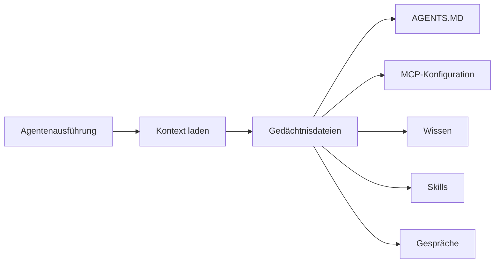
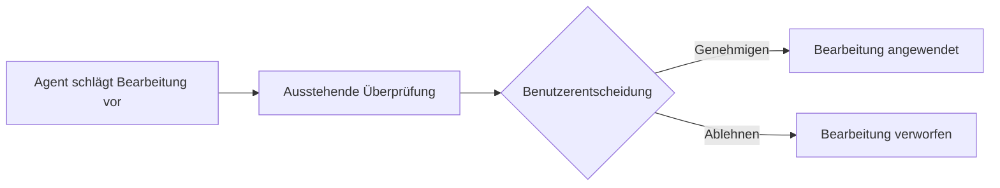

Das Agenten-Gedächtnis bietet ein virtuelles Dateisystem, in dem Agenten persistentes Wissen speichern und abrufen. Jede Agenten-Instanz hat ihr eigenes strukturiertes Gedächtnis, das über Gespräche und Ausführungen hinweg bestehen bleibt.

## Wie Agenten-Gedächtnis funktioniert

Jede Agenten-Instanz hat einen dedizierten Gedächtnisspeicher, der als virtuelles Dateisystem organisiert ist. Gedächtnisdateien enthalten Wissen, Konfiguration, Gesprächsverlauf und Skills, auf die der Agent während der Ausführung verweist.

## Dateitypen

Gedächtnisdateien sind nach Typ kategorisiert, wobei jeder einen bestimmten Zweck erfüllt:

| Dateityp | Beschreibung | Beispielpfad |
|-----------|-------------|--------------|
| **AGENTS_MD** | Agentenkonfiguration und Verhaltensanweisungen | `/agents.md` |
| **MCP_JSON** | MCP-Server-Konfiguration für den Agenten | `/mcp.json` |
| **SKILL** | Wiederverwendbare Skill-Definitionen und -Verfahren | `/skills/research.md` |
| **KNOWLEDGE** | Domänenwissen und Referenzmaterial | `/knowledge/product-docs.md` |
| **CONVERSATION** | Gesprächsverlauf und episodisches Gedächtnis | `/conversations/session-1.md` |
| **CUSTOM** | Benutzerdefinierte Dateien für beliebige Zwecke | `/custom/notes.md` |

## Gedächtnisdateien verwalten

### Dateien auflisten

Alle Gedächtnisdateien für eine Agenten-Instanz anzeigen, optional nach Dateityp oder Pfadpräfix gefiltert.

### Dateien lesen

Den Inhalt beliebiger Gedächtnisdateien lesen. Dateien werden als Klartext gespeichert (typischerweise Markdown oder JSON).

### Dateien schreiben

Neue Dateien erstellen oder vorhandene aktualisieren. Jeder Schreibvorgang wird vor dem Speichern validiert:

- Dateipfad und Inhalt werden auf Formatrichtigkeit geprüft
- Dateien können mit dem `isEnabled`-Flag ein- oder ausgeschaltet werden
- Eine optionale `sourceSkillId` verfolgt, welcher Skill die Datei generiert hat

### Dateien löschen

Eine Gedächtnisdatei dauerhaft entfernen. Dies kann nicht rückgängig gemacht werden.

### Dateien suchen

Mit Volltextabgleich über Gedächtnisdateiinhalte suchen. Ergebnisse können nach Dateityp gefiltert werden und werden nach Relevanz sortiert.

## Gedächtnis aus Vorlagen initialisieren

Wenn Sie eine neue Agenten-Instanz aus einer Vorlage erstellen, können Sie ihr Gedächtnis mit einem vordefinierten Satz von Dateien initialisieren.

<Steps>
  <Step>
    ### Eine Agenten-Instanz auswählen

    Navigieren Sie zu der Agenten-Instanz, für die Sie das Gedächtnis initialisieren möchten.
  </Step>

  <Step>
    ### Gedächtnis initialisieren

    Gedächtnisinitialisierung auslösen, die die Standard-Dateien der Vorlage in den Gedächtnisspeicher des Agenten kopiert.
  </Step>

  <Step>
    ### Anpassen

    Die initialisierten Dateien bearbeiten, um das Wissen und Verhalten des Agenten an Ihre Bedürfnisse anzupassen.
  </Step>
</Steps>

Wenn Gedächtnisdateien bereits vorhanden sind, wird die Initialisierung blockiert, es sei denn, Sie erzwingen die Neu-Initialisierung explizit.

## Mensch-im-Prozess-Bearbeitung

Agenten können Änderungen an ihren eigenen Gedächtnisdateien vorschlagen. Diese Änderungen durchlaufen vor der Anwendung einen Genehmigungsworkflow.

### Bearbeitungsworkflow

### Bearbeitungen überprüfen

1. Die Liste der ausstehenden Bearbeitungen für eine Agenten-Instanz anzeigen
2. Jede Bearbeitung zeigt die vorgeschlagenen Änderungen an einer bestimmten Datei
3. Die Bearbeitung **genehmigen**, um sie auf die Gedächtnisdatei anzuwenden
4. Die Bearbeitung **ablehnen**, um sie ohne Änderungen zu verwerfen

Nur der Dateieigentümer (oder Organisations-Admin im Org-Kontext) kann Bearbeitungen genehmigen oder ablehnen.

## Kontext-Laden

Wenn ein Agent ausgeführt wird, lädt Fabric alle aktivierten Gedächtnisdateien in den Kontext des Agenten. Die `loadContext`-Operation sammelt:

- Alle aktivierten Gedächtnisdateien für die Agenten-Instanz
- Dateien nach Typ-Priorität geordnet (AGENTS_MD zuerst, dann MCP_JSON, SKILL, KNOWLEDGE usw.)
- Inhalte in einen strukturierten Kontext zusammengestellt, auf den der Agent verweisen kann

Dies stellt sicher, dass der Agent bei der Ausführung Zugriff auf seine vollständige Wissensbasis hat.

## Import und Export

### Gedächtnis exportieren

Alle Gedächtnisdateien für eine Agenten-Instanz als JSON-Objekt exportieren. Der Export umfasst:

- Dateipfade als Schlüssel
- Dateiinhalte als Werte
- Export-Zeitstempel

Verwenden Sie dies, um das Gedächtnis eines Agenten zu sichern oder auf eine andere Instanz zu übertragen.

### Gedächtnis importieren

Gedächtnisdateien aus einem JSON-Objekt importieren (Pfad-zu-Inhalt-Zuordnung):

- **Validierung** — Dateien werden vor dem Import validiert (kann mit `validateFirst: false` übersprungen werden)
- **Überschreiben** — Vorhandene Dateien am selben Pfad werden überschrieben
- **Stapel** — Alle Dateien werden in einer einzigen Operation importiert

## Mandantenfähige Unterstützung

Agenten-Gedächtnis ist strikt nach Mandantenkontext isoliert:

- **Persönlich** (`/app/agents`) — Gedächtnisdateien auf Ihre persönlichen Agenten-Instanzen beschränkt
- **Organisation** (`/app/{org}/agents`) — Gedächtnisdateien auf Organisations-Agenten-Instanzen beschränkt
- Gedächtnisdateien aus einem Kontext sind in einem anderen nie zugänglich
- Suchen sind auf den aktuellen Mandantenkontext beschränkt
- Import-/Export-Operationen respektieren Mandantengrenzen

---

## Nächste Schritte

<Cards>
  <Card title="Agenten-Vorlagen" href="/docs/features/agent-templates">
    Agenten-Vorlagen mit vorkonfiguriertem Gedächtnis erstellen
  </Card>
  <Card title="Agenten-Deployments" href="/docs/features/agent-deployments">
    Agenten deployen, die persistentes Gedächtnis verwenden
  </Card>
  <Card title="Skills" href="/docs/features/skills">
    Wiederverwendbare Skills im Agenten-Gedächtnis definieren
  </Card>
</Cards>
