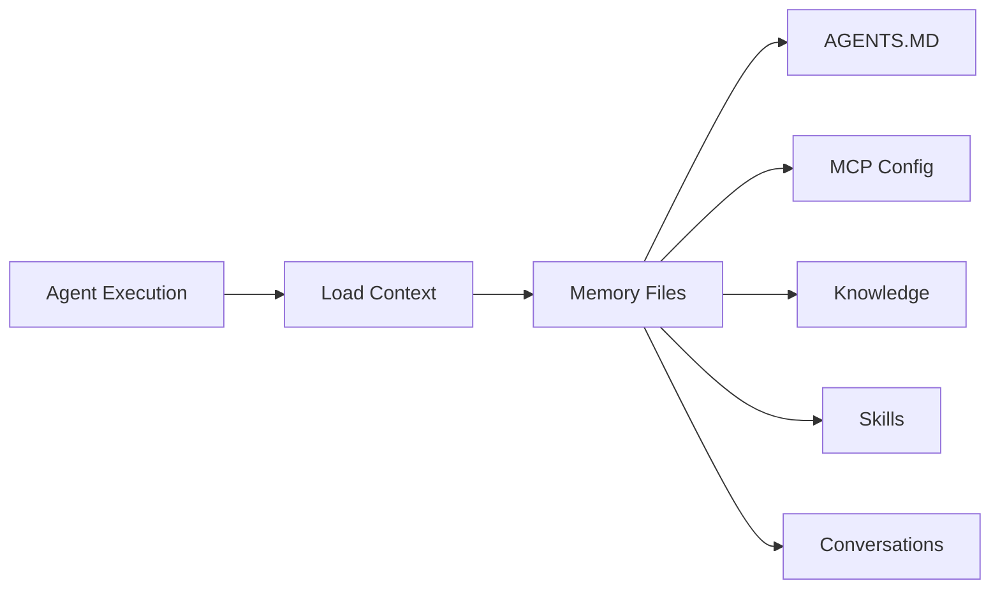
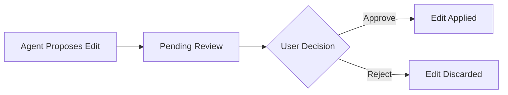

Agent Memory provides a virtual filesystem where agents store and retrieve persistent knowledge. Each agent instance has its own structured memory that persists across conversations and executions.

## How Agent Memory Works

Each agent instance has a dedicated memory store organized as a virtual filesystem. Memory files contain knowledge, configuration, conversation history, and skills that the agent references during execution.

## File Types

Memory files are categorized by type, each serving a specific purpose:

| File Type | Description | Example Path |
|-----------|-------------|--------------|
| **AGENTS_MD** | Agent configuration and behavior instructions | `/agents.md` |
| **MCP_JSON** | MCP server configuration for the agent | `/mcp.json` |
| **SKILL** | Reusable skill definitions and procedures | `/skills/research.md` |
| **KNOWLEDGE** | Domain knowledge and reference material | `/knowledge/product-docs.md` |
| **CONVERSATION** | Conversation history and episodic memory | `/conversations/session-1.md` |
| **CUSTOM** | User-defined files for any purpose | `/custom/notes.md` |

## Managing Memory Files

### Listing Files

View all memory files for an agent instance, optionally filtered by file type or path prefix.

### Reading Files

Read the content of any memory file. Files are stored as plain text (typically Markdown or JSON).

### Writing Files

Create new files or update existing ones. Each write is validated before being saved:

- File path and content are checked for format correctness
- Files can be toggled on or off with the `isEnabled` flag
- An optional `sourceSkillId` tracks which skill generated the file

### Deleting Files

Remove a memory file permanently. This cannot be undone.

### Searching Files

Search across memory file content with full-text matching. Results can be filtered by file type and are ranked by relevance.

## Initializing Memory from Templates

When you create a new agent instance from a template, you can initialize its memory with a predefined set of files.

<Steps>
  <Step>
    ### Select an Agent Instance

    Navigate to the agent instance you want to initialize memory for.
  </Step>

  <Step>
    ### Initialize Memory

    Trigger memory initialization, which copies the template's default files into the agent's memory store.
  </Step>

  <Step>
    ### Customize

    Edit the initialized files to tailor the agent's knowledge and behavior to your needs.
  </Step>
</Steps>

If memory files already exist, initialization is blocked unless you explicitly force re-initialization.

## Human-in-the-Loop Editing

Agents can propose changes to their own memory files. These changes go through an approval workflow before being applied.

### Edit Workflow

### Reviewing Edits

1. View the list of pending edits for an agent instance
2. Each edit shows the proposed changes to a specific file
3. **Approve** the edit to apply it to the memory file
4. **Reject** the edit to discard it without changes

Only the file owner (or organization admin in org context) can approve or reject edits.

## Context Loading

When an agent executes, Fabric loads all enabled memory files into the agent's context. The `loadContext` operation gathers:

- All enabled memory files for the agent instance
- Files ordered by type priority (AGENTS_MD first, then MCP_JSON, SKILL, KNOWLEDGE, etc.)
- Content assembled into a structured context that the agent can reference

This ensures the agent has access to its full knowledge base at execution time.

## Import and Export

### Exporting Memory

Export all memory files for an agent instance as a JSON object. The export includes:

- File paths as keys
- File content as values
- Export timestamp

Use this to back up an agent's memory or transfer it to another instance.

### Importing Memory

Import memory files from a JSON object (path-to-content mapping):

- **Validation** — Files are validated before import (can be skipped with `validateFirst: false`)
- **Overwrite** — Existing files at the same path are overwritten
- **Batch** — All files are imported in a single operation

## Multi-Tenant Support

Agent memory is strictly isolated by tenant context:

- **Personal** (`/app/agents`) — Memory files scoped to your personal agent instances
- **Organization** (`/app/{org}/agents`) — Memory files scoped to organization agent instances
- Memory files from one context are never accessible in another
- Searches are scoped to the current tenant context
- Import/export operations respect tenant boundaries

---

## Next Steps

<Cards>
  <Card title="Agent Templates" href="/docs/features/agent-templates">
    Create agent templates with preconfigured memory
  </Card>
  <Card title="Agent Deployments" href="/docs/features/agent-deployments">
    Deploy agents that use persistent memory
  </Card>
  <Card title="Skills" href="/docs/features/skills">
    Define reusable skills stored in agent memory
  </Card>
</Cards>
