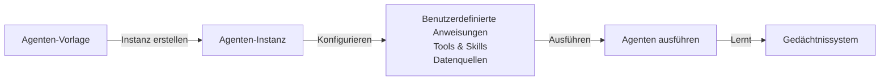

Agenten-Vorlagen bieten ein wiederverwendbares Blueprint-System zur Erstellung von KI-Agenten. Durchsuchen Sie vorgefertigte Vorlagen, passen Sie sie mit Ihren eigenen Anweisungen und Integrationen an oder erstellen Sie völlig neue.

## Wie es funktioniert

1. **Vorlagen** sind Blueprints – sie definieren die Struktur und Fähigkeiten
2. **Instanzen** sind funktionierende Kopien – für Ihren spezifischen Anwendungsfall angepasst
3. **Gedächtnis** persistiert über Sitzungen – Agenten lernen und verbessern sich mit der Zeit

## Vorlagen durchsuchen

Navigieren Sie zu **Agenten-Vorlagen** in der Seitenleiste, um die Galerie aufzurufen.

### Vorlagenkategorien

Vorlagen sind in 15 Kategorien organisiert:

| Kategorie | Beispiele |
|----------|---------|
| **Engineering** | Code-Reviewer, Architekturberater |
| **Produktmanagement** | PRD-Autor, Feature-Priorisierung |
| **Daten** | SQL-Experte, Datenanalyst |
| **Marketing** | Content-Stratege, SEO-Optimierer |
| **Vertrieb** | Lead-Qualifizierer, Angebotsverfasser |
| **Support** | Kundenservice, Wissensdatenbank |
| **Design** | UX-Forscher, Designsystem |
| **Finanzen** | Budget-Analysator, Prognosemodell |
| **Recht** | Vertrags-Reviewer, Compliance-Prüfer |
| **Betrieb** | Prozessoptimierer, SOP-Verfasser |
| **Personalwesen** | Lebenslauf-Screener, Interviewvorbereitung |
| **Wissen** | Forschungsassistent, Dokumentenzusammenfasser |
| **Produktivität** | Aufgabenplaner, Besprechungsnotizen-Ersteller |
| **Allgemein** | Allzweckassistent |

### Vorlagenbereiche

| Bereich | Sichtbarkeit | Bearbeitbar von |
|-------|------------|-------------|
| **System** | Für alle | Nur lesbar (integriert) |
| **Organisation** | Nur für Org-Mitglieder | Org-Eigentümer und Admins |
| **Benutzer** | Nur für Sie | Nur Sie |

## Eine Instanz erstellen

<Steps>
  <Step>
    ### Eine Vorlage auswählen

    Durchsuchen Sie die Galerie und klicken Sie auf eine Vorlage, um ihre Details anzuzeigen, einschließlich Anweisungen, Anwendungsfälle und erforderliche Integrationen.
  </Step>

  <Step>
    ### Auf „Agent erstellen" klicken

    Dies öffnet das Instanzkonfigurationsformular.
  </Step>

  <Step>
    ### Ihre Instanz konfigurieren

    Passen Sie den Agenten für Ihre Bedürfnisse an:

    - **Name und Beschreibung** — Geben Sie ihm einen aussagekräftigen Namen
    - **Benutzerdefinierte Anweisungen** — Vorlagen-Platzhalter mit Ihrem Kontext ausfüllen
    - **Datenquellen** — Google Drive, Notion, GitHub oder andere Wissensquellen verbinden
    - **Tools** — Integrierte Tools (Suche, Code-Interpreter, Bildgenerierung) oder MCP-Server aktivieren
    - **Trigger** — Festlegen, wie der Agent aktiviert wird (manuell, Slack, Webhook, Zeitplan)
    - **Modell** — Das vorgeschlagene KI-Modell der Vorlage überschreiben
  </Step>

  <Step>
    ### Speichern und initialisieren

    Die Instanz wird erstellt und ihr Gedächtnis aus der Vorlage initialisiert. Dies umfasst Skills, Anweisungen und MCP-Konfigurationsdateien.
  </Step>
</Steps>

## Instanzkonfiguration

### Ausführungsmodi

| Modus | Beschreibung |
|------|-------------|
| **Einzelner Zug** | Einfaches Frage-Antwort (Standard) |
| **Zielorientiert** | Agent iteriert, bis ein definiertes Ziel erreicht ist |

Für den zielorientierten Modus angeben:
- **Ziel** — Was der Agent erreichen soll
- **Erfolgskriterien** — Wie die Fertigstellung bestimmt wird (LLM-Richter, Ausgabezuordnung, Tool-Erfolg)
- **Maximale Iterationen** — Sicherheitsgrenze (Standard: 10, max: 50)

### Datenquellen

Externe Wissensquellen für RAG verbinden:

- **Google Drive** — Dokumente und Tabellen
- **Notion** — Seiten und Datenbanken
- **Confluence** — Dokumentationsräume
- **GitHub** — Repository-Inhalte
- **Slack** — Kanalverlauf
- **Microsoft Graph** — Microsoft 365-Dokumente

OAuth-basierte Quellen benötigen einen einmaligen „Verbinden"-Schritt. Integrationsbasierte Quellen verwenden API-Schlüssel.

### Tools

Fähigkeiten für Ihren Agenten aktivieren:

**Integrierte Tools:**
- Web-Suche
- Code-Interpreter
- Bildgenerierung

**MCP-Tools:**
Beliebige Tools von Ihren konfigurierten MCP-Servern können angehängt werden. Tools werden durch ihre MCP-Konfigurations-ID referenziert.

### Trigger

Definieren Sie, wie der Agent aktiviert wird:

| Trigger | Beschreibung |
|---------|-------------|
| **Manuell** | Über die Benutzeroberfläche ausführen |
| **Slack** | Auf Slack-Nachrichten antworten |
| **Webhook** | HTTP-Endpunkt für externe Trigger |
| **Zeitplan** | Cron-basierte automatische Ausführung |

## Versionsverlauf

Instanzen unterstützen Versionierung für sichere Iteration:

- **Bearbeitungen erstellen neue Versionen** — Signifikante Änderungen erstellen automatisch eine neue Version
- **Alte Versionen werden archiviert** — Frühere Versionen bleiben erhalten
- **Jederzeit zurückrollen** — Beliebige archivierte Version wiederherstellen (erstellt eine neue Version)
- **Gedächtnis bleibt erhalten** — Lernen wird über Versionen hinweg fortgeführt
- **Gleiche stabile ID** — Alle Versionen einer Instanz teilen dieselbe Tracking-ID

## Skills

Skills sind modulare Fähigkeiten, die an Vorlagen und Instanzen angehängt werden können.

### Was ist ein Skill?

Ein Skill ist ein eigenständiger Satz von Anweisungen im Markdown-Format. Wenn er an einen Agenten angehängt wird, wird der Inhalt des Skills Teil des Agentengedächtnisses als Datei (`skills/{slug}/SKILL.md`).

### Skills anhängen

1. Die Detailseite einer Vorlage öffnen
2. Zum Abschnitt **Skills** gehen
3. Verfügbare Skills durchsuchen und auf **Anhängen** klicken
4. Sortierreihenfolge und ob der Skill erforderlich ist festlegen

Skills folgen Bereichsregeln:
- **System-Skills** können an beliebige Vorlagen angehängt werden
- **Organisations-Skills** können nur an Organisationsvorlagen in derselben Org angehängt werden
- **Benutzer-Skills** können nur an Ihre persönlichen Vorlagen angehängt werden

### Skill-Materialisierung

Wenn Sie eine Instanz aus einer Vorlage mit Skills erstellen:
1. Jeder Skill wird als Datei in das Gedächtnis der Instanz kopiert
2. Der Agent kann diese Skill-Dateien lesen und referenzieren
3. Sie können materialisierte Skills innerhalb der Instanz bearbeiten, ohne das Original zu beeinflussen

## Gedächtnissystem

Jede Agenten-Instanz hat ein persistentes Gedächtnissystem, das Dateien speichert, die der Agent lesen, schreiben und aus ihnen lernen kann.

### Gedächtnis-Dateitypen

| Typ | Symbol | Beschreibung |
|------|------|-------------|
| **AGENTS.md** | Lila | Kernagenten-Anweisungen |
| **MCP.json** | Blau | MCP-Server-Konfiguration |
| **Skill** | Amber | Materialisierte Skill-Dateien |
| **Wissen** | Grün | Gelernte Wissensdateien |
| **Gespräch** | Cyan | Gesprächszusammenfassungen |

### Gedächtnis durchsuchen

Die Registerkarte **Gedächtnis** zeigt einen Dateibaum-Browser:
- Ordner und Dateien navigieren
- Auf eine Datei klicken, um ihren Inhalt in einem syntaxhervorgehobenen Editor anzuzeigen
- Dateien direkt bearbeiten, um das Agentenverhalten anzupassen

### Ausstehende Bearbeitungen

Agenten können Änderungen an ihren eigenen Gedächtnisdateien vorschlagen (z. B. Lernen aus Interaktionen):

1. Der Agent schlägt eine Dateierstellung, -aktualisierung oder -löschung vor
2. Die Bearbeitung erscheint in der Registerkarte **Ausstehend** mit einem Grund
3. Die vorgeschlagenen Änderungen mit einem Diff-Viewer überprüfen
4. **Genehmigen** zum Anwenden oder **Ablehnen** zum Verwerfen

### Automatischer Genehmigungsmodus

Aktivieren Sie den **automatischen Genehmigungsmodus** (YOLO-Modus) auf einer Instanz, um dem Agenten zu erlauben, sein eigenes Gedächtnis ohne menschliche Überprüfung zu ändern. Nützlich für Agenten, die schnell lernen müssen.

### Gedächtnisoperationen

- Beliebige Gedächtnisdatei **lesen**
- Neue Dateien erstellen oder vorhandene **schreiben**
- Nicht mehr benötigte Dateien **löschen**
- Gedächtnis aus Vorlage **initialisieren** (bei Neustart)
- Gesamtes Gedächtnis als JSON für Backup **exportieren**

## Agenten erwähnen

In Chat-Oberflächen und Dokumenten **@** eingeben, um eine Agenten-Instanz zu erwähnen. Die Suche findet Instanzen nach:
- Instanzname und Beschreibung
- Angehängte Skills
- Aktivierte Integrationen und Tools

## Best Practices

### Vorlagendesign

- **Spezifisch sein** — Klare Anweisungen produzieren bessere Ergebnisse
- **Abschnitte verwenden** — Rolle, Domänenwissen, Prozess, Beispiele
- **Anwendungsfälle definieren** — Benutzern helfen, zu verstehen, wann die Vorlage zu verwenden ist
- **Pro-Tipps hinzufügen** — Benutzer bei der Anpassung leiten

### Instanzverwaltung

- **Mit Standardwerten beginnen** — Testen, bevor stark angepasst wird
- **Gedächtnis-Bearbeitungen überprüfen** — Nützliches Lernen genehmigen, Fehler ablehnen
- **Versionen verwenden** — Neue Versionen für größere Änderungen erstellen
- **Relevante Daten verbinden** — Mehr Kontext bedeutet bessere Ergebnisse

### Skills

- **Skills fokussiert halten** — Eine Fähigkeit pro Skill
- **Beschreibende Slugs verwenden** — `forschungsmethodik` statt `skill-1`
- **Unabhängig testen** — Einen Skill überprüfen, bevor er breit angehängt wird

---

## Nächste Schritte

<Cards>
  <Card title="Skills-Katalog" href="/docs/features/skills">
    Wiederverwendbare Skills durchsuchen und erstellen
  </Card>
  <Card title="Orchestrator" href="/docs/agents/orchestrator">
    Multi-Agenten-Koordination mit Fabric Loom
  </Card>
  <Card title="KI-Chat" href="/docs/features/ai-chat">
    Ihre Agenten-Instanzen in Gesprächen verwenden
  </Card>
</Cards>
