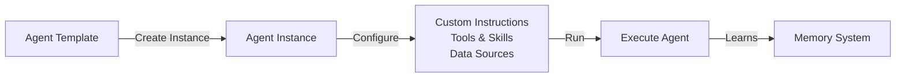

Agent Templates provide a reusable blueprint system for creating AI agents. Browse pre-built templates, customize them with your own instructions and integrations, or build entirely new ones.

## How It Works

1. **Templates** are blueprints — they define the structure and capabilities
2. **Instances** are working copies — customized for your specific use case
3. **Memory** persists across sessions — agents learn and improve over time

## Browsing Templates

Navigate to **Agent Templates** in the sidebar to access the gallery.

### Template Categories

Templates are organized into 15 categories:

| Category | Examples |
|----------|---------|
| **Engineering** | Code reviewer, architecture advisor |
| **Product Management** | PRD writer, feature prioritizer |
| **Data** | SQL expert, data analyst |
| **Marketing** | Content strategist, SEO optimizer |
| **Sales** | Lead qualifier, proposal writer |
| **Support** | Customer service, knowledge base |
| **Design** | UX researcher, design system |
| **Finance** | Budget analyzer, forecast modeler |
| **Legal** | Contract reviewer, compliance checker |
| **Operations** | Process optimizer, SOP writer |
| **Hiring** | Resume screener, interview prep |
| **Knowledge** | Research assistant, document summarizer |
| **Productivity** | Task planner, meeting note taker |
| **General** | General-purpose assistant |

### Template Scopes

| Scope | Visibility | Editable By |
|-------|------------|-------------|
| **System** | Everyone | Read-only (built-in) |
| **Organization** | Org members only | Org owners and admins |
| **User** | Only you | Only you |

## Creating an Instance

<Steps>
  <Step>
    ### Select a Template

    Browse the gallery and click on a template to view its details, including instructions, use cases, and required integrations.
  </Step>

  <Step>
    ### Click "Create Agent"

    This opens the instance configuration form.
  </Step>

  <Step>
    ### Configure Your Instance

    Customize the agent for your needs:

    - **Name and description** — Give it a meaningful name
    - **Custom instructions** — Fill in template placeholders with your context
    - **Data sources** — Connect Google Drive, Notion, GitHub, or other knowledge sources
    - **Tools** — Enable built-in tools (search, code interpreter, image generation) or MCP servers
    - **Triggers** — Set how the agent is activated (manual, Slack, webhook, schedule)
    - **Model** — Override the template's suggested AI model
  </Step>

  <Step>
    ### Save and Initialize

    The instance is created and its memory is initialized from the template. This includes skills, instructions, and MCP configuration files.
  </Step>
</Steps>

## Instance Configuration

### Execution Modes

| Mode | Description |
|------|-------------|
| **Single Turn** | Simple question-and-answer (default) |
| **Goal Oriented** | Agent iterates until a defined goal is achieved |

For goal-oriented mode, provide:
- **Goal** — What the agent should accomplish
- **Success criteria** — How to determine completion (LLM judge, output matching, tool success)
- **Max iterations** — Safety limit (default: 10, max: 50)

### Data Sources

Connect external knowledge sources for RAG:

- **Google Drive** — Documents and spreadsheets
- **Notion** — Pages and databases
- **Confluence** — Documentation spaces
- **GitHub** — Repository contents
- **Slack** — Channel history
- **Microsoft Graph** — Microsoft 365 documents

OAuth-based sources require a one-time "Connect" step. Integration-based sources use API keys.

### Tools

Enable capabilities for your agent:

**Built-in tools:**
- Web search
- Code interpreter
- Image generation

**MCP tools:**
Any tools from your configured MCP servers can be attached. Tools are referenced by their MCP config ID.

### Triggers

Define how the agent is activated:

| Trigger | Description |
|---------|-------------|
| **Manual** | Run from the UI |
| **Slack** | Respond to Slack messages |
| **Webhook** | HTTP endpoint for external triggers |
| **Schedule** | Cron-based automatic execution |

## Version History

Instances support versioning for safe iteration:

- **Edits create new versions** — Significant changes create a new version automatically
- **Old versions are archived** — Previous versions are preserved
- **Rollback anytime** — Restore any archived version (creates a new version)
- **Memory persists** — Learning carries forward across versions
- **Same stable ID** — All versions of an instance share the same tracking ID

## Skills

Skills are modular capabilities that can be attached to templates and instances.

### What is a Skill?

A skill is a self-contained set of instructions in Markdown format. When attached to an agent, the skill's content becomes part of the agent's memory as a file (`skills/{slug}/SKILL.md`).

### Attaching Skills

1. Open a template's detail page
2. Go to the **Skills** section
3. Browse available skills and click **Attach**
4. Set the sort order and whether the skill is required

Skills follow scope rules:
- **System skills** can attach to any template
- **Organization skills** only attach to organization templates in the same org
- **User skills** only attach to your personal templates

### Skill Materialization

When you create an instance from a template with skills:
1. Each skill is copied into the instance's memory as a file
2. The agent can read and reference these skill files
3. You can edit materialized skills within the instance without affecting the original

## Memory System

Each agent instance has a persistent memory system that stores files the agent can read, write, and learn from.

### Memory File Types

| Type | Icon | Description |
|------|------|-------------|
| **AGENTS.md** | Purple | Core agent instructions |
| **MCP.json** | Blue | MCP server configuration |
| **Skill** | Amber | Materialized skill files |
| **Knowledge** | Green | Learned knowledge files |
| **Conversation** | Cyan | Conversation summaries |

### Browsing Memory

The **Memory** tab shows a file tree browser:
- Navigate folders and files
- Click a file to view its content in a syntax-highlighted editor
- Edit files directly to customize agent behavior

### Pending Edits

Agents can propose changes to their own memory (e.g., learning from interactions):

1. The agent proposes a file creation, update, or deletion
2. The edit appears in the **Pending** tab with a reason
3. Review the proposed changes with a diff viewer
4. **Approve** to apply or **Reject** to discard

### Auto-Approve Mode

Enable **auto-approve** (YOLO mode) on an instance to let the agent modify its own memory without human review. Useful for agents that need to learn rapidly.

### Memory Operations

- **Read** any memory file
- **Write** new files or edit existing ones
- **Delete** files no longer needed
- **Initialize** memory from template (if starting fresh)
- **Export** all memory as JSON for backup

## Mentioning Agents

In chat interfaces and documents, type **@** to mention an agent instance. The search finds instances by:
- Instance name and description
- Attached skills
- Enabled integrations and tools

## Best Practices

### Template Design

- **Be specific** — Clear instructions produce better results
- **Use sections** — Role, domain knowledge, process, examples
- **Define use cases** — Help users understand when to use the template
- **Add pro tips** — Guide users on customization

### Instance Management

- **Start with defaults** — Test before heavily customizing
- **Review memory edits** — Approve useful learning, reject mistakes
- **Use versions** — Create new versions for major changes
- **Connect relevant data** — More context means better results

### Skills

- **Keep skills focused** — One capability per skill
- **Use descriptive slugs** — `research-methodology` not `skill-1`
- **Test independently** — Verify a skill works before attaching broadly

---

## Next Steps

<Cards>
  <Card title="Skills Catalog" href="/docs/features/skills">
    Browse and create reusable skills
  </Card>
  <Card title="Orchestrator" href="/docs/agents/orchestrator">
    Multi-agent coordination with Fabric Loom
  </Card>
  <Card title="AI Chat" href="/docs/features/ai-chat">
    Use your agent instances in conversations
  </Card>
</Cards>
