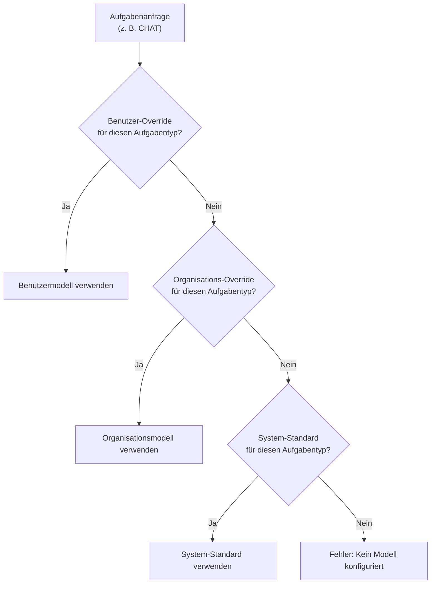

Fabric AI unterstützt 20+ KI-Anbieter. Konfigurieren Sie Ihre bevorzugten Anbieter, legen Sie Modellpräferenzen pro Aufgabentyp fest und verwalten Sie Einbettungen für die Dokumentensuche.

Die gesamte Modellauswahl wird durch Fabrics KI-Modellkatalog gesteuert, der 50+ kanonische Modelle mit Anbieter-Mappings und Aufgaben-Standardwerten enthält. Es werden keine hardcodierten Fallbacks verwendet.

## Anbieterkategorien

### KI-Gateways

Gateways bieten einheitlichen Zugriff auf mehrere Modelle über einen einzigen API-Schlüssel:

| Gateway | Beschreibung |
|---------|-------------|
| **Vercel Gateway** | Weiterleitung zu mehreren Anbietern über Vercel AI |
| **OpenRouter** | Zugriff auf 100+ Modelle über eine API |
| **Cloudflare AI** | Edge-optimierter KI-Inference |

### Direkte Anbieter

Direkte Verbindung zu einem bestimmten KI-Anbieter:

| Anbieter | Wichtige Modelle |
|----------|------------|
| **OpenAI** | GPT-4o, GPT-4o-mini, o1 |
| **Anthropic** | Claude Sonnet, Claude Opus |
| **Groq** | Llama 3.3, Mixtral (schneller Inference) |
| **Together AI** | Open-Source-Modelle im Maßstab |
| **DeepSeek** | DeepSeek R1, DeepSeek V3 |
| **Cohere** | Command R+, Embed |
| **Mistral AI** | Mistral Large, Codestral |
| **Fireworks** | Schneller Open-Source-Inference |
| **Perplexity** | Sucherweiterte Modelle |
| **XAI** | Grok-Modelle |
| **Cerebras** | Ultraschneller Inference |
| **Replicate** | Open-Source-Modell-Hosting |
| **Hugging Face** | Community-Modell-Hub |

### Cloud-Anbieter

Enterprise-Cloud-KI-Dienste:

| Anbieter | Beschreibung |
|----------|-------------|
| **Azure AI Foundry** | Microsoft Azure-gehostete Modelle |
| **AWS Bedrock** | Amazon-gehostete Modelle |
| **Google Vertex AI** | Google Cloud-gehostete Modelle |

## Einen Anbieter einrichten

<Steps>
  <Step>
    ### Zu KI-Anbietern navigieren

    Gehen Sie in der linken Seitenleiste zu **Einstellungen → KI-Anbieter**.
  </Step>

  <Step>
    ### Einen Anbieter auswählen

    Klicken Sie auf den Anbieter, den Sie konfigurieren möchten.
  </Step>

  <Step>
    ### Ihren API-Schlüssel eingeben

    Geben Sie Ihren API-Schlüssel an (und die Basis-URL, falls erforderlich, z. B. für Azure-Deployments). API-Schlüssel werden vor der Speicherung verschlüsselt.
  </Step>

  <Step>
    ### Verbindung testen

    Klicken Sie auf **Verbindung testen**, um Ihre Zugangsdaten zu überprüfen. Der Test zeigt die Latenz an und bestätigt, dass der Anbieter erreichbar ist.
  </Step>

  <Step>
    ### Speichern und als Standard festlegen

    Speichern Sie die Konfiguration. Legen Sie sie optional als Ihren **Standard-Anbieter** fest – dies ist der Fallback, wenn kein spezifisches Modell-Override festgelegt ist.
  </Step>
</Steps>

## Modellpräferenzen

### Wie die Modellauflösung funktioniert

Wenn Fabric ein KI-Modell benötigt (für Chat, Dokumentengenerierung usw.), folgt es dieser Priorität:

### Aufgabentypen

Verschiedene Modelle für verschiedene Arbeitstypen festlegen:

| Aufgabentyp | Anwendungsfall | Empfohlen |
|-----------|----------|-------------|
| **Einfach** | Schnelle Aufgaben – Titel, Zusammenfassungen, Labels | Schnelles, günstiges Modell (z. B. GPT-4o-mini) |
| **Komplex** | Dokumentengenerierung, Analyse | Qualitätsmodell (z. B. GPT-4o) |
| **Chat** | Konversationelle KI | Ausgewogenes Modell (z. B. Claude Sonnet) |
| **Tool-Aufruf** | Funktionsaufrufe, MCP-Tools | Tool-fähiges Modell (z. B. GPT-4o) |
| **Reasoning** | Tiefe Analyse, mehrstufige Logik | Reasoning-Modell (z. B. o1, DeepSeek R1) |
| **Einbettung** | Vektorgenerierung für die Dokumentensuche | Einbettungsmodell (z. B. text-embedding-3-small) |

### Modellpräferenzen festlegen

1. Gehen Sie zu **Einstellungen → KI-Anbieter**
2. Scrollen Sie zu **Modellpräferenzen**
3. Wählen Sie einen Aufgabentyp
4. Wählen Sie Ihr bevorzugtes Modell aus dem Katalog
5. Speichern

### Organisationspräferenzen

Organisations-Administratoren können Präferenzen auf Organisationsebene festlegen:

1. Wechseln Sie in Ihren Organisationskontext
2. Gehen Sie zu **Einstellungen → KI-Anbieter**
3. Standardwerte auf Organisationsebene festlegen

Organisationspräferenzen gelten für alle Mitglieder, es sei denn, ein Mitglied hat sein eigenes persönliches Override.

## Einbettungskonfiguration

Einbettungen sind für die Dokumentensuche und RAG-Funktionen erforderlich. Nicht alle Anbieter unterstützen Einbettungen.

### Einbettungsfähige Anbieter

- OpenAI (text-embedding-3-small, text-embedding-3-large)
- Azure AI Foundry
- Google Vertex AI
- Cohere (embed-english-v3.0)
- Together AI
- Fireworks
- Mistral AI

### Einen Einbettungsanbieter festlegen

1. Den Anbieter mit einem API-Schlüssel konfigurieren (falls noch nicht geschehen)
2. Auf **Als Einbettungsanbieter festlegen** klicken
3. Der Einbettungsanbieter wird für alle Dokumentenverarbeitung und RAG-Abruf verwendet

## Konfigurationsstatus

Die Einstellungsseite zeigt eine visuelle Übersicht:

- Welche Anbieter konfiguriert sind
- Welcher Anbieter der **Standard** ist
- Welcher Anbieter **Einbettungen** verarbeitet
- Warnungen, wenn erforderliche Anbieter fehlen

## Gateway-Sub-Anbieter-Verwaltung

Bei Verwendung eines Gateways (z. B. Vercel Gateway oder OpenRouter) können Sie bestimmte Sub-Anbieter aktivieren oder deaktivieren:

1. Gateway mit Ihrem API-Schlüssel konfigurieren
2. Den Abschnitt **Aktivierte Anbieter** erweitern
3. Einzelne Anbieter ein- oder ausschalten
4. Nur aktivierte Sub-Anbieter erscheinen bei der Modellauswahl

## Best Practices

- **Immer einen Standard-Anbieter festlegen** – Dies stellt sicher, dass KI-Funktionen auch ohne spezifische Overrides funktionieren
- **Einbettungen konfigurieren** – Erforderlich für Dokument-Upload, RAG und Suchfunktionen
- **Gateways für Flexibilität verwenden** – Gateways ermöglichen den Wechsel von Modellen ohne Code-Änderungen
- **Aufgabenspezifische Modelle festlegen** – Schnelle Modelle für einfache Aufgaben und Qualitätsmodelle für komplexe Arbeit
- **Verbindungen testen** – Zugangsdaten überprüfen, bevor man sich auf einen Anbieter verlässt

---

## Nächste Schritte

<Cards>
  <Card title="KI-Chat" href="/docs/features/ai-chat">
    Ihre konfigurierten KI-Anbieter im Chat verwenden
  </Card>
  <Card title="RAG" href="/docs/core-concepts/rag">
    Verstehen, wie Dokumenteinbettungen den Abruf unterstützen
  </Card>
</Cards>
