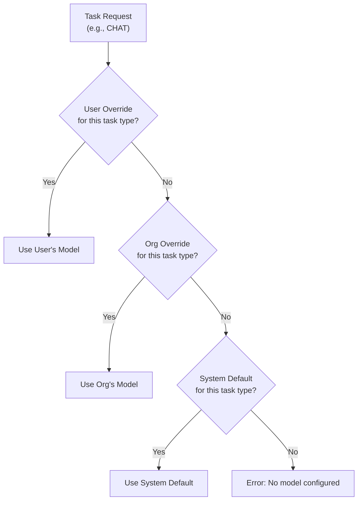

Fabric AI supports 20+ AI providers. Configure your preferred providers, set model preferences per task type, and manage embeddings for document search.

All model selection is driven by Fabric's AI model catalog, which includes 50+ canonical models with provider mappings and task defaults. No hardcoded fallbacks are used.

## Provider Categories

### AI Gateways

Gateways provide unified access to multiple models through a single API key:

| Gateway | Description |
|---------|-------------|
| **Vercel Gateway** | Route to multiple providers via Vercel AI |
| **OpenRouter** | Access 100+ models through one API |
| **Cloudflare AI** | Edge-optimized AI inference |

### Direct Providers

Connect directly to a specific AI vendor:

| Provider | Key Models |
|----------|------------|
| **OpenAI** | GPT-4o, GPT-4o-mini, o1 |
| **Anthropic** | Claude Sonnet, Claude Opus |
| **Groq** | Llama 3.3, Mixtral (fast inference) |
| **Together AI** | Open-source models at scale |
| **DeepSeek** | DeepSeek R1, DeepSeek V3 |
| **Cohere** | Command R+, Embed |
| **Mistral AI** | Mistral Large, Codestral |
| **Fireworks** | Fast open-source inference |
| **Perplexity** | Search-augmented models |
| **XAI** | Grok models |
| **Cerebras** | Ultra-fast inference |
| **Replicate** | Open-source model hosting |
| **Hugging Face** | Community model hub |

### Cloud Providers

Enterprise cloud AI services:

| Provider | Description |
|----------|-------------|
| **Azure AI Foundry** | Microsoft Azure-hosted models |
| **AWS Bedrock** | Amazon-hosted models |
| **Google Vertex AI** | Google Cloud-hosted models |

## Setting Up a Provider

<Steps>
  <Step>
    ### Navigate to AI Providers

    Go to **Settings → AI Providers** in the left sidebar.
  </Step>

  <Step>
    ### Select a Provider

    Click on the provider you want to configure.
  </Step>

  <Step>
    ### Enter Your API Key

    Provide your API key (and base URL if needed, e.g., for Azure deployments). API keys are encrypted before storage.
  </Step>

  <Step>
    ### Test the Connection

    Click **Test Connection** to verify your credentials. The test shows latency and confirms the provider is reachable.
  </Step>

  <Step>
    ### Save and Set as Default

    Save the configuration. Optionally set it as your **default provider** — this is the fallback when no specific model override is set.
  </Step>
</Steps>

## Model Preferences

### How Model Resolution Works

When Fabric needs an AI model (for chat, document generation, etc.), it follows this priority:

### Task Types

Set different models for different types of work:

| Task Type | Use Case | Recommended |
|-----------|----------|-------------|
| **Simple** | Quick tasks — titles, summaries, labels | Fast, cheap model (e.g., GPT-4o-mini) |
| **Complex** | Document generation, analysis | High-quality model (e.g., GPT-4o) |
| **Chat** | Conversational AI | Balanced model (e.g., Claude Sonnet) |
| **Tool Calling** | Function calling, MCP tools | Tool-capable model (e.g., GPT-4o) |
| **Reasoning** | Deep analysis, multi-step logic | Reasoning model (e.g., o1, DeepSeek R1) |
| **Embedding** | Vector generation for document search | Embedding model (e.g., text-embedding-3-small) |

### Setting Model Preferences

1. Go to **Settings → AI Providers**
2. Scroll to **Model Preferences**
3. Select a task type
4. Choose your preferred model from the catalog
5. Save

### Organization Preferences

Organization admins can set org-level model preferences:

1. Switch to your organization context
2. Go to **Settings → AI Providers**
3. Set org-level defaults

Organization preferences apply to all members unless a member has their own personal override.

## Embedding Configuration

Embeddings are required for document search and RAG features. Not all providers support embeddings.

### Embedding-Capable Providers

- OpenAI (text-embedding-3-small, text-embedding-3-large)
- Azure AI Foundry
- Google Vertex AI
- Cohere (embed-english-v3.0)
- Together AI
- Fireworks
- Mistral AI

### Setting an Embedding Provider

1. Configure the provider with an API key (if not already done)
2. Click **Set as Embedding Provider**
3. The embedding provider is used for all document processing and RAG retrieval

## Configuration Status

The settings page shows a visual overview:

- Which providers are configured
- Which provider is the **default**
- Which provider handles **embeddings**
- Warnings when required providers are missing

## Gateway Sub-Provider Management

When using a gateway (e.g., Vercel Gateway or OpenRouter), you can enable or disable specific sub-providers:

1. Configure the gateway with your API key
2. Expand the **Enabled Providers** section
3. Toggle individual providers on or off
4. Only enabled sub-providers appear in model selection

## Best Practices

- **Always set a default provider** — This ensures AI features work even without specific overrides
- **Configure embeddings** — Required for document upload, RAG, and search features
- **Use gateways for flexibility** — Gateways let you switch models without changing code
- **Set task-specific models** — Use fast models for simple tasks and quality models for complex work
- **Test connections** — Verify credentials before relying on a provider

---

## Next Steps

<Cards>
  <Card title="AI Chat" href="/docs/features/ai-chat">
    Start using your configured AI providers in chat
  </Card>
  <Card title="RAG" href="/docs/core-concepts/rag">
    Understand how document embeddings power retrieval
  </Card>
</Cards>
