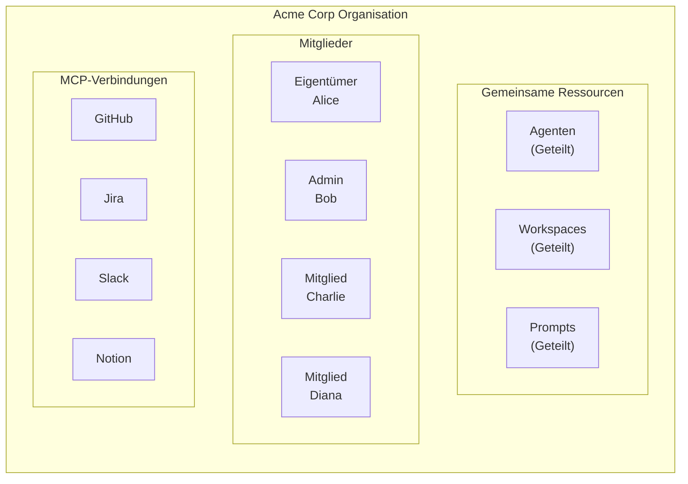
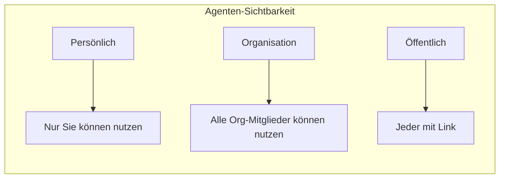
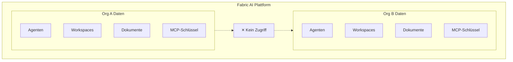

Organisationen in Fabric AI ermöglichen Team-Zusammenarbeit mit unternehmensweiter Sicherheit und Isolierung. Teilen Sie Agenten, Workspaces und Prompts und behalten Sie dabei die Kontrolle darüber, wer auf was zugreifen kann.

## Was ist eine Organisation?

Eine Organisation ist ein gemeinsamer Workspace für Teams:

## Eine Organisation erstellen

<Steps>
  <Step>
    ### Zu Einstellungen navigieren

    Klicken Sie auf Ihr Profilsymbol und wählen Sie **Einstellungen → Organisationen**.
  </Step>

  <Step>
    ### Organisation erstellen

    Klicken Sie auf **Organisation erstellen** und füllen Sie aus:
    
    - **Name**: Ihr Unternehmen oder Teamname
    - **Slug**: URL-freundlicher Bezeichner (automatisch generiert)
    - **Logo**: Logo Ihrer Organisation hochladen (optional)
  </Step>

  <Step>
    ### Mitglieder einladen

    Teammitglieder per E-Mail hinzufügen:
    
    1. Auf **Mitglieder einladen** klicken
    2. E-Mail-Adressen eingeben
    3. Rolle für jedes Mitglied auswählen
    4. Auf **Einladungen senden** klicken
    
    Eingeladene Personen erhalten eine E-Mail mit einem Link zum Beitreten.
  </Step>
</Steps>

## Rollen & Berechtigungen

Fabric AI verwendet rollenbasierte Zugriffskontrolle (RBAC):

| Berechtigung | Eigentümer | Admin | Mitglied |
|------------|-------|-------|--------|
| Agenten und Workspaces nutzen | ✅ | ✅ | ✅ |
| Agenten und Workspaces erstellen | ✅ | ✅ | ✅ |
| Mitglieder einladen | ✅ | ✅ | ❌ |
| Mitgliederrollen verwalten | ✅ | ✅ | ❌ |
| Mitglieder entfernen | ✅ | ✅ | ❌ |
| MCP-Server konfigurieren | ✅ | ✅ | ❌ |
| Abrechnung verwalten | ✅ | ❌ | ❌ |
| Organisation löschen | ✅ | ❌ | ❌ |
| Eigentümerschaft übertragen | ✅ | ❌ | ❌ |

### Eigentümer

- Vollständige Kontrolle über die Organisation
- Einzige Rolle, die die Organisation löschen oder die Abrechnung verwalten kann
- Ein Eigentümer pro Organisation (kann übertragen werden)

### Admin

- Kann Mitglieder und Einstellungen verwalten
- Kein Zugriff auf Abrechnung oder Löschen der Organisation
- Ideal für Teamleiter und Manager

### Mitglied

- Kann gemeinsame Ressourcen nutzen
- Kann persönliche und Organisationsressourcen erstellen
- Kann keine anderen Mitglieder verwalten

## Gemeinsame Ressourcen

### Organisations-Agenten

Agenten können Ihrer Organisation zugeordnet werden:

Beim Erstellen eines Agenten wählen Sie **Organisation** als Sichtbarkeit, um mit Ihrem Team zu teilen.

### Organisations-Workspaces

Wissensbasen im Team teilen:

- Unternehmensdokumente einmal hochladen
- Alle Mitglieder können sie an Gespräche anhängen
- Konsistenten Kontext beibehalten
- Versionskontrolle für Dokumente

### Organisations-Prompts

Gemeinsame Prompt-Vorlagen erstellen:

- Dokumentformate standardisieren
- Konsistenten Ton und Stil sicherstellen
- Best Practices teilen
- Nutzungsanalysen verfolgen

### Organisations-MCP-Verbindungen

Organisationskonten mit externen Tools verbinden:

- **GitHub-Organisation** — Gemeinsamer Repo-Zugriff
- **Jira-Projekt** — Unternehmensweites Issue-Tracking
- **Slack-Workspace** — Teamkommunikation
- **Notion-Workspace** — Gemeinsame Dokumentation

## Datenisolierung

Fabric AI gewährleistet vollständige Datenisolierung zwischen Organisationen:

### Sicherheitsfunktionen

- **Datenbank-Isolierung**: Separate Datenspeicherung pro Organisation
- **API-Schlüssel-Verschlüsselung**: Zugangsdaten verschlüsselt gespeichert
- **Protokollierung**: Verfolgen, wer wann auf was zugegriffen hat
- **Sitzungsverwaltung**: Sichere Sitzungsbehandlung
- **SSO-Unterstützung**: Enterprise Single Sign-On (demnächst)

## Zwischen Organisationen wechseln

Sie können mehreren Organisationen angehören:

<Steps>
  <Step>
    ### Organisationsauswähler öffnen

    Klicken Sie auf Ihr Profilsymbol oder den Organisationsnamen in der oberen Leiste.
  </Step>

  <Step>
    ### Organisation auswählen

    Wählen Sie aus:
    - **Persönliches Konto** — Ihr privater Workspace
    - **Organisation 1** — Erstes Team
    - **Organisation 2** — Zweites Team
    - usw.
  </Step>

  <Step>
    ### Kontext wechselt

    Alle Ressourcen zeigen jetzt Inhalte der ausgewählten Organisation.
  </Step>
</Steps>

## Persönlicher vs. Organisationskontext

Verstehen Sie, in welchem Kontext Sie arbeiten:

| Aspekt | Persönlich | Organisation |
|--------|----------|--------------|
| Agenten | Nur Sie | Alle Mitglieder |
| Workspaces | Nur Sie | Alle Mitglieder |
| Prompts | Nur Sie | Alle Mitglieder |
| MCP-Verbindungen | Ihre Konten | Gemeinsame Konten |
| Abrechnung | Ihr Plan | Org-Plan |

## Mitglieder verwalten

### Mitglieder einladen

1. Gehen Sie zu **Einstellungen → Organisation → Mitglieder**
2. Klicken Sie auf **Einladen**
3. E-Mail-Adressen eingeben (durch Komma getrennt für Masseneinladungen)
4. Standard-Rolle auswählen
5. Auf **Einladungen senden** klicken

### Rollen ändern

1. Das Mitglied in der Liste finden
2. Auf das Rollenmenü klicken
3. Neue Rolle auswählen
4. Änderungen werden sofort angewendet

### Mitglieder entfernen

1. Das Mitglied in der Liste finden
2. Auf **Entfernen** klicken
3. Entfernung bestätigen

Entfernte Mitglieder:
- Verlieren sofort den Zugriff
- Persönliche Ressourcen bleiben in ihrem Konto
- Organisationsressourcen bleiben bei der Org

## Best Practices

### 1. Beschreibende Namen verwenden

Agenten und Workspaces klar benennen:
- ✅ „Q4 Produkt-PRDs"
- ❌ „Workspace 1"

### 2. Angemessene Sichtbarkeit festlegen

- **Persönlich** für Experimente und Entwürfe verwenden
- **Organisation** für Team-Ressourcen verwenden
- Selten **Öffentlich** verwenden

### 3. Workspaces nach Domäne organisieren

Separate Workspaces für verschiedene Wissensdomänen erstellen:
- „Backend-Architektur"
- „Frontend-Richtlinien"
- „Produktanforderungen"
- „Kundenforschung"

### 4. Mit Prompts standardisieren

Organisations-Prompts erstellen für:
- PRD-Vorlagen
- Technische Spezifikationsformate
- Besprechungszusammenfassungsstrukturen

### 5. Regelmäßig prüfen

Mitglieder und Berechtigungen regelmäßig überprüfen:
- Inaktive Mitglieder entfernen
- Rollen bei Zuständigkeitsänderungen aktualisieren
- Nicht genutzte Ressourcen archivieren

## Enterprise-Funktionen

Für Enterprise-Kunden:

- **SSO/SAML**: Single Sign-On mit Ihrem Identitätsanbieter
- **SCIM**: Automatische Benutzerbereitstellung
- **Erweiterte Protokollierung**: Detaillierte Aktivitätsverfolgung
- **Benutzerdefinierte Datenspeicherung**: Kontrolle über die Speicherdauer von Daten
- **Dedizierter Support**: Prioritätsunterstützung

Kontaktieren Sie sales@fabric.pro für Enterprise-Preise.

---

## Nächste Schritte

<Cards>
  <Card title="Erste Schritte" href="/docs/getting-started/overview">
    Konto und Organisation einrichten
  </Card>
  <Card title="MCP-Integration" href="/docs/integrations/mcp">
    Organisations-Tools verbinden
  </Card>
  <Card title="Benutzerdefinierten Agenten erstellen" href="/docs/tutorials/first-agent">
    Agenten für Ihr Team bauen
  </Card>
</Cards>
