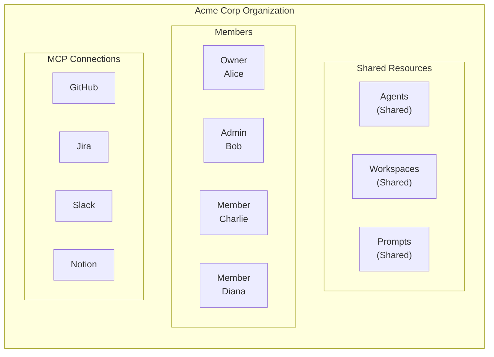
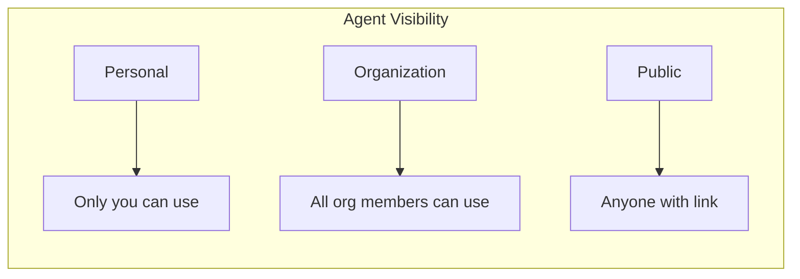
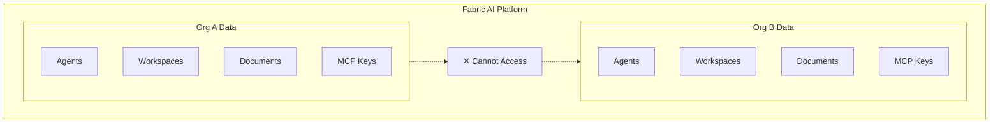

Organizations in Fabric AI enable team collaboration with enterprise-grade security and isolation. Share agents, workspaces, and prompts while maintaining control over who can access what.

## What is an Organization?

An organization is a shared workspace for teams:

## Creating an Organization

<Steps>
  <Step>
    ### Navigate to Settings

    Click your profile icon and select **Settings → Organizations**.
  </Step>

  <Step>
    ### Create Organization

    Click **Create Organization** and fill in:
    
    - **Name**: Your company or team name
    - **Slug**: URL-friendly identifier (auto-generated)
    - **Logo**: Upload your organization's logo (optional)
  </Step>

  <Step>
    ### Invite Members

    Add team members by email:
    
    1. Click **Invite Members**
    2. Enter email addresses
    3. Select role for each member
    4. Click **Send Invites**
    
    Invitees receive an email with a link to join.
  </Step>
</Steps>

## Roles & Permissions

Fabric AI uses role-based access control (RBAC):

| Permission | Owner | Admin | Member |
|------------|-------|-------|--------|
| Use agents and workspaces | ✅ | ✅ | ✅ |
| Create agents and workspaces | ✅ | ✅ | ✅ |
| Invite members | ✅ | ✅ | ❌ |
| Manage member roles | ✅ | ✅ | ❌ |
| Remove members | ✅ | ✅ | ❌ |
| Configure MCP servers | ✅ | ✅ | ❌ |
| Manage billing | ✅ | ❌ | ❌ |
| Delete organization | ✅ | ❌ | ❌ |
| Transfer ownership | ✅ | ❌ | ❌ |

### Owner

- Full control over the organization
- Only role that can delete the organization or manage billing
- One owner per organization (can be transferred)

### Admin

- Can manage members and settings
- Cannot access billing or delete organization
- Ideal for team leads and managers

### Member

- Can use shared resources
- Can create personal and organization resources
- Cannot manage other members

## Shared Resources

### Organization Agents

Agents can be scoped to your organization:

When creating an agent, select **Organization** visibility to share with your team.

### Organization Workspaces

Share knowledge bases across your team:

- Upload company documents once
- All members can attach to conversations
- Maintain consistent context
- Version control for documents

### Organization Prompts

Create shared prompt templates:

- Standardize document formats
- Ensure consistent tone and style
- Share best practices
- Track usage analytics

### Organization MCP Connections

Connect organization accounts to external tools:

- **GitHub Organization** — Shared repo access
- **Jira Project** — Company-wide issue tracking
- **Slack Workspace** — Team communication
- **Notion Workspace** — Shared documentation

## Data Isolation

Fabric AI ensures complete data isolation between organizations:

### Security Features

- **Database isolation**: Separate data storage per organization
- **API key encryption**: Credentials encrypted at rest
- **Audit logging**: Track who accessed what and when
- **Session management**: Secure session handling
- **SSO support**: Enterprise single sign-on (coming soon)

## Switching Between Organizations

You can belong to multiple organizations:

<Steps>
  <Step>
    ### Open Organization Switcher

    Click your profile icon or the organization name in the top bar.
  </Step>

  <Step>
    ### Select Organization

    Choose from:
    - **Personal Account** — Your private workspace
    - **Organization 1** — First team
    - **Organization 2** — Second team
    - etc.
  </Step>

  <Step>
    ### Context Switches

    All resources now show content from the selected organization.
  </Step>
</Steps>

## Personal vs Organization Context

Understand which context you're working in:

| Aspect | Personal | Organization |
|--------|----------|--------------|
| Agents | Only you | All members |
| Workspaces | Only you | All members |
| Prompts | Only you | All members |
| MCP Connections | Your accounts | Shared accounts |
| Billing | Your plan | Org plan |

## Managing Members

### Inviting Members

1. Go to **Settings → Organization → Members**
2. Click **Invite**
3. Enter email addresses (comma-separated for bulk)
4. Select default role
5. Click **Send Invites**

### Changing Roles

1. Find the member in the list
2. Click the role dropdown
3. Select new role
4. Changes apply immediately

### Removing Members

1. Find the member in the list
2. Click **Remove**
3. Confirm removal

Removed members:
- Lose access immediately
- Personal resources stay in their account
- Organization resources remain with the org

## Deleting an Organization

Only the **Owner** can delete an organization. The control lives in
**Settings → Danger zone**, and it asks for two separate proofs before anything
happens:

1. **Type the organization's name.** This proves you know which organization you
   are deleting.
2. **Open the link we email you.** Nothing is deleted when you press the button —
   the deletion happens when you confirm from that link, which proves it is you
   and not someone at an unlocked laptop.

Before you confirm, the dialog shows what will go: the number of projects,
members, documents and context sources the organization holds.

### The 30-day recovery window

Deleting an organization does not destroy anything straight away. It is
deactivated: everyone loses access immediately, every API key and MCP connection
scoped to it stops working, and it disappears from the organization switcher.
Nothing inside it is erased.

For **30 days** you can bring it back exactly as it was, from the **Recently
deleted** list on your organization page. Restoring is self-service and needs no
support ticket. Owners also get an email warning shortly before the window ends,
so the last chance to act does not pass unnoticed.

After 30 days the organization and everything in it — projects, documents,
meeting transcripts, indexed context and uploaded files — are permanently
deleted. That deletion cannot be undone by you or by us.

<Callout type="info">
  Deleted **projects** keep a 7-day recovery window. Organizations get longer
  because deleting one takes everyone in it offline at once, including the people
  most likely to notice.
</Callout>

### Inactive organizations

Fabric may remove organizations that have been inactive for **six months**. If
that applies to yours, we email the owner before anything is deleted, and the
30-day recovery window above applies in the same way.

If you need help with a deletion or a recovery, contact support@fabric.pro.

## Best Practices

### 1. Use Descriptive Names

Name agents and workspaces clearly:
- ✅ "Q4 Product PRDs"
- ❌ "Workspace 1"

### 2. Set Appropriate Visibility

- Use **Personal** for experiments and drafts
- Use **Organization** for team resources
- Rarely use **Public**

### 3. Organize Workspaces by Domain

Create separate workspaces for different knowledge domains:
- "Backend Architecture"
- "Frontend Guidelines"
- "Product Requirements"
- "Customer Research"

### 4. Standardize with Prompts

Create organization prompts for:
- PRD templates
- Technical spec formats
- Meeting summary structures

### 5. Audit Regularly

Review members and permissions periodically:
- Remove inactive members
- Update roles as responsibilities change
- Archive unused resources

## Enterprise Features

For enterprise customers:

- **SSO/SAML**: Single sign-on with your identity provider
- **SCIM**: Automatic user provisioning
- **Advanced audit logs**: Detailed activity tracking
- **Custom data retention**: Control how long data is stored
- **Dedicated support**: Priority assistance

Contact support@fabric.pro for enterprise pricing.

---

## Next Steps

<Cards>
  <Card title="Getting Started" href="/docs/getting-started/overview">
    Set up your account and organization
  </Card>
  <Card title="MCP Integration" href="/docs/integrations/mcp">
    Connect organization tools
  </Card>
  <Card title="Create Custom Agent" href="/docs/tutorials/first-agent">
    Build agents for your team
  </Card>
</Cards>
