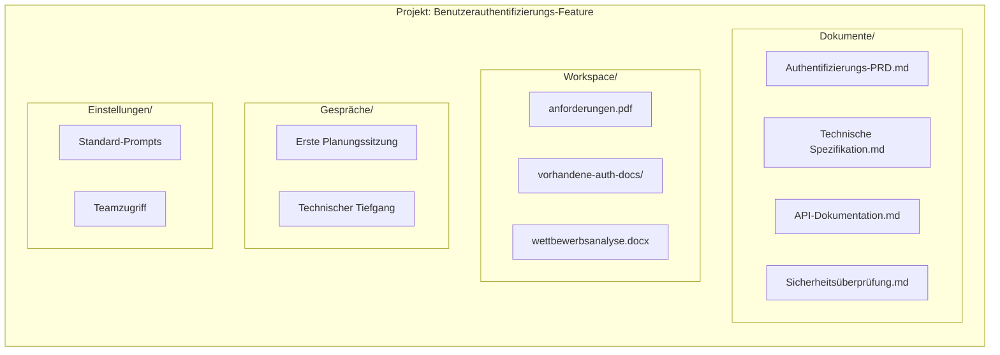

Projekte sind die primäre Methode, Ihre Arbeit in Fabric AI zu organisieren. Sie bringen Dokumente, Workspaces, Agenten und Teamzusammenarbeit an einem Ort zusammen.

## Was ist ein Projekt?

Ein Projekt ist ein Container für verwandte Arbeit:

- **Dokumente** — PRDs, Spezifikationen, Architekturdokumente, die von Agenten generiert wurden
- **Workspaces** — Hochgeladene Dateien, die KI-Agenten Kontext bieten
- **Gespräche** — Chat-Verlauf mit Agenten über dieses Projekt
- **Einstellungen** — Projektspezifische Konfiguration und Vorlagen

## Ein Projekt erstellen

<Steps>
  <Step>
    ### Zu Projekten navigieren

    Klicken Sie in der linken Seitenleiste auf **Projekte**.
  </Step>

  <Step>
    ### Neues Projekt erstellen

    Klicken Sie auf **Projekt erstellen** und geben Sie an:

    - **Name** — Beschreibender Projektname
    - **Beschreibung** — Kurze Zusammenfassung des Projekts
    - **Vorlage** (optional) — Von einer Vorlage starten
  </Step>

  <Step>
    ### Einstellungen konfigurieren

    Projektpräferenzen festlegen:

    - **Standard-Dokumenttyp** — PRD, Spezifikation usw.
    - **Standard-Agent** — Welcher Agent verwendet werden soll
    - **Sichtbarkeit** — Persönlich oder mit Organisation geteilt
  </Step>

  <Step>
    ### Mit der Arbeit beginnen

    Ihr Projekt ist bereit! Sie können:
    - Dokumente in den Workspace hochladen
    - Ein Gespräch mit einem Agenten starten
    - Ihr erstes Dokument generieren
  </Step>
</Steps>

## Projektstruktur



## Mit Dokumenten arbeiten

### Dokumente generieren

<Steps>
  <Step>
    ### Projekt öffnen

    Klicken Sie auf Ihr Projekt, um es zu öffnen.
  </Step>

  <Step>
    ### Agenten-Chat starten

    Klicken Sie auf **Neues Dokument** oder **Chat**, um ein Gespräch mit einem Agenten zu starten.
  </Step>

  <Step>
    ### Beschreiben, was Sie benötigen

    Sagen Sie dem Agenten, welches Dokument Sie möchten:

    ```
    Erstelle ein PRD für die Implementierung der OAuth 2.0-Authentifizierung.
    Beziehe Benutzerflüsse, API-Anforderungen und Sicherheitsüberlegungen ein.
    ```
  </Step>

  <Step>
    ### Überprüfen und bearbeiten

    Der Agent erstellt einen Entwurf. Sie können:

    - **Direkt bearbeiten** im Rich-Text-Editor
    - **Änderungen anfordern** durch Gespräch mit dem Agenten
    - **Akzeptieren/Ablehnen** vorgeschlagener Änderungen
  </Step>

  <Step>
    ### Dokument speichern

    Klicken Sie auf **Speichern**, um das Dokument Ihrem Projekt hinzuzufügen.
  </Step>
</Steps>

### Dokumenttypen

Fabric unterstützt verschiedene Dokumenttypen:

| Typ | Beschreibung | Vorlagenfunktionen |
|------|-------------|-------------------|
| PRD | Produktanforderungsdokument | Ziele, Features, Erfolgsmetriken |
| Technische Spezifikation | Technische Implementierungsdetails | Architektur, APIs, Datenmodelle |
| Architektur | Systemarchitekturdokumentation | Diagramme, Komponenten, Abläufe |
| User Story | Agile User Stories | Als/Möchte/Damit-Format |
| API-Spezifikation | API-Dokumentation | Endpunkte, Schemas, Beispiele |
| Vorschlag | Projektvorschläge | Problem, Lösung, Zeitplan |

### Dokumenteditor

Der integrierte Editor bietet:

- **Umfangreiche Formatierung** — Überschriften, Listen, Code-Blöcke
- **Markdown-Unterstützung** — In Markdown schreiben, schön darstellen
- **KI-Unterstützung** — Inline-KI-Vorschläge und Umschreibungen
- **Diff-Hervorhebung** — Änderungen klar sehen
- **Versionsverlauf** — Alle Änderungen verfolgen
- **Export** — PDF, DOCX, Markdown

## Projekt-Workspaces

Jedes Projekt hat einen dedizierten Workspace für RAG-Kontext.

### Dokumente hochladen

Dateien per Drag & Drop oder Klicken zum Hochladen:

- **Unterstützte Formate** — PDF, DOCX, MD, TXT, Code-Dateien
- **Größenbegrenzungen** — Bis zu 50 MB pro Datei
- **Massen-Upload** — Mehrere Dateien gleichzeitig

### Kontext nutzen

Wenn Sie in einem Projekt mit einem Agenten chatten, hat er automatisch Zugriff auf:

1. Alle Dokumente im Projekt-Workspace
2. Zuvor generierte Dokumente im Projekt
3. Alle explizit angehängten Workspaces

Das bedeutet, der Agent versteht Ihren Projektkontext und kann:
- Auf Ihre vorhandene Dokumentation verweisen
- Konsistenz über Dokumente hinweg aufrechterhalten
- Auf früherer Arbeit aufbauen

### Workspace verwalten

- **Dateien hinzufügen** — Neue Dokumente jederzeit hochladen
- **Dateien entfernen** — Veraltete Dokumente löschen
- **Organisieren** — Ordner zur Organisation erstellen
- **Suchen** — Bestimmte Dokumente schnell finden

## Teamzusammenarbeit

### Projekte teilen

Projekte mit Ihrer Organisation teilen:

1. Projekteinstellungen öffnen
2. Auf **Teilen** klicken
3. Sichtbarkeit wählen:
   - **Privat** — Nur Sie
   - **Organisation** — Alle Org-Mitglieder
   - **Bestimmte Mitglieder** — Ausgewählte Personen

### Mitgliederrollen

| Rolle | Berechtigungen |
|------|-------------|
| Eigentümer | Vollständige Kontrolle, kann Projekt löschen |
| Editor | Kann Dokumente erstellen und bearbeiten |
| Betrachter | Kann Dokumente nur ansehen |

### Aktivitätsfeed

Projektaktivität verfolgen:

- Dokument erstellt von [Benutzer]
- Dokument bearbeitet von [Benutzer]
- Workspace-Dokument hinzugefügt
- Gespräch gestartet

## Projektvorlagen

### Vorlagen verwenden

Von einer Vorlage für schnelleren Start beginnen:

1. Auf **Projekt erstellen** klicken
2. **Vorlage verwenden** auswählen
3. Aus verfügbaren Vorlagen wählen
4. Für Ihre Bedürfnisse anpassen

### Verfügbare Vorlagen

- **Feature-Entwicklung** — PRD, Spezifikation, Stories
- **API-Projekt** — API-Spezifikation, Dokumentation
- **Forschungsprojekt** — Analyse, Erkenntnisse, Empfehlungen
- **Sprint-Planung** — Stories, Aufgaben, Schätzungen

### Vorlagen erstellen

Vorlagen aus bestehenden Projekten erstellen:

1. Ein Projekt öffnen
2. Auf **Einstellungen → Als Vorlage speichern** klicken
3. Auswählen, was einzubeziehen ist:
   - Dokumentstruktur
   - Standard-Prompts
   - Workspace-Organisation
4. Vorlage speichern

## Projekteinstellungen

### Allgemeine Einstellungen

- **Name und Beschreibung** — Projektdetails aktualisieren
- **Standard-Agent** — Welcher Agent standardmäßig verwendet werden soll
- **Standard-Dokumenttyp** — Start-Dokumenttyp

### Prompt-Einstellungen

Projektspezifische Prompts konfigurieren:

- **Organisations-Prompts überschreiben** — Benutzerdefinierte Prompts verwenden
- **Variablen-Standardwerte** — Vorlagen-Variablen vorausfüllen
- **Ausgabepräferenzen** — Format, Länge, Stil

### Integrationseinstellungen

Externe Tools verbinden:

- **Jira** — Stories und Aufgaben synchronisieren
- **GitHub** — Mit Repository verknüpfen
- **Slack** — Benachrichtigungen senden

## Best Practices

### Projektorganisation

**Ein Projekt pro Feature/Initiative:**
```
✅ „Benutzerauthentifizierung v2"
✅ „Q1 Mobile App Redesign"
✅ „API Rate-Limiting-Implementierung"

❌ „Alle meine PRDs"
❌ „Zufällige Dokumente"
```

**Klare Benennung:**
```
✅ „[Team] Feature-Name - Phase"
   „[Platform] API-Gateway - Phase 1"
   „[Mobile] Push-Benachrichtigungen - MVP"

❌ „Neues Projekt"
❌ „Test"
```

### Dokumentenverwaltung

- Verwandte Dokumente im selben Projekt generieren
- Referenzmaterialien in Workspace hochladen
- Workspace sauber halten – veraltete Dateien entfernen
- Konsistente Benennung für Dokumente verwenden

### Zusammenarbeit

- Angemessene Freigabeebenen festlegen
- Beschreibungen für das Teamverständnis hinzufügen
- Aktivitätsfeed zum Verfolgen von Änderungen verwenden
- Abgeschlossene Projekte archivieren

---

## Nächste Schritte

<Cards>
  <Card title="Dokumentengenerierung" href="/docs/tutorials/first-document">
    Ihr erstes Projektdokument erstellen
  </Card>
  <Card title="Prompt-Bibliothek" href="/docs/features/prompts">
    Projektspezifische Prompts konfigurieren
  </Card>
</Cards>
