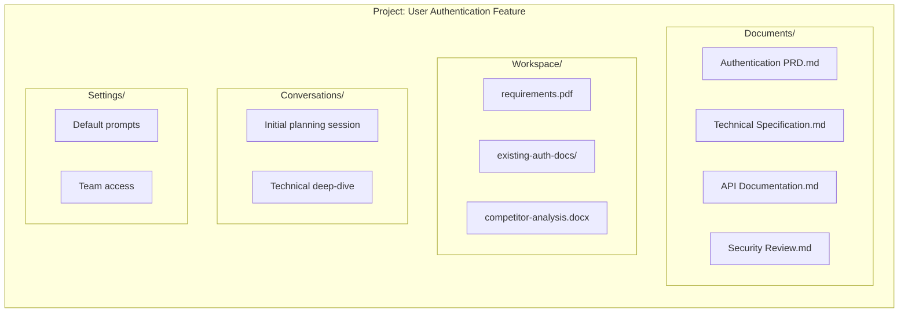

Projects are the primary way to organize your work in Fabric AI. They bring together documents, workspaces, agents, and team collaboration in one place.

## What is a Project?

A project is a container for related work:

- **Documents** — PRDs, specs, architecture docs generated by agents
- **Workspaces** — Uploaded files that provide context for AI agents
- **Conversations** — Chat history with agents about this project
- **Settings** — Project-specific configuration and templates

## Creating a Project

<Steps>
  <Step>
    ### Navigate to Projects

    Click **Projects** in the left sidebar.
  </Step>

  <Step>
    ### Create New Project

    Click **Create Project** and provide:

    - **Name** — Descriptive project name
    - **Description** — Brief summary of the project
    - **Template** (optional) — Start from a template
  </Step>

  <Step>
    ### Configure Settings

    Set project preferences:

    - **Default Document Type** — PRD, Spec, etc.
    - **Default Agent** — Which agent to use
    - **Visibility** — Personal or shared with organization
  </Step>

  <Step>
    ### Start Working

    Your project is ready! You can:
    - Upload documents to the workspace
    - Start a conversation with an agent
    - Generate your first document
  </Step>
</Steps>

## Project Structure



## Working with Documents

### Generating Documents

<Steps>
  <Step>
    ### Open Project

    Click on your project to open it.
  </Step>

  <Step>
    ### Start Agent Chat

    Click **New Document** or **Chat** to start a conversation with an agent.
  </Step>

  <Step>
    ### Describe What You Need

    Tell the agent what document you want:

    ```
    Create a PRD for implementing OAuth 2.0 authentication.
    Include user flows, API requirements, and security considerations.
    ```
  </Step>

  <Step>
    ### Review and Edit

    The agent generates a draft. You can:

    - **Edit directly** in the rich text editor
    - **Request changes** by chatting with the agent
    - **Accept/Reject** suggested modifications
  </Step>

  <Step>
    ### Save Document

    Click **Save** to add the document to your project.
  </Step>
</Steps>

### Document Types

Fabric supports various document types:

| Type | Description | Template Features |
|------|-------------|-------------------|
| PRD | Product Requirements Document | Goals, features, success metrics |
| Technical Spec | Technical implementation details | Architecture, APIs, data models |
| Architecture | System architecture documentation | Diagrams, components, flows |
| User Story | Agile user stories | As a/I want/So that format |
| API Spec | API documentation | Endpoints, schemas, examples |
| Proposal | Project proposals | Problem, solution, timeline |

### Document Editor

The built-in editor provides:

- **Rich formatting** — Headings, lists, code blocks
- **Markdown support** — Write in Markdown, render beautifully
- **AI assistance** — Inline AI suggestions and rewrites
- **Diff highlighting** — See changes clearly
- **Version history** — Track all changes
- **Export** — PDF, DOCX, Markdown

## Project Workspaces

Each project has a dedicated workspace for RAG context.

### Uploading Documents

Drag and drop files or click to upload:

- **Supported formats** — PDF, DOCX, MD, TXT, code files
- **Size limits** — Up to 50MB per file
- **Bulk upload** — Multiple files at once

### Using Context

When you chat with an agent in a project, it automatically has access to:

1. All documents in the project workspace
2. Previously generated documents in the project
3. Any explicitly attached workspaces

This means the agent understands your project context and can:
- Reference your existing documentation
- Maintain consistency across documents
- Build on previous work

### Managing Workspace

- **Add files** — Upload new documents anytime
- **Remove files** — Delete outdated documents
- **Organize** — Create folders for organization
- **Search** — Find specific documents quickly

## Team Collaboration

### Sharing Projects

Share projects with your organization:

1. Open project settings
2. Click **Sharing**
3. Choose visibility:
   - **Private** — Only you
   - **Organization** — All org members
   - **Specific members** — Selected individuals

### Member Roles

| Role | Permissions |
|------|-------------|
| Owner | Full control, can delete project |
| Editor | Can create and edit documents |
| Viewer | Can view documents only |

### Activity Feed

Track project activity:

- Document created by [User]
- Document edited by [User]
- Workspace document added
- Conversation started

## Project Templates

### Using Templates

Start from a template for faster setup:

1. Click **Create Project**
2. Select **Use Template**
3. Choose from available templates
4. Customize for your needs

### Available Templates

- **Feature Development** — PRD, spec, stories
- **API Project** — API spec, documentation
- **Research Project** — Analysis, findings, recommendations
- **Sprint Planning** — Stories, tasks, estimates

### Creating Templates

Create templates from existing projects:

1. Open a project
2. Click **Settings → Save as Template**
3. Choose what to include:
   - Document structure
   - Default prompts
   - Workspace organization
4. Save the template

## Project Settings

### General Settings

- **Name and description** — Update project details
- **Default agent** — Which agent to use by default
- **Default document type** — Starting document type

### Prompt Settings

Configure project-specific prompts:

- **Override organization prompts** — Use custom prompts
- **Variable defaults** — Pre-fill template variables
- **Output preferences** — Format, length, style

### Integration Settings

Connect external tools:

- **Jira** — Sync stories and tasks
- **GitHub** — Link to repository
- **Slack** — Send notifications

## Best Practices

### Project Organization

**One project per feature/initiative:**
```
✅ "User Authentication v2"
✅ "Q1 Mobile App Redesign"
✅ "API Rate Limiting Implementation"

❌ "All my PRDs"
❌ "Random documents"
```

**Clear naming:**
```
✅ "[Team] Feature Name - Phase"
   "[Platform] API Gateway - Phase 1"
   "[Mobile] Push Notifications - MVP"

❌ "New project"
❌ "test"
```

### Document Management

- Generate related documents in the same project
- Upload reference materials to workspace
- Keep workspace clean—remove outdated files
- Use consistent naming for documents

### Collaboration

- Set appropriate sharing levels
- Add descriptions for team understanding
- Use activity feed to track changes
- Archive completed projects

---

## Next Steps

<Cards>
  <Card title="Document Generation" href="/docs/tutorials/first-document">
    Create your first project document
  </Card>
  <Card title="Prompt Library" href="/docs/features/prompts">
    Configure project-specific prompts
  </Card>
</Cards>
