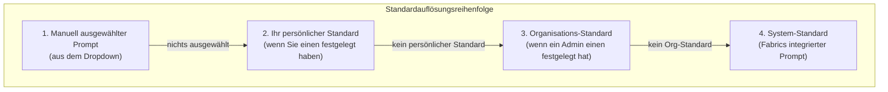

Die Prompt-Bibliothek ist eine leistungsstarke Funktion, mit der Sie Prompts für KI-Agenten erstellen, verwalten und versionieren können. Sie sorgt für Konsistenz in Ihrer Organisation und ermöglicht es Ihnen, Prompts im Laufe der Zeit zu optimieren.

## Warum eine Prompt-Bibliothek nutzen?

### Ohne eine Bibliothek

- Jedes Teammitglied schreibt Prompts unterschiedlich
- Keine Möglichkeit, effektive Prompts zu teilen
- Kein Verfolgen, was funktioniert hat und was nicht
- Prompts gehen im Chat-Verlauf verloren

### Mit Fabrics Prompt-Bibliothek

- **Konsistenz** — Alle verwenden die gleichen optimierten Prompts
- **Versionierung** — Änderungen verfolgen und bei Bedarf zurückrollen
- **Teilen** — Effektive Prompts teamübergreifend teilen
- **Analyse** — Sehen, welche Prompts am besten abschneiden
- **Vorlagen** — Variablen für dynamische Inhalte verwenden

## Prompt-Typen

### System-Prompts (Nur lesbar)

Von der Plattform bereitgestellte Prompts, die für spezifische Aufgaben optimiert sind:

- **PRD-Generator** — Erstellt Produktanforderungsdokumente
- **Technische Spezifikation** — Generiert technische Spezifikationen
- **Architekturdokument** — Entwirft Systemarchitekturdokumente
- **User Story** — Erstellt User Stories mit Akzeptanzkriterien
- **API-Dokumentation** — Dokumentiert API-Endpunkte

Diese Prompts sind:
- Von Fabric getestet und optimiert
- Nicht direkt bearbeitbar
- Können geforkt werden, um benutzerdefinierte Versionen zu erstellen

### Benutzer-Prompts (Bearbeitbar)

Benutzerdefinierte Prompts, die von Ihnen oder Ihrer Organisation erstellt wurden:

- Vollständige Bearbeitungskontrolle
- Versionsverlauf
- Organisationsweiter oder persönlicher Bereich
- Können auf System-Prompts basieren

## Prompts erstellen

<Steps>
  <Step>
    ### Zur Prompt-Bibliothek navigieren

    Klicken Sie in der Seitenleiste auf **Einstellungen → Prompt-Bibliothek**.
  </Step>

  <Step>
    ### Neuen Prompt erstellen

    Klicken Sie auf **Prompt erstellen** und füllen Sie aus:
    
    - **Name** — Beschreibender Name (z. B. „Engineering PRD-Vorlage")
    - **Beschreibung** — Wofür der Prompt ist
    - **Inhalt** — Der eigentliche Prompt-Text
  </Step>

  <Step>
    ### Vorlagen-Variablen hinzufügen

    Handlebars-Syntax für dynamische Inhalte verwenden:
    
    ```handlebars
    Sie schreiben ein PRD für {{projektName}}.
    
    Die Zielgruppe ist {{zielgruppe}}.
    
    Anforderungen:
    {{#each anforderungen}}
    - {{this}}
    {{/each}}
    
    {{#if zeitplanEinbeziehen}}
    Fügen Sie einen Zeitplanabschnitt mit Meilensteinen ein.
    {{/if}}
    ```
  </Step>

  <Step>
    ### Bereich festlegen

    Wählen Sie die Sichtbarkeit dieses Prompts:

    - **Persönlich** — Nur für Sie sichtbar, in Ihrem persönlichen Arbeitsbereich
    - **Organisation** — Sichtbar für alle Mitglieder Ihrer Organisation
    - **System** — Plattformweit, von Fabric verwaltet (schreibgeschützt)

    Siehe [Prompt-Bereiche](#prompt-bereiche) weiter unten für Details zur Auswirkung auf Sichtbarkeit und Standards.
  </Step>

  <Step>
    ### Speichern

    Klicken Sie auf **Speichern**, um den Prompt zu erstellen. Er ist jetzt zur Verwendung verfügbar.
  </Step>
</Steps>

## Vorlagen-Variablen

Vorlagen-Variablen machen Prompts dynamisch und wiederverwendbar.

### Syntax

```handlebars
{{variablenName}}           — Einfache Variable
{{#if bedingung}}...{{/if}} — Bedingungsblock
{{#each elemente}}...{{/each}} — Über Array iterieren
{{#unless bedingung}}...{{/unless}} — Negierte Bedingung
```

### Integrierte Variablen

Fabric stellt diese Variablen automatisch bereit:

| Variable | Beschreibung |
|----------|-------------|
| `{{projektName}}` | Aktueller Projektname |
| `{{projektBeschreibung}}` | Projektbeschreibung |
| `{{organisationsName}}` | Organisationsname |
| `{{benutzerName}}` | Name des aktuellen Benutzers |
| `{{aktuelesDatum}}` | Das heutige Datum |
| `{{dokumentTyp}}` | Typ des generierten Dokuments |

### Benutzerdefinierte Variablen

Definieren Sie eigene Variablen bei der Verwendung von Prompts:

```handlebars
Erstellen Sie ein {{dokumentTyp}} für {{featureName}}.

Zielbenutzer: {{zielBenutzer}}
Priorität: {{priorität}}
```

Bei der Verwendung dieses Prompts werden Sie aufgefordert, Werte für jede Variable anzugeben.

## Prompt-Bereiche

Jeder Prompt gehört zu einem von drei Bereichen, die steuern, wer ihn sehen und verwenden kann.

### System

System-Prompts werden von Fabric bereitgestellt und sind für alle Benutzer verfügbar. Sie dienen als Plattform-Standards für jeden Dokumenttyp. System-Prompts können nicht bearbeitet werden, aber Sie können einen **forken**, um Ihre eigene angepasste Version zu erstellen.

### Organisation

Organisations-Prompts sind für jedes Mitglied dieser Organisation sichtbar. Wenn Sie in einem Organisations-Arbeitsbereich arbeiten, sehen Sie System-Prompts und die Prompts Ihrer Organisation. Persönliche Prompts aus Ihrem eigenen Arbeitsbereich sind in diesem Kontext nicht sichtbar.

### Persönlich

Persönliche Prompts sind privat und erscheinen nur in Ihrem persönlichen Arbeitsbereich. Wenn Sie zu einem Organisations-Arbeitsbereich wechseln, sind Ihre persönlichen Prompts dort nicht sichtbar, und die Organisations-Prompts sind in Ihrem persönlichen Arbeitsbereich nicht sichtbar.

### Sichtbarkeit nach Kontext

| Wo Sie sich befinden | Was Sie sehen |
|---------------------|--------------|
| Persönlicher Arbeitsbereich (`/app/prompts`) | System + Ihre persönlichen Prompts |
| Organisations-Arbeitsbereich (`/app/acme/prompts`) | System + Prompts dieser Organisation |

Persönliche und Organisations-Prompts werden vollständig getrennt gehalten. Ein Prompt, der in einer Organisation erstellt wurde, ist niemals in einer anderen Organisation sichtbar, selbst wenn Sie beiden angehören.

<Callout>
Der Prompt-Bereich steuert, **welche Prompts in der Liste erscheinen**. Er beeinflusst nicht, welcher Standard beim Generieren eines Dokuments verwendet wird — das wird durch den **Bindungsbereich** gesteuert, der im nächsten Abschnitt beschrieben wird. Sie können beispielsweise in einem Organisations-Arbeitsbereich einen System-Prompt in der Liste sehen und dafür einen persönlichen Standard festlegen. Dieser persönliche Standard hat für Sie höchste Priorität, obwohl Ihre persönlichen *Prompts* in der Organisationsliste nicht sichtbar sind.
</Callout>

## Prompt-Bindungen und Standards

Eine **Bindung** verbindet einen Prompt mit einem bestimmten Agenten und Dokumenttyp und macht ihn in der Prompt-Auswahl verfügbar, wenn dieser Dokumenttyp generiert wird. Sie können eine Bindung auch als **Standard** markieren, sodass sie automatisch ausgewählt wird.

### Einen Standard festlegen

Sie können einen Prompt an zwei Stellen als Standard festlegen:

- **Prompts-Seite** — Verwenden Sie die Dokumenttyp-Tabs zum Filtern nach Typ und wählen Sie dann **Als Standard festlegen** aus dem Menü des Prompts.
- **Dokumenten-Editor** — Wählen Sie beim Generieren eines Dokuments einen Prompt aus dem Dropdown und klicken Sie auf **Als Standard binden**.

Beim Festlegen eines Standards wählen Sie einen **Bindungsbereich**:

- **Persönlich** — Dieser Standard gilt nur für Sie.
- **Organisation** — Dieser Standard gilt für jedes Mitglied der Organisation.

### Wie Standards aufgelöst werden

Wenn Sie ein Dokument generieren, sucht Fabric nach dem besten Prompt, indem es jede Ebene der Reihe nach prüft und beim ersten Treffer stoppt:



Das bedeutet:
- Ein persönlicher Standard hat immer Vorrang vor dem Organisations- und System-Standard.
- Ein Organisations-Standard hat Vorrang vor dem System-Standard für alle Mitglieder, die keinen eigenen persönlichen Standard festgelegt haben.
- Der System-Standard ist der endgültige Fallback.

### Beispiel: Team mit unterschiedlichen Standards

Angenommen, Ihre Organisation hat drei Teammitglieder, die PRDs generieren:

| Teammitglied | Persönlicher Standard gesetzt? | Verwendeter Prompt |
|-------------|-------------------------------|-------------------|
| Alice | Ja — ihr eigener Prompt | Alices persönlicher Standard |
| Bob | Nein | Organisations-Standard |
| Carol | Nein | Organisations-Standard |

Alices persönlicher Standard beeinflusst Bob oder Carol nicht. Wenn der Organisations-Admin später den Organisations-Standard aktualisiert, sehen Bob und Carol die Änderung sofort, während Alice weiterhin ihren eigenen verwendet.

<Callout>
Wenn Sie einen neuen Organisations-Standard festlegen, wird Ihr eigener persönlicher Standard für diesen Dokumenttyp automatisch entfernt, damit der neue Organisations-Standard sofort für Sie wirksam wird.
</Callout>

## Versionierung

Jeder Prompt führt einen Versionsverlauf.

### Automatische Versionierung

Wenn Sie einen Prompt bearbeiten:
1. Eine neue Version wird automatisch erstellt
2. Frühere Versionen bleiben erhalten
3. Sie können den Unterschied zwischen Versionen ansehen
4. Zurückrollen ist jederzeit möglich

### Versionsverlauf

```
v3 (aktuell) — Zeitplanabschnitt hinzugefügt
v2           — Formatierung verbessert
v1           — Erste Version
```

### Zurückrollen

Um auf eine frühere Version zurückzurollen:

1. Den Prompt öffnen
2. Auf **Versionsverlauf** klicken
3. Die wiederherzustellende Version auswählen
4. Auf **Diese Version wiederherstellen** klicken

Eine neue Version wird erstellt (Zurückrollen löscht keinen Verlauf).

## Organisations-Prompts

### Einen Prompt mit Ihrem Team teilen

Um einen Prompt für Ihre gesamte Organisation verfügbar zu machen:

1. Einen Prompt erstellen oder bearbeiten
2. Den Bereich auf **Organisation** setzen
3. Den Prompt speichern

Alle Organisationsmitglieder können den Prompt jetzt ansehen, verwenden und forken, um eigene Versionen zu erstellen.

### Organisationsweite Standards festlegen

Organisations-Admins können einen Prompt als Standard für einen Dokumenttyp in der gesamten Organisation festlegen:

1. Öffnen Sie den Prompt in der Prompt-Bibliothek
2. Wählen Sie **Als Standard festlegen** aus dem Menü
3. Wählen Sie den Dokumenttyp und Agenten
4. Setzen Sie den Bindungsbereich auf **Organisation**

Mitglieder, die keinen eigenen persönlichen Standard festgelegt haben, verwenden diesen Prompt automatisch beim Generieren dieses Dokumenttyps.

## Best Practices

### Effektive Prompts schreiben

**Spezifisch sein**
```
❌ "Schreibe ein Dokument über das Feature"
✅ "Schreibe ein PRD für {{featureName}}, das Folgendes enthält:
    - Problembeschreibung
    - Vorgeschlagene Lösung
    - User Stories
    - Erfolgsmetriken"
```

**Kontext verwenden**
```
❌ "User Stories erstellen"
✅ "Basierend auf dem PRD für {{projektName}}, User Stories erstellen,
    die folgendem Format folgen:
    Als [Benutzertyp] möchte ich [Ziel], damit [Nutzen]"
```

**Beispiele einbeziehen**
```
"Die Ausgabe wie folgt formatieren:

## User Story 1
**Als** Kunde
**Möchte ich** mein Passwort zurücksetzen
**Damit** ich wieder Zugang zu meinem Konto erhalte

### Akzeptanzkriterien
- [ ] Benutzer erhält Reset-E-Mail innerhalb von 1 Minute
- [ ] Reset-Link läuft nach 24 Stunden ab"
```

### Prompt-Organisation

**Benennungskonvention**
```
[Typ] - [Zweck] - [Version/Variante]

Beispiele:
"PRD - Feature-Anfrage - Technisch"
"Story - Bug-Fix-Vorlage"
"Spezifikation - API-Dokumentation - REST"
```

**Kategorien**
- Dokumentengenerierungs-Prompts
- Code-Review-Prompts
- Analyse-Prompts
- Kommunikations-Prompts

### Prompts testen

Bevor ein Prompt organisationsweit wird:

1. Mit verschiedenen Eingaben testen
2. Ausgabequalität überprüfen
3. Variablenbehandlung überprüfen
4. Feedback von Teammitgliedern einholen
5. Basierend auf Ergebnissen iterieren

## Analyse

Prompt-Leistung verfolgen:

| Kennzahl | Beschreibung |
|--------|-------------|
| Nutzungsanzahl | Wie oft verwendet |
| Zufriedenheitsrate | Benutzerbewertungen |
| Bearbeitungsrate | Wie oft die Ausgabe bearbeitet wird |
| Zeit bis zur Fertigstellung | Generierungsgeschwindigkeit |

Zugriff auf Analysen unter **Einstellungen → Prompt-Bibliothek → Analyse**.

---

## Nächste Schritte

<Cards>
  <Card title="Agenten" href="/docs/agents/overview">
    Erfahren Sie mehr über die Agenten, die Prompts verwenden
  </Card>
  <Card title="Dokumentengenerierung" href="/docs/tutorials/first-document">
    Ihr erstes Dokument mit benutzerdefinierten Prompts generieren
  </Card>
</Cards>
