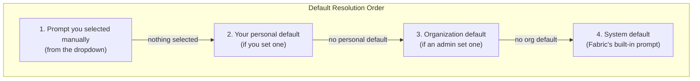

The Prompt Library is a powerful feature that lets you create, manage, and version prompts for AI agents. It ensures consistency across your organization and allows you to optimize prompts over time.

## Why Use a Prompt Library?

### Without a Library

- Each team member writes prompts differently
- No way to share effective prompts
- Can't track what worked and what didn't
- Prompts get lost in chat history

### With Fabric's Prompt Library

- **Consistency** — Everyone uses the same optimized prompts
- **Versioning** — Track changes and rollback if needed
- **Sharing** — Share effective prompts across teams
- **Analytics** — See which prompts perform best
- **Templates** — Use variables for dynamic content

## Prompt Types

### System Prompts (Read-Only)

Platform-provided prompts optimized for specific tasks:

- **PRD Generator** — Creates Product Requirement Documents
- **Technical Spec** — Generates technical specifications
- **Architecture Doc** — Designs system architecture documents
- **User Story** — Creates user stories with acceptance criteria
- **API Documentation** — Documents API endpoints

These prompts are:
- Tested and optimized by Fabric
- Can't be edited directly
- Can be forked to create custom versions

### User Prompts (Editable)

Custom prompts created by you or your organization:

- Full editing control
- Version history
- Organization-wide or personal scope
- Can be based on system prompts

## Creating Prompts

<Steps>
  <Step>
    ### Navigate to Prompt Library

    Click **Settings → Prompt Library** in the sidebar.
  </Step>

  <Step>
    ### Create New Prompt

    Click **Create Prompt** and fill in:
    
    - **Name** — Descriptive name (e.g., "Engineering PRD Template")
    - **Description** — What the prompt is for
    - **Content** — The actual prompt text
  </Step>

  <Step>
    ### Add Template Variables

    Use Handlebars syntax for dynamic content:
    
    ```handlebars
    You are writing a PRD for {{projectName}}.
    
    The target audience is {{audience}}.
    
    Requirements:
    {{#each requirements}}
    - {{this}}
    {{/each}}
    
    {{#if includeTimeline}}
    Include a timeline section with milestones.
    {{/if}}
    ```
  </Step>

  <Step>
    ### Set Scope

    Choose the visibility of this prompt:

    - **Personal** — Only visible to you, in your personal workspace
    - **Organization** — Visible to all members of your organization
    - **System** — Platform-wide, managed by Fabric (read-only)

    See [Prompt Scopes](#prompt-scopes) below for details on how scopes affect visibility and defaults.
  </Step>

  <Step>
    ### Save

    Click **Save** to create the prompt. It's now available for use.
  </Step>
</Steps>

## Template Variables

Template variables make prompts dynamic and reusable.

### Syntax

```handlebars
{{variableName}}           — Simple variable
{{#if condition}}...{{/if}} — Conditional block
{{#each items}}...{{/each}} — Loop over array
{{#unless condition}}...{{/unless}} — Negative conditional
```

### Built-in Variables

Fabric automatically provides these variables:

| Variable | Description |
|----------|-------------|
| `{{projectName}}` | Current project name |
| `{{projectDescription}}` | Project description |
| `{{organizationName}}` | Organization name |
| `{{userName}}` | Current user's name |
| `{{currentDate}}` | Today's date |
| `{{documentType}}` | Type of document being generated |

### Custom Variables

Define your own variables when using prompts:

```handlebars
Create a {{documentType}} for {{featureName}}.

Target users: {{targetUsers}}
Priority: {{priority}}
```

When using this prompt, you'll be asked to provide values for each variable.

## Prompt Scopes

Every prompt belongs to one of three scopes that control who can see and use it.

### System

System prompts are provided by Fabric and available to all users. They serve as the platform defaults for each document type. System prompts cannot be edited, but you can **fork** one to create your own customized version.

### Organization

Organization prompts are visible to every member of that organization. When you're working inside an organization workspace, you see System prompts and your organization's prompts. Personal prompts from your own workspace are not visible in this context.

### Personal

Personal prompts are private to you and only appear in your personal workspace. When you switch to an organization workspace, your personal prompts are not visible there, and the organization's prompts are not visible in your personal workspace.

### Visibility by context

| Where you are | What you see |
|---------------|-------------|
| Personal workspace (`/app/prompts`) | System + your Personal prompts |
| Organization workspace (`/app/acme/prompts`) | System + that organization's prompts |

Personal and organization prompts are kept completely separate. A prompt created in one organization is never visible in another organization, even if you belong to both.

<Callout>
Prompt scope controls **which prompts appear in the list**. It does not affect which default is used when generating a document — that is controlled by **binding scope**, described in the next section. For example, you can be in an organization workspace, see a System prompt in the list, and set a Personal default for it. That personal default takes highest precedence for you, even though your personal *prompts* are not visible in the organization list.
</Callout>

## Prompt Bindings and Defaults

A **binding** connects a prompt to a specific agent and document type, making it available in the prompt selector when generating that type of document. You can also mark a binding as the **default**, so it is automatically selected.

### Setting a default

You can set a prompt as the default from two places:

- **Prompts page** — Use the document type tabs to filter by type, then select **Set as Default** from the prompt's menu.
- **Document editor** — When generating a document, pick a prompt from the dropdown and click **Bind as Default**.

When setting a default, you choose a **binding scope**:

- **Personal** — This default applies only to you.
- **Organization** — This default applies to every member of the organization.

### How defaults are resolved

When you generate a document, Fabric looks for the best prompt to use by checking each level in order and stopping at the first match:



This means:
- A personal default always takes priority over the organization and system defaults.
- An organization default takes priority over the system default for all members who haven't set their own personal default.
- The system default is the final fallback.

### Example: team with mixed defaults

Suppose your organization has three team members generating PRDs:

| Team member | Personal default set? | Prompt used |
|-------------|----------------------|-------------|
| Alice | Yes — her custom prompt | Alice's personal default |
| Bob | No | Organization default |
| Carol | No | Organization default |

Alice's personal default does not affect Bob or Carol. If the organization admin later updates the organization default, Bob and Carol see the change immediately, while Alice continues using her own.

<Callout>
When you set a new organization default, your own personal default for that document type is cleared automatically so the new organization default takes effect for you right away.
</Callout>

## Versioning

Every prompt maintains a version history.

### Automatic Versioning

When you edit a prompt:
1. A new version is created automatically
2. Previous versions are preserved
3. You can view the diff between versions
4. Rollback is available anytime

### Version History

```
v3 (current) — Added timeline section
v2           — Improved formatting
v1           — Initial version
```

### Rollback

To rollback to a previous version:

1. Open the prompt
2. Click **Version History**
3. Select the version to restore
4. Click **Restore This Version**

A new version is created (rollbacks don't delete history).

## Organization Prompts

### Sharing a prompt with your team

To make a prompt available to your entire organization:

1. Create or edit a prompt
2. Set the scope to **Organization**
3. Save the prompt

All organization members can now view, use, and fork the prompt to create their own versions.

### Setting organization-wide defaults

Organization admins can set a prompt as the default for a document type across the entire organization:

1. Open the prompt in the Prompt Library
2. Select **Set as Default** from the menu
3. Choose the document type and agent
4. Set the binding scope to **Organization**

Members who haven't set their own personal default will automatically use this prompt when generating that document type.

## Best Practices

### Writing Effective Prompts

**Be Specific**
```
❌ "Write a document about the feature"
✅ "Write a PRD for {{featureName}} that includes:
    - Problem statement
    - Proposed solution
    - User stories
    - Success metrics"
```

**Use Context**
```
❌ "Create user stories"
✅ "Based on the PRD for {{projectName}}, create user stories
    that follow the format:
    As a [user type], I want [goal] so that [benefit]"
```

**Include Examples**
```
"Format the output like this example:

## User Story 1
**As a** customer
**I want** to reset my password
**So that** I can regain access to my account

### Acceptance Criteria
- [ ] User receives reset email within 1 minute
- [ ] Reset link expires after 24 hours"
```

### Prompt Organization

**Naming Convention**
```
[Type] - [Purpose] - [Version/Variant]

Examples:
"PRD - Feature Request - Technical"
"Story - Bug Fix Template"
"Spec - API Documentation - REST"
```

**Categories**
- Document generation prompts
- Code review prompts
- Analysis prompts
- Communication prompts

### Testing Prompts

Before making a prompt organization-wide:

1. Test with various inputs
2. Check output quality
3. Verify variable handling
4. Get feedback from team members
5. Iterate based on results

## Analytics

Track prompt performance:

| Metric | Description |
|--------|-------------|
| Usage count | How many times used |
| Satisfaction rate | User ratings |
| Edit rate | How often output is edited |
| Time to complete | Generation speed |

Access analytics in **Settings → Prompt Library → Analytics**.

---

## Next Steps

<Cards>
  <Card title="Agents" href="/docs/agents/overview">
    Learn about the agents that use prompts
  </Card>
  <Card title="Document Generation" href="/docs/tutorials/first-document">
    Generate your first document with custom prompts
  </Card>
</Cards>
