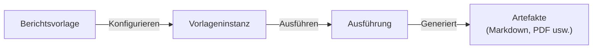

Berichte bieten ein Vorlagen- und Ausführungssystem zur Generierung strukturierter Berichte. Erstellen Sie wiederverwendbare Vorlagen, konfigurieren Sie Instanzen mit spezifischen Parametern und führen Sie sie aus, um Artefakte zu produzieren.

## Wie Berichte funktionieren

1. **Vorlagen** definieren die Berichtsstruktur, Datenquellen und KI-Konfiguration
2. **Instanzen** sind Ihre konfigurierten Kopien einer Vorlage mit spezifischen Parametern
3. **Ausführungen** produzieren Artefakte, die Sie ansehen und herunterladen können

## Berichtstypen

| Typ | Beschreibung |
|------|-------------|
| **Gantt-Diagramm** | Projektzeitplan-Visualisierung |
| **Burndown** | Sprint-Fortschrittsverfolgung |
| **Sprint-Abschluss** | Sprint-Zusammenfassung und Metriken |
| **Feature-Zusammenfassung** | Feature-Status und Details |
| **Monatsbericht** | Monatliche Aktivitätszusammenfassung |
| **Quartalsbericht** | Vierteljährliche Geschäftsüberprüfung |
| **Integrationsaktivität** | Aktivitätsbericht für externe Tools |
| **Benutzerdefiniert** | Benutzerdefiniertes Berichtsformat |

## Berichtskategorien

Vorlagen nach Kategorie durchsuchen:

- **Video & Audio** — Medienanalyseberichte
- **Inhaltsanalyse** — Inhaltsleistung und Erkenntnisse
- **Entwicklung** — Code-Qualität, Sprint-Metriken
- **Kommunikation** — Team-Kommunikationsanalyse
- **Business** — Geschäftsmetriken und KPIs

## Einen Bericht erstellen

<Steps>
  <Step>
    ### Vorlagen durchsuchen

    Navigieren Sie in der Seitenleiste zu **Berichtsvorlagen**. Verfügbare Vorlagen in der Galerie durchsuchen.
  </Step>

  <Step>
    ### Eine Instanz erstellen

    Auf eine Vorlage klicken und dann auf **Instanz erstellen**. Konfigurieren:

    - **Name** — Beschreibender Name für diese Berichtsinstanz
    - **Parameter** — Vorlagenspezifische Parameter ausfüllen
    - **Datenquellen** — Erforderliche Integrationen verbinden
    - **Zeitplan** (optional) — Automatische Generierung einrichten
  </Step>

  <Step>
    ### Ausführen

    Klicken Sie auf **Ausführen**, um den Bericht zu generieren. Die Ausführung läuft als dauerhafter Workflow und überlebt Unterbrechungen.
  </Step>

  <Step>
    ### Artefakte anzeigen

    Nach Abschluss die generierten Berichtsartefakte anzeigen. In Ihrem bevorzugten Format herunterladen.
  </Step>
</Steps>

## Vorlagenkonfiguration

### Datenquellen

Vorlagen können Daten aus verbundenen Integrationen abrufen:

- MCP-Server (Linear, GitHub usw.)
- Workspaces mit hochgeladenen Dokumenten
- Agenten-Ausgaben

### KI-Anreicherung

Vorlagen unterstützen Fabric KI-Anreicherung:

- **Strategie** — Wie KI die Daten verarbeitet (Zusammenfassung, Analyse usw.)
- **Kontext** — Zusätzlicher Kontext für die KI
- **Variablen** — Dynamische Werte, die bei der Ausführung ausgefüllt werden
- **Auto-Erkennung** — Relevante Datenpunkte automatisch identifizieren

### Zeitplanung

Automatische Berichtsgenerierung einrichten:

- **Cron-Ausdruck** — Feinkörnige Zeitplansteuerung
- **Zeitzone** — Generiert in Ihrer Zeitzone
- **Häufigkeitsvoreinstellungen** — Täglich, wöchentlich, monatlich

## Skills anhängen

Skills an Berichtsvorlagen anhängen für erweiterte Fähigkeiten:

1. Detailseite einer Vorlage öffnen
2. Zum Abschnitt **Skills** gehen
3. Relevante Skills aus dem Katalog anhängen
4. Skills bieten zusätzliche Anweisungen für KI-Anreicherung

## Versionsverlauf

Instanzen verfolgen den Ausführungsverlauf:

- Alle vergangenen Ausführungen mit Zeitstempeln anzeigen
- Ergebnisse über Ausführungen hinweg vergleichen
- Alte Instanzen archivieren
- Archivierte Instanzen wiederherstellen

## Benutzerdefinierte Vorlagen erstellen

Eigene Berichtsvorlagen erstellen:

1. Auf **Vorlage erstellen** klicken
2. Die Struktur definieren:
   - **Name und Beschreibung**
   - **Typ und Kategorie**
   - **Ausgabeformat** (standardmäßig Markdown)
   - **Definition** — Datenquellen, KI-Agenten, Abschnitte, Layout
   - **Parameter-Schema** — Konfigurierbare Felder für Instanzen
   - **Erforderliche Verbindungen** — Welche Integrationen benötigt werden
3. Bereich festlegen (Organisation oder Persönlich)
4. Vorlage veröffentlichen

## Vorlagenbereiche

| Bereich | Sichtbarkeit | Bearbeitbar von |
|-------|------------|-------------|
| **System** | Für alle | Nur lesbar (integriert) |
| **Organisation** | Org-Mitglieder | Org-Eigentümer und Admins |
| **Benutzer** | Nur Sie | Nur Sie |

---

## Nächste Schritte

<Cards>
  <Card title="Integrationen" href="/docs/tutorials/setup-integrations">
    Externe Dienste für Berichtsdaten verbinden
  </Card>
  <Card title="Skills" href="/docs/features/skills">
    Berichte mit wiederverwendbaren Skills verbessern
  </Card>
</Cards>
