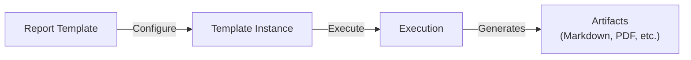

Reports provide a templating and execution system for generating structured reports. Create reusable templates, configure instances with specific parameters, and execute them to produce artifacts.

## How Reports Work

1. **Templates** define the report structure, data sources, and AI configuration
2. **Instances** are your configured copies of a template with specific parameters
3. **Executions** produce artifacts that you can view and download

## Report Types

| Type | Description |
|------|-------------|
| **Gantt Chart** | Project timeline visualization |
| **Burndown** | Sprint progress tracking |
| **Sprint Completion** | Sprint summary and metrics |
| **Feature Summary** | Feature status and details |
| **Monthly Report** | Monthly activity summary |
| **Quarterly Report** | Quarterly business review |
| **Integration Activity** | External tool activity report |
| **Custom** | User-defined report format |

## Report Categories

Browse templates by category:

- **Video & Audio** — Media analysis reports
- **Content Analysis** — Content performance and insights
- **Development** — Code quality, sprint metrics
- **Communication** — Team communication analysis
- **Business** — Business metrics and KPIs

## Creating a Report

<Steps>
  <Step>
    ### Browse Templates

    Navigate to **Report Templates** in the sidebar. Browse available templates in the gallery.
  </Step>

  <Step>
    ### Create an Instance

    Click on a template and then **Create Instance**. Configure:

    - **Name** — Descriptive name for this report instance
    - **Parameters** — Fill in template-specific parameters
    - **Data sources** — Connect required integrations
    - **Schedule** (optional) — Set up automatic generation
  </Step>

  <Step>
    ### Execute

    Click **Run** to generate the report. Execution runs as a durable workflow, so it survives interruptions.
  </Step>

  <Step>
    ### View Artifacts

    Once complete, view the generated report artifacts. Download them in your preferred format.
  </Step>
</Steps>

## Template Configuration

### Data Sources

Templates can pull data from connected integrations:

- MCP servers (Linear, GitHub, etc.)
- Workspaces with uploaded documents
- Agent outputs

### AI Enrichment

Templates support Fabric AI enrichment:

- **Strategy** — How AI processes the data (summarization, analysis, etc.)
- **Context** — Additional context for the AI
- **Variables** — Dynamic values filled at execution time
- **Auto-detection** — Automatically identify relevant data points

### Scheduling

Turn on **Auto-generate** in a report template to have reports generated automatically. Instances you create from that template inherit its schedule.

- **Frequency** — daily, weekly, biweekly, monthly, or quarterly
- **Time** — generated around 09:00 in the configured timezone (UTC by default)

Scheduled reports are dispatched within ~15 minutes of their due time. A failed run notifies you in-app (and by email if enabled), the same as a manually generated report.

## Skills Attachment

Attach skills to report templates for enhanced capabilities:

1. Open a template's detail page
2. Go to the **Skills** section
3. Attach relevant skills from the catalog
4. Skills provide additional instructions for AI enrichment

## Version History

Instances track execution history:

- View all past executions with timestamps
- Compare results across runs
- Archive old instances
- Restore archived instances

## Creating Custom Templates

Build your own report templates:

1. Click **Create Template**
2. Define the structure:
   - **Name and description**
   - **Type and category**
   - **Output format** (Markdown by default)
   - **Definition** — Data sources, AI agents, sections, layout
   - **Parameters schema** — Configurable fields for instances
   - **Required connections** — Which integrations are needed
3. Set the scope (Organization or Personal)
4. Publish the template

## Template Scopes

| Scope | Visibility | Editable By |
|-------|------------|-------------|
| **System** | Everyone | Read-only (built-in) |
| **Organization** | Org members | Org owners and admins |
| **User** | Only you | Only you |

---

## Next Steps

<Cards>
  <Card title="Integrations" href="/docs/tutorials/setup-integrations">
    Connect external services for report data
  </Card>
  <Card title="Skills" href="/docs/features/skills">
    Enhance reports with reusable skills
  </Card>
</Cards>
