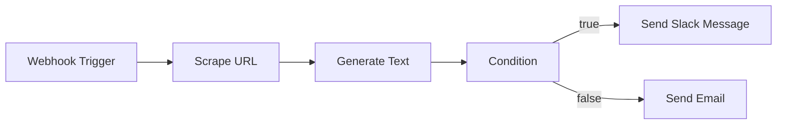

Der Workflow-Builder ist ein visueller Canvas für Automatisierungen. Sie platzieren
Knoten, verbinden sie, veröffentlichen — und Fabric führt den Graphen dauerhaft aus:
Eingabe, Ausgabe und Dauer jedes Knotens werden protokolliert, fehlgeschlagene Schritte
werden wiederholt, und ein Lauf übersteht einen Neustart des ausführenden Dienstes.

Die Knotennamen im Canvas sind englisch, so wie sie in der Oberfläche erscheinen. Diese
Seite verwendet sie unverändert, damit Referenzen wie `{{Generate Text.text}}` genau so
funktionieren, wie sie hier stehen.

## Was ein Workflow ist

Ein Workflow ist ein gerichteter Graph. Ein **Trigger**-Knoten bestimmt, wann der Graph
läuft; jeder andere Knoten ist ein Schritt, der die Ausgabe der vorherigen Knoten
verarbeitet.



## Einen Workflow bauen

<Steps>
  <Step>
    ### Anlegen

    **Workflows** in der Seitenleiste, dann **New Workflow**. Der Workflow wird sofort als
    `Untitled Workflow` angelegt und öffnet sich auf einem leeren Canvas; umbenennen
    können Sie ihn in der Kopfzeile. Ein Workflow gehört Ihnen, innerhalb des Kontos oder
    der Organisation, in der Sie ihn angelegt haben.
  </Step>

  <Step>
    ### Leerer Canvas oder Prompt

    Beschreiben Sie, was Sie brauchen, und lassen Sie die KI den Graphen entwerfen — oder
    ziehen Sie die Knoten selbst. Beides landet im selben Editor.

    ```
    Suche die neuesten KI-Nachrichten, fasse die Ergebnisse zusammen
    und sende eine Slack-Nachricht an #technology mit der Zusammenfassung.
    ```
  </Step>

  <Step>
    ### Trigger hinzufügen

    Jeder Workflow beginnt mit einem. Siehe [Trigger](#trigger) für die einzelnen Arten.
  </Step>

  <Step>
    ### Aktionsknoten hinzufügen und verbinden

    **Add a Step** auf dem leeren Canvas und danach **+** in der Werkzeugleiste öffnen den
    Tab **Actions**; die Wahl einer Aktion füllt den neuen Knoten. Das Hinzufügen
    verbindet ihn nicht — ziehen Sie dafür zwischen den Anschlusspunkten zweier Knoten,
    denn ein Knoten, in den nichts hineinführt, läuft nie.

    Ein Knoten läuft, sobald jeder direkt eingehende Knoten sein Ergebnis geliefert hat,
    und Knoten, die gleichzeitig bereit sind, laufen gleichzeitig. Die Ausnahme ist
    **Condition**: Dieser Knoten schickt den Lauf über genau eine seiner beiden Kanten,
    nie über beide.
  </Step>

  <Step>
    ### Knoten konfigurieren

    Ein Klick auf einen Knoten öffnet sein Panel. Die Felder unterscheiden sich je Knoten
    — **Generate Text** erwartet einen Prompt und ein Modell, **Send Slack Message** einen
    Kanal und eine Nachricht. Jedes Textfeld akzeptiert Referenzen auf frühere Knoten.
  </Step>

  <Step>
    ### Aus dem Editor ausführen

    **Run** führt den Graphen sofort aus, einschließlich ungespeicherter Änderungen, und
    zeigt pro Knoten Status, Eingabe, Ausgabe und Dauer im Ausführungspanel. Das
    funktioniert auch im Entwurf — zum Testen ist keine Veröffentlichung nötig.
  </Step>

  <Step>
    ### Veröffentlichen

    Das Veröffentlichen legt den Graphen als nummerierte Version ab und öffnet die
    externen Trigger: Der Webhook nimmt Anfragen an, der Zeitplan beginnt zu feuern.
  </Step>
</Steps>

## Trigger

Der **Trigger Type** des Trigger-Knotens bestimmt, wie Läufe starten.

| Trigger | Startet einen Lauf, wenn | Veröffentlichung nötig |
|---|---|---|
| **Manual** | Sie im Editor auf **Run** klicken | Nein |
| **Webhook** | Ein authentifizierter `POST` an der Trigger-URL eintrifft | Ja, mit gesetztem **Enable Webhook Trigger** |
| **Schedule** | Der Cron-Ausdruck des Trigger-Knotens fällig wird | Ja |

Erst das Häkchen bei **Enable Webhook Trigger** im Publish-Dialog schaltet den Endpunkt
scharf: Es setzt die Trigger-Art des Workflows auf Webhook und erzeugt das
Signaturgeheimnis. Ein ohne dieses Häkchen veröffentlichter Workflow lehnt Aufrufe mit
`403` ab, so veröffentlicht er auch aussieht. Ein Trigger-Knoten mit der Art **Schedule** macht den
Workflow beim Veröffentlichen zeitgesteuert; aktivieren Sie zusätzlich den Webhook, hat
dieser als Trigger-Art Vorrang.

Der Zeitplan wird aus dem Feld **Schedule (cron)** des Trigger-Knotens gelesen, in Form von
fünf oder sechs Feldern — zum Beispiel `0 9 * * 1-5` für 09:00 Uhr von montags bis freitags.
Dieses Feld ist vorbelegt; ob ein Zeitplan entsteht, entscheidet also die **Trigger Type**,
nicht das Vorhandensein eines Cron-Ausdrucks. Fabric registriert ihn beim
Veröffentlichen und entfernt ihn, sobald Sie den Workflow zurückziehen, pausieren oder
archivieren.

## Knoten

### Kernknoten

| Knoten | Funktion |
|---|---|
| **Trigger** | Beginn des Graphen; trägt Trigger-Art und Cron-Ausdruck |
| **HTTP Request** | Beliebige URL mit `GET`, `POST`, `PUT`, `PATCH` oder `DELETE` aufrufen, mit eigenen Headern und Body |
| **Condition** | Einen Ausdruck auswerten und über die `true`- oder die `false`-Kante weiterlaufen |

### Integrationsaktionen

Die Palette umfasst **55 Integrationsaktionen** zusätzlich zu den drei Kernknoten. Eine
Aktion erscheint nur, wenn Fabric einen Executor dafür mitbringt — die Palette bietet also
keinen Knoten an, den nichts ausführen kann. Den genutzten Dienst müssen Sie trotzdem
selbst verbinden.

#### AI

| Knoten | Integration | Funktion |
|---|---|---|
| **Generate Image** | AI Gateway | Bilder mit KI-Modellen erzeugen |
| **Generate Text** | AI Gateway | Text mit KI-Modellen erzeugen |
| **Search** | Perplexity | Websuche mit KI-gestützten Antworten |
| **Guard Text** | Superagent | Text auf Prompt-Injection und Richtlinienverstöße klassifizieren |
| **Redact Text** | Superagent | Personenbezogene Daten aus Text entfernen |
| **Generate Image (FLUX)** | fal.ai | Bilder mit FLUX-Modellen erzeugen |
| **Generate Video** | fal.ai | Videos aus Text oder Bildern erzeugen |

#### Communication

| Knoten | Integration | Funktion |
|---|---|---|
| **Send Email** | Resend | E-Mail über Resend versenden |
| **Send Slack Message** | Slack | Nachricht in einen Slack-Kanal senden |

#### CRM

| Knoten | Integration | Funktion |
|---|---|---|
| **Create Attio Record** | Attio | Datensatz in Attio anlegen (Person, Firma, Deal) |
| **Search Attio Records** | Attio | Datensätze im Attio-CRM suchen |
| **Create HubSpot Contact** | HubSpot | Kontakt in HubSpot anlegen |
| **Search HubSpot Contacts** | HubSpot | HubSpot-Kontakte durchsuchen |
| **Create Salesforce Lead** | Salesforce | Lead in Salesforce anlegen |
| **Query Salesforce Records** | Salesforce | SOQL-Abfrage in Salesforce ausführen |

#### Data

| Knoten | Integration | Funktion |
|---|---|---|
| **List Blobs** | Vercel Blob | Gespeicherte Dateien auflisten |
| **Upload to Blob** | Vercel Blob | Datei in Vercel Blob schreiben |

#### Design

| Knoten | Integration | Funktion |
|---|---|---|
| **List Canva Designs** | Canva | Designs des Canva-Kontos auflisten |
| **Get Webflow Site** | Webflow | Details einer Website abrufen |
| **List Webflow Sites** | Webflow | Websites auflisten, auf die das Token Zugriff hat |
| **Publish Webflow Site** | Webflow | Website auf ihre Domains veröffentlichen |

#### Developer

| Knoten | Integration | Funktion |
|---|---|---|
| **Create Bitbucket Issue** | Bitbucket | Issue in einem Bitbucket-Repository anlegen |
| **Search Bitbucket Issues** | Bitbucket | Issues eines Bitbucket-Repositories durchsuchen |
| **Create Clerk User** | Clerk | Benutzer in Clerk anlegen |
| **Delete Clerk User** | Clerk | Benutzer dauerhaft löschen |
| **Get Clerk User** | Clerk | Benutzer per ID abrufen |
| **Update Clerk User** | Clerk | Bestehenden Benutzer aktualisieren |
| **Create Issue** | GitHub | GitHub-Issue anlegen |
| **Get Diff** | GitHub | Diff zwischen zwei Commits/Branches oder für einen Pull Request abrufen |
| **Get File Contents** | GitHub | Dateiinhalt aus einem Repository lesen |
| **Search Issues** | GitHub | Issues und Pull Requests durchsuchen |
| **Create GitLab Issue** | GitLab | Issue in einem GitLab-Projekt anlegen |
| **Get File Contents** | GitLab | Dateiinhalt aus einem GitLab-Projekt lesen |
| **Search GitLab Issues** | GitLab | Issues eines GitLab-Projekts durchsuchen |
| **MCP Tool** | MCP Tools | Ein Tool eines MCP-Servers ausführen |

#### Productivity

| Knoten | Integration | Funktion |
|---|---|---|
| **Create Asana Task** | Asana | Aufgabe in einem Asana-Projekt anlegen |
| **List Asana Tasks** | Asana | Aufgaben eines Asana-Projekts auflisten |
| **Create ClickUp Task** | ClickUp | Aufgabe in einer ClickUp-Liste anlegen |
| **Search ClickUp Tasks** | ClickUp | Aufgaben in ClickUp durchsuchen |
| **Create Jira Issue** | Jira | Vorgang in einem Jira-Projekt anlegen |
| **Search Jira Issues** | Jira | Jira-Vorgänge per JQL durchsuchen |
| **Create Linear Ticket** | Linear | Issue in Linear anlegen |
| **Find Linear Issues** | Linear | Issues in Linear suchen |

#### Sales

| Knoten | Integration | Funktion |
|---|---|---|
| **Create Stripe Customer** | Stripe | Kunden in Stripe anlegen |
| **Create Stripe Invoice** | Stripe | Rechnung erstellen und optional versenden |
| **Get Stripe Customer** | Stripe | Kunden per ID oder E-Mail abrufen |

#### Support

| Knoten | Integration | Funktion |
|---|---|---|
| **Create Freshservice Ticket** | Freshservice | IT-Service-Ticket in Freshservice anlegen |
| **Create Front Conversation** | Front | E-Mail-Konversation in Front anlegen |
| **List Front Conversations** | Front | Konversationen eines Front-Postfachs auflisten |
| **Create Intercom Contact** | Intercom | Kontakt in Intercom anlegen |
| **Search Intercom Conversations** | Intercom | Intercom-Konversationen durchsuchen |
| **Create Zendesk Ticket** | Zendesk | Support-Ticket in Zendesk anlegen |
| **Search Zendesk Tickets** | Zendesk | Zendesk-Tickets durchsuchen |

#### Web

| Knoten | Integration | Funktion |
|---|---|---|
| **Scrape URL** | Firecrawl | Inhalt einer URL auslesen |
| **Search Web** | Firecrawl | Das Web durchsuchen |

Sechs weitere Verbindungen — Confluence, Databricks Vector Search, Google Drive, Microsoft
Teams, NHTSA Vehicle Data und Notion — sind Wissensquellen und keine Workflow-Aktionen.
Sie werden an derselben Stelle konfiguriert, fügen dem Canvas aber keine Knoten hinzu.

## Daten zwischen Knoten weitergeben

Jedes Textfeld jedes Knotens kann Werte referenzieren, die zuvor erzeugt wurden. Fabric
setzt sie unmittelbar vor der Ausführung des Knotens ein.

| Referenz | Löst auf zu |
|---|---|
| `{{fieldName}}` | Ein Feld der obersten Ebene der Trigger-Nutzlast oder eine an den Lauf übergebene Variable |
| `{{Node Label.field}}` | Ein Ausgabefeld eines früheren Knotens, adressiert über die Beschriftung auf dem Canvas |
| `{{Node Label.nested.field}}` | Ein verschachtelter Wert innerhalb dieser Ausgabe |
| `{{$nodeId.field}}` | Dasselbe, adressiert über die Knoten-ID — überlebt das Umbenennen des Knotens |

Der Webhook-Body wird auf die oberste Ebene gelegt: Ein `POST` mit `{"body": "..."}`
liefert Ihnen also `{{body}}`. Die Ausgabefelder eines Knotens erscheinen in den Textfeldern der
nachfolgenden Knoten, die jede an dieser Stelle verfügbare Referenz vervollständigen.

<Callout type="warning">
Eine Referenz, die nicht aufgelöst werden kann, wird zu einer **leeren Zeichenkette** —
nicht zum wörtlichen `{{...}}`. Kommt eine Nachricht leer an, prüfen Sie die Schreibweise
der Knotenbeschriftung und ob das Feld tatsächlich von diesem Knoten zurückgegeben wird;
das Ausführungsprotokoll zeigt die echte Ausgabe jedes Knotens.
</Callout>

## Bedingungen

Ein **Condition**-Knoten wertet einen Ausdruck aus und leitet den Lauf über seine `true`-
oder `false`-Kante weiter.

```
{{Generate Text.text}}.includes("negative")
{{HTTP Request.status}} == 200
{{Score.value}} > 7
{{Out.text}}.includes("failed") && {{Out.text}}.includes("windows")
```

Unterstützte Formen:

- Teilstring-Prüfungen — `.includes("...")`
- Vergleiche — `==`, `!=`, `===`, `!==`, `>`, `<`, `>=`, `<=`
- Logische Operatoren — `&&`, `||`, `!`, mit Klammern

Ein Ausdruck ohne Operator ist eine Wahrheitsprüfung des Werts. Ausdrücke werden von einem
eingeschränkten Parser gelesen, nicht von einer JavaScript-Engine: Funktionsaufrufe außer
`.includes()`, Zuweisungen und beliebiger Code stehen nicht zur Verfügung.

Dieser Parser schränkt auch die Zeichen ein: `:` `/` `@` `#` `%` `?` `;`, Klammern und alles
Nicht-ASCII werden vor dem Vergleich auf beiden Seiten entfernt. Ein Vergleich mit einem
Literal stimmt weiterhin, weil beide Seiten dieselben Zeichen verlieren — eine
Teilstring-Prüfung trifft dagegen nicht das, was Sie geschrieben haben: Die Suche nach
`user@example.com` vergleicht gegen `userexample.com`. Prüfen Sie auf ein einfacheres
Fragment.

## Workflows mit KI erzeugen

Das Prompt-Feld im Editor entwirft Graphen in drei Modi:

- **Create** — den Canvas durch einen neuen Graphen ersetzen
- **Modify** — den bestehenden Graphen ändern
- **Append** — Schritte am Ende ergänzen

Die Erzeugung kennt elf Knotentypen: Trigger, KI-Text und -Bild, HTTP Request, Firecrawl
Scrape und Search, Condition, Linear-Ticket, E-Mail, Slack-Nachricht und MCP Tool. Alles
andere — GitHub, Jira, Stripe, der Rest der Palette — fügen Sie selbst hinzu. Verlangt Ihr
Prompt einen dieser Knoten, wird der Graph abgelehnt, statt halb funktionsfähig gespeichert
zu werden: Seine Kanten würden auf einen Knoten zeigen, den nichts ausführen kann.

Die Erzeugung nutzt den KI-Anbieter und das Modell, die Sie konfiguriert haben.

## Integrationen und Zugangsdaten

Dienste verbinden Sie unter **Workflows → Integrations**. Eine Verbindung gehört dem Konto
oder der Organisation, die sie angelegt hat. Zugangsdaten werden vor dem Speichern
verschlüsselt und in der Oberfläche maskiert; **Test Connection** ruft den echten Dienst
auf, ein grünes Ergebnis bedeutet also, dass die Zugangsdaten funktionieren — nicht bloß,
dass sie formal gültig aussehen.

| Integration | Anbindung | Bringt Workflow-Knoten mit |
|---|---|---|
| **AI Gateway** | API-Schlüssel | Ja |
| **Asana** | OAuth oder persönliches Zugriffstoken | Ja |
| **Attio** | API-Schlüssel | Ja |
| **Bitbucket** | Konto-E-Mail + API-Token | Ja |
| **Canva** | API-Token | Ja |
| **Clerk** | Secret Key | Ja |
| **ClickUp** | API-Token, optional Team-ID | Ja |
| **Confluence** | Domain + E-Mail + API-Token | Nur Wissensquelle |
| **Databricks Vector Search** | Workspace-URL + Service-Principal-ID und -Secret | Nur Wissensquelle |
| **fal.ai** | API-Schlüssel | Ja |
| **Firecrawl** | API-Schlüssel | Ja |
| **Freshservice** | API-Schlüssel + Domain | Ja |
| **Front** | API-Token | Ja |
| **GitHub** | OAuth oder ein persönliches Zugriffstoken | Ja |
| **GitLab** | OAuth oder Instanz-URL und Zugriffstoken | Ja |
| **Google Drive** | OAuth | Nur Wissensquelle |
| **HubSpot** | OAuth oder Zugriffstoken | Ja |
| **Intercom** | OAuth oder Zugriffstoken | Ja |
| **Jira** | Domain + E-Mail + API-Token | Ja |
| **Linear** | OAuth oder Zugriffstoken; optional Team-ID | Ja |
| **MCP Tools** | Nichts — nutzt Ihre konfigurierten MCP-Server | Ja |
| **Microsoft Teams** | OAuth | Nur Wissensquelle |
| **NHTSA Vehicle Data** | Nichts — öffentliche API | Nur Wissensquelle |
| **Notion** | OAuth | Nur Wissensquelle |
| **Perplexity** | API-Schlüssel | Ja |
| **Resend** | API-Schlüssel + Absenderadresse | Ja |
| **Salesforce** | Domain + Benutzername + Zugriffstoken | Ja |
| **Slack** | OAuth oder ein Bot-Token, wenn auf dem Server keine Slack-App konfiguriert ist | Ja |
| **Stripe** | Secret Key | Ja |
| **Superagent** | API-Schlüssel | Ja |
| **Vercel Blob** | Read/Write-Token | Ja |
| **Webflow** | API-Token | Ja |
| **Zendesk** | Subdomain + E-Mail + Token | Ja |

## Veröffentlichen und Versionen

Das Veröffentlichen eines Workflows:

1. Speichert den aktuellen Graphen als nummerierte Version, mit dem Changelog, den Sie eingeben
2. Erzeugt Webhook-URL und Signaturgeheimnis, falls Sie den Webhook-Trigger aktivieren
3. Registriert den Zeitplan, falls die Art des Trigger-Knotens **Schedule** ist

<Callout type="warning">
Das Veröffentlichen steuert, **ob** externe Trigger angenommen werden — nicht, **welche**
Version sie ausführen. Webhook- und Zeitplan-Läufe führen immer den aktuell gespeicherten
Stand aus. Eine Änderung, die Sie an einem veröffentlichten Workflow speichern, wirkt also
schon beim nächsten Lauf; einen zweiten Veröffentlichungsschritt gibt es nicht. Nutzen Sie
Rollback, wenn Sie auf einen früheren Stand zurück müssen.
</Callout>

**Version History** listet jede veröffentlichte Version. Ein Rollback stellt den Graphen
dieser Version auf dem Canvas wieder her und hält die Wiederherstellung als neue Version
fest — die Historie wird also nur ergänzt, nie überschrieben.

## Webhook-Trigger

Ein veröffentlichter Workflow mit Webhook-Trigger nimmt Folgendes an:

```
POST /api/workflows/trigger/{workflowId}
```

Signieren Sie den Request-Body und senden Sie Ihre Eingabe als JSON:

| Header | Wert |
|---|---|
| `X-Workflow-Signature` | `sha256=<HMAC-SHA256 des rohen Request-Bodys, mit dem Webhook-Geheimnis als Schlüssel>` |

Das Webhook-Geheimnis erscheint beim Veröffentlichen mit aktiviertem Webhook. Kopieren
Sie es dann: Solange der Workflow veröffentlicht bleibt, zeigt es Ihnen nichts erneut an.
Senden Sie niemals das Geheimnis selbst als Header — Sie senden einen daraus berechneten
Hash über exakt die Bytes des Bodys, den Sie abschicken.

```bash
SIGNATURE=$(printf '%s' "$BODY" | openssl dgst -sha256 -hmac "$SECRET" -r | cut -d' ' -f1)
curl -X POST "$URL" \
  -H "Content-Type: application/json" \
  -H "X-Workflow-Signature: sha256=$SIGNATURE" \
  -d "$BODY"
```

Ein erfolgreicher Aufruf gibt die `executionId` des gestarteten Laufs zurück, die dem
Eintrag in der Laufhistorie des Workflows entspricht.

| Antwort | Bedeutung |
|---|---|
| `401` | Fehlende oder ungültige Signatur |
| `403` | Der Workflow ist nicht aktiv, oder seine Trigger-Art ist nicht Webhook — der Body nennt den Grund |
| `400` | Der Body ist kein gültiges JSON |
| `404` | Kein Workflow mit dieser ID |
| `429` | Rate-Limit überschritten oder Workspace an der Grenze gleichzeitiger Läufe — nach `Retry-After` erneut versuchen |
| `502` | Der Lauf wurde erfasst, aber die Engine hat ihn nicht angenommen |
| `503` | Das Rate-Limiting ist nicht verfügbar, die Anfrage wird daher abgelehnt statt durchgelassen |

## Ausführung und Beobachtung

Das Ausführungspanel und — für vergangene Läufe — die Laufhistorie zeigen pro Knoten
Status, Ausgabe, Fehler und Dauer.

Ein fehlgeschlagener Knoten wird bis zu dreimal versucht, wobei sich die Wartezeit ab einer
Sekunde verdoppelt.

Knoten, die in einen externen Dienst schreiben, werden nach einem Infrastrukturfehler
bewusst **nicht** wiederholt, weil der Schreibvorgang bereits angekommen sein kann und eine
Wiederholung ihn verdoppeln würde. Das betrifft das Anlegen eines Tickets, das Senden einer
Nachricht, das Anlegen eines Issues, das Hochladen einer Datei und das Veröffentlichen einer
Website — und den Knoten **MCP Tool**, dessen Werkzeug all das tun könnte. Diese Knoten
lassen den Lauf fehlschlagen; das Ausführungsprotokoll zeigt, welcher Knoten gerade lief.

## Status

| Status | Bedeutung |
|---|---|
| **Draft** | Bearbeitbar, aus dem Editor ausführbar; Webhook- und Zeitplan-Trigger werden abgelehnt |
| **Published** | Webhook- und Zeitplan-Trigger werden angenommen; weiterhin voll bearbeitbar |
| **Active** | Wie Published; über das Menü der Workflow-Karte gesetzt |
| **Paused** | Trigger ausgesetzt, über das Kartenmenü gesetzt; mit Activate wiederherstellen |
| **Archived** | Trigger werden abgelehnt; in der Liste als **Archived** markiert, mit eigener Filterschaltfläche |

## Limits

| Limit | Wert |
|---|---|
| Webhook-Anfragen | 60 pro Minute, je aufrufender IP und Workflow |
| Gleichzeitige Läufe | 25 pro Workspace als Standard; das Kontingent Ihrer Organisation hat Vorrang |
| Einzelner Knoten | 10 Minuten |
| Einzelner Lauf | 6 Stunden, danach wird der Lauf als Zeitüberschreitung markiert |
| Knoten pro Workflow | 200; über 150 warnt der Editor |

## Fehlersuche

**Ein Webhook-Aufruf antwortet mit 403.** Entweder ist der Workflow nicht aktiv — Entwurf,
pausiert oder archiviert — oder seine Trigger-Art ist nicht Webhook. Den zweiten Fall
beheben Sie, indem Sie erneut mit gesetztem **Enable Webhook Trigger** veröffentlichen.

**Ein geplanter Workflow feuert nicht mehr.** Pausieren, Zurückziehen oder Archivieren
entfernt den Zeitplan; Aktivieren oder erneutes Veröffentlichen legt ihn wieder an. Ein
geänderter Cron-Ausdruck greift beim Speichern.

**Eine Nachricht kommt mit leerem Wert an.** Eine Referenz wurde nicht aufgelöst.
Vergleichen Sie sie mit der Knotenbeschriftung und den Ausgabefeldern im Panel des Knotens.

**Eine Bedingung nimmt immer denselben Zweig.** Prüfen Sie den Ausdruck gegen die oben
aufgeführten Formen und lesen Sie die tatsächliche Ausgabe des referenzierten Knotens im
Ausführungsprotokoll.

---

## Nächste Schritte

<Cards>
  <Card title="Ihren ersten Workflow erstellen" href="/docs/tutorials/first-workflow">
    Ein geführter Durchlauf mit Webhook, KI und Slack
  </Card>
  <Card title="MCP-Integration" href="/docs/integrations/mcp">
    MCP-Server für zusätzliche Tools in Workflows anbinden
  </Card>
  <Card title="KI-Konfiguration" href="/docs/features/ai-providers">
    Die Anbieter konfigurieren, die Workflows und Generierung nutzen
  </Card>
</Cards>
