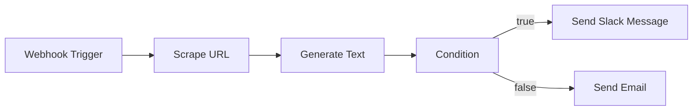

The Workflow Builder is a visual canvas for automations. You place nodes, connect them,
publish, and Fabric runs the graph durably: every node's input, output and timing is
recorded, failed steps retry, and a run survives a restart of the service executing it.

## What a workflow is

A workflow is a directed graph. One **trigger** node decides when the graph runs; every
other node is a step that consumes the output of the nodes before it.



## Build a workflow

<Steps>
  <Step>
    ### Create it

    **Workflows** in the sidebar, then **New Workflow**. The workflow is created straight
    away as `Untitled Workflow` and opens on an empty canvas; rename it from the header.
    A workflow belongs to you, inside the account or organization you created it in.
  </Step>

  <Step>
    ### Start from a blank canvas or from a prompt

    Describe what you want and let AI draft the graph, or drag nodes yourself. Both end
    up in the same editor.

    ```
    Search for the latest AI news, summarise the results,
    and send a Slack message to #technology with the summary.
    ```
  </Step>

  <Step>
    ### Add a trigger

    Every workflow starts with one. See [Triggers](#triggers) for what each kind does.
  </Step>

  <Step>
    ### Add and connect action nodes

    **Add a Step** on an empty canvas, and **+** in the toolbar after that, open the
    **Actions** tab; picking an action fills in the new node. Adding a node does not
    connect it — drag between the handles of two nodes to do that, since a node with
    nothing feeding it never runs.

    A node runs once every node feeding it has produced its result, and nodes that are
    ready together run together. A **Condition** is the exception: it sends the run down
    one of its two edges, never both.
  </Step>

  <Step>
    ### Configure each node

    Click a node to open its panel. Fields differ per node — a **Generate Text** node
    takes a prompt and a model, a **Send Slack Message** node takes a channel and a
    message. Any text field accepts references to earlier nodes.
  </Step>

  <Step>
    ### Run it from the editor

    **Run** executes what is on the canvas, including unsaved changes, and streams
    per-node status, input, output and duration into the execution panel. This works on a
    draft — you do not have to publish to test. An editor run sends no trigger payload,
    so references to webhook fields resolve to nothing.
  </Step>

  <Step>
    ### Publish

    Save first: publishing versions the **saved** graph, not what is on screen, and
    nothing autosaves. Publishing then opens the external triggers — the webhook starts
    accepting requests and the schedule starts firing. A graph that fails validation is
    not published, and the dialog lists what to fix.
  </Step>
</Steps>

## Triggers

The trigger node's **Trigger Type** decides how runs start.

| Trigger | Starts a run when | Needs publishing |
|---|---|---|
| **Manual** | You click **Run** in the editor | No |
| **Webhook** | An authenticated `POST` arrives at the workflow's trigger URL | Yes, with **Enable Webhook Trigger** ticked |
| **Schedule** | The cron expression on the trigger node comes due | Yes |

Ticking **Enable Webhook Trigger** in the publish dialog is what arms the endpoint: it
sets the workflow's trigger type to Webhook and mints the signing secret. A workflow
published without it refuses calls with `403`, however published it looks. A cron on the
trigger node set to **Schedule** makes the workflow schedule-triggered on publish; if you
enable the webhook as well, the webhook wins as the workflow's trigger type.

A schedule is read from the trigger node's **Schedule (cron)** field, in five- or six-field
form — for example `0 9 * * 1-5` for 09:00, Monday to Friday. That field carries a default,
so it is the **Trigger Type** that decides whether a schedule is created, not the presence
of a cron. Fabric registers it when you publish and
removes it when you unpublish, pause or archive the workflow.

## Nodes

### Core nodes

| Node | What it does |
|---|---|
| **Trigger** | Start of the graph; carries the trigger type and the cron expression |
| **HTTP Request** | Call any URL with `GET`, `POST`, `PUT`, `PATCH` or `DELETE`, with your own headers and body |
| **Condition** | Evaluate an expression and continue down the `true` or the `false` edge |

### Integration actions

The palette carries **55 integration actions** on top of the three core nodes. An action
appears only when Fabric ships an executor for it, so the palette never offers a node
that nothing can run — you still have to connect the service it uses.

#### AI

| Node | Integration | What it does |
|---|---|---|
| **Generate Image** | AI Gateway | Generate images using AI models |
| **Generate Text** | AI Gateway | Generate text using AI models |
| **Search** | Perplexity | Search the web with AI-powered answers |
| **Guard Text** | Superagent | Classify text for prompt injection and policy violations |
| **Redact Text** | Superagent | Remove personal data from text |
| **Generate Image (FLUX)** | fal.ai | Generate images using FLUX models |
| **Generate Video** | fal.ai | Generate videos from text or images |

#### Communication

| Node | Integration | What it does |
|---|---|---|
| **Send Email** | Resend | Send an email using Resend |
| **Send Slack Message** | Slack | Send a message to a Slack channel |

#### CRM

| Node | Integration | What it does |
|---|---|---|
| **Create Attio Record** | Attio | Create a new record in Attio (person, company, deal) |
| **Search Attio Records** | Attio | Search for records in Attio CRM |
| **Create HubSpot Contact** | HubSpot | Create a contact record in HubSpot |
| **Search HubSpot Contacts** | HubSpot | Search HubSpot contacts live |
| **Create Salesforce Lead** | Salesforce | Create a lead in Salesforce |
| **Query Salesforce Records** | Salesforce | Run a SOQL query against Salesforce |

#### Data

| Node | Integration | What it does |
|---|---|---|
| **List Blobs** | Vercel Blob | List stored files |
| **Upload to Blob** | Vercel Blob | Write a file to Vercel Blob |

#### Design

| Node | Integration | What it does |
|---|---|---|
| **List Canva Designs** | Canva | List designs from your Canva account |
| **Get Webflow Site** | Webflow | Fetch a single site's details |
| **List Webflow Sites** | Webflow | List the sites this token can access |
| **Publish Webflow Site** | Webflow | Publish a site to its domains |

#### Developer

| Node | Integration | What it does |
|---|---|---|
| **Create Bitbucket Issue** | Bitbucket | Create a new issue in a Bitbucket repository |
| **Search Bitbucket Issues** | Bitbucket | Search issues in a Bitbucket repository |
| **Create Clerk User** | Clerk | Create a user in Clerk |
| **Delete Clerk User** | Clerk | Permanently delete a user |
| **Get Clerk User** | Clerk | Fetch a user by ID |
| **Update Clerk User** | Clerk | Update an existing user |
| **Create Issue** | GitHub | Create a new GitHub issue |
| **Get Diff** | GitHub | Get the diff between two commits/branches or for a pull request |
| **Get File Contents** | GitHub | Get the contents of a file from a repository |
| **Search Issues** | GitHub | Search for issues and PRs |
| **Create GitLab Issue** | GitLab | Create a new issue in a GitLab project |
| **Get File Contents** | GitLab | Get the contents of a file from a GitLab project |
| **Search GitLab Issues** | GitLab | Search issues in a GitLab project |
| **MCP Tool** | MCP Tools | Execute a tool from an MCP server |

#### Productivity

| Node | Integration | What it does |
|---|---|---|
| **Create Asana Task** | Asana | Create a new task in an Asana project |
| **List Asana Tasks** | Asana | List tasks from an Asana project |
| **Create ClickUp Task** | ClickUp | Create a new task in a ClickUp list |
| **Search ClickUp Tasks** | ClickUp | Search tasks live in ClickUp |
| **Create Jira Issue** | Jira | Create a new issue in a Jira project |
| **Search Jira Issues** | Jira | Search Jira issues with JQL |
| **Create Linear Ticket** | Linear | Create a new issue in Linear |
| **Find Linear Issues** | Linear | Search for issues in Linear |

#### Sales

| Node | Integration | What it does |
|---|---|---|
| **Create Stripe Customer** | Stripe | Create a new customer in Stripe |
| **Create Stripe Invoice** | Stripe | Create and optionally send an invoice |
| **Get Stripe Customer** | Stripe | Retrieve a customer by ID or email |

#### Support

| Node | Integration | What it does |
|---|---|---|
| **Create Freshservice Ticket** | Freshservice | Create a new IT service ticket in Freshservice |
| **Create Front Conversation** | Front | Create a new email conversation in Front |
| **List Front Conversations** | Front | List conversations from a Front inbox |
| **Create Intercom Contact** | Intercom | Create a contact record in Intercom |
| **Search Intercom Conversations** | Intercom | Search Intercom conversations live |
| **Create Zendesk Ticket** | Zendesk | Create a support ticket in Zendesk |
| **Search Zendesk Tickets** | Zendesk | Search Zendesk tickets live |

#### Web

| Node | Integration | What it does |
|---|---|---|
| **Scrape URL** | Firecrawl | Scrape content from a URL |
| **Search Web** | Firecrawl | Search the web and get results |


Six further connections — Confluence, Databricks Vector Search, Google Drive, Microsoft
Teams, NHTSA Vehicle Data and Notion — are knowledge sources rather than workflow
actions. They are configured in the same place but do not add nodes to the canvas.

## Passing data between nodes

Any text field on any node can reference values produced earlier. Fabric substitutes
them just before the node runs.

| Reference | Resolves to |
|---|---|
| `{{fieldName}}` | A top-level field of the trigger payload, or a variable passed to the run |
| `{{Node Label.field}}` | An output field of an earlier node, addressed by the label shown on the canvas |
| `{{Node Label.nested.field}}` | A nested value inside that output |
| `{{$nodeId.field}}` | The same, addressed by node id, which survives renaming the node |

A webhook body is spread across the top level — each key becomes a variable of that name
— so `POST`ing `{"body": "..."}` gives you `{{body}}`. Each node's own output fields are
listed in the template fields of the nodes after it, which autocomplete every reference
available at that point.

Labels are how references resolve, so two nodes sharing one label are ambiguous. Some
default labels collide across integrations — GitHub and GitLab both offer a **Get File
Contents** — so rename one of them if you use both on a canvas.

<Callout type="warning">
A reference that does not resolve becomes an **empty string**, not the literal
`{{...}}` text. If a message arrives blank, check the spelling of the referenced node's
label and that the field is one the node actually returns — the execution panel shows
each node's real output.
</Callout>

## Conditions

A **Condition** node evaluates one expression and routes the run down its `true` or
`false` edge.

```
{{Generate Text.text}}.includes("negative")
{{HTTP Request.status}} == 200
{{Score.value}} > 7
{{Out.text}}.includes("failed") && {{Out.text}}.includes("windows")
```

Supported forms:

- substring tests — `.includes("...")`
- comparisons — `==`, `!=`, `===`, `!==`, `>`, `<`, `>=`, `<=`
- logical operators — `&&`, `||`, `!`, with parentheses

An expression with no operator is a truthiness check on the value. Expressions are read
by a restricted parser rather than a JavaScript engine, so function calls other than
`.includes()`, assignment and arbitrary code are not available.

That parser also narrows the characters it will consider: `:` `/` `@` `#` `%` `?` `;`
brackets, braces and anything non-ASCII are dropped from both sides before comparison.
Equality against a literal still holds, since both sides lose the same characters, but a
substring test whose needle contains one will not match what you wrote — searching for
`user@example.com` compares against `userexample.com`. Match on a plainer fragment.

## Generating a workflow with AI

The prompt box in the editor drafts graphs in three modes:

- **Create** — replace the canvas with a new graph
- **Modify** — change the existing graph
- **Append** — add steps to the end

Generation can emit eleven node types: the trigger, AI text and image, HTTP request,
Firecrawl scrape and search, condition, Linear ticket, email, Slack message and MCP tool.
Everything else — GitHub, Jira, Stripe, the rest of the palette — you add yourself. Ask for
one of those in the prompt and the graph is rejected rather than saved half-working, since
its edges would reference a node nothing can run.

Generation uses your configured AI provider and model.

## Integrations and credentials

Connect services under **Workflows → Integrations**. A connection belongs to the account
or organization that created it. Secrets are encrypted before they are stored and masked
when displayed, and **Test Connection** calls the live service, so a green result means
the credential works rather than merely that it is well-formed.

| Integration | How you connect | Adds workflow nodes |
|---|---|---|
| **AI Gateway** | API key | Yes |
| **Asana** | OAuth, or a personal access token | Yes |
| **Attio** | API key | Yes |
| **Bitbucket** | Account email + API token | Yes |
| **Canva** | API token | Yes |
| **Clerk** | Secret key | Yes |
| **ClickUp** | API token, optional team id | Yes |
| **Confluence** | Domain + email + API token | Knowledge only |
| **Databricks Vector Search** | Workspace URL + service principal id and secret | Knowledge only |
| **fal.ai** | API key | Yes |
| **Firecrawl** | API key | Yes |
| **Freshservice** | API key + domain | Yes |
| **Front** | API token | Yes |
| **GitHub** | OAuth, or a personal access token | Yes |
| **GitLab** | OAuth, or an instance URL and access token | Yes |
| **Google Drive** | OAuth | Knowledge only |
| **HubSpot** | OAuth, or an access token | Yes |
| **Intercom** | OAuth, or an access token | Yes |
| **Jira** | Domain + email + API token | Yes |
| **Linear** | OAuth, or an access token; optional team id | Yes |
| **MCP Tools** | Nothing — uses the MCP servers you have configured | Yes |
| **Microsoft Teams** | OAuth | Knowledge only |
| **NHTSA Vehicle Data** | Nothing — public API | Knowledge only |
| **Notion** | OAuth | Knowledge only |
| **Perplexity** | API key | Yes |
| **Resend** | API key + from address | Yes |
| **Salesforce** | Domain + username + access token | Yes |
| **Slack** | OAuth, or a bot token when the server has no Slack app configured | Yes |
| **Stripe** | Secret key | Yes |
| **Superagent** | API key | Yes |
| **Vercel Blob** | Read/write token | Yes |
| **Webflow** | API token | Yes |
| **Zendesk** | Subdomain + email + token | Yes |

## Publishing and versions

Publishing a workflow:

1. Saves the current graph as a numbered version, with the changelog you type
2. Generates the webhook URL and signing secret, if you enable the webhook trigger
3. Registers the schedule, if the trigger node's type is **Schedule**

<Callout type="warning">
Publishing controls **whether** external triggers are accepted, not **which** version
they run. Webhook and scheduled runs always execute the workflow's current saved state,
so an edit you save to a published workflow takes effect on the very next run — there is
no second publish step. Use rollback if you need to get back to an earlier state.
</Callout>

**Version History** lists every published version. Rolling back restores that version's
graph onto the canvas and records the restore as a new version, so the history stays
append-only.

## Webhook triggers

A published workflow with a webhook trigger accepts:

```
POST /api/workflows/trigger/{workflowId}
```

Sign the request body and send your input as JSON:

| Header | Value |
|---|---|
| `X-Workflow-Signature` | `sha256=<HMAC-SHA256 of the raw request body, keyed with the webhook secret>` |

The webhook secret is shown when you publish with webhooks enabled. Copy it then: while
the workflow stays published, nothing shows it again. Never send the secret itself as a
header — you send a hash computed from it, over the exact bytes of the body you are
posting.

```bash
SIGNATURE=$(printf '%s' "$BODY" | openssl dgst -sha256 -hmac "$SECRET" -r | cut -d' ' -f1)
curl -X POST "$URL" \
  -H "Content-Type: application/json" \
  -H "X-Workflow-Signature: sha256=$SIGNATURE" \
  -d "$BODY"
```

A successful call returns the `executionId` of the run it started, which matches the run
in the workflow's run history.

| Response | Meaning |
|---|---|
| `401` | Missing or invalid signature |
| `403` | The workflow is not live, or its trigger type is not Webhook — the body says which |
| `400` | The body is not valid JSON |
| `404` | No workflow with that id |
| `429` | Over the rate limit, or the workspace is at its concurrent-run cap — retry after the `Retry-After` header |
| `502` | The run was recorded but the engine would not start it |
| `503` | Rate limiting is unavailable, so the request is refused rather than let through |

## Running and monitoring

The execution panel, and the run history for past runs, show each node's status, output,
error and duration.

A failed node is tried up to three times, with the wait doubling from one second.

Nodes that write to an external service are deliberately **not** retried after an
infrastructure error, because the write may already have landed and a retry would
duplicate it. That covers creating a ticket, sending a message, filing an issue, uploading
a file and publishing a site — and the **MCP Tool** node, whose tool could be doing any of
those. Those nodes fail the run instead; the execution log shows which node was in flight.

## Statuses

| Status | Meaning |
|---|---|
| **Draft** | Editable, runnable from the editor; webhook and schedule triggers are refused |
| **Published** | Webhook and schedule triggers accepted; still fully editable |
| **Active** | Same as Published; set from the workflow card menu |
| **Paused** | Triggers suspended, set from the card menu; restore with Activate |
| **Archived** | Triggers refused; badged **Archived** in the list, with a filter pill of its own |

## Limits

| Limit | Value |
|---|---|
| Webhook requests | 60 per minute, per caller IP and workflow |
| Concurrent runs | 25 per workspace by default; your organization's quota takes precedence |
| Single node | 10 minutes |
| Single run | 6 hours, after which the run is marked timed out |
| Nodes per workflow | 200; above 150 the editor warns |

## Troubleshooting

**A webhook call returns 403.** Either the workflow is not live — a draft, paused or
archived — or its trigger type is not Webhook. Republishing with **Enable Webhook
Trigger** ticked fixes the second case.

**A scheduled workflow stopped firing.** Pausing, unpublishing or archiving removes the
schedule; activating or republishing puts it back. A changed cron expression takes
effect when you save.

**A condition always takes the same branch.** Check the expression against the forms
listed above, and read the referenced node's real output in the run history.

---

## Next steps

<Cards>
  <Card title="Build your first workflow" href="/docs/tutorials/first-workflow">
    A guided run through webhook, AI and Slack
  </Card>
  <Card title="MCP integration" href="/docs/integrations/mcp">
    Connect MCP servers for additional tools in workflows
  </Card>
  <Card title="AI configuration" href="/docs/features/ai-providers">
    Configure the providers workflows and generation use
  </Card>
</Cards>
