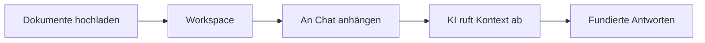

Workspaces sind gemeinsame Dokument-Repositories, die Fabrics RAG-Fähigkeiten (Retrieval-Augmented Generation) antreiben. Laden Sie Dokumente in einen Workspace hoch, laden Sie Mitarbeiter ein, hängen Sie ihn an KI-Gespräche an und lassen Sie die KI auf Ihre Dokumente verweisen, wenn sie antwortet.

## Was ist ein Workspace?

Ein Workspace ist ein Container für Dokumente, der mit Teammitgliedern geteilt und an KI-Chat-Gespräche angehängt werden kann. Wenn ein Workspace an ein Gespräch angehängt ist, kann die KI relevante Inhalte aus allen Dokumenten in diesem Workspace suchen und abrufen.

## Einen Workspace erstellen

<Steps>
  <Step>
    ### Zu Workspaces navigieren

    Klicken Sie in der linken Seitenleiste auf **Workspaces**, um Ihre bestehenden Workspaces anzuzeigen.
  </Step>

  <Step>
    ### Neuen Workspace erstellen

    Klicken Sie auf **Neuer Workspace** und geben Sie an:

    - **Name** — Ein beschreibender Name (bis zu 100 Zeichen)
    - **Beschreibung** — Optionale Zusammenfassung des Workspace-Zwecks (bis zu 500 Zeichen)
    - **Dokumentenlimit** — Maximale Anzahl erlaubter Dokumente (1 bis 100)
  </Step>

  <Step>
    ### Dokumente hochladen

    Fügen Sie Dokumente zu Ihrem Workspace per Drag & Drop oder über die Upload-Schaltfläche hinzu. Dokumente werden automatisch durch eine Pipeline aus Extraktion, Aufteilung und Einbettung verarbeitet.
  </Step>
</Steps>

## Dokumentenverwaltung

### Upload-Prozess

Wenn Sie ein Dokument hochladen, verarbeitet Fabric es automatisch durch mehrere Stufen:

| Status | Beschreibung |
|--------|-------------|
| **Ausstehend** | Dokument hochgeladen, wartet auf Verarbeitung |
| **Wird hochgeladen** | Dateiübertragung läuft |
| **Hochgeladen** | Datei gespeichert, wartet auf Extraktion |
| **Wird extrahiert** | Inhalt wird aus der Datei extrahiert |
| **Wird aufgeteilt** | Inhalt wird in durchsuchbare Segmente aufgeteilt |
| **Wird eingebettet** | Vektoreinbettungen werden generiert |
| **Wird gespeichert** | Einbettungen werden in der Vektordatenbank gespeichert |
| **Bereit** | Dokument für RAG-Abruf verfügbar |
| **Fehlgeschlagen** | Verarbeitung hat einen Fehler gefunden (kann wiederholt werden) |

**Maximale Dateigröße:** 50 MB pro Datei

### Fehlgeschlagene Dokumente wiederholen

Wenn ein Dokument bei der Verarbeitung fehlschlägt, können Sie es aus der Dokumentenliste heraus wiederholen. Fabric startet einen neuen Verarbeitungsworkflow, der dort weitermacht, wo der vorherige aufgehört hat.

### Dokumentstatistiken

Jeder Workspace zeigt Dokumentstatistiken einschließlich Gesamtanzahl, Statusaufschlüsselung und Speichernutzung.

## Mitgliederverwaltung

Workspaces unterstützen drei Zugriffsebenen, die in Gruppen organisiert sind:

| Gruppe | Berechtigungen |
|-------|-------------|
| **Administratoren** | Vollständige Kontrolle: Mitglieder verwalten, Dokumente hochladen/löschen, Einstellungen aktualisieren, Workspace archivieren/löschen |
| **Mitwirkende** | Dokumente hochladen und verwalten, alle Workspace-Inhalte ansehen |
| **Interessierte** | Nur-Lese-Zugriff auf Workspace-Dokumente und Inhalte |

### Mitglieder hinzufügen

<Steps>
  <Step>
    ### Mitglieder-Panel öffnen

    Zu Ihrem Workspace navigieren und die Registerkarte **Mitglieder** öffnen.
  </Step>

  <Step>
    ### Nach Benutzern suchen

    Name oder E-Mail eingeben, um nach Benutzern zu suchen. Im Organisationskontext ist die Suche auf Organisationsmitglieder beschränkt.
  </Step>

  <Step>
    ### Eine Gruppe zuweisen

    Den Benutzer auswählen und ihre Gruppe wählen: **Administratoren**, **Mitwirkende** oder **Interessierte**.
  </Step>
</Steps>

### Rollen ändern

Administratoren können die Gruppe eines Mitglieds jederzeit ändern oder es vollständig aus dem Workspace entfernen.

## Agenten in Workspaces

Sie können KI-Agenten an einen Workspace anhängen und ihnen Zugriff auf den Dokumentenkontext des Workspaces geben. Administratoren können Agenten zu einem Workspace hinzufügen oder entfernen.

Dies ermöglicht Agenten, Workspace-Dokumente als Referenzmaterial bei der Ausführung von Aufgaben zu nutzen.

## Gesprächsintegration

Workspaces können an KI-Chat-Gespräche angehängt werden, um während Ihrer Interaktionen Dokumentenkontext bereitzustellen.

### Einen Workspace anhängen

1. Ein KI-Chat-Gespräch öffnen
2. Die Workspace-Anhängen-Option auswählen
3. Einen oder mehrere Workspaces zum Anhängen auswählen
4. Die KI hat jetzt Zugriff auf alle bereiten Dokumente in den angehängten Workspaces

### Wie Abruf funktioniert

Wenn Sie eine Nachricht in einem Gespräch mit angehängten Workspaces senden:

1. Die KI identifiziert relevante Dokumentabschnitte mithilfe von Vektorähnlichkeitssuche
2. Passender Inhalt wird als Kontext in den Prompt der KI einbezogen
3. Die KI verweist auf diesen Kontext bei der Generierung ihrer Antwort

Sie können einen Workspace jederzeit von einem Gespräch trennen, ohne den Gesprächsverlauf zu verlieren.

## RAG-Einstellungen

Jeder Workspace hat konfigurierbare RAG-Einstellungen, die steuern, wie Dokumente verarbeitet und abgerufen werden:

| Einstellung | Beschreibung | Standardbereich |
|---------|-------------|---------------|
| **Abschnittsgröße** | Größe der Textsegmente in Zeichen | 100 - 10.000 |
| **Abschnittsüberlappung** | Überlappung zwischen benachbarten Abschnitten | 0 - 2.000 |
| **Aufteilungsmethode** | Wie Text in Abschnitte aufgeteilt wird | Absatz, Satz, Fest, Rekursiv, Dokument, Semantisch |
| **Einbettungsmodell** | Modell für Vektorgenerierung | text-embedding-3-small, text-embedding-3-large |
| **Top K** | Anzahl der Ergebnisse pro Anfrage | 1 - 50 |
| **Ähnlichkeitsschwelle** | Mindestzählicherheitswert für Ergebnisse | 0,0 - 1,0 |
| **Neu-Rangierung aktivieren** | Ob Ergebnisse nach Relevanz neu geordnet werden | Ein/Aus |

Das Ändern von RAG-Einstellungen wirkt sich auf zukünftige Dokumentenverarbeitung aus. Vorhandene Dokumente behalten ihre aktuellen Einbettungen, es sei denn, sie werden neu verarbeitet.

## Workspace-Lebenszyklus

| Status | Beschreibung |
|--------|-------------|
| **Aktiv** | Workspace wird genutzt, Dokumente zugänglich |
| **Archiviert** | Workspace aus Standardansichten ausgeblendet, Dokumente erhalten |

- Einen Workspace **archivieren**, um ihn ohne Datenlöschung auszublenden
- Einen archivierten Workspace **reaktivieren**, um ihn wiederherzustellen
- Einen Workspace **löschen**, um ihn und alle seine Dokumente dauerhaft zu entfernen

## Workspace-Typen

| Typ | Beschreibung |
|------|-------------|
| **Persönlich** | Automatisch erstellter Standard-Workspace für jeden Benutzer |
| **Benutzerdefiniert** | Vom Benutzer erstellter Workspace mit konfigurierbaren Einstellungen |

## Mandantenfähige Unterstützung

Workspaces funktionieren sowohl in persönlichen als auch in Organisationskontexten:

- **Persönlich** (`/app/workspaces`) — Ihre privaten Workspaces und Dokumente
- **Organisation** (`/app/{org}/workspaces`) — Organisationsbereichsbezogene Workspaces, unter Mitgliedern geteilt
- Jeder Kontext hat separate Workspaces mit strikter Datenisolierung
- Mitglieder können nur aus demselben Mandantenkontext hinzugefügt werden
- Dokument-Uploads sind nach Workspace-Eigentümerschaft isoliert

---

## Nächste Schritte

<Cards>
  <Card title="KI-Chat" href="/docs/features/ai-chat">
    Workspaces an Gespräche für dokumentenbewusste KI anhängen
  </Card>
  <Card title="KI-Anbieter" href="/docs/features/ai-providers">
    Einbettungsmodelle für die Dokumentenverarbeitung konfigurieren
  </Card>
  <Card title="Agenten-Vorlagen" href="/docs/features/agent-templates">
    Agenten erstellen, die Workspace-Dokumente als Kontext nutzen
  </Card>
</Cards>
