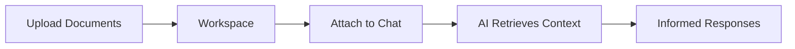

Workspaces are shared document repositories that power Fabric's Retrieval-Augmented Generation (RAG) capabilities. Upload documents to a workspace, invite collaborators, attach it to AI conversations, and let the AI reference your documents when responding.

## What is a Workspace?

A workspace is a container for documents that can be shared with team members and attached to AI chat conversations. When a workspace is attached to a conversation, the AI can search and retrieve relevant content from all documents in that workspace.

## Creating a Workspace

<Steps>
  <Step>
    ### Navigate to Workspaces

    Click **Workspaces** in the left sidebar to view your existing workspaces.
  </Step>

  <Step>
    ### Create New Workspace

    Click **New Workspace** and provide:

    - **Name** — A descriptive name (up to 100 characters)
    - **Description** — Optional summary of the workspace purpose (up to 500 characters)
    - **Document Limit** — Maximum number of documents allowed (1 to 100)
  </Step>

  <Step>
    ### Upload Documents

    Add documents to your workspace using drag-and-drop or the upload button. Documents are automatically processed through a pipeline of extraction, chunking, and embedding.
  </Step>
</Steps>

## Document Management

### Upload Process

When you upload a document, Fabric automatically processes it through several stages:

| Status | Description |
|--------|-------------|
| **Pending** | Document uploaded, waiting to be processed |
| **Uploading** | File transfer in progress |
| **Uploaded** | File stored, awaiting extraction |
| **Extracting** | Content being extracted from the file |
| **Chunking** | Content being split into searchable segments |
| **Embedding** | Vector embeddings being generated |
| **Storing** | Embeddings being stored in the vector database |
| **Ready** | Document available for RAG retrieval |
| **Failed** | Processing encountered an error (can be retried) |

**Maximum file size:** 50 MB per file

### Retrying Failed Documents

If a document fails processing, you can retry it from the document list. Fabric starts a new processing workflow that picks up where the previous one left off.

### Document Statistics

Each workspace shows document statistics including total count, status breakdown, and storage usage.

## Member Management

Workspaces support three access levels organized into groups:

| Group | Permissions |
|-------|-------------|
| **Administrators** | Full control: manage members, upload/delete documents, update settings, archive/delete workspace |
| **Contributors** | Upload and manage documents, view all workspace content |
| **Stakeholders** | View-only access to workspace documents and content |

### Adding Members

<Steps>
  <Step>
    ### Open Members Panel

    Navigate to your workspace and open the **Members** tab.
  </Step>

  <Step>
    ### Search for Users

    Type a name or email to search for users. In an organization context, the search is scoped to organization members.
  </Step>

  <Step>
    ### Assign a Group

    Select the user and choose their group: **Administrators**, **Contributors**, or **Stakeholders**.
  </Step>
</Steps>

### Changing Roles

Administrators can change a member's group at any time or remove them from the workspace entirely.

## Agents in Workspaces

You can attach AI agents to a workspace, giving them access to the workspace's document context. Administrators can add or remove agents from a workspace.

This enables agents to use workspace documents as reference material when executing tasks.

## Conversation Integration

Workspaces can be attached to AI Chat conversations to provide document context during your interactions.

### Attaching a Workspace

1. Open an AI Chat conversation
2. Select the workspace attachment option
3. Choose one or more workspaces to attach
4. The AI now has access to all ready documents in the attached workspaces

### How Retrieval Works

When you send a message in a conversation with attached workspaces:

1. The AI identifies relevant document chunks using vector similarity search
2. Matching content is included as context in the AI's prompt
3. The AI references this context when generating its response

You can detach a workspace from a conversation at any time without losing the conversation history.

## RAG Settings

Each workspace has configurable RAG settings that control how documents are processed and retrieved:

| Setting | Description | Default Range |
|---------|-------------|---------------|
| **Chunk Size** | Size of text segments in characters | 100 - 10,000 |
| **Chunk Overlap** | Overlap between adjacent chunks | 0 - 2,000 |
| **Split Method** | How text is divided into chunks | Paragraph, Sentence, Fixed, Recursive, Document, Semantic |
| **Embedding Model** | Model used for vector generation | text-embedding-3-small, text-embedding-3-large |
| **Top K** | Number of results returned per query | 1 - 50 |
| **Similarity Threshold** | Minimum similarity score for results | 0.0 - 1.0 |
| **Enable Reranking** | Whether to rerank results for relevance | On/Off |

Changing RAG settings affects future document processing. Existing documents retain their current embeddings unless reprocessed.

## Workspace Lifecycle

| Status | Description |
|--------|-------------|
| **Active** | Workspace is in use, documents accessible |
| **Archived** | Workspace hidden from default views, documents preserved |

- **Archive** a workspace to hide it without deleting data
- **Reactivate** an archived workspace to restore it
- **Delete** a workspace to permanently remove it and all its documents

## Workspace Types

| Type | Description |
|------|-------------|
| **Personal** | Automatically created default workspace for each user |
| **Custom** | User-created workspace with configurable settings |

## Multi-Tenant Support

Workspaces work in both personal and organization contexts:

- **Personal** (`/app/workspaces`) — Your private workspaces and documents
- **Organization** (`/app/{org}/workspaces`) — Organization-scoped workspaces shared among members
- Each context has separate workspaces with strict data isolation
- Members can only be added from the same tenant context
- Document uploads are isolated by workspace ownership

---

## Next Steps

<Cards>
  <Card title="AI Chat" href="/docs/features/ai-chat">
    Attach workspaces to conversations for document-aware AI
  </Card>
  <Card title="AI Providers" href="/docs/features/ai-providers">
    Configure embedding models for document processing
  </Card>
  <Card title="Agent Templates" href="/docs/features/agent-templates">
    Create agents that use workspace documents as context
  </Card>
</Cards>
