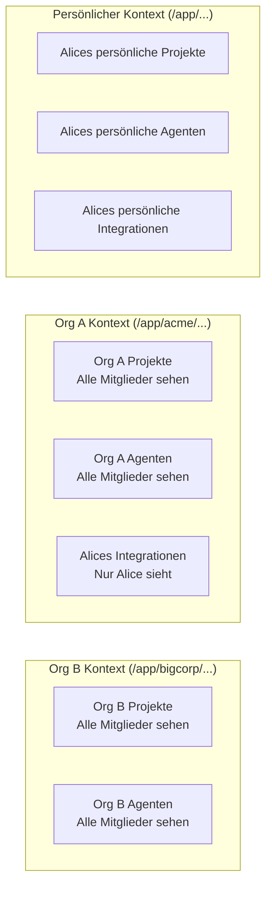

Fabric AI ist eine Multi-Tenant-Plattform, bei der jedes Feature sowohl **persönliche** als auch **Organisations**-Kontexte mit strikter Datenisolierung unterstützt. Diese Seite erklärt, wie Ihre Daten geschützt werden.

## Isolierungsgrenzen

Datenisolierung wird auf drei Ebenen erzwungen:

| Grenze | Regel |
|----------|------|
| Persönlich vs. Organisation | Die persönlichen Daten eines Benutzers sind in einem Organisationskontext nie sichtbar, und umgekehrt |
| Organisation vs. Organisation | Die Daten von Organisation A sind für Organisation B nie sichtbar, auch wenn derselbe Benutzer beiden angehört |
| Benutzer vs. Benutzer (innerhalb der Org) | Manche Daten sind benutzerprivat innerhalb einer Organisation, während andere von Mitgliedern geteilt werden |

---

## Wie Ihre Daten geschützt werden

Fabric erzwingt Datenisolierung auf mehreren Ebenen, um sicherzustellen, dass Ihre Informationen sicher bleiben.

### Isolierung auf Anwendungsebene

Jede API-Anfrage ist auf den richtigen Kontext beschränkt. Wenn Sie im persönlichen Kontext arbeiten, sind nur Ihre persönlichen Daten zugänglich. Wenn Sie zu einer Organisation wechseln, werden nur die Daten dieser Organisation angezeigt. Es ist nicht möglich, versehentlich kontextübergreifend abzufragen.

### Sicherheit auf Datenbankebene

Zusätzlich zur Filterung auf Anwendungsebene erzwingt die Datenbank selbst Sicherheitsrichtlinien auf Zeilenebene. Selbst wenn ein Anwendungsfehler die normale Filterung umgehen würde, würde die Datenbank unbefugten Zugriff ablehnen. Dieser Defense-in-Depth-Ansatz stellt sicher, dass kein einzelner Schwachpunkt die Datenisolierung gefährden kann.

### Vektorsuche-Isolierung

Dokument-Embeddings für KI-gestützte Suche und Abruf sind pro Tenant isoliert. Die Suche nach Dokumenten gibt nur Ergebnisse aus Ihrem aktuellen Kontext zurück.

### Dateispeicher-Isolierung

Hochgeladene Dateien (Dokumente, Avatare, Exporte) werden mit tenant-spezifischen Zugangskontrollen gespeichert, die kontextübergreifenden Dateizugriff verhindern.

---

## Persönlicher vs. Organisationskontext

Fabric bietet zwei verschiedene Kontexte für die Organisation Ihrer Arbeit:

### Persönlicher Kontext (`/app/...`)

Ihr privater Workspace. Alles, was Sie hier erstellen, ist nur für Sie sichtbar:
- Persönliche Projekte und Dokumente
- Persönliche KI-Chat-Gespräche
- Persönliche Agenten-Konfigurationen
- Persönliche Integrations-Anmeldedaten

### Organisationskontext (`/app/{org-slug}/...`)

Ein gemeinsamer Workspace für Ihr Team. Hier erstellte Daten sind auf die Organisation beschränkt:
- Organisationsprojekte für alle Mitglieder sichtbar
- Gemeinsame Agenten-Bereitstellungen
- Organisationsweite KI-Konfigurationen
- Team-Zusammenarbeit an Dokumenten und Workflows

Verwenden Sie den Kontext-Umschalter in der oberen Navigation, um zwischen persönlichen und Organisationskontexten zu wechseln.

---

## Was isoliert ist

### Vollständig pro Tenant isoliert

Diese Ressourcen sind strikt zwischen persönlichen und Organisationskontexten getrennt:

- **Projekte** und Projektdokumente
- **KI-Chat**-Gespräche und -Verlauf
- **Agenten** — Vorlagen, Bereitstellungen und Speicher
- **Workflows** und Ausführungsverlauf
- **Workspaces** und hochgeladene Dokumente
- **Prompts** und Prompt-Vorlagen
- **Berichte** und Berichtsausführungen
- **Käufe** und Abrechnung

### Pro Benutzer innerhalb von Organisationen

Einige Ressourcen sind für jeden Benutzer privat, auch innerhalb einer Organisation:

- **Integrations-Anmeldedaten** — Jedes Mitglied verwaltet seine eigenen API-Verbindungen
- **KI-Anbieter-Schlüssel** — Persönliche API-Schlüssel werden nie mit der Organisation geteilt

### Innerhalb von Organisationen geteilt

- **System-Agenten** und System-Prompts sind für alle verfügbar
- **KI-Einstellungen auf Organisationsebene** gelten für alle Mitglieder (sofern nicht persönlich überschrieben)

---

## Organisationsrollen

Innerhalb einer Organisation steuern Rollen, was Mitglieder tun können:

| Rolle | Berechtigungen |
|------|-------------|
| **Eigentümer** | Volle Kontrolle einschließlich Abrechnung, Löschung und Mitgliederverwaltung |
| **Admin** | Mitglieder, Einstellungen und alle Ressourcen verwalten |
| **Mitglied** | Agenten verwenden, Dokumente erstellen und auf gemeinsame Ressourcen zugreifen |

---

## Kontinuierliche Überprüfung

Fabric testet kontinuierlich die Tenant-Isolierung, um sicherzustellen, dass Datengrenzen eingehalten werden. Automatisierte Testsuiten überprüfen, dass:

- Persönliche Daten nie in Organisationskontexten erscheinen
- Die Daten von Organisation A nie in Organisation B erscheinen
- Der Kontextwechsel den sichtbaren Datensatz korrekt ändert
- Neue Features die Isolierung von Anfang an aufrechterhalten

---

## Nächste Schritte

<Cards>
  <Card title="Organisationen" href="/docs/features/organizations">
    Organisationen einrichten und verwalten
  </Card>
  <Card title="Architektur" href="/docs/core-concepts/architecture">
    Plattformarchitektur-Übersicht
  </Card>
  <Card title="API-Authentifizierung" href="/docs/api/authentication">
    Authentifizierung und Autorisierung
  </Card>
</Cards>
