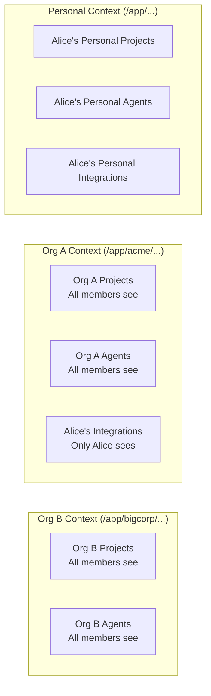

Fabric AI is a multi-tenant platform where every feature supports both **personal** and **organization** contexts with strict data isolation. This page explains how your data is protected.

## Isolation Boundaries

Data isolation is enforced at three levels:

| Boundary | Rule |
|----------|------|
| Personal vs. Organization | A user's personal data is never visible in an organization context, and vice versa |
| Organization vs. Organization | Organization A's data is never visible to Organization B, even if the same user belongs to both |
| User vs. User (within org) | Some data is user-private within an organization, while other data is shared across members |

---

## How Your Data is Protected

Fabric enforces data isolation at multiple layers to ensure your information stays secure.

### Application-Level Isolation

Every API request is scoped to the correct context. When you're working in a personal context, only your personal data is accessible. When you switch to an organization, only that organization's data is shown. There is no way to accidentally query across contexts.

### Database-Level Security

In addition to application-level filtering, the database itself enforces row-level security policies. Even if an application bug were to bypass the normal filtering, the database would reject unauthorized access. This defense-in-depth approach ensures no single point of failure can compromise data isolation.

### Vector Search Isolation

Document embeddings used for AI-powered search and retrieval are isolated per tenant. Searching for documents only returns results from your current context.

### File Storage Isolation

Uploaded files (documents, avatars, exports) are stored with tenant-scoped access controls, preventing cross-tenant file access.

---

## Personal vs Organization Context

Fabric provides two distinct contexts for organizing your work:

### Personal Context (`/app/...`)

Your private workspace. Everything you create here is visible only to you:
- Personal projects and documents
- Personal AI chat conversations
- Personal agent configurations
- Personal integration credentials

### Organization Context (`/app/{org-slug}/...`)

A shared workspace for your team. Data created here is scoped to the organization:
- Organization projects visible to all members
- Shared agent deployments
- Organization-wide AI configurations
- Team collaboration on documents and workflows

Use the context switcher in the top navigation to move between personal and organization contexts.

---

## What's Isolated

### Fully Isolated Per Tenant

These resources are strictly separated between personal and organization contexts:

- **Projects** and project documents
- **AI Chat** conversations and history
- **Agents** — templates, deployments, and memory
- **Workflows** and execution history
- **Workspaces** and uploaded documents
- **Prompts** and prompt templates
- **Reports** and report executions
- **Purchases** and billing

### Per-User Within Organizations

Some resources are private to each user even within an organization:

- **Integration credentials** — Each member manages their own API connections
- **AI provider keys** — Personal API keys are never shared with the organization

### Shared Within Organizations

- **System agents** and system prompts are available to everyone
- **Organization-level AI settings** apply to all members (unless overridden personally)

---

## Organization Roles

Within an organization, roles control what members can do:

| Role | Permissions |
|------|-------------|
| **Owner** | Full control including billing, deletion, and member management |
| **Admin** | Manage members, settings, and all resources |
| **Member** | Use agents, create documents, and access shared resources |

---

## Continuous Verification

Fabric continuously tests tenant isolation to ensure data boundaries are maintained. Automated test suites verify that:

- Personal data never appears in organization contexts
- Organization A's data never appears in Organization B
- Context switching correctly changes the visible data set
- New features maintain isolation from the start

---

## Next Steps

<Cards>
  <Card title="Organizations" href="/docs/features/organizations">
    Set up and manage organizations
  </Card>
  <Card title="Architecture" href="/docs/core-concepts/architecture">
    Platform architecture overview
  </Card>
  <Card title="API Authentication" href="/docs/api/authentication">
    Authentication and authorization
  </Card>
</Cards>
