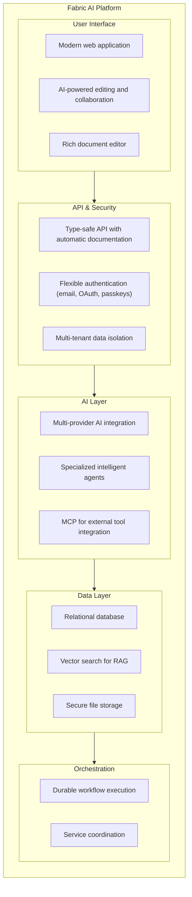

**Fabric AI** ist eine unternehmensgerechte Plattform, die darauf ausgelegt ist, die Arbeitsweise von Softwareteams zu revolutionieren. Durch die Kombination intelligenter KI-Agenten, Retrieval-Augmented Generation (RAG) und dauerhafter Workflow-Automatisierung komprimiert Fabric den gesamten Software Development Lifecycle (SDLC) von Wochen auf Tage.

## Was ist Fabric AI?

Fabric AI ist eine umfassende Plattform, die Entwicklungsteams dabei unterstützt:

- **Dokumente sofort erstellen** — PRDs, technische Spezifikationen, Architekturdokumente und mehr mit KI-Agenten, die Ihre Codebasis und vergangene Arbeit verstehen
- **Wiederkehrende Aufgaben automatisieren** — Lassen Sie KI-Agenten Routineaufgaben wie das Erstellen von Jira-Tickets, das Posten von Updates und das Synchronisieren von Informationen über Tools hinweg erledigen
- **Ihre Wissensbasis erschließen** — Verarbeiten und durchsuchen Sie PDFs, Confluence-Seiten, Code-Repositories und Legacy-Dokumentation mit RAG
- **Komplexe Workflows orchestrieren** — Verketten Sie mehrere Agenten für mehrstufige Aufgaben mit integrierter Fehlerbehebung und Genehmigungsworkflows

## Wichtige Funktionen auf einen Blick

<Cards>
  <Card title="KI-Agenten" href="/docs/agents/overview">
    Vordefinierte und benutzerdefinierte Agenten, die Dokumente erstellen, API-Aufrufe ausführen und Workflows automatisieren können
  </Card>
  <Card title="RAG-System" href="/docs/core-concepts/rag">
    Laden Sie Dokumente hoch und lassen Sie KI-Agenten auf relevanten Kontext aus Ihrer Wissensbasis zugreifen
  </Card>
  <Card title="Prompt-Bibliothek" href="/docs/features/prompts">
    Versionierte, wiederverwendbare Prompts mit Template-Variablen für konsistente KI-Interaktionen
  </Card>
  <Card title="MCP-Integration" href="/docs/integrations/mcp">
    Verbinden Sie externe Tools wie GitHub, Jira, Slack und mehr über das Model Context Protocol
  </Card>
  <Card title="Dauerhafte Workflows" href="/docs/core-concepts/workflows">
    Fehlertolerante, fortsetzbare Workflow-Ausführung mit automatischer Fehlerbehebung
  </Card>
  <Card title="Multi-Tenancy" href="/docs/features/organizations">
    Unternehmensgerechte Isolation mit Organisationen, Teams und rollenbasierter Zugriffskontrolle
  </Card>
</Cards>

## Für wen ist Fabric AI?

### Produktmanager
- Verwandeln Sie grobe Ideen in Minuten statt Tagen in detaillierte PRDs
- Gewährleisten Sie Konsistenz in allen Produktdokumentationen
- Generieren Sie automatisch User Stories mit Akzeptanzkriterien

### Entwickler
- Greifen Sie sofort auf Kontext aus vergangenen Projekten und Dokumentationen zu
- Erstellen Sie technische Spezifikationen und Architekturdokumente
- Weniger Zeit für Dokumentation, mehr Zeit für Code

### Engineering Manager
- Verbessern Sie die Teamgeschwindigkeit ohne Qualitätseinbußen
- Ermöglichen Sie besseren Wissensaustausch im Team
- Erhalten Sie Echtzeit-Einblicke in den Workflow-Fortschritt

### Unternehmensführung
- Beschleunigen Sie die Time-to-Market für neue Funktionen
- Reduzieren Sie das Risiko von Wissensverlust bei Mitarbeiterabgängen
- Demonstrieren Sie Compliance mit dokumentierten Prozessen

## Schnellstart

Starten Sie mit Fabric AI in unter 5 Minuten:

<Steps>
  <Step>
    ### Registrieren oder Anmelden

    Erstellen Sie Ihr Konto unter [fabric.pro](https://fabric.pro) per E-Mail, Magic Link oder Social Login.
  </Step>

  <Step>
    ### KI-Anbieter konfigurieren

    Navigieren Sie zu **Einstellungen → AI Gateway** und fügen Sie Ihren API-Schlüssel für OpenAI, Anthropic oder andere unterstützte Anbieter hinzu.
  </Step>

  <Step>
    ### Ihren ersten Agenten erstellen

    Gehen Sie zu **Agents → Agent erstellen** und wählen Sie aus vordefinierten Vorlagen wie Document Generator oder erstellen Sie einen benutzerdefinierten Agenten.
  </Step>

  <Step>
    ### Konversation starten

    Wählen Sie Ihren Agenten und beginnen Sie zu chatten! Bitten Sie ihn, ein Dokument zu erstellen, Fragen zu Ihrer Codebasis zu beantworten oder eine Aufgabe zu automatisieren.
  </Step>
</Steps>

Bereit für mehr? Weiter zu [Einführung](/docs/getting-started/overview) für eine umfassende Anleitung.

## Wie alles zusammenhängt

Fabric AI verbindet mehrere Ebenen für intelligente Automatisierung:

## Nächste Schritte

<Cards>
  <Card title="Einführung" href="/docs/getting-started/overview">
    Vollständige Einrichtungsanleitung mit Schritt-für-Schritt-Anweisungen
  </Card>
  <Card title="Kernkonzepte" href="/docs/core-concepts/architecture">
    Verstehen Sie die Schlüsselkonzepte, die Fabric AI antreiben
  </Card>
  <Card title="Tutorials" href="/docs/tutorials/first-document">
    Praktische Tutorials zum Erlernen der Fabric AI-Funktionen
  </Card>
  <Card title="API-Referenz" href="/docs/api/overview">
    Detaillierte API-Dokumentation für Entwickler
  </Card>
</Cards>

---

Brauchen Sie Hilfe? Treten Sie unserer Community bei oder lesen Sie die [FAQ](/docs/faq).
