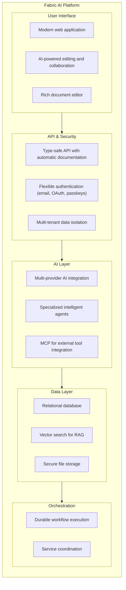

**Fabric AI** is an enterprise-grade platform designed to revolutionize how software teams work. By combining intelligent AI agents, Retrieval-Augmented Generation (RAG), and durable workflow automation, Fabric compresses the entire Software Development Lifecycle (SDLC) from weeks to days.

## What is Fabric AI?

Fabric AI is a comprehensive platform that helps development teams:

- **Generate Documents Instantly** — Create PRDs, technical specs, architecture docs, and more using AI agents that understand your codebase and past work
- **Automate Repetitive Tasks** — Let AI agents handle routine work like creating Jira tickets, posting updates, and syncing information across tools
- **Unlock Your Knowledge Base** — Process and search through PDFs, Confluence pages, code repositories, and legacy documentation using RAG
- **Orchestrate Complex Workflows** — Chain multiple agents together for multi-step tasks with built-in error recovery and human approval workflows

## Key Features at a Glance

<Cards>
  <Card title="AI Agents" href="/docs/agents/overview">
    Pre-built and custom agents that can generate documents, execute API calls, and automate workflows
  </Card>
  <Card title="RAG System" href="/docs/core-concepts/rag">
    Upload documents and let AI agents access relevant context from your knowledge base
  </Card>
  <Card title="Prompt Library" href="/docs/features/prompts">
    Versioned, reusable prompts with template variables for consistent AI interactions
  </Card>
  <Card title="MCP Gateway" href="/docs/integrations/mcp-gateway">
    Use Fabric as a unified MCP server from Claude Desktop, Cursor, and other AI clients
  </Card>
  <Card title="MCP Integration" href="/docs/integrations/mcp">
    Connect to external tools like GitHub, Jira, Slack, and more using the Model Context Protocol
  </Card>
  <Card title="Durable Workflows" href="/docs/core-concepts/workflows">
    Fault-tolerant, resumable workflow execution with automatic error recovery
  </Card>
  <Card title="Multi-Tenancy" href="/docs/features/organizations">
    Enterprise-grade isolation with organizations, teams, and role-based access control
  </Card>
</Cards>

## Who is Fabric AI For?

### Product Managers
- Transform rough ideas into detailed PRDs in minutes instead of days
- Ensure consistency across all product documentation
- Automatically generate user stories with acceptance criteria

### Developers
- Access instant context from past projects and documentation
- Generate technical specs and architecture documents
- Spend less time on documentation, more time on code

### Engineering Managers
- Improve team velocity without sacrificing quality
- Enable better knowledge sharing across teams
- Get real-time visibility into workflow progress

### Enterprise Leaders
- Accelerate time-to-market for new features
- Reduce risk from knowledge loss when employees leave
- Demonstrate compliance with documented processes

## Quick Start

Get started with Fabric AI in under 5 minutes:

<Steps>
  <Step>
    ### Sign Up or Sign In

    Create your account at [fabric.pro](https://fabric.pro) using email, magic link, or social login.
  </Step>

  <Step>
    ### Configure AI Provider

    Navigate to **Settings → AI Gateway** and add your API key for OpenAI, Anthropic, or other supported providers.
  </Step>

  <Step>
    ### Create Your First Agent

    Go to **Agents → Create Agent** and choose from pre-built templates like Document Generator or create a custom agent.
  </Step>

  <Step>
    ### Start a Conversation

    Select your agent and start chatting! Ask it to generate a document, answer questions about your codebase, or automate a task.
  </Step>
</Steps>

Ready to dive deeper? Continue to [Getting Started](/docs/getting-started/overview) for a comprehensive guide.

## How It All Fits Together

Fabric AI connects several layers to deliver intelligent automation:

## Next Steps

<Cards>
  <Card title="Getting Started" href="/docs/getting-started/overview">
    Complete setup guide with step-by-step instructions
  </Card>
  <Card title="Core Concepts" href="/docs/core-concepts/architecture">
    Understand the key concepts that power Fabric AI
  </Card>
  <Card title="Tutorials" href="/docs/tutorials/first-document">
    Hands-on tutorials to learn Fabric AI features
  </Card>
  <Card title="API Reference" href="/docs/api/overview">
    Detailed API documentation for developers
  </Card>
</Cards>

---

Need help? Join our community or check out the [FAQ](/docs/faq).
