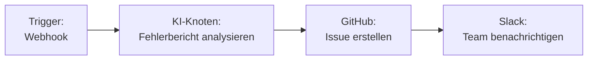
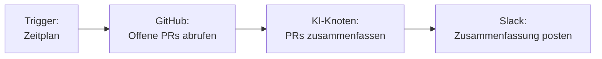

Integrieren Sie GitHub mit Fabric AI, um Issues zu erstellen, Pull Requests zu verwalten, Repositories zu durchsuchen und Entwicklungs-Workflows zu automatisieren — alles über natürliche Sprache oder visuelle Workflow-Builder-Knoten.

## Integrationsmethoden

GitHub verbindet sich auf zwei Arten mit Fabric:

| Methode | Anwendungsfall | Auth |
|--------|----------|------|
| **MCP-Server** | KI-Chat und Orchestrator-Tool-Aufrufe | OAuth oder Personal Access Token |
| **Workflow-Plugin** | Visuelle Workflow-Builder-Knoten | OAuth oder Personal Access Token |

## GitHub einrichten

<Steps>
  <Step>
    ### Authentifizierungsmethode wählen

    **OAuth (Empfohlen)**
    1. Gehen Sie zu **Einstellungen → MCP-Server** (für Chat) oder **Workflow-Builder → Integrationen** (für Workflows)
    2. Wählen Sie **GitHub**
    3. Klicken Sie auf **Mit OAuth verbinden**
    4. Autorisieren Sie Fabric AI im Popup-Fenster
    5. Tokens werden verschlüsselt gespeichert und automatisch erneuert

    **Personal Access Token**
    1. Gehen Sie zu [github.com/settings/tokens](https://github.com/settings/tokens)
    2. Generieren Sie ein neues Token mit `repo`-Berechtigungen
    3. Fügen Sie das Token in die GitHub-Konfiguration in Fabric ein
  </Step>

  <Step>
    ### Verbindung testen

    Klicken Sie auf **Verbindung testen**, um zu überprüfen, ob Ihre Anmeldedaten funktionieren.
  </Step>

  <Step>
    ### Für Ihren Kontext aktivieren

    Wählen Sie, ob dies eine **Persönliche** oder **Organisations**-Verbindung ist. Organisationsverbindungen werden mit allen Mitgliedern geteilt.
  </Step>
</Steps>

## Verfügbare Aktionen

### Im KI-Chat und Orchestrator

Bitten Sie die KI, GitHub-Operationen in natürlicher Sprache auszuführen:

```
"Erstelle ein GitHub-Issue für den Login-Fehler in acme/web-app"

"Suche nach offenen Pull Requests im Frontend-Repository"

"Liste die neuesten Commits im Main-Branch auf"
```

### Im Workflow-Builder

Verwenden Sie GitHub-Knoten in Ihren visuellen Workflows:

| Aktion | Beschreibung | Wichtige Felder |
|--------|-------------|------------|
| **Issue erstellen** | Ein neues Issue in einem Repository öffnen | Eigentümer, Repository, Titel, Inhalt, Labels, Zugewiesene Personen |
| **Pull Request erstellen** | Einen PR mit angegebenem Branch öffnen | Eigentümer, Repository, Titel, Head, Base, Inhalt |
| **Code suchen** | Code in Repositories durchsuchen | Abfrage, Eigentümer, Repository |
| **Repository abrufen** | Repository-Details abrufen | Eigentümer, Repository |

### Template-Variablen

Workflow-Knoten unterstützen dynamische Werte aus vorherigen Schritten:

```
Titel: {{AINode.summary}}
Inhalt: {{AINode.description}}
Labels: {{AINode.labels}}
```

## Häufige Workflow-Muster

### Fehlerbericht zu Issue



### PR-Zusammenfassung an Slack



## Berechtigungen

| Bereich | Erforderlich für |
|-------|-------------|
| `repo` | Vollständiger Repository-Zugriff (Issues, PRs, Code) |
| `read:org` | Organisationsmitgliedschaft (optional) |

## Fehlerbehebung

### „Not Found"-Fehler
- Überprüfen Sie, ob Eigentümer und Name des Repositories korrekt sind
- Stellen Sie sicher, dass Ihr Token den Bereich `repo` für private Repositories hat

### OAuth-Token abgelaufen
- Fabric erneuert OAuth-Tokens automatisch. Bei anhaltenden Problemen trennen und erneut verbinden

### Rate Limiting
- GitHub erlaubt 5.000 Anfragen/Stunde für authentifizierte Benutzer
- Fabric verarbeitet Rate-Limits mit automatischem Backoff

---

## Nächste Schritte

<Cards>
  <Card title="MCP-Integration" href="/docs/integrations/mcp">
    Mehr über das MCP-Protokoll erfahren, das Tool-Verbindungen ermöglicht
  </Card>
  <Card title="Workflow-Builder" href="/docs/features/workflow-builder">
    Visuelle Workflows mit GitHub-Knoten erstellen
  </Card>
</Cards>
