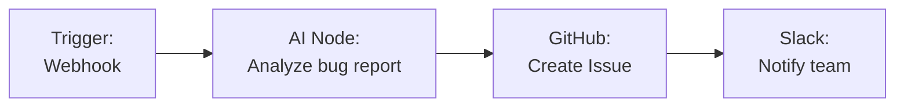
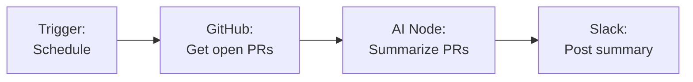

Integrate GitHub with Fabric AI to create issues, manage pull requests, search repositories, and automate development workflows — all through natural language or visual workflow builder nodes.

## Integration Methods

GitHub connects to Fabric in two ways:

| Method | Use Case | Auth |
|--------|----------|------|
| **MCP Server** | AI chat and orchestrator tool calls | OAuth or Personal Access Token |
| **Workflow Plugin** | Visual workflow builder nodes | OAuth or Personal Access Token |

## Setting Up GitHub

<Steps>
  <Step>
    ### Choose Your Authentication Method

    **OAuth (Recommended)**
    1. Go to **Settings → MCP Servers** (for chat) or **Workflow Builder → Integrations** (for workflows)
    2. Select **GitHub**
    3. Click **Connect with OAuth**
    4. Authorize Fabric AI in the popup window
    5. Tokens are stored encrypted and refresh automatically

    **Personal Access Token**
    1. Go to [github.com/settings/tokens](https://github.com/settings/tokens)
    2. Generate a new token with `repo` permissions
    3. Paste the token into the GitHub configuration in Fabric
  </Step>

  <Step>
    ### Test the Connection

    Click **Test Connection** to verify your credentials are working.
  </Step>

  <Step>
    ### Enable for Your Context

    Choose whether this is a **Personal** or **Organization** connection. Organization connections are shared with all members.
  </Step>
</Steps>

## Available Actions

### In AI Chat and Orchestrator

Ask the AI to perform GitHub operations using natural language:

```
"Create a GitHub issue for the login bug in acme/web-app"

"Search for open pull requests in the frontend repo"

"List recent commits on the main branch"
```

### In Workflow Builder

Use GitHub nodes in your visual workflows:

| Action | Description | Key Fields |
|--------|-------------|------------|
| **Create Issue** | Open a new issue in a repository | Owner, Repo, Title, Body, Labels, Assignees |
| **Create Pull Request** | Open a PR with specified branch | Owner, Repo, Title, Head, Base, Body |
| **Search Code** | Search for code across repositories | Query, Owner, Repo |
| **Get Repository** | Fetch repository details | Owner, Repo |

### Template Variables

Workflow nodes support dynamic values from previous steps:

```
Title: {{AINode.summary}}
Body: {{AINode.description}}
Labels: {{AINode.labels}}
```

## Common Workflow Patterns

### Bug Report to Issue



### PR Summary to Slack



## Permissions

| Scope | Required For |
|-------|-------------|
| `repo` | Full repository access (issues, PRs, code) |
| `read:org` | Organization membership (optional) |

## Troubleshooting

### "Not Found" errors
- Verify the repository owner and name are correct
- Ensure your token has `repo` scope for private repositories

### OAuth token expired
- Fabric auto-refreshes OAuth tokens. If issues persist, disconnect and reconnect

### Rate limiting
- GitHub allows 5,000 requests/hour for authenticated users
- Fabric handles rate limits with automatic backoff

---

## Next Steps

<Cards>
  <Card title="MCP Integration" href="/docs/integrations/mcp">
    Learn about the MCP protocol powering tool connections
  </Card>
  <Card title="Workflow Builder" href="/docs/features/workflow-builder">
    Build visual workflows with GitHub nodes
  </Card>
</Cards>
