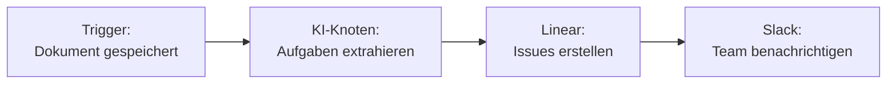
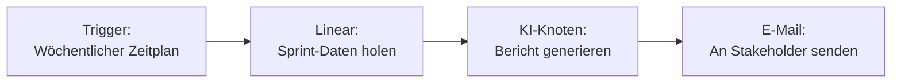

Integrieren Sie Linear mit Fabric AI, um Issues zu erstellen und zu verwalten, Projekte zu verfolgen und Sprint-Workflows direkt aus dem KI-Chat oder dem visuellen Workflow-Builder zu automatisieren.

## Integrationsmethoden

| Methode | Anwendungsfall | Auth |
|--------|----------|------|
| **MCP-Server** | KI-Chat — „Erstelle ein Linear-Issue für..." | API-Schlüssel oder OAuth |
| **Workflow-Plugin** | Automatische Issue-Erstellung und Updates in Workflows | API-Schlüssel |

## Linear einrichten

<Steps>
  <Step>
    ### Ihren API-Schlüssel erhalten

    1. Gehen Sie zu [linear.app/settings/api](https://linear.app/settings/api)
    2. Klicken Sie auf **Create Key**
    3. Benennen Sie ihn (z. B. „Fabric AI Integration")
    4. Kopieren Sie den generierten API-Schlüssel
  </Step>

  <Step>
    ### In Fabric verbinden

    **Für Workflows:**
    1. Öffnen Sie den Workflow-Builder
    2. Fügen Sie einen Linear-Knoten hinzu
    3. Klicken Sie auf **Integration konfigurieren**
    4. Fügen Sie Ihren API-Schlüssel ein

    **Für MCP / Chat:**
    1. Gehen Sie zu **Einstellungen → MCP-Server**
    2. Fügen Sie den Linear MCP-Server hinzu
    3. Geben Sie Ihren API-Schlüssel ein oder verbinden Sie sich über OAuth
  </Step>

  <Step>
    ### Verbindung testen

    Klicken Sie auf **Verbindung testen**, um zu überprüfen, ob Ihr Schlüssel die erforderlichen Berechtigungen hat.
  </Step>
</Steps>

## Verfügbare Aktionen

### Im Workflow-Builder

| Aktion | Beschreibung | Wichtige Felder |
|--------|-------------|------------|
| **Issue erstellen** | Ein neues Linear-Issue erstellen | Team, Titel, Beschreibung, Priorität, Labels, Zugewiesene Person |
| **Issue aktualisieren** | Ein bestehendes Issue aktualisieren | Issue-ID, Status, Priorität, Zugewiesene Person |
| **Issues suchen** | Issues nach Filter abfragen | Team, Status, Zugewiesene Person, Label |

### Im KI-Chat

Verwenden Sie natürliche Sprache für die Interaktion mit Linear:

```
"Erstelle ein Linear-Issue für den Zahlungsabwicklungsfehler — hohe Priorität, dem Backend-Team zuweisen"

"Welche Issues sind im aktuellen Sprint?"

"Verschiebe Issue FE-123 zu Erledigt"
```

### Template-Variablen

```
Titel: {{AINode.issueTitle}}
Beschreibung: {{AINode.issueDescription}}
Priorität: {{ConditionNode.priority}}
```

## Häufige Workflow-Muster

### PRD zu Linear-Issues



### Sprint-Bericht generieren



## Prioritätszuordnung

| Linear-Priorität | Wert |
|----------------|-------|
| Dringend | 1 |
| Hoch | 2 |
| Mittel | 3 |
| Niedrig | 4 |
| Keine Priorität | 0 |

## Fehlerbehebung

### „Authentication failed"
- Überprüfen Sie, ob Ihr API-Schlüssel korrekt ist und nicht widerrufen wurde
- Stellen Sie sicher, dass der Schlüssel von einem Benutzer mit den erforderlichen Berechtigungen erstellt wurde

### Issues werden im falschen Team erstellt
- Überprüfen Sie die Team-ID oder den Teamnamen in Ihrer Knotenkonfiguration
- Verwenden Sie Template-Variablen, um das Team dynamisch auszuwählen

### Fehlende Felder in erstellten Issues
- Einige Felder (wie Labels) erfordern genaue IDs aus Ihrem Linear-Workspace
- Verwenden Sie die Suchwerkzeuge des Linear MCP-Servers, um korrekte IDs zu finden

---

## Nächste Schritte

<Cards>
  <Card title="Workflow-Builder" href="/docs/features/workflow-builder">
    End-to-End-Workflows mit Linear erstellen
  </Card>
  <Card title="Berichte" href="/docs/features/reports">
    Sprint-Berichte aus Linear-Daten generieren
  </Card>
</Cards>
