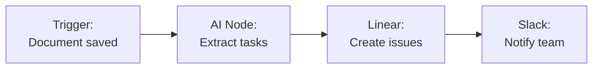
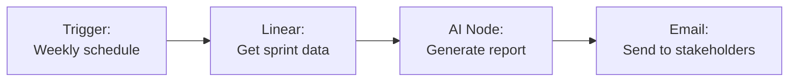

Integrate Linear with Fabric AI to create and manage issues, track projects, and automate sprint workflows directly from AI chat or the visual workflow builder.

## Integration Methods

| Method | Use Case | Auth |
|--------|----------|------|
| **MCP Server** | AI chat — "create a Linear issue for..." | API Key or OAuth |
| **Workflow Plugin** | Automated issue creation and updates in workflows | API Key |

## Setting Up Linear

<Steps>
  <Step>
    ### Get Your API Key

    1. Go to [linear.app/settings/api](https://linear.app/settings/api)
    2. Click **Create Key**
    3. Name it (e.g., "Fabric AI Integration")
    4. Copy the generated API key
  </Step>

  <Step>
    ### Connect in Fabric

    **For Workflows:**
    1. Open the Workflow Builder
    2. Add a Linear node
    3. Click **Configure Integration**
    4. Paste your API key

    **For MCP / Chat:**
    1. Go to **Settings → MCP Servers**
    2. Add the Linear MCP server
    3. Enter your API key or connect via OAuth
  </Step>

  <Step>
    ### Test the Connection

    Click **Test Connection** to verify your key has the required permissions.
  </Step>
</Steps>

## Available Actions

### In Workflow Builder

| Action | Description | Key Fields |
|--------|-------------|------------|
| **Create Issue** | Create a new Linear issue | Team, Title, Description, Priority, Labels, Assignee |
| **Update Issue** | Update an existing issue | Issue ID, Status, Priority, Assignee |
| **Search Issues** | Query issues by filter | Team, Status, Assignee, Label |

### In AI Chat

Use natural language to interact with Linear:

```
"Create a Linear issue for the payment processing bug — high priority, assign to the backend team"

"What issues are in the current sprint?"

"Move issue FE-123 to Done"
```

### Template Variables

```
Title: {{AINode.issueTitle}}
Description: {{AINode.issueDescription}}
Priority: {{ConditionNode.priority}}
```

## Common Workflow Patterns

### PRD to Linear Issues



### Sprint Report Generation



## Priority Mapping

| Linear Priority | Value |
|----------------|-------|
| Urgent | 1 |
| High | 2 |
| Medium | 3 |
| Low | 4 |
| No priority | 0 |

## Troubleshooting

### "Authentication failed"
- Verify your API key is correct and hasn't been revoked
- Ensure the key was created by a user with the necessary permissions

### Issues created in wrong team
- Double-check the Team ID or team name in your node configuration
- Use template variables to dynamically select the team

### Missing fields in created issues
- Some fields (like labels) require exact IDs from your Linear workspace
- Use the Linear MCP server's search tools to find correct IDs

---

## Next Steps

<Cards>
  <Card title="Workflow Builder" href="/docs/features/workflow-builder">
    Build end-to-end workflows with Linear
  </Card>
  <Card title="Reports" href="/docs/features/reports">
    Generate sprint reports from Linear data
  </Card>
</Cards>
