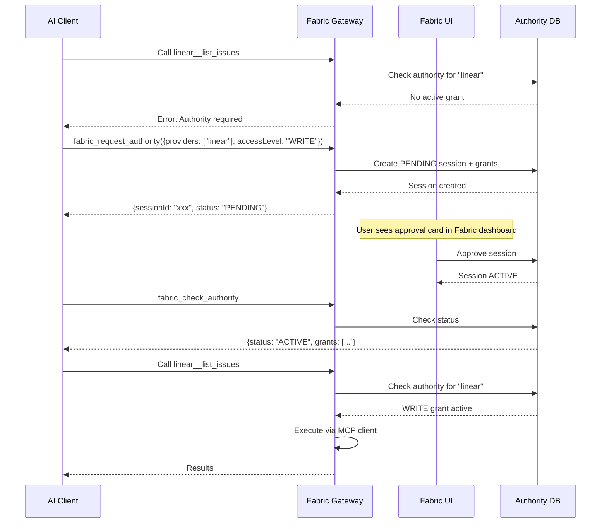

The **Fabric MCP Gateway** turns your entire Fabric instance into a single MCP server. Instead of configuring each tool separately in every AI client, you connect once to Fabric and get access to everything — your projects, documents, workspaces, workflows, and all your connected MCP servers — through one URL.

## Why Use the Gateway?

| Without Gateway | With Gateway |
|---|---|
| Configure each MCP server separately in each client | One URL in your client config |
| Manage API keys per tool per client | Fabric manages all credentials centrally |
| OAuth flows broken in most clients | Fabric handles OAuth + token refresh |
| No visibility across project artifacts | Full access to projects, docs, workspaces |
| Credentials scattered in config files | Credentials encrypted in Fabric, never leave the server |
| No usage controls | Time-limited, human-approved runtime authority |

## Quick Setup

### 1. Create an API Key

Go to **Settings → API Keys** and create a new key. Copy the key — it starts with `fab_`.

<Callout type="info">
For organization context, create the key from your organization settings page.
</Callout>

### 2. Configure Your Client

<Tabs items={["Claude Desktop", "Cursor", "VS Code", "Custom"]}>
  <Tab value="Claude Desktop">
    Edit your `claude_desktop_config.json`:

    ```json
    {
      "mcpServers": {
        "fabric": {
          "url": "https://your-fabric.com/api/mcp-gateway",
          "headers": {
            "Authorization": "Bearer fab_xxxx_xxxxxxxxxx"
          }
        }
      }
    }
    ```
  </Tab>
  <Tab value="Cursor">
    Go to **Settings → MCP Servers → Add Server**:

    - **Name**: Fabric
    - **URL**: `https://your-fabric.com/api/mcp-gateway`
    - **Headers**: `Authorization: Bearer fab_xxxx_xxxxxxxxxx`
  </Tab>
  <Tab value="VS Code">
    Add to your MCP configuration:

    ```json
    {
      "servers": {
        "fabric": {
          "url": "https://your-fabric.com/api/mcp-gateway",
          "headers": {
            "Authorization": "Bearer fab_xxxx_xxxxxxxxxx"
          }
        }
      }
    }
    ```
  </Tab>
  <Tab value="Custom">
    Any MCP-compatible client can connect using the Streamable HTTP transport:

    ```
    Endpoint: POST https://your-fabric.com/api/mcp-gateway
    Auth:     Authorization: Bearer fab_xxxx_xxxxxxxxxx
    Protocol: MCP 2025-03-26 (Streamable HTTP)
    ```

    Health check: `GET /api/mcp-gateway` returns server info (no auth needed).
  </Tab>
</Tabs>

### 3. Organization Context (Optional)

To scope all tools to a specific organization, add the `X-Organization-Id` header:

```json
{
  "headers": {
    "Authorization": "Bearer fab_xxxx_xxxxxxxxxx",
    "X-Organization-Id": "your-org-id"
  }
}
```

Or use `fabric_switch_organization` after connecting to switch context dynamically.

### Coding Instructions

A project's **Coding Instructions** tab publishes one version of its skills, agents, rules,
and setup files, and serves them to a connected client over the tools below. Rather than
building the configuration above by hand, open that tab and click **Connect your agent**: it
mints a read-only key (the `mcp:read` scope, which covers every read-only platform tool,
these three included) and shows the same configuration block.

A connected agent finds them on its own. Every project `fabric_get_project` and
`fabric_list_projects` return carries a `codingInstructions` field — `{ "published": false }`
when there is nothing to load, and the snapshot's `version`, `fileCount`, `digest` and
`publishedAt` when there is. The connection handshake tells the agent what to do with it:
call `fabric_get_project_instruction_bundle` to install the whole approved tree in one step,
or `fabric_list_project_instructions` and `fabric_get_project_instruction` to read individual
files, and follow them while working on that project. The field is omitted entirely for a key
that does not hold the `instructions:read` scope (or a coarse `mcp:read`/`mcp:write`).

Keeping an installed copy current does not always mean downloading it again. Pass the
`digest` you last installed as `sinceDigest` to either
`fabric_get_project_instruction_bundle` or `fabric_list_project_instructions`:

- the digest still matches — you get `"unchanged": true` and nothing else: no file list, no
  manifest, and no zip URL, so nothing is built or transferred. This is the only case that
  short-circuits;
- it has moved on — you get the response you would have got anyway, in full, plus `changes`
  (the added, removed and changed paths) and `since`, the snapshot that digest names.
  `sinceDigest` tells you *what* changed; it does not send you a smaller download;
- Fabric has never published that digest for this project, or has since pruned it — you get
  `"changes": null` alongside the same full response, which means treat it as a fresh
  install.

The Connect dialog also offers a starter sentence to paste into your tool. It is optional
now that the project response advertises the instructions, and useful mainly to point an
agent at one specific project:

```
Use the Fabric MCP server to load the published coding instructions for the project
"Your Project" and follow them while you help me work on it.
```

## What Tools Are Available?

When your client connects, it receives two categories of tools:

### Platform Tools (Always Available)

These give the AI direct access to your Fabric data — no extra setup needed:

| Tool | Description |
|---|---|
| `fabric_get_identity` | See your user context, active organization, and available orgs |
| `fabric_list_organizations` | List all organizations you belong to |
| `fabric_switch_organization` | Switch between personal and org context |
| `fabric_list_projects` | List your projects with filtering and search, each with its published `codingInstructions` |
| `fabric_get_project` | Get full project details, including its published `codingInstructions` |
| `fabric_create_project` | Create a new project |
| `fabric_update_project` | Update project name or description |
| `fabric_list_documents` | List documents in a project (PRDs, specs, etc.) |
| `fabric_get_document` | Get full document content in markdown |
| `fabric_list_project_contexts` | List a project's Context tab sources — uploads, meeting transcripts, crawled links, notes |
| `fabric_get_project_context` | Read one context source in full: transcript text, extracted file text, or crawled markdown |
| `fabric_list_project_instructions` | Browse or search a project's published coding-instruction files, or ask what changed since a `sinceDigest` |
| `fabric_get_project_instruction` | Read one published coding-instruction file by path, paged for large files |
| `fabric_get_project_instruction_bundle` | Install the whole published tree as one zip, and report what changed since a `sinceDigest` |
| `fabric_list_workspaces` | List your knowledge base workspaces |
| `fabric_get_workspace` | Get workspace details and document list |
| `fabric_query_workspace` | Semantic search (RAG) across workspace documents |
| `fabric_list_workflows` | List your automation workflows |
| `fabric_get_workflow` | Get workflow details including nodes and edges |
| `fabric_execute_workflow` | Trigger a published workflow |
| `fabric_get_workflow_execution` | Check workflow execution status |
| `fabric_list_chats` | List recent AI conversations |
| `fabric_list_connected_servers` | See all your connected MCP servers |

### Connected Server Tools (Require Authority)

Every MCP server you've connected in **Settings → MCP Servers** becomes available, namespaced by server name:

```
linear__list_issues       → List issues from your Linear connection
linear__create_issue      → Create an issue in Linear
github__list_repos        → List repos from your GitHub connection
slack__send_message       → Send a message via your Slack connection
notion__search            → Search your Notion workspace
fizzy__get_cards          → Get cards from Fizzy boards
```

<Callout type="warn">
Connected server tools require **runtime authority** before use. See [Runtime Authority](/docs/core-concepts/runtime-authority) for details.
</Callout>

### Per-User Tool Visibility

Each user only sees tools from MCP servers **they personally connected** in their current context:

- **User A** connected Fizzy only → sees `fizzy__*` tools
- **User B** connected Linear + Fizzy → sees `linear__*` + `fizzy__*` tools
- In **org context** → sees tools from servers connected within that organization
- Personal connections never appear in org context, and vice versa

## Runtime Authority

Connected server tools are protected by **runtime authority** — a Pipes-style session-scoped authorization model. This means:

1. **Credentials are persistent** — your MCP server connections stay configured
2. **Runtime access is ephemeral** — AI agents must request temporary permission before using tools
3. **Approval is human-only** — agents can request authority, but only humans can approve it

### The Authority Flow



### Authority Tools

| Tool | Description |
|---|---|
| `fabric_request_authority` | Request access to providers (e.g., `linear`, `github`) with READ or WRITE level and TTL |
| `fabric_check_authority` | Check which providers are currently authorized |
| `fabric_revoke_authority` | End all active authority immediately |

### Authority Metadata in tools/list

Connected tools include metadata indicating their authority status:

```json
{
  "name": "linear__list_issues",
  "description": "[Linear] List issues",
  "_meta": {
    "requiresAuthority": true,
    "authorityStatus": "granted",
    "providerKey": "linear"
  }
}
```

For more details, see [Runtime Authority](/docs/core-concepts/runtime-authority).

## Example Conversations

### Cross-Platform Project Sync

> "Show me the features in the Acme project, then create a Linear issue for each one that doesn't have a corresponding ticket"

The AI will:
1. `fabric_list_projects` → find Acme
2. `fabric_list_documents` → get feature docs
3. `fabric_request_authority` for Linear (WRITE)
4. Wait for your approval in Fabric UI
5. `linear__list_issues` → compare with features
6. `linear__create_issue` → create missing tickets

### Research From Project Context

> "Read the last two design meetings on the Acme project and tell me what we decided about rate limiting"

The AI will:
1. `fabric_list_projects` → find Acme
2. `fabric_list_project_contexts` with `type: "MEETING_TRANSCRIPT"` → list the synced transcripts
3. `fabric_get_project_context` on the two most recent → read the transcript text
4. Answer from the transcripts, paging with `nextOffset` if a transcript is long

This is the same material the Context tab's **Download All** export covers. Two things
to know before you rely on it:

- Repository code-index entries (`CODE_FILE`, `CODE_FILE_SUMMARY`) are hidden from an
  unfiltered listing — an indexed repo produces thousands. Pass `includeCodeContexts: true`
  or filter by that type to see them.
- A context that pins a **monitored** Teams or Slack conversation carries no transcript of
  its own: those messages are analysed into backlog proposals rather than stored on the
  context. Such rows come back with `contentAvailable: false` and an `unavailableReason`
  saying so, rather than an empty body.

### Knowledge Base Search

> "Search the engineering workspace for our database migration strategy and summarize the key decisions"

The AI will:
1. `fabric_list_workspaces` → find engineering workspace
2. `fabric_query_workspace` → semantic search for "database migration strategy"
3. Return a summary based on the matching document chunks

### Workflow Execution

> "Run the weekly report workflow and send the output to #team-updates on Slack"

The AI will:
1. `fabric_list_workflows` → find weekly report
2. `fabric_execute_workflow` → trigger it
3. `fabric_get_workflow_execution` → wait for completion
4. `fabric_request_authority` for Slack (WRITE)
5. `slack__send_message` → post the results

## Protocol Details

The gateway implements the **MCP 2025-03-26 Streamable HTTP** transport:

| Method | Endpoint | Purpose |
|---|---|---|
| `POST` | `/api/mcp-gateway` | JSON-RPC requests (`initialize`, `tools/list`, `tools/call`) |
| `GET` | `/api/mcp-gateway` | Server info (health check) |
| `DELETE` | `/api/mcp-gateway` | Terminate session |

### Session Management

- Sessions are created automatically on first request
- Session ID is returned in the `Mcp-Session-Id` response header
- Sessions last 24 hours
- Active authority sessions are completed when the gateway session ends

### Authentication

| Method | Header | Use Case |
|---|---|---|
| API Key | `Authorization: Bearer fab_xxx` | External clients (recommended) |
| Session Cookie | Automatic | Browser-based clients |

---

## Next Steps

<Cards>
  <Card title="MCP Authority & Security" href="/docs/core-concepts/mcp-authority">
    Complete security guide: credentials, authority, stake levels, and audit
  </Card>
  <Card title="Runtime Authority" href="/docs/core-concepts/runtime-authority">
    Deep dive into the session-scoped authorization model
  </Card>
  <Card title="MCP Integration" href="/docs/integrations/mcp">
    Learn about connecting MCP servers to Fabric
  </Card>
  <Card title="API Reference" href="/docs/api/mcp-gateway">
    Full API reference for the MCP Gateway
  </Card>
</Cards>
