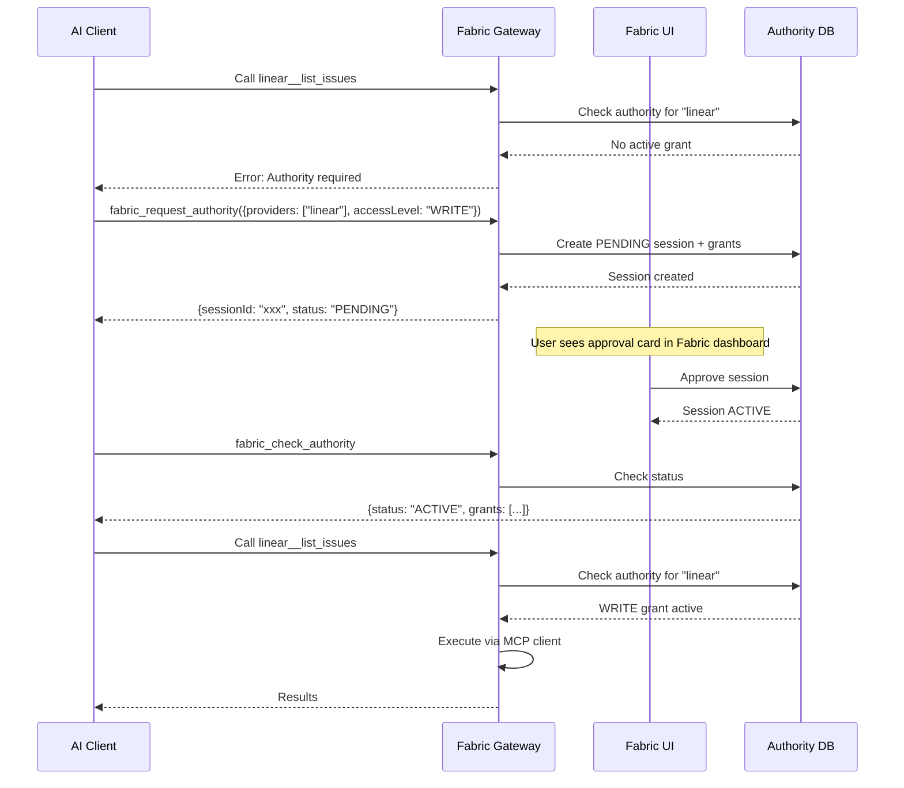

The **Fabric MCP Gateway** turns your entire Fabric instance into a single MCP server. Instead of configuring each tool separately in every AI client, you connect once to Fabric and get access to everything — your projects, documents, workspaces, workflows, and all your connected MCP servers — through one URL.

## Why Use the Gateway?

| Without Gateway | With Gateway |
|---|---|
| Configure each MCP server separately in each client | One URL in your client config |
| Manage API keys per tool per client | Fabric manages all credentials centrally |
| OAuth flows broken in most clients | Fabric handles OAuth + token refresh |
| No visibility across project artifacts | Full access to projects, docs, workspaces |
| Credentials scattered in config files | Credentials encrypted in Fabric, never leave the server |
| No usage controls | Time-limited, human-approved runtime authority |

## Quick Setup

### Sign in from your coding agent

Connect from the project you want the agent to work on. The project has its own
gateway URL, `https://your-fabric.com/api/mcp-gateway/projects/<project-id>`:
add it to your tool with no key, then sign in from the tool. The first request
is answered `401` with a `WWW-Authenticate` challenge naming that URL's sign-in
metadata, the tool opens your browser, and you approve the tool once. You are
never asked to choose an organization or a project: the URL already says which.
The project's **Connect your agent** dialog shows the same entries with your
deployment's URL and the project filled in.

<Tabs items={["Claude Code", "VS Code", "Cursor", "Codex", "Other"]}>
  <Tab value="Claude Code">
    Run it in the project's folder:

    ```bash
    claude mcp add --scope local --transport http fabric-<end-of-project-id> https://your-fabric.com/api/mcp-gateway/projects/<project-id>
    ```

    The server is named `fabric-` and the last six letters and digits of the project's id, the same name Codex and `fabric instructions init` use, so a server added from the dialog is the one `init` finds. A server you already named `fabric` that points at this project keeps working and is not duplicated. Then run `/mcp` in Claude Code and choose **Authenticate**.
  </Tab>
  <Tab value="VS Code">
    Use **Add to VS Code** in the Connect dialog, or add the server to your MCP
    configuration with no headers. VS Code installs the server for every folder
    it opens, so the Connect dialog names it after the project and the end of
    its id (`fabric-<project-name>-<id>`), and two projects do not collide, even
    when they share a name:

    ```json
    {
      "servers": {
        "fabric-example-project-a1b2c3": {
          "type": "http",
          "url": "https://your-fabric.com/api/mcp-gateway/projects/<project-id>"
        }
      }
    }
    ```

    VS Code asks you to sign in the first time the server starts.
  </Tab>
  <Tab value="Cursor">
    Use **Add to Cursor** in the Connect dialog, or add a server with only the
    project's URL, `https://your-fabric.com/api/mcp-gateway/projects/<project-id>`.
    Cursor installs it for every folder it opens, so the Connect dialog names
    it `fabric-<project-name>-<id>`, with the end of the project's id so two
    projects of one name stay apart. Cursor opens the browser to sign in.
  </Tab>
  <Tab value="Codex">
    Codex keeps one list of servers for every project on the machine, so the
    Connect dialog names this project's server `fabric-` and the last six letters
    and digits of its id (`fabric-ewrite` for `project-checkout-rewrite`), and
    `fabric instructions init` registers the same name. Two projects then stay
    apart in Codex's list:

    ```bash
    codex mcp add fabric-<end-of-project-id> --url https://your-fabric.com/api/mcp-gateway/projects/<project-id>
    ```

    The command opens your browser to sign in and finishes once you approve. If
    the sign-in did not finish, run `codex mcp login fabric-<end-of-project-id>`.
  </Tab>
  <Tab value="Other">
    Any client that implements MCP authorization works from the server entry
    alone. It contains no credential, so a project can commit it as `.mcp.json`:

    ```json
    {
      "mcpServers": {
        "fabric": {
          "type": "http",
          "url": "https://your-fabric.com/api/mcp-gateway/projects/<project-id>"
        }
      }
    }
    ```
  </Tab>
</Tabs>

What you approve is the same for every tool, and it is for that project alone:
read the project, its features and bugs and their decisions and revisions, its
documents, its context, and search its knowledge; read its coding instructions;
and suggest changes to them, held for review and never published by the agent.
The consent
page names the project and its organization, and what you approve is exactly
what the page showed: if the connection changes while the page is open, nothing
is approved and the tool has to start the sign-in again. The agent works on that
project and nothing else in Fabric: the gateway offers it the project's tools
only, and no organization-wide tool and no connected server's. A token issued
for one project works only at that project's URL, so it cannot be pointed at
another project or at the organization-wide gateway. If you can no longer open
the project, the agent's next request is refused.

The tool stays signed in until you revoke it under **Account → Connected
agents**, which lists one row per project and organization grant and signs the
tool out of it at its next request. To work on another project, connect from
that project.

<Callout type="info">
A client must send the project's URL as the `resource` of its authorization, as
the MCP authorization specification requires. The sign-in metadata at
`/.well-known/oauth-protected-resource/api/mcp-gateway/projects/<project-id>`
names exactly that URL, and a project URL never falls back to an
organization-wide sign-in.
</Callout>

#### The organization-wide gateway

Connections made before projects had their own URL, at
`https://your-fabric.com/api/mcp-gateway`, keep working unchanged: they are
signed in for one organization, which is chosen on the sign-in page when you
belong to several, and reach all of its projects. The Connect dialog no longer
offers it. A token issued for one project is refused there, and the refusal
names the project's URL to use instead.

The sign-in page shows the organization it will use, and what you approve is
exactly what the page showed: if the organization the server would use differs,
nothing is approved and the tool has to start the sign-in again. `mcp:read`,
the scope behind "Read this organization's projects and context", covers that
organization's projects, features and bugs with their decisions and revisions,
documents, project context, coding instructions, workspaces, workflows and
frames, plus the list of connected servers. It does not cover your personal AI
chats, and the identity tools list only the organization you signed in for.
An OAuth sign-in never holds `mcp:write`, so it cannot call a connected server's
tools unless that server declares them read-only.

### Or use an API key (CI and headless)

Where nobody can approve a sign-in in a browser, authenticate with a key.

#### 1. Create an API Key

Go to **Settings → API Keys** and create a new key. Copy the key — it starts with `fab_`.

<Callout type="info">
For organization context, create the key from your organization settings page.
</Callout>

#### 2. Configure Your Client

<Tabs items={["Claude Desktop", "Cursor", "VS Code", "Custom"]}>
  <Tab value="Claude Desktop">
    Edit your `claude_desktop_config.json`:

    ```json
    {
      "mcpServers": {
        "fabric": {
          "url": "https://your-fabric.com/api/mcp-gateway",
          "headers": {
            "Authorization": "Bearer fab_xxxx_xxxxxxxxxx"
          }
        }
      }
    }
    ```
  </Tab>
  <Tab value="Cursor">
    Go to **Settings → MCP Servers → Add Server**:

    - **Name**: Fabric
    - **URL**: `https://your-fabric.com/api/mcp-gateway`
    - **Headers**: `Authorization: Bearer fab_xxxx_xxxxxxxxxx`
  </Tab>
  <Tab value="VS Code">
    Add to your MCP configuration:

    ```json
    {
      "servers": {
        "fabric": {
          "url": "https://your-fabric.com/api/mcp-gateway",
          "headers": {
            "Authorization": "Bearer fab_xxxx_xxxxxxxxxx"
          }
        }
      }
    }
    ```
  </Tab>
  <Tab value="Custom">
    Any MCP-compatible client can connect using the Streamable HTTP transport:

    ```
    Endpoint: POST https://your-fabric.com/api/mcp-gateway
    Auth:     Authorization: Bearer fab_xxxx_xxxxxxxxxx
    Protocol: MCP 2025-03-26 (Streamable HTTP)
    ```

    Health check: `GET /api/mcp-gateway` returns server info (no auth needed).
  </Tab>
</Tabs>

#### 3. Organization Context (Optional)

A personal API key (`fab_`) belongs to you, not to an organization. If you belong to
more than one, name the organization the connection should start in with the
`X-Organization-Id` header:

```json
{
  "headers": {
    "Authorization": "Bearer fab_xxxx_xxxxxxxxxx",
    "X-Organization-Id": "your-org-id"
  }
}
```

Fabric checks that you are a member of that organization and refuses the request
otherwise. The header chooses where the connection starts. It does not confine the
key: a personal key can still move between your organizations with
`fabric_switch_organization`, and a browser session follows the organization you are
working in. A connection that must stay in one organization uses an organization API
key (`org_`) or an OAuth sign-in. Both are fixed to one organization when they are
issued, ignore this header, and cannot switch.

### Coding Instructions

A project's **Coding Instructions** tab publishes one version of its skills, agents, rules,
and setup files, and serves them to a connected agent over the six tools below. The files
come from one of two places: a folder uploaded in Fabric, or a branch of the project's
repository that Fabric keeps in sync.

#### Connect a tool from the tab

Open the tab and choose **Connect your agent**, beside **Fabric MCP** in the status strip
under the heading. The dialog has one tab for each of five tools, **Claude Code**,
**Codex**, **VS Code**, **Cursor** and **Other**, and one action for each. You approve the
connection once in your browser: there is no key to create or paste.

| Tab | What you do | What it sets up |
|---|---|---|
| **Claude Code** and **Codex** | Copy the one line shown and run it (see below) | The Fabric CLI your deployment serves, run straight from its URL, so nothing is installed first. It signs in through your browser, finds the project, and adds a session-start hook for that tool |
| **VS Code** and **Cursor** | Choose **Add to VS Code** or **Add to Cursor** | The gateway as an MCP server. There is no hook; the agent compares its checkout with the published version at each session start |
| **Other** | Copy the server entry (it holds no credential) | Any MCP client that supports sign-in asks you to approve it the first time it connects |

**The setup line.** For Claude Code and Codex the dialog shows one line per case, with
`<tool>` the tab you are on (`claude-code` or `codex`) and `<tgz>` your deployment's
tarball, `https://your-fabric.com/cli/fabric-<version>-<build>.tgz`. You need Node.js 22 or
later and nothing else: `npx` comes with it.

- **Already cloned.** `npx -y <tgz> instructions init --tool <tool>`. Run it in the top
  folder of your clone of the project's repository, or, when the project's instructions
  live in a folder of that repository, in that folder (`<rootPath>/` inside the clone). Not
  in any other folder: the CLI refuses and says where to go. It finds the project from the
  checkout's git remote.
- **Clone it for me.** One command, `npx -y <tgz> instructions init --project <id> --tool <tool> --clone <dir>`.
  It makes `<dir>` (a folder that does not exist yet, or is empty), clones the project's
  repository into it with your own git credentials, and finishes setting up inside it, in
  the project's own folder when the instructions live in a subfolder. Open your coding tool
  in that folder afterwards.
- **An upload project** has no repository to find it from, so its line names the project:
  `npx -y <tgz> instructions init --project <id> --tool <tool>`. Run it in the folder your
  agent works in.

Each is one command with no `&&` and no `cd`, so it runs in Windows PowerShell 5.1 as well as
bash. The dialog adds `--base-url https://your-fabric.com`, the address you are on, unless the
CLI was built for exactly that address (see below), so the line works on any deployment with
nothing configured. After it runs, the CLI opens your browser to approve the connection once.
Run by an agent with no terminal, it prints the URL for you to open and waits up to five
minutes for you to finish. Under `CI` it starts no browser sign-in at all: it stops and names
the sign-in command, so a CI run signs in with an API key (below).

Your checkout uses your own git credentials; Fabric never hands out repository credentials.
If git cannot sign in to the repository yet, the dialog's
**Git can't sign in to the repository** section shows how to sign git in for the provider:
`gh auth login` for GitHub, `glab auth login` for GitLab, and for Azure DevOps one
`git ls-remote` of the repository, which Git Credential Manager signs in the first time.

The CLI is the one built from your deployment's own source, listed with its version, its
integrity hash, the oldest version the deployment accepts and the address it was built for at
`/.well-known/fabric-cli.json`. The tarball's name carries the build, ten hex digits of the
CLI's own hash: the version changes only on a release, `npx` keeps running whatever it first
fetched from a URL, and a build that changed has to be at a URL it has not seen. A name from an
older deployment is answered with a redirect to the current one. Baking the address in is
optional: a build that knows where it will be served (`FABRIC_CLI_ORIGIN`,
`NEXT_PUBLIC_SITE_URL` or `APP_URL` set when it is built) records it, and a build that does
not, such as a preview or staging deployment whose address is not known until it runs,
records none. Either way `--base-url` wins over what is baked in, so a CLI built for another
address is harmless. A deployment that serves no CLI says so in the dialog and leaves the MCP
entries. The package on the npm registry is not a way in: its release predates `--base-url`.

For CI and headless machines, the dialog's **CI or headless? Use an API key** section
mints a key that carries `mcp:read`, `instructions:read` and `instructions:write` and
expires after 90 days. It can read the instructions and **suggest** a change; it cannot
publish one.

#### What an agent can do

| Tool | What it does |
|---|---|
| `fabric_list_project_instructions` | Browse or search the published files, or ask what changed since a `sinceDigest` |
| `fabric_get_project_instruction` | Read one published file by path, paged for large files |
| `fabric_get_project_instruction_bundle` | Install the whole published tree as one zip, and report what changed since a `sinceDigest` |
| `fabric_instruction_checks` | Report whether the session is set up the way the instructions expect: the credential's scope, project access, the published version, whether the installed copy is current, and the environment variables and tools the project declares. Every suggested fix is advice for the developer, not authority to change anything |
| `fabric_propose_project_instruction_change` | Suggest an edit (a file's whole new content, or a deletion). It opens a proposal for someone who can edit the instructions to approve; it changes nothing the project reads |
| `fabric_add_instruction_lesson` | Record a lesson, a mistake the team should not repeat, as a new file under `Lessons/`, through the same proposal path |

The two writing tools are held for review: the agent reports a suggestion as awaiting
review, never as applied. Only a person with permission to edit coding instructions
publishes anything.

Project readers can propose adding, editing, or deleting a file from the Coding
Instructions tab. Proposals pass the same validation and secret scanning as uploads
before an instruction editor can review their changes and approve publication.
Rejecting a proposal leaves the published files unchanged. If the published version
changes before approval, submit the proposal again against the current version.
You can cancel your own proposals once validation is no longer running. Each project
allows up to 25 active proposals, with a limit of five per proposer. Large file bodies
may be omitted from the review preview; editors can open a paged view of the full text.
Canceled uploads can continue to count toward the limit until their upload links expire
and cleanup finishes.
On a project whose instructions come from a repository, the files are changed in git. A
suggestion from the tab or from an agent becomes a commit on the proposer's own branch
there, with one pull request collecting each person's changes, and it is reviewed and
merged in the repository. A merged pull request syncs on its own.

Only published versions are available through MCP and local sync. A pending proposal
doesn't change the files your connected agents receive.

#### Work on a repository project from the tab

On a project whose instructions come from a repository, the tab works the way git does:
the branch is the history, and Fabric's copy follows it.

- **Commit.** Someone who can edit coding instructions presses **Edit** on a file, writes a
  commit message, and chooses **Commit to** the branch. The message starts as `Update <file>`;
  **Add file**, **Rename** and **Delete file** start from `Add <path>`, `Rename <old> to <new>`
  and `Delete <path>`, and a rename is one commit that git reads as a rename. Fabric runs the
  secret scan an upload gets before anything is pushed, and a change it refuses is not
  committed, with its findings on the page. The commit names you as author, with a Fabric
  no-reply address, and Fabric as committer. Fabric's copy takes the commit a few seconds
  later, from a sync of the branch's real files, and the status block says so until it has.
- **Suggest as a pull request.** The alternative to committing, and the only choice for a
  reader once the project lets read-only members propose. If the branch is protected, or keeps
  moving, Fabric opens the pull request for you and links it. If a teammate changed the same
  file since you started, nothing is written: you choose between retrying the commit,
  suggesting it as a pull request and cancelling, and what you typed stays.
- **Commits.** The button that is **History** on an upload project reads **Commits** here: the
  branch's own history within the synced folder, newest first, 30 at a time. Each row has the
  short commit (a link to GitHub, GitLab or Azure DevOps), its author, its age and its subject,
  and is marked **Published** when Fabric's copy is of it, **Refused by scan** when the secret
  scan refused its files, or **Not synced yet** when it is newer than the published commit and
  Fabric has not taken it. A commit message that looks like it contains a secret is shown as
  withheld. Nothing in Commits publishes, rolls back to or deletes a version: Fabric's copy
  follows the branch.
- **Revert.** Undoes a commit with a new commit on the branch, as `git revert` does. It is
  refused, with the reason, when a later commit changed the same files, when a file it would
  restore looks like it contains a credential, for a merge commit or a repository's first
  commit, and on a protected branch, where you revert in the repository instead.
- **Compare with parent.** Shows what a commit changed within the synced folder: the files
  added, removed and changed, and a line diff of each changed file once you open it. A file
  Fabric will not show (it is in a commit the secret scan refused, it holds a secret, it is not
  text, or it is too large) is described in one line instead of a diff. Comparing needs the same
  right as committing; everyone who can read the tab sees the commits themselves.

A project in Read-only mode makes no commit and no revert from Fabric, whatever the member's
role, and says so; suggesting and reading are unchanged.

#### Move uploaded instructions into a repository

An upload project can hand its published files to a repository without anyone copying them.
**Settings** offers **Move to a repository…** to a member who can create and update coding
instructions, once something is published and a repository is connected to the project.

- **Start.** Choose the repository, the branch and a folder. The folder must not hold any
  files yet, and a new folder is fine; leave it empty to put the files at the repository
  root, as long as they would not overwrite anything there. Fabric opens one pull request
  carrying the published files. It refuses, with the reason, a folder that already has files,
  a project that already has a repository sync set up, and a project with nothing published.
- **While it is open.** The status under the summary follows the pull request: *Preparing the
  pull request…* while it is opened, then the repository, the branch and the pull request
  awaiting its merge, with a link to it. The instructions stay as published until it merges.
  Uploads, edits, publishing, ignore rules, repository settings, reverts and manual syncs
  are paused, and each says why: *Moving to the repository: pull request #n is open*.
  Everyone who reads the tab sees the status; **Cancel move** is for members who can create
  and update.
- **If it is blocked.** The status gives the reason in a sentence and offers **Retry** when a
  retry can help. A failure no retry can fix says to cancel the move and start it again. If
  the project was switched to the repository by something other than the move, Cancel move
  and Retry are refused and the status says so: the only way out is **Switch to upload mode**
  in Settings.
- **When it merges.** The status reads *Merged — switching the project to the repository…*
  until the first sync from the repository has succeeded. The repository is then the source
  of truth and the tab works as on any repository project. If the pull request is closed
  without merging, the move ends, the instructions stay as published, and the tab says so
  once. A pull request that was merged into a different branch than the one the project
  reads ends the move the same way: Fabric does not sync it, and the status says it was
  merged into another branch.
- **If the first sync cannot finish.** While the project is switching over, **Switch to
  upload mode** in Settings ends the move and gives the tab back its uploads. It is offered
  only while a move is switching over or blocked, and nowhere else a move is open; whatever
  was already merged in the repository stays there.
- **Cancel.** **Cancel move** closes the pull request without merging it and gives the tab its
  controls back. A pull request that has already merged cannot be canceled: its files are in
  the repository and the project is switching to them.

#### Keep a checkout current

The session-start hook asks, every time a Claude Code or Codex session starts, whether the
published version moved, and tells the agent when it did.

- **A project that syncs from a repository.** The hook fast-forwards the branch the project
  follows to its newest commit when your checkout is clean and on that branch. It is a
  fast-forward and nothing else: it never merges, rebases, resets or stashes, and when it
  cannot (uncommitted changes, another branch, a detached `HEAD`, a diverged history, a
  shallow clone) it leaves the checkout exactly as it was and prints one line saying why.
  `init --report-only` writes a hook that only reports and never fetches.
- **An upload project.** The hook reports when the published instructions changed; it applies
  nothing unless `init` was given `--apply`.

Codex asks whether to trust the folder the first time it opens it. Trust it, then run `/hooks`
once to trust the project hook. VS Code and Cursor have no hook, so the agent makes the
comparison through `fabric_instruction_checks` at the start of a session. An agent connected
over MCP only reports: it never pulls, and the pull itself stays with you.

**What setup leaves on your machine, and how to check it and undo it.** Two things, and
neither is in your repository's history:

- A hook entry in the checkout: `.claude/settings.local.json` for Claude Code,
  `.codex/hooks.json` for Codex. `init` adds both files to the repository's own
  `.git/info/exclude`. The entry is a `SessionStart` command that starts with `node`, then the
  CLI's own copy, then `instructions check` (or `sync`) with your project and your deployment.
- That copy of the CLI, one file per deployment: `cli/<deployment>/fabric.mjs` inside the
  CLI's config folder (`%APPDATA%\fabricai-nodejs\Config` on Windows,
  `~/.config/fabricai-nodejs` on Linux, `~/Library/Preferences/fabricai-nodejs` on macOS).
  It is why the hook works with no `fabric` command installed. Each run of the setup line
  replaces it, and the copy also keeps itself current (below). A small
  `update-check.json` beside it records when it last asked.

**The copy updates itself.** Once a day, at the end of a session-start hook run and after the
hook has printed what it has to say, the copy asks the deployment the hook is bound to which
CLI it serves now. When that is a different build from the one running, the copy downloads it
from that deployment, checks it against the integrity hash the deployment publishes, and
replaces itself. The new copy runs from the next session. Only that deployment is ever asked
(over `https`, or plain `http` to `localhost` for a deployment you run yourself), nothing
downloaded is run, and only the copy and its `update-check.json` are written, inside the CLI's
config folder. It only runs when at least five seconds of the hook's ten-second limit are
still unspent, and any failure (no network, a hash that does not match, a copy another session
holds open) leaves the earlier copy as it was, prints at most one line on stderr and never
touches the hook's own output. To turn it off, set `FABRIC_CLI_NO_SELF_UPDATE=1`; it is also
off whenever `CI` is set. Run the setup line again to update by hand.

When a message from the CLI tells you to run a command, it gives the short `npx` line for the
deployment, even from the copy the hook runs. That line keeps working after the deployment
moves on, because a tarball name it served earlier answers with a redirect to the current one.

To check it, run the setup line's CLI with `instructions doctor --project <id>`: it reads the
hook entry, says whether it is in the form this CLI would write, and warns when the file it
runs is gone. To undo it, delete the project's `instructions check` or `instructions sync`
entry from the hook file (and its `lesson-prompt` entry, if you set up lesson capture), and
delete the deployment's folder under `cli/` if no other checkout uses it. `auth logout`
removes the saved sign-in.

The tab says the other half. For a repository project, a status block under the summary
states which version, commit and branch are published, whether Fabric's copy is current or
was held back because a commit was refused by the secret scan (with a link to the
findings), and whether automatic sync is on. Your own checkout is not tracked there: the
hook in your coding tool is what tells you when it is behind.

A connected agent finds them on its own. Every project `fabric_get_project` and
`fabric_list_projects` return carries a `codingInstructions` field — `{ "published": false }`
when there is nothing to load, and the snapshot's `version`, `fileCount`, `digest` and
`publishedAt` when there is. The connection handshake tells the agent what to do with it:
call `fabric_get_project_instruction_bundle` to install the whole approved tree in one step,
or `fabric_list_project_instructions` and `fabric_get_project_instruction` to read individual
files, and follow them while working on that project. The field is omitted entirely for a key
that does not hold the `instructions:read` scope (or a coarse `mcp:read`/`mcp:write`).

Keeping an installed copy current does not always mean downloading it again. Pass the
`digest` you last installed as `sinceDigest` to either
`fabric_get_project_instruction_bundle` or `fabric_list_project_instructions`:

- the digest still matches — you get `"unchanged": true` and nothing else: no file list, no
  manifest, and no zip URL, so nothing is built or transferred. This is the only case that
  short-circuits;
- it has moved on — you get the response you would have got anyway, in full, plus `changes`
  (the added, removed and changed paths) and `since`, the snapshot that digest names.
  `sinceDigest` tells you *what* changed; it does not send you a smaller download;
- Fabric has never published that digest for this project, or has since pruned it — you get
  `"changes": null` alongside the same full response, which means treat it as a fresh
  install.

You do not need to tell the agent any of this: the connection handshake already carries it.
To point an agent at one specific project in a chat, name the project and ask it to load
that project's coding instructions.

### Bootstrap a Project

A new project's **Context** tab is often empty, which leaves Fabric's AI features little to
work from. A connected coding agent can fill it from the repository you already have open: it sets the project's description, then pushes your README and key docs as
knowledge sources. The connection handshake tells the agent to offer this when a project's
`fabric_list_project_contexts` comes back with few or no sources.

The flow uses two tools. `fabric_update_project` sets the description, and
`fabric_upsert_project_context` pushes one file per call, keyed by the file's path in the
repository:

```
{ "name": "fabric_update_project",
  "arguments": { "projectId": "proj_example", "description": "Billing service: invoicing, payment retries and dunning." } }

{ "name": "fabric_upsert_project_context",
  "arguments": { "projectId": "proj_example", "sourcePath": "README.md", "content": "# Billing service\n..." } }

{ "name": "fabric_upsert_project_context",
  "arguments": { "projectId": "proj_example", "sourcePath": "docs/architecture.md", "content": "# Architecture\n..." } }
```

Pushed files appear in the project's **Context** tab under **Living Memory**, grouped by the
folder of their path.

Pushing the same path again with the same content answers `unchanged` and writes nothing,
and content identical to a source already in the project — another pushed file, or a file,
link or note added in the Context tab — answers `duplicate`. To replace a
file that is already there, the agent passes the `contentHash` it read from
`fabric_get_project_context` or `fabric_list_project_contexts` as `expectedContentHash`; if
someone else has changed the file since, the push answers `conflict` with the current hash and
who changed it, and nothing is overwritten. If the file was deleted since, the push answers
`conflict` with `current` set to `null`; call again without `expectedContentHash` to recreate it,
which answers `duplicate` instead if that content already exists elsewhere in the project.
When a file was renamed or moved without changing, push it at its new path with the old path as
`movedFromSourcePath` and the old path's `contentHash` as `expectedContentHash`: the stored source
is renamed in place and answers `moved`, keeping its history, instead of leaving a second copy
behind.

Coding-instruction files — `CLAUDE.md`, `AGENTS.md`, anything under `.claude/`, and skills,
agents, hooks, rules and scripts — do not go through this flow. The agent proposes those with
`fabric_propose_project_instruction_change`, which opens a proposal on the Coding Instructions
tab for a person to review. The agent should also leave out secrets, `.env` files and
generated output.

Pushing context needs a key with the `projects:write` or `mcp:write` scope — the key
that **Connect your agent** mints cannot do it — and, as with every key, your own permission to
add context sources to that project. If those docs already sit together in one folder, the
Fabric CLI can push the whole folder instead: `fabric context push <dir> --project <id>` sends
each text file by its path with the same `unchanged`, `duplicate` and `conflict` answers, and
remembers what it sent so that later runs send only what changed. It needs the same
`projects:write` scope. To start the agent flow, paste a sentence like this into your agent:

```
Use the Fabric MCP server to bootstrap the context for the project "Your Project" from this
repository: set its description and push the README and key docs, and tell me what you pushed.
```

## What Tools Are Available?

When your client connects, it receives two categories of tools:

### Platform Tools (Always Available)

These give the AI direct access to your Fabric data — no extra setup needed:

| Tool | Description |
|---|---|
| `fabric_get_identity` | See your user context, active organization, and available orgs |
| `fabric_list_organizations` | List all organizations you belong to |
| `fabric_switch_organization` | Switch between personal and org context |
| `fabric_list_projects` | List your projects with filtering and search, each with its published `codingInstructions` |
| `fabric_get_project` | Get full project details, including its published `codingInstructions` |
| `fabric_create_project` | Create a new project |
| `fabric_update_project` | Update project name or description |
| `fabric_search_project_knowledge` | Search feature descriptions, document contents, and available project source text with ranked excerpts |
| `fabric_list_documents` | List documents in a project (PRDs, specs, etc.) |
| `fabric_get_document` | Get full document content in markdown |
| `fabric_list_project_contexts` | List a project's Context tab sources — uploads, meeting transcripts, crawled links, notes |
| `fabric_get_project_context` | Read one context source in full: transcript text, extracted file text, or crawled markdown |
| `fabric_upsert_project_context` | Push a text file into a project's Context by its relative path: unchanged content is skipped, changed content replaces the stored version and is re-indexed, and replacing a file requires the `contentHash` you last read so nobody's edit is silently overwritten |
| `fabric_list_project_instructions` | Browse or search a project's published coding-instruction files, or ask what changed since a `sinceDigest` |
| `fabric_get_project_instruction` | Read one published coding-instruction file by path, paged for large files |
| `fabric_get_project_instruction_bundle` | Install the whole published tree as one zip, and report what changed since a `sinceDigest` |
| `fabric_instruction_checks` | Check that this session is set up the way the project's coding instructions expect: scope, access, published version, whether your installed copy is current, and the variables and tools the project declares |
| `fabric_propose_project_instruction_change` | Suggest an edit to the published coding instructions; held for review, never published by the agent |
| `fabric_add_instruction_lesson` | Record a lesson as a new file under `Lessons/`, through the same review-gated proposal path |
| `fabric_list_workspaces` | List your knowledge base workspaces |
| `fabric_get_workspace` | Get workspace details and document list |
| `fabric_query_workspace` | Semantic search (RAG) across workspace documents |
| `fabric_list_workflows` | List your automation workflows |
| `fabric_get_workflow` | Get workflow details including nodes and edges |
| `fabric_execute_workflow` | Trigger a published workflow |
| `fabric_get_workflow_execution` | Check workflow execution status |
| `fabric_list_chats` | List recent AI conversations |
| `fabric_list_connected_servers` | See all your connected MCP servers |

#### Search project knowledge

Call `fabric_search_project_knowledge` with an explicit `projectId` and a nonempty
`query` to find a literal, case-insensitive keyword or phrase across feature
(including bug) titles and descriptions, authored document titles and contents,
and available project context text. Crawled URL pages and captured channel
conversations participate; repository code-index contexts and sources without
readable text are excluded. Feature rich-text descriptions are searched as text
nodes rather than editor attributes. Search performs no model or embedding calls.

The tool requires both `projects:read` and `features:read`, or an existing
`mcp:read`, `mcp:write`, or wildcard umbrella. Every call checks the creator's
current project access. Organization keys and OAuth credentials remain bound to
the organization that issued them; invited guests using browser or personal-key
credentials read the project's hosting organization.

Exact titles or feature identifiers rank first (3), title substrings next (2),
and body matches last (1). Ties sort by source kind, then ID. Each result provides
its ID, source kind, bounded title and match-centered excerpt, `excerptField`
(`body`, `title`, or `identifier`), truncation flags, and a `readTool`
with `readArguments` for reading the source in full. Child page and conversation
matches also include their parent `contextId` and `pageId` or `bundleId`.
An unusually long source URL is omitted with `sourceUrlOmitted: true`; the ID-based
read remains available.

`limit` defaults to 20 and accepts 1–50 results. `maxBytes` defaults to 12000 and
accepts 8192–50000 UTF-8 bytes of the complete serialized JSON response text,
including pagination metadata. Results are complete records from the ranked
prefix; the response never cuts JSON. `returnedCount`, `hasMore`, and
`omissionReason` distinguish a complete response from a page stopped by
`result_limit` or `response_budget`. The tool reports exclusions rather than
presenting unavailable source text as an empty search match.

When `hasMore` is true, pass `nextCursor` with the same project and query to
continue. You may change `limit` or `maxBytes`. Cursors bind to the project,
query, and hosting organization and resume after the last emitted record, so a
record omitted for the byte budget remains eligible on the next page. This is
live keyset pagination, not a snapshot: edits between calls can change ranks or
matches. Restart the search when you need to include changed material.

### Connected Server Tools (Require Authority)

Every MCP server you've connected in **Settings → MCP Servers** becomes available, namespaced by server name:

```
linear__list_issues       → List issues from your Linear connection
linear__create_issue      → Create an issue in Linear
github__list_repos        → List repos from your GitHub connection
slack__send_message       → Send a message via your Slack connection
notion__search            → Search your Notion workspace
fizzy__get_cards          → Get cards from Fizzy boards
```

<Callout type="warn">
A connected server's tools are held to the credential's scopes and, for any tool that
may change something, to **runtime authority**. A tool counts as a read only when its
server declares `readOnlyHint: true`; for an OAuth sign-in or an organization API key
nothing else makes it a read, whatever its name. Everything else needs the `mcp:write`
scope (an OAuth sign-in can never hold it, so it cannot call those tools) and a
runtime grant. Your own session and your personal API key keep the name-based
guess (`get_`, `list_` and the like) for deciding whether a grant is asked for,
and still need `mcp:read` or `mcp:write`. See [Runtime Authority](/docs/core-concepts/runtime-authority) for details.
</Callout>

### Per-User Tool Visibility

Each user only sees tools from MCP servers **they personally connected** in their current context:

- **User A** connected Fizzy only → sees `fizzy__*` tools
- **User B** connected Linear + Fizzy → sees `linear__*` + `fizzy__*` tools
- In **org context** → sees tools from servers connected within that organization
- Personal connections never appear in org context, and vice versa

## Runtime Authority

Connected server tools are protected by **runtime authority** — a Pipes-style session-scoped authorization model. This means:

1. **Credentials are persistent** — your MCP server connections stay configured
2. **Runtime access is ephemeral** — AI agents must request temporary permission before using tools
3. **Approval is human-only** — agents can request authority, but only humans can approve it

### The Authority Flow


```mermaid
sequenceDiagram
    participant AI as AI Client
    participant GW as Fabric Gateway
    participant UI as Fabric UI
    participant DB as Authority DB

    AI->>GW: Call linear__list_issues
    GW->>DB: Check authority for "linear"
    DB-->>GW: No active grant
    GW-->>AI: Error: Authority required

    AI->>GW: fabric_request_authority({providers: ["linear"], accessLevel: "WRITE"})
    GW->>DB: Create PENDING session + grants
    DB-->>GW: Session created
    GW-->>AI: {sessionId: "xxx", status: "PENDING"}

    Note over UI: User sees approval card in Fabric dashboard

    UI->>DB: Approve session
    DB-->>UI: Session ACTIVE

    AI->>GW: fabric_check_authority
    GW->>DB: Check status
    DB-->>AI: {status: "ACTIVE", grants: [...]}

    AI->>GW: Call linear__list_issues
    GW->>DB: Check authority for "linear"
    DB-->>GW: WRITE grant active
    GW->>GW: Execute via MCP client
    GW-->>AI: Results
```

### Authority Tools

| Tool | Description |
|---|---|
| `fabric_request_authority` | Request access to providers (e.g., `linear`, `github`) with READ or WRITE level and TTL |
| `fabric_check_authority` | Check which providers are currently authorized |
| `fabric_revoke_authority` | End all active authority immediately |

### Authority Metadata in tools/list

Connected tools include metadata indicating their authority status:

```json
{
  "name": "linear__list_issues",
  "description": "[Linear] List issues",
  "_meta": {
    "requiresAuthority": true,
    "authorityStatus": "granted",
    "providerKey": "linear"
  }
}
```

For more details, see [Runtime Authority](/docs/core-concepts/runtime-authority).

## Example Conversations

### Cross-Platform Project Sync

> "Show me the features in the Acme project, then create a Linear issue for each one that doesn't have a corresponding ticket"

The AI will:
1. `fabric_list_projects` → find Acme
2. `fabric_list_documents` → get feature docs
3. `fabric_request_authority` for Linear (WRITE)
4. Wait for your approval in Fabric UI
5. `linear__list_issues` → compare with features
6. `linear__create_issue` → create missing tickets

### Research From Project Context

> "Read the last two design meetings on the Acme project and tell me what we decided about rate limiting"

The AI will:
1. `fabric_list_projects` → find Acme
2. `fabric_list_project_contexts` with `type: "MEETING_TRANSCRIPT"` → list the synced transcripts
3. `fabric_get_project_context` on the two most recent → read the transcript text
4. Answer from the transcripts, paging with `nextOffset` if a transcript is long

This is the same material the Context tab's **Download All** export covers. Two things
to know before you rely on it:

- Repository code-index entries (`CODE_FILE`, `CODE_FILE_SUMMARY`) are hidden from an
  unfiltered listing — an indexed repo produces thousands. Pass `includeCodeContexts: true`
  or filter by that type to see them.
- A context that pins a **monitored** Teams or Slack conversation carries no transcript of
  its own: those messages are analysed into backlog proposals rather than stored on the
  context. Such rows come back with `contentAvailable: false` and an `unavailableReason`
  saying so, rather than an empty body.

### Knowledge Base Search

> "Search the engineering workspace for our database migration strategy and summarize the key decisions"

The AI will:
1. `fabric_list_workspaces` → find engineering workspace
2. `fabric_query_workspace` → semantic search for "database migration strategy"
3. Return a summary based on the matching document chunks

### Workflow Execution

> "Run the weekly report workflow and send the output to #team-updates on Slack"

The AI will:
1. `fabric_list_workflows` → find weekly report
2. `fabric_execute_workflow` → trigger it
3. `fabric_get_workflow_execution` → wait for completion
4. `fabric_request_authority` for Slack (WRITE)
5. `slack__send_message` → post the results

## Protocol Details

The gateway implements the **MCP 2025-03-26 Streamable HTTP** transport:

| Method | Endpoint | Purpose |
|---|---|---|
| `POST` | `/api/mcp-gateway` | JSON-RPC requests (`initialize`, `tools/list`, `tools/call`) |
| `GET` | `/api/mcp-gateway` | Server info (health check) |
| `DELETE` | `/api/mcp-gateway` | Terminate session |

### Session Management

- Sessions are created automatically on first request
- Session ID is returned in the `Mcp-Session-Id` response header
- Sessions last 24 hours
- Active authority sessions are completed when the gateway session ends

### Authentication

| Method | Header | Use Case |
|---|---|---|
| Sign-in (OAuth 2.1) | `Authorization: Bearer fat_xxx`, obtained by the client | Coding agents (recommended) |
| API Key | `Authorization: Bearer fab_xxx` or `org_xxx` | CI and headless clients |
| Session Cookie | Automatic | Browser-based clients |

An unauthenticated request is answered `401` with
`WWW-Authenticate: Bearer resource_metadata="<origin>/.well-known/oauth-protected-resource/api/mcp-gateway"`.
That document names the authorization server (`<origin>/api/auth`), whose
metadata is at `<origin>/.well-known/oauth-authorization-server/api/auth`.
Clients register themselves (RFC 7591) as public clients, use PKCE S256, and
request the token for the resource `<origin>/api/mcp-gateway`.

---

## Next Steps

<Cards>
  <Card title="MCP Authority & Security" href="/docs/core-concepts/mcp-authority">
    Complete security guide: credentials, authority, stake levels, and audit
  </Card>
  <Card title="Runtime Authority" href="/docs/core-concepts/runtime-authority">
    Deep dive into the session-scoped authorization model
  </Card>
  <Card title="MCP Integration" href="/docs/integrations/mcp">
    Learn about connecting MCP servers to Fabric
  </Card>
  <Card title="API Reference" href="/docs/api/mcp-gateway">
    Full API reference for the MCP Gateway
  </Card>
</Cards>
