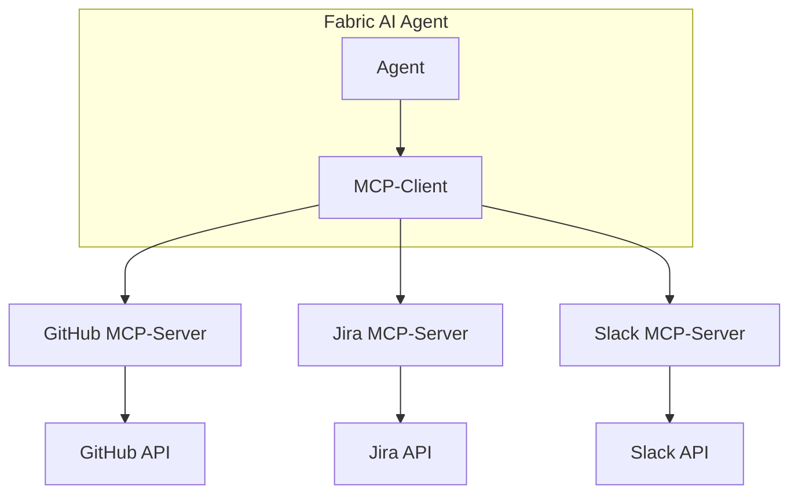
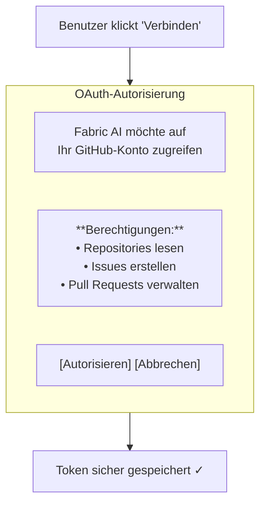
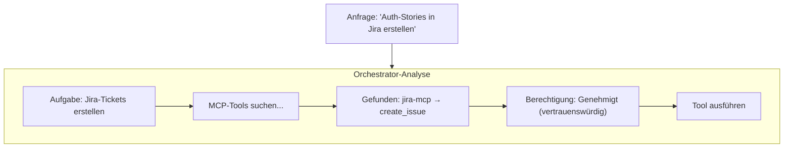
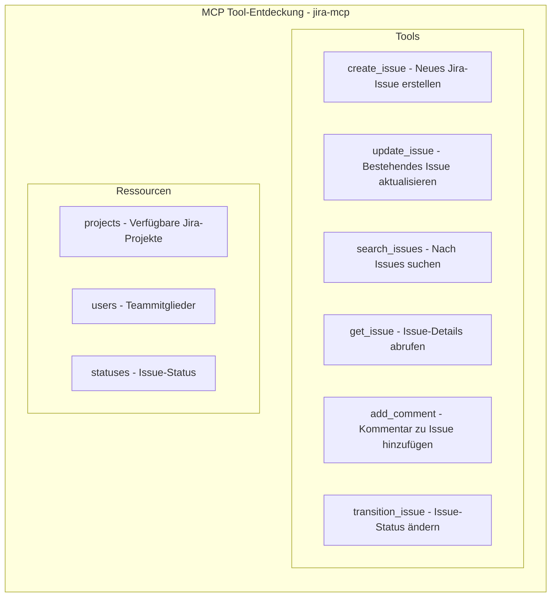
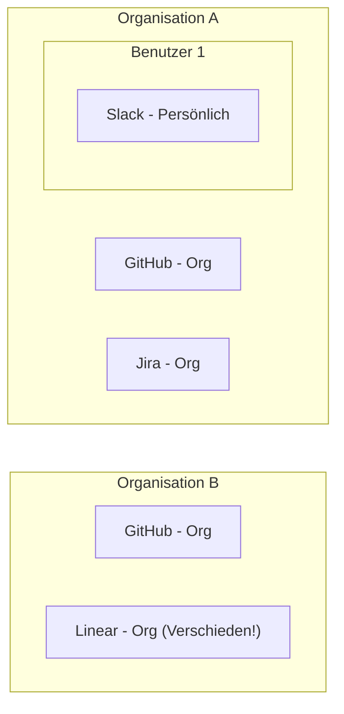
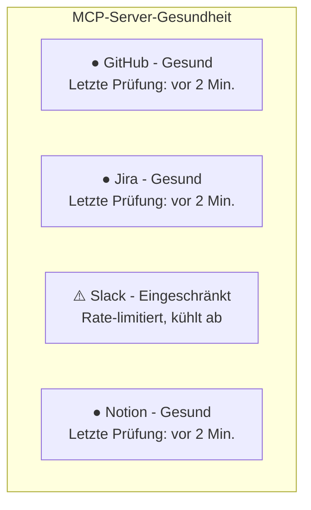

Das Model Context Protocol (MCP) ermöglicht es Fabric AI-Agenten, mit externen Tools und Diensten zu interagieren. Verbinden Sie sich mit GitHub, Jira, Slack, Notion und Dutzenden anderer Tools, um Ihre Workflows zu automatisieren.

## Was ist MCP?

**MCP (Model Context Protocol)** ist ein offener Standard, der es KI-Modellen ermöglicht, auf standardisierte Weise mit externen Tools und Datenquellen zu interagieren.



## Vorteile

### Für Benutzer
- Befehle in natürlicher Sprache zur Steuerung externer Tools
- Kein Wechsel zwischen Anwendungen erforderlich
- Automatisierte Workflows über mehrere Dienste hinweg

### Für Agenten
- Standardisierte Tool-Entdeckung
- Konsistente Authentifizierung
- Integrierte Fehlerbehandlung

## Verfügbare MCP-Server

Fabric enthält ein Verzeichnis getesteter, vorkonfigurierter MCP-Server:

### Entwicklung & Zusammenarbeit

| Server | Fähigkeiten |
|--------|--------------|
| **GitHub** | Issues, PRs, Repositories, Code-Suche |
| **GitLab (Offiziell)** | Issues, Merge Requests, Projekte — über GitLabs offiziellen MCP-Server (Premium/Ultimate) |
| **Atlassian (Jira & Confluence)** | Jira-Tickets, Sprints und Boards; Confluence-Seiten und -Bereiche |
| **Azure DevOps** | Work Items, Boards, Repositories, Pipelines |
| **Fizzy** | Karten und Projekt-Boards |

<Callout type="info">
Der Server **Atlassian (Jira & Confluence)** verwendet den offiziellen Rovo-MCP-Server von Atlassian. Eine OAuth-Verbindung schaltet sowohl Jira-Tickets als auch Confluence-Seiten frei.
</Callout>

### Kommunikation

| Server | Fähigkeiten |
|--------|--------------|
| **Slack** | Nachrichten, Kanäle, Threads |

### Wissen & Dokumente

| Server | Fähigkeiten |
|--------|--------------|
| **Notion** | Seiten, Datenbanken, Blöcke |
| **Google Drive** | Dateien, Ordner, Dokumente |

### Diagramme

| Server | Fähigkeiten |
|--------|--------------|
| **Excalidraw** | Diagramme erstellen und bearbeiten |

### Fabric

| Server | Fähigkeiten |
|--------|--------------|
| **Fabric** | Greifen Sie von jedem Agenten oder MCP-Client auf Ihre eigenen Fabric-Projekte, Dokumente und Workspaces zu |

<Callout type="info">
Der gewünschte Dienst ist nicht dabei? Sie können auch eigene **benutzerdefinierte MCP-Server** hinzufügen — siehe [Benutzerdefinierte MCP-Server erstellen](#benutzerdefinierte-mcp-server-erstellen) weiter unten.
</Callout>

## MCP-Server einrichten

<Steps>
  <Step>
    ### Zu Einstellungen navigieren

    Gehen Sie zu **Einstellungen → MCP-Server**.
  </Step>

  <Step>
    ### Verzeichnis durchsuchen

    Klicken Sie auf **Server hinzufügen**, um verfügbare Server im Verzeichnis anzuzeigen.
  </Step>

  <Step>
    ### Einen Server auswählen

    Wählen Sie den Server, mit dem Sie sich verbinden möchten (z. B. GitHub).
  </Step>

  <Step>
    ### Authentifizieren

    Je nach Server authentifizieren Sie sich über:
    
    **OAuth (Empfohlen)**
    1. Auf „Mit OAuth verbinden" klicken
    2. Im Popup-Fenster autorisieren
    3. Tokens werden automatisch gespeichert
    
    **API-Schlüssel**
    1. API-Schlüssel vom Dienst holen
    2. In Fabric einfügen
    3. Auf „Speichern" klicken
  </Step>

  <Step>
    ### Verbindung testen

    Klicken Sie auf **Verbindung testen**, um zu überprüfen, ob es funktioniert.
  </Step>

  <Step>
    ### Server aktivieren

    Server auf **Aktiviert** umschalten. Er ist jetzt für Agenten verfügbar.
  </Step>
</Steps>

## Authentifizierungsmethoden

### OAuth 2.0 (Empfohlen)

Für Server, die OAuth unterstützen:

1. **Entdeckung** — Fabric findet OAuth-Endpunkte automatisch
2. **DCR** — Dynamische Client-Registrierung, wenn unterstützt
3. **Autorisierung** — Benutzer autorisiert im Popup
4. **Token-Speicherung** — Tokens verschlüsselt und sicher gespeichert
5. **Auto-Erneuerung** — Tokens werden automatisch erneuert



### API-Schlüssel

Für Server, die API-Schlüssel verwenden:

1. Schlüssel vom Service-Dashboard holen
2. In Fabric-Einstellungen einfügen
3. Schlüssel wird vor der Speicherung verschlüsselt
4. Schlüssel wird nur bei Bedarf entschlüsselt

### Keine Authentifizierung

Einige Server funktionieren ohne Authentifizierung:
- Öffentliche Such-APIs
- Offene Datenquellen
- Lokale Entwicklungsserver

## MCP-Tools verwenden

### In Gesprächen

Bitten Sie den Agenten einfach, ein verbundenes Tool zu verwenden:

```
"Erstelle ein GitHub-Issue für den Login-Bug, den wir besprochen haben"

"Poste eine Zusammenfassung dieses PRDs in den #engineering Slack-Kanal"

"Erstelle Jira-Stories aus den oben genannten Benutzeranforderungen"
```

### Mit dem Orchestrator

Der Orchestrator entdeckt und verwendet MCP-Tools automatisch:



### Tool-Entdeckung

Agenten entdecken Tools automatisch:



## Mandantenfähige Sicherheit

MCP-Verbindungen sind pro Benutzer/Organisation beschränkt:

### Persönliche Verbindungen

- Ihr persönliches GitHub-Konto verbinden
- Nur Sie können diese Verbindungen nutzen
- Von Organisations-Verbindungen isoliert

### Organisations-Verbindungen

- Organisationskonten verbinden (z. B. Unternehmens-Jira)
- Alle Organisationsmitglieder können nutzen
- Von Organisations-Admins verwaltet

### Isolierung



## Transport-Typen

MCP-Server kommunizieren über verschiedene Transporte:

### SSE (Server-Sent Events)

- Echtzeit-Streaming
- Am besten für langwierige Operationen
- Von den meisten Cloud-Servern verwendet

### HTTP

- Standardmäßige Anfrage/Antwort
- Einfach und zuverlässig
- Gut für einfache Operationen

### STDIO

- Lokale Prozesskommunikation
- Für Entwicklung verwendet
- Self-Hosted-Server

## Gesundheitsüberwachung

Fabric überwacht den Gesundheitszustand von MCP-Servern:



### Automatische Wiederherstellung

- **Rate-Limits** — Automatischer Backoff und Wiederholung
- **Token-Ablauf** — OAuth-Tokens automatisch erneuern
- **Server ausgefallen** — Anfragen in Warteschlange, später wiederholen
- **Failover** — Alternative Server verwenden, wenn konfiguriert

## Benutzerdefinierte MCP-Server erstellen

Für benutzerdefinierte Integrationen Ihren eigenen MCP-Server erstellen:

### Server-Anforderungen

- MCP-Protokoll implementieren
- Tool-Definitionen freigeben
- Authentifizierung behandeln
- Strukturierte Antworten zurückgeben

### Registrierung

1. Gehen Sie zu **Einstellungen → MCP-Server → Benutzerdefiniert hinzufügen**
2. Server-URL eingeben
3. Authentifizierung konfigurieren
4. Testen und aktivieren

---

## Nächste Schritte

<Cards>
  <Card title="Agenten-Übersicht" href="/docs/agents/overview">
    Erfahren Sie, wie Agenten MCP-Tools nutzen
  </Card>
  <Card title="Orchestrator" href="/docs/agents/orchestrator">
    MCP-Tools in mehrstufigen Workflows sehen
  </Card>
  <Card title="Benutzerdefinierten Agenten erstellen" href="/docs/tutorials/first-agent">
    Einen Agenten mit MCP-Tools bauen
  </Card>
</Cards>
